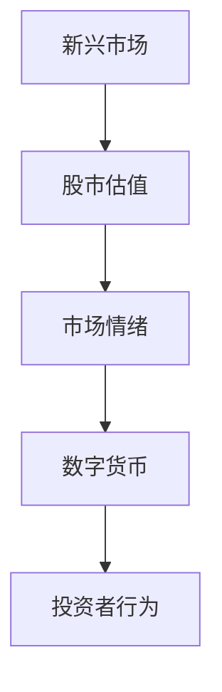
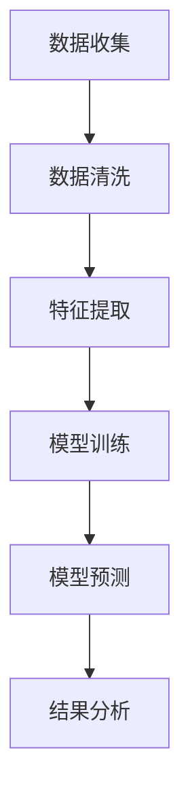
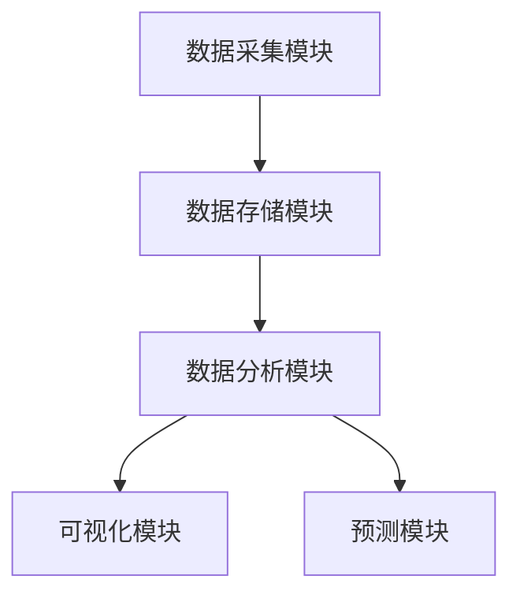
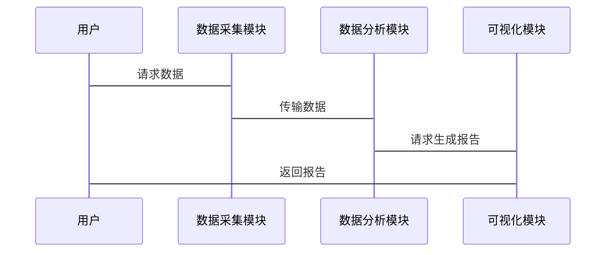

                 


# 新兴市场股市估值与数字货币发展的互动

## 关键词：新兴市场，股市估值，数字货币，互动，技术分析，经济影响，投资策略

## 摘要：本文探讨新兴市场股市估值与数字货币之间的互动关系，分析其影响因素和传导机制，结合技术分析和经济模型，提出投资策略和风险管理建议。

---

# 第1章 背景介绍

## 1.1 问题背景

### 1.1.1 新兴市场的定义与特点
新兴市场是指那些经济快速发展、工业化程度较低的国家，如中国、印度等。这些市场具有高增长潜力，但也伴随着高波动性和不确定性。

### 1.1.2 股市估值的基本概念
股市估值是通过分析公司基本面和市场情绪来确定股票合理价格的过程，常用的指标包括市盈率、市净率等。

### 1.1.3 数字货币的基本概念
数字货币是基于区块链技术的虚拟货币，如比特币和以太坊，具有去中心化、匿名性和高波动性的特点。

### 1.1.4 问题的提出与研究意义
随着数字货币的兴起，其价格波动对股市估值的影响日益显著。研究这一互动关系，有助于投资者制定更有效的投资策略。

## 1.2 问题描述

### 1.2.1 新兴市场股市估值的现状
新兴市场的股市估值受宏观经济政策、外资流动等因素影响，波动较大。

### 1.2.2 数字货币的发展趋势
数字货币的技术创新和广泛应用推动其市场规模不断扩大，成为影响全球金融的重要因素。

### 1.2.3 两者互动关系的初步探讨
数字货币的价格波动可能影响股市投资者情绪，进而影响股市估值；反之，股市的波动也可能影响数字货币的市场接受度。

## 1.3 问题解决

### 1.3.1 研究目标的设定
本研究旨在分析新兴市场股市估值与数字货币之间的互动关系，探索其影响机制。

### 1.3.2 研究方法的选择
采用定量分析与定性分析相结合的方法，结合统计模型和案例分析。

### 1.3.3 数据来源与分析框架
数据来源包括新兴市场股市数据和数字货币交易数据，分析框架包括时间序列分析和因果关系分析。

## 1.4 边界与外延

### 1.4.1 研究范围的界定
仅限于新兴市场，不包括发达国家市场；主要分析价格波动和市场情绪的影响。

### 1.4.2 相关概念的外延
新兴市场、股市估值、数字货币的定义和范围需明确，避免混淆。

### 1.4.3 研究的局限性
数据获取的限制、模型的简化假设可能导致结果偏差。

## 1.5 概念结构与核心要素

### 1.5.1 核心概念的组成
新兴市场、股市估值、数字货币及其互动关系。

### 1.5.2 概念之间的关系
数字货币通过影响市场情绪和投资者行为，间接影响股市估值。

### 1.5.3 核心要素的对比分析
通过表格对比新兴市场、股市估值、数字货币的属性特征。

---

# 第2章 核心概念与联系

## 2.1 核心概念原理

### 2.1.1 股市估值的原理
股市估值基于公司基本面和市场情绪，常用的指标包括市盈率、市净率等。

### 2.1.2 数字货币的运行机制
数字货币基于区块链技术，具有去中心化和匿名性，价格受市场供需和投资者情绪影响。

### 2.1.3 两者互动的理论基础
市场情绪和投资者行为是连接股市估值和数字货币的关键因素。

## 2.2 概念属性特征对比

| 特性                | 股市估值                   | 数字货币                  |
|---------------------|--------------------------|--------------------------|
| 价格决定因素        | 公司盈利、市场情绪         | 市场供需、技术因素       |
| 波动性               | 较高                     | 极高                     |
| 调节机制            | 市场监管、投资者行为       | 去中心化、技术创新       |

### 2.2.1 股市估值的属性特征
- 受宏观经济政策影响较大
- 波动性较高，但相对可控

### 2.2.2 数字货币的属性特征
- 技术驱动，去中心化
- 高波动性，市场参与者情绪影响显著

## 2.3 ER实体关系图



---

# 第3章 算法原理讲解

## 3.1 算法原理

### 3.1.1 数据收集与预处理
- 数据来源：新兴市场股市数据和数字货币交易数据
- 数据清洗：处理缺失值和异常值

### 3.1.2 模型构建与训练
- 使用时间序列分析模型（如ARIMA）和因果关系模型（如Granger检验）进行分析

### 3.1.3 模型预测与验证
- 预测股市估值和数字货币价格的互动关系
- 验证模型的准确性和稳定性

## 3.2 算法流程图



## 3.3 核心代码实现

```python
import pandas as pd
from statsmodels.tsa.arima_model import ARIMA

# 数据加载
data = pd.read_csv('data.csv')

# 数据预处理
data_clean = data.dropna()

# 特征提取
features = ['stock_price', 'crypto_price']

# 模型训练
model = ARIMA(data_clean[features], order=(1, 1, 1))
model_fit = model.fit()

# 模型预测
forecast = model_fit.forecast(steps=10)
```

---

# 第4章 系统分析与架构设计

## 4.1 问题场景介绍

### 4.1.1 项目介绍
本项目旨在分析新兴市场股市估值与数字货币之间的互动关系，构建预测模型，为投资者提供参考。

### 4.1.2 系统功能设计
- 数据采集模块：实时采集新兴市场股市和数字货币数据
- 数据分析模块：分析数据并生成互动关系报告
- 可视化模块：展示分析结果

### 4.1.3 系统架构设计



### 4.1.4 系统接口设计
- 数据接口：与数据源API对接
- 用户接口：提供数据可视化和预测结果的展示

### 4.1.5 系统交互流程



---

# 第5章 项目实战

## 5.1 环境安装

### 5.1.1 安装Python和相关库
```bash
pip install pandas numpy statsmodels matplotlib
```

## 5.2 系统核心实现源代码

```python
import pandas as pd
import matplotlib.pyplot as plt
from statsmodels.tsa.arima_model import ARIMA
from sklearn.metrics import mean_squared_error

# 数据加载
data = pd.read_csv('data.csv')

# 数据预处理
data_clean = data.dropna()

# 模型训练
model = ARIMA(data_clean['stock_price'], order=(1, 1, 1))
model_fit = model.fit()

# 模型预测
forecast = model_fit.forecast(steps=10)

# 结果可视化
plt.plot(data_clean['stock_price'], label='实际值')
plt.plot(forecast[0], label='预测值')
plt.xlabel('时间')
plt.ylabel('股票价格')
plt.legend()
plt.show()
```

## 5.3 代码应用解读与分析

### 5.3.1 数据加载与预处理
- 加载数据并处理缺失值，确保数据完整性。

### 5.3.2 模型训练与预测
- 使用ARIMA模型进行时间序列预测，分析股市估值的变化趋势。

### 5.3.3 结果可视化
- 对比实际值和预测值，评估模型的准确性。

## 5.4 实际案例分析

### 5.4.1 案例介绍
分析某个新兴市场在特定时间段内的股市估值和数字货币价格波动。

### 5.4.2 数据分析
使用统计模型分析两者之间的互动关系，找出主要影响因素。

### 5.4.3 结果解读
解释分析结果，提出投资建议和风险管理策略。

## 5.5 项目小结

### 5.5.1 成果总结
本项目成功构建了预测模型，验证了股市估值与数字货币之间的互动关系。

### 5.5.2 经验分享
数据质量、模型选择和结果解读是项目成功的关键。

### 5.5.3 改进建议
未来可以引入更多变量和复杂模型，提高预测精度。

---

# 第6章 结论与展望

## 6.1 结论

### 6.1.1 核心结论
新兴市场股市估值和数字货币之间存在显著的互动关系，市场情绪和投资者行为是主要影响因素。

### 6.1.2 经验总结
通过技术分析和经济模型，可以有效预测两者互动关系，制定科学的投资策略。

## 6.2 未来展望

### 6.2.1 研究方向
进一步研究互动机制，探索更多影响因素和复杂模型。

### 6.2.2 应用前景
研究成果可应用于投资决策支持系统，帮助投资者优化资产配置。

---

# 作者：AI天才研究院 & 禅与计算机程序设计艺术

