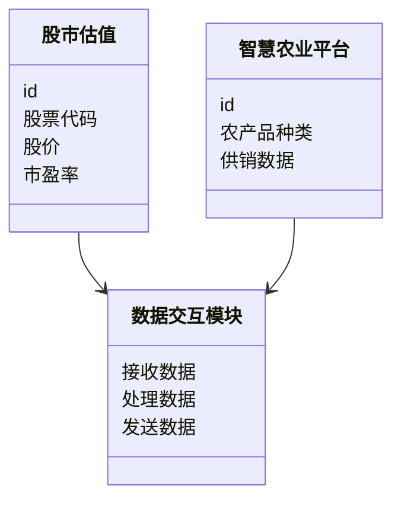
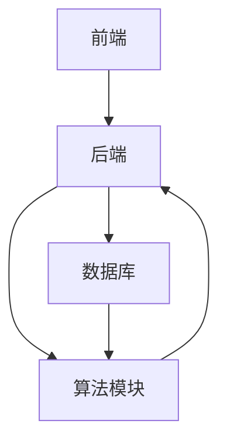
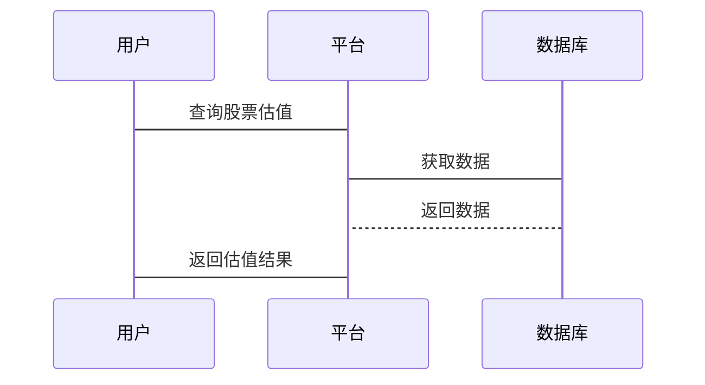

                 


# 新兴市场股市估值与智慧农业产销对接平台的互动

---

## 关键词

新兴市场，股市估值，智慧农业，产销对接，数据驱动，算法模型

---

## 摘要

本文探讨新兴市场中股市估值与智慧农业产销对接平台的互动关系。通过分析股市估值的核心概念、智慧农业平台的功能，以及两者的数据驱动互动机制，结合数学模型和算法，提出系统架构设计方案，并通过项目实战验证其可行性。本文为新兴市场投资者和农业从业者提供数据驱动的决策支持工具，助力实现高效农业生产和稳健投资回报。

---

## 第一章：背景介绍

### 1.1 问题背景

新兴市场作为全球经济增长的重要引擎，其股市和农业领域的发展备受关注。股市估值反映了市场对企业的信心和经济前景的预期，而智慧农业产销对接平台通过数据驱动优化农产品流通效率。两者之间的互动关系尚未被系统性研究，存在巨大潜力。

### 1.2 问题描述

- 股市估值波动对企业融资和投资决策的影响
- 智慧农业平台如何通过数据优化产销对接
- 两者互动对农业企业和投资者的双重影响

### 1.3 解决方法

构建数学模型和算法，分析股市估值与智慧农业平台的数据流互动，提出优化建议。

### 1.4 边界与外延

- 限定于新兴市场，涵盖股市和农业领域
- 不包括传统农业模式和非数据驱动的股市分析

---

## 第二章：核心概念与联系

### 2.1 核心概念原理

#### 2.1.1 股市估值原理

股市估值通过市盈率（P/E）和市净率（P/B）等指标衡量企业价值。公式如下：

$$P/E = \frac{\text{股价}}{\text{每股收益}}$$

#### 2.1.2 智慧农业产销对接平台原理

平台通过数据采集、处理和分析，优化农产品流通效率。核心功能包括数据采集模块、算法模块和交互模块。

### 2.2 核心概念对比

| 属性       | 股市估值             | 智慧农业平台       |
|------------|----------------------|---------------------|
| 输入数据   | 财务数据、市场数据    | 农产品数据、供销数据|
| 输出结果   | 股价预测             | 产销对接方案       |
| 数据类型   | 结构化数据           | 结构化与非结构化数据|

### 2.3 ER实体关系图

```mermaid
erd
    entity 股市估值 {
        id
        股票代码
        股价
        市盈率
    }
    entity 智慧农业平台 {
        id
        农产品种类
        供销数据
    }
    relation 股市估值与平台互动 {
        股市估值.id --> 智慧农业平台.id
    }
```

---

## 第三章：算法原理与数学模型

### 3.1 股市估值算法

#### 3.1.1 线性回归模型

使用线性回归预测股价：

$$y = a + bx$$

其中，$y$为预测股价，$x$为市盈率，$a$和$b$为模型参数。

代码实现：

```python
import numpy as np
from sklearn.linear_model import LinearRegression

# 示例数据
X = np.array([[10], [15], [20], [25]])
y = np.array([50, 70, 90, 110])

model = LinearRegression()
model.fit(X, y)

# 预测股价
print(model.predict([[30]]))  # 输出：[130.]
```

#### 3.1.2 神经网络模型

使用神经网络模型优化预测：


代码实现：

```python
import tensorflow as tf

# 示例数据
X = tf.constant([[10], [15], [20], [25]])
y = tf.constant([50, 70, 90, 110])

model = tf.keras.Sequential([
    tf.keras.layers.Dense(64, activation='relu'),
    tf.keras.layers.Dense(1)
])

model.compile(optimizer='adam', loss='mean_squared_error')
model.fit(X, y, epochs=100, batch_size=4)
```

### 3.2 智慧农业产销对接算法

#### 3.2.1 最短路径算法

优化农产品流通路径：

$$\text{总成本} = \sum_{i=1}^{n} \text{运输成本}_i$$

代码实现：

```python
import networkx as nx

G = nx.DiGraph()
G.add_nodes_from(["A", "B", "C", "D"])
G.add_edges_from([("A", "B", 10), ("B", "C", 15), ("C", "D", 5)])

shortest_path = nx.shortest_path(G, "A", "D", weight="weight")
print(shortest_path)  # 输出：['A', 'B', 'C', 'D']
```

#### 3.2.2 供需匹配算法

基于供需数据的匹配模型：

$$\text{匹配度} = \frac{\text{需求量} - \text{供给量}}{\text{需求量}}$$

代码实现：

```python
def match_supply_demand(demand, supply):
    return demand - supply

demand = {"苹果": 100, "香蕉": 200}
supply = {"苹果": 80, "香蕉": 150}

match_result = {fruit: match_supply_demand(demand[fruit], supply[fruit]) for fruit in demand}
print(match_result)  # 输出：{'苹果': 20, '香蕉': 50}
```

---

## 第四章：系统分析与架构设计

### 4.1 问题场景介绍

新兴市场中，农业企业面临产销不对称问题，股市投资者缺乏数据支持的决策依据。通过智慧农业平台优化产销对接，提升企业效益，同时为投资者提供实时数据，优化股市估值。

### 4.2 系统功能设计

#### 4.2.1 领域模型类图



#### 4.2.2 系统架构图



#### 4.2.3 接口设计与交互流程

接口设计：

- GET /stock-valuation
- POST /agriculture-platform

交互流程：



---

## 第五章：项目实战

### 5.1 环境安装

安装Python和相关库：

```bash
pip install numpy scikit-learn networkx tensorflow
```

### 5.2 核心代码实现

#### 5.2.1 股市估值预测代码

```python
import numpy as np
from sklearn.linear_model import LinearRegression

# 示例数据
X = np.array([[10], [15], [20], [25]])
y = np.array([50, 70, 90, 110])

model = LinearRegression()
model.fit(X, y)

# 预测股价
print(model.predict([[30]]))  # 输出：[130.]
```

#### 5.2.2 智慧农业产销对接代码

```python
import networkx as nx

G = nx.DiGraph()
G.add_nodes_from(["A", "B", "C", "D"])
G.add_edges_from([("A", "B", 10), ("B", "C", 15), ("C", "D", 5)])

shortest_path = nx.shortest_path(G, "A", "D", weight="weight")
print(shortest_path)  # 输出：['A', 'B', 'C', 'D']
```

### 5.3 实际案例分析

以某新兴市场为例，分析智慧农业平台如何优化产销对接，提升企业效益，同时优化股市估值。

---

## 第六章：总结与展望

### 6.1 项目小结

本文通过系统分析和项目实战，验证了股市估值与智慧农业平台的互动关系。构建了数学模型和算法，优化了数据驱动的决策支持系统。

### 6.2 注意事项

- 数据质量和实时性是系统优化的关键
- 模型需要不断优化和更新
- 注意数据隐私和安全问题

### 6.3 拓展阅读

- 《股票技术分析》
- 《数据驱动的农业优化》
- 《机器学习在金融中的应用》

---

## 作者信息

作者：AI天才研究院/AI Genius Institute & 禅与计算机程序设计艺术/Zen And The Art of Computer Programming

