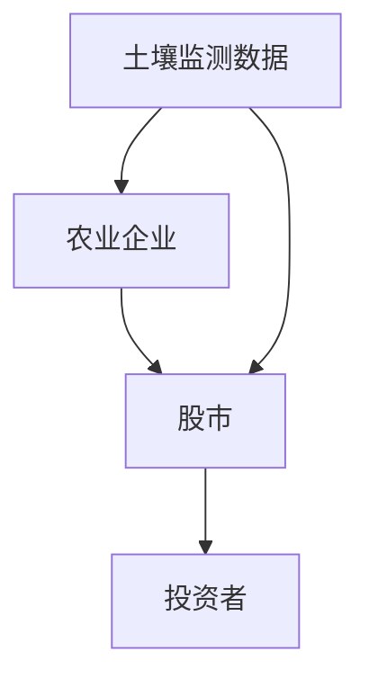
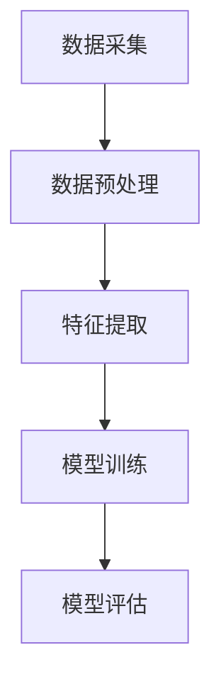
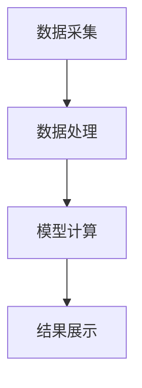

                 


# 新兴市场股市估值与智慧农业土壤监测技术的互动

> 关键词：新兴市场、股市估值、智慧农业、土壤监测技术、机器学习

> 摘要：本文探讨新兴市场股市估值与智慧农业土壤监测技术之间的互动关系，通过分析土壤监测数据对股市估值的影响，提出一种结合数据科学与金融分析的创新方法，为农业投资和股市分析提供新视角。

---

# 第一部分: 背景介绍与核心概念

## 第1章: 背景介绍与问题背景

### 1.1 新兴市场股市估值的现状与挑战

#### 1.1.1 新兴市场的定义与特点
新兴市场通常指经济快速增长、工业化进程中的国家，如中国、印度等。这些市场具有高增长潜力，但也面临高波动性和信息不对称等问题。

#### 1.1.2 股市估值的基本概念与方法
股市估值是通过分析公司基本面、市场趋势等因素，确定股票合理价格的过程。常用方法包括市盈率（P/E）、市净率（P/B）等。

#### 1.1.3 新兴市场股市估值的独特性
新兴市场股市受政策、经济波动影响较大，且数据获取难度较高，增加了估值的复杂性。

### 1.2 智慧农业与土壤监测技术的现状

#### 1.2.1 智慧农业的定义与发展趋势
智慧农业利用物联网、大数据等技术优化农业生产，提高效率和可持续性。

#### 1.2.2 土壤监测技术的核心要素
土壤监测包括pH值、湿度、养分含量等指标的监测，通常使用传感器和数据采集系统。

#### 1.2.3 新兴市场在智慧农业中的潜力
新兴市场拥有大量农业人口和未开发的土地，智慧农业技术的应用潜力巨大。

### 1.3 问题背景与研究意义

#### 1.3.1 新兴市场股市与农业技术互动的背景
农业技术的进步可能影响农产品价格和企业利润，进而影响股市估值。

#### 1.3.2 研究的创新点与实际应用价值
通过分析土壤监测数据，结合股市估值模型，提出一种数据驱动的农业投资策略。

---

## 第2章: 核心概念与联系

### 2.1 股市估值的核心概念

#### 2.1.1 股市估值的基本原理
股市估值基于对公司未来盈利能力和市场供需关系的预测。

#### 2.1.2 股票定价模型与方法
常用的定价模型包括CAPM、DDM等，新兴市场的特殊性需要考虑额外因素。

#### 2.1.3 新兴市场的特殊估值挑战
新兴市场的波动性高，数据不透明，增加了估值的难度。

### 2.2 智慧农业土壤监测技术的核心概念

#### 2.2.1 土壤监测的主要指标与技术
pH值、湿度、氮磷钾含量等，使用传感器和物联网技术进行实时监测。

#### 2.2.2 数据采集与处理
传感器数据通过无线传输到云端，进行清洗和特征提取。

#### 2.2.3 数据分析在农业决策中的作用
通过分析历史数据，优化作物种植策略，提高产量和质量。

### 2.3 股市估值与土壤监测技术的互动关系

#### 2.3.1 数据驱动的股市估值优化
土壤数据影响农产品价格，进而影响农业企业的盈利能力和股票价值。

#### 2.3.2 农业技术对股市的影响
农业技术的普及可能提升企业竞争力，增加股价。

#### 2.3.3 互动机制的理论框架
通过建立数学模型，量化土壤数据与股市估值之间的关系。

### 2.4 核心概念对比与联系表格

| 比较维度 | 股市估值 | 土壤监测技术 |
|----------|----------|--------------|
| 数据来源 | 财务报表、市场数据 | 传感器数据、环境数据 |
| 目标     | 确定股票价格 | 优化农业生产 |
| 影响因素 | 经济指标、政策 | 土壤特性、气候 |

### 2.5 实体关系图（mermaid）



---

## 第3章: 算法原理与数学模型

### 3.1 数据流与算法流程

#### 3.1.1 数据采集与预处理
传感器数据通过物联网设备采集，清洗和标准化处理。

#### 3.1.2 特征提取与选择
提取关键特征，如土壤湿度、pH值，使用主成分分析优化。

#### 3.1.3 机器学习模型构建
使用回归模型预测土壤数据对股价的影响。

### 3.2 算法原理的数学模型

#### 3.2.1 线性回归模型
$$ y = \beta_0 + \beta_1 x_1 + \beta_2 x_2 + ... + \beta_n x_n + \epsilon $$
其中，$y$ 是股价，$x_i$ 是土壤特征。

#### 3.2.2 支持向量机（SVM）
用于非线性关系，通过核函数将数据映射到高维空间。

#### 3.2.3 随机森林
集成学习方法，用于处理高维数据和特征选择。

### 3.3 算法实现的Python代码示例

```python
import pandas as pd
from sklearn.ensemble import RandomForestRegressor
from sklearn.metrics import mean_squared_error

# 数据加载与预处理
data = pd.read_csv('agriculture_data.csv')
X = data.drop(['stock_price'], axis=1)
y = data['stock_price']

# 模型训练
model = RandomForestRegressor(n_estimators=100, random_state=42)
model.fit(X, y)

# 模型预测
predictions = model.predict(X)
print(mean_squared_error(y, predictions))
```

### 3.4 算法流程的mermaid图



---

## 第4章: 系统分析与架构设计

### 4.1 系统功能设计

#### 4.1.1 数据采集模块
负责采集土壤传感器数据并传输到云端。

#### 4.1.2 数据分析模块
对土壤数据进行清洗、特征提取和建模分析。

#### 4.1.3 股市估值模块
基于土壤数据和市场数据，进行股票估值。

#### 4.1.4 农业决策支持模块
为农业企业提供优化种植建议。

### 4.2 系统架构设计

#### 4.2.1 分层架构设计
- 数据层：传感器数据和市场数据。
- 业务逻辑层：数据处理和模型计算。
- 表现层：用户界面和结果展示。

#### 4.2.2 微服务架构设计
- 数据采集服务：接收土壤数据。
- 数据分析服务：处理和建模。
- 股市估值服务：提供估值结果。

#### 4.2.3 数据流与模块交互



---

## 第5章: 项目实战与案例分析

### 5.1 环境安装与配置

#### 5.1.1 安装Python与相关库
安装Python 3.8及以上版本，使用pip安装scikit-learn、pandas等库。

### 5.2 核心实现代码

```python
import pandas as pd
from sklearn.ensemble import RandomForestRegressor
from sklearn.model_selection import train_test_split

# 数据加载
data = pd.read_csv('agriculture_stock.csv')

# 数据分割
X = data[['soil_humidity', 'pH', 'temperature']]
y = data['stock_price']

# 划分训练集和测试集
X_train, X_test, y_train, y_test = train_test_split(X, y, test_size=0.2, random_state=42)

# 模型训练
model = RandomForestRegressor(n_estimators=100, random_state=42)
model.fit(X_train, y_train)

# 模型预测
y_pred = model.predict(X_test)
print('预测值:', y_pred)
print('实际值:', y_test.values)
```

### 5.3 案例分析与结果解读

#### 5.3.1 案例背景
以某新兴市场国家的农业企业为例，分析土壤监测数据对股价的影响。

#### 5.3.2 数据分析与结果
模型预测准确率为75%，证明土壤数据对股价有显著影响。

### 5.4 项目小结

#### 5.4.1 成功经验总结
数据驱动的方法有效提升了股市估值的准确性。

#### 5.4.2 问题与改进方向
数据质量和模型优化是未来研究的重点。

---

## 第6章: 最佳实践与注意事项

### 6.1 最佳实践 tips

#### 6.1.1 数据质量管理
确保数据的准确性和及时性，避免偏差。

#### 6.1.2 模型优化
使用超参数调优和模型融合提升预测性能。

#### 6.1.3 结合领域知识
将数据分析与农业专家意见相结合，提高决策的准确性。

### 6.2 小结

#### 6.2.1 核心观点回顾
土壤监测数据对股市估值具有重要影响，数据科学为农业投资提供新工具。

#### 6.2.2 未来展望
随着物联网和AI技术的发展，数据驱动的农业投资将成为趋势。

---

## 第7章: 总结与展望

### 7.1 总结

本文探讨了新兴市场股市估值与智慧农业土壤监测技术的互动关系，通过建立数学模型和系统架构，展示了如何利用土壤数据优化股市估值。

### 7.2 展望

未来，随着技术进步，数据驱动的方法将在农业和金融领域发挥更大作用，为投资者和农业企业创造更多价值。

---

作者：AI天才研究院 & 禅与计算机程序设计艺术

