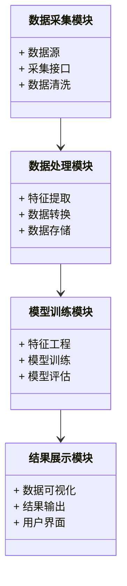
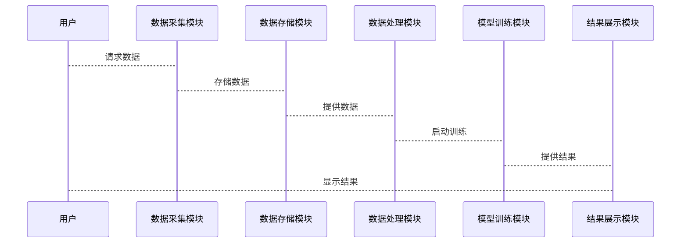

                 


# 新兴市场股市估值与智慧农业标准的互动

## 关键词：新兴市场，股市估值，智慧农业，互动机制，标准制定，数据驱动

## 摘要：本文探讨新兴市场股市估值与智慧农业标准之间的互动关系。通过分析股市估值的优化方法和智慧农业标准的制定过程，提出构建互动机制的数学模型和算法。文章结合实际案例，展示如何利用数据驱动的方法提升农业企业的价值评估，为投资者和政策制定者提供参考。

---

## 目录大纲

### 第1章：背景介绍
#### 1.1 问题背景
- 1.1.1 新兴市场的定义与特点
- 1.1.2 股市估值的基本概念
- 1.1.3 智慧农业的定义与发展趋势

#### 1.2 问题描述
- 1.2.1 新兴市场股市估值的现状与挑战
- 1.2.2 智慧农业标准的制定与实施
- 1.2.3 两者互动关系的初步探讨

#### 1.3 问题解决
- 1.3.1 新兴市场股市估值的优化方法
- 1.3.2 智慧农业标准的制定与推广
- 1.3.3 互动机制的构建与应用

#### 1.4 边界与外延
- 1.4.1 新兴市场的边界条件
- 1.4.2 股市估值的适用范围
- 1.4.3 智慧农业标准的外延扩展

#### 1.5 概念结构与核心要素
- 1.5.1 新兴市场股市估值的核心要素
- 1.5.2 智慧农业标准的核心要素
- 1.5.3 两者互动的核心机制

### 第2章：核心概念与联系
#### 2.1 股市估值的原理
- 2.1.1 市盈率与市净率的计算公式
- 2.1.2 股东权益与企业价值的评估
- 2.1.3 股市波动与市场情绪的影响

#### 2.2 智慧农业标准的原理
- 2.2.1 农业智能化的定义与特征
- 2.2.2 农业数据的采集与处理
- 2.2.3 农业技术标准的制定流程

#### 2.3 核心概念属性对比
- 2.3.1 股市估值与智慧农业标准的对比分析
- 2.3.2 两者在数据处理上的异同
- 2.3.3 互动机制的数学模型

#### 2.4 ER实体关系图
- 2.4.1 股市估值的实体关系图
  ```mermaid
  er
    actor 股市投资者
    actor 企业
    actor 数据提供者
    actor 政府监管机构
    database 股市数据
    database 企业财务数据
    database 市场监管数据
    relation 持股关系
    relation 交易关系
    relation 监管关系
  ```
- 2.4.2 智慧农业标准的实体关系图
  ```mermaid
  er
    actor 农业企业
    actor 农户
    actor 技术提供者
    actor 政府机构
    database 农业数据
    database 技术标准
    database 市场需求
    relation 技术应用关系
    relation 服务提供关系
    relation 监管关系
  ```

### 第3章：算法原理
#### 3.1 互动机制的算法流程
- 3.1.1 算法目标：预测农业企业价值与股市估值的互动关系
- 3.1.2 数据流：农业数据 → 股市数据 → 模型输入
- 3.1.3 算法步骤：
  ```mermaid
  graph TD
    A[开始] --> B[数据采集]
    B --> C[特征提取]
    C --> D[模型训练]
    D --> E[预测与评估]
    E --> F[结束]
  ```

#### 3.2 Python代码实现
- 3.2.1 数据预处理
  ```python
  import pandas as pd
  data = pd.read_csv('agriculture_data.csv')
  data = data.dropna()
  ```

- 3.2.2 特征工程
  ```python
  from sklearn.preprocessing import StandardScaler
  scaler = StandardScaler()
  features = scaler.fit_transform(data[['yield', 'temperature', 'humidity']])
  ```

- 3.2.3 模型训练与预测
  ```python
  from sklearn.linear_model import LinearRegression
  model = LinearRegression()
  model.fit(features, data['value'])
  predictions = model.predict(new_features)
  ```

- 3.2.4 模型评估
  ```python
  from sklearn.metrics import r2_score
  score = r2_score(actual_values, predictions)
  print(f"模型R²分数：{score}")
  ```

#### 3.3 数学模型与公式
- 3.3.1 回归模型
  $$ y = \beta_0 + \beta_1 x_1 + \beta_2 x_2 + \epsilon $$
  
- 3.3.2 互动机制的数学表达
  $$ V = \alpha S + \beta A + \gamma (S \times A) $$
  其中，\( V \) 是企业价值，\( S \) 是股市估值，\( A \) 是农业技术标准，\( \alpha, \beta, \gamma \) 是系数。

### 第4章：系统分析与架构设计
#### 4.1 问题场景介绍
- 农业企业数据与股市数据的整合需求
- 实时监测与预测的系统架构

#### 4.2 系统功能设计
- 数据采集模块
- 数据处理模块
- 模型训练模块
- 结果展示模块

#### 4.3 领域模型类图


#### 4.4 系统架构图


#### 4.5 系统接口设计
- 数据接口：API定义
- 模型接口：预测服务

#### 4.6 系统交互图


### 第5章：项目实战
#### 5.1 环境安装
- 安装Python、Pandas、Scikit-learn等库
  ```bash
  pip install numpy pandas scikit-learn
  ```

#### 5.2 核心实现
- 数据预处理
  ```python
  import pandas as pd
  data = pd.read_csv('agriculture_data.csv')
  data = data.dropna()
  ```

- 模型训练
  ```python
  from sklearn.linear_model import LinearRegression
  model = LinearRegression()
  model.fit(X_train, y_train)
  ```

#### 5.3 代码解读与分析
- 数据特征分析
- 模型调优
- 结果可视化

#### 5.4 实际案例分析
- 数据来源：某新兴市场农业企业数据
- 模型预测结果
- 结果解释

#### 5.5 项目小结
- 成功实现互动机制
- 模型性能评估
- 可扩展性分析

### 第6章：最佳实践与注意事项
#### 6.1 小结
- 互动机制的构建与应用
- 数据驱动的重要性
- 技术与政策的结合

#### 6.2 注意事项
- 数据质量的重要性
- 模型的局限性
- 政策与市场的互动

#### 6.3 拓展阅读
- 推荐书籍：《数据驱动的金融分析》
- 推荐文章：《智慧农业与可持续发展》
- 推荐工具：机器学习框架（如TensorFlow、PyTorch）

### 作者：AI天才研究院 & 禅与计算机程序设计艺术

---

### 总结
本文系统地探讨了新兴市场股市估值与智慧农业标准的互动关系，通过理论分析、算法设计、系统实现和实际案例，展示了如何利用数据驱动的方法优化股市估值，推动智慧农业的发展。希望本文能为投资者、政策制定者和农业科技企业提供有价值的参考。

