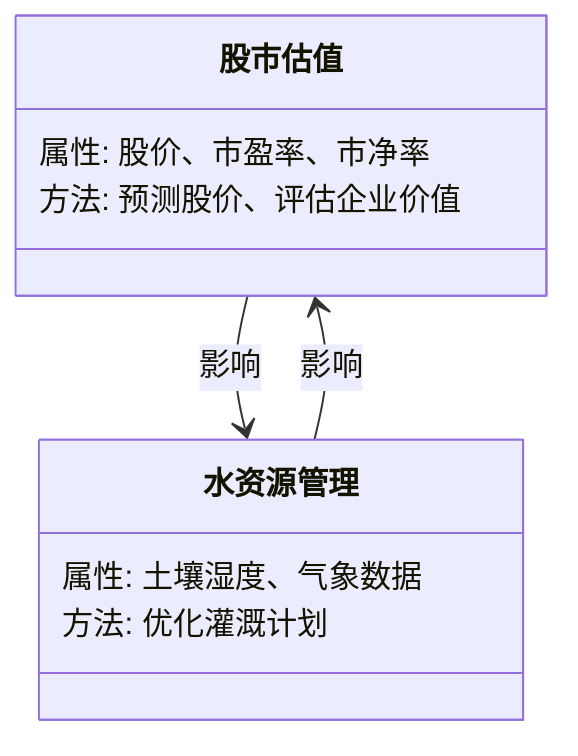
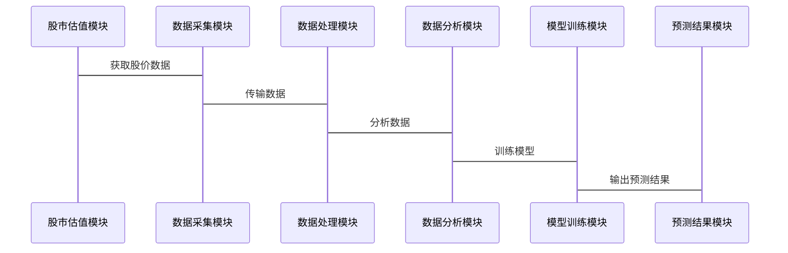

                 


# 新兴市场股市估值与智慧农业水资源管理的互动

## 关键词：新兴市场、股市估值、智慧农业、水资源管理、互动关系

## 摘要：本文探讨新兴市场股市估值与智慧农业水资源管理之间的互动关系，分析股市估值的核心要素，智慧农业中的水资源管理挑战，以及两者如何相互影响。通过数学模型和算法，揭示两者互动的内在机制，并提出系统架构和项目实战方案，为相关领域提供理论和实践指导。

---

## 第1章: 新兴市场股市估值与智慧农业水资源管理的互动概述

### 1.1 问题背景

#### 1.1.1 新兴市场的经济特点
新兴市场通常具有较高的经济增长潜力，但同时也伴随着较高的市场波动性和不确定性。这些市场的特点是多元化和复杂性，涉及多个经济领域和行业，如科技、金融、农业等。新兴市场的投资者通常关注高回报，但也面临着更高的风险。

#### 1.1.2 智慧农业的发展现状
智慧农业利用信息技术、物联网、大数据和人工智能等技术，优化农业生产过程，提高资源利用效率。智慧农业的核心在于通过数据驱动的决策来实现精准农业，从而提高产量、降低成本，并减少对环境的影响。新兴市场在智慧农业方面的发展潜力巨大，尤其是在水资源管理方面。

#### 1.1.3 水资源管理的重要性
水资源是农业生产的基石，合理管理水资源对于农业的可持续发展至关重要。在新兴市场，由于水资源分布不均和气候变化的影响，水资源管理面临着严峻的挑战。智慧农业通过技术手段优化水资源的分配和使用，从而提高农业生产的效率和可持续性。

### 1.2 问题描述

#### 1.2.1 股市估值的核心要素
股市估值是衡量企业价值的重要指标，主要包括市盈率（P/E）、市净率（P/B）、股息率（Dividend Yield）等。这些指标反映了市场的预期和企业盈利能力，是投资者决策的重要依据。

#### 1.2.2 智慧农业中的水资源管理挑战
智慧农业中的水资源管理面临数据收集、处理和分析的挑战。需要通过传感器和物联网技术实时监测水资源的使用情况，结合数据分析和优化模型，实现水资源的高效利用。

#### 1.2.3 两者互动关系的初步分析
新兴市场股市估值与智慧农业水资源管理之间存在复杂的互动关系。股市估值的波动可能影响农业企业的投资和运营，而水资源管理的效率则会影响农业生产的稳定性和企业的盈利能力，从而进一步影响股市估值。

### 1.3 问题解决思路

#### 1.3.1 理论框架的构建
构建一个综合性的理论框架，将股市估值和水资源管理纳入统一的分析体系，分析两者之间的相互影响和作用机制。

#### 1.3.2 数据分析方法的选择
选择适合的数据分析方法，如时间序列分析、机器学习模型等，对股市数据和水资源管理数据进行建模和预测。

#### 1.3.3 模型设计与验证
设计数学模型，模拟股市估值和水资源管理的互动关系，并通过实证数据进行验证和优化。

## 1.4 本章小结
本章介绍了新兴市场股市估值与智慧农业水资源管理的互动背景，分析了问题的核心要素和挑战，并提出了初步的解决思路。接下来将详细探讨核心概念和算法原理。

---

## 第2章: 核心概念与联系

### 2.1 股市估值的核心要素

#### 2.1.1 市盈率与市净率
市盈率（P/E）= 股价 / 每股收益，反映了市场对企业的盈利预期。市净率（P/B）= 股价 / 每股净资产，反映了企业的资产价值。

#### 2.1.2 股息率与股息支付率
股息率 = 每股股息 / 股价，股息支付率 = 股息 / 净利润。这两个指标反映了企业的分红能力和盈利能力。

#### 2.1.3 财务指标的综合评估
通过综合评估企业的收入、利润、负债等财务指标，全面评估企业的财务健康状况，从而影响股市估值。

### 2.2 智慧农业中的水资源管理

#### 2.2.1 精准农业的概念
精准农业通过地理信息系统（GIS）、遥感技术和物联网技术，实现对农田的精准监测和管理，提高农业生产效率。

#### 2.2.2 智能灌溉系统
智能灌溉系统利用传感器和自动化控制技术，实时监测土壤湿度和气象数据，优化灌溉计划，提高水资源利用效率。

#### 2.2.3 数据驱动的水资源优化配置
通过收集和分析农田、气象和水资源的数据，利用优化模型实现水资源的最优配置，减少浪费，提高农业生产效率。

### 2.3 核心概念的属性特征对比

| **属性**       | **股市估值**             | **水资源管理**           |
|----------------|--------------------------|--------------------------|
| 核心目标       | 评估企业价值             | 优化水资源利用           |
| 数据来源       | 财务报表、市场数据       | 气象数据、传感器数据     |
| 分析方法       | 时间序列分析、机器学习   | 线性规划、遗传算法       |
| 应用场景       | 金融投资决策             | 农业生产优化             |

### 2.4 ER实体关系图

```mermaid
er
  actor 股市: 市场参与者
  actor 农业: 农业生产者
  actor 政府: 政府机构
  actor 水资源: 自然资源
  actor 投资者: 金融市场投资者
  actor 数据: 数据采集与处理
  actor 模型: 分析模型
  actor 决策者: 农业决策者
  actor 股市估值: 股市价值评估
  actor 水资源管理: 水资源优化配置
```

---

## 第3章: 股市估值与水资源管理的互动算法

### 3.1 股市估值预测算法

#### 3.1.1 时间序列分析
时间序列分析是一种统计方法，用于分析和预测随时间变化的数据。常用模型包括ARIMA和GARCH。

##### 示例代码
```python
import pandas as pd
import numpy as np
from statsmodels.tsa.arima_model import ARIMA

# 假设data是一个包含历史股价的数据框
model = ARIMA(data['股价'], order=(5, 1, 0))
model_fit = model.fit()
 forecast = model_fit.forecast(steps=5)
print(forecast)
```

#### 3.1.2 机器学习模型
使用机器学习算法，如随机森林和神经网络，进行股市预测。

##### 示例代码
```python
from sklearn.ensemble import RandomForestRegressor

# 假设X是输入特征，y是目标变量（股价）
model = RandomForestRegressor(n_estimators=100)
model.fit(X, y)
预测 = model.predict(X_test)
```

### 3.2 水资源优化配置算法

#### 3.2.1 线性规划模型
线性规划是一种优化方法，用于在约束条件下最大化或最小化目标函数。

##### 示例代码
```python
import pulp

# 定义问题
prob = pulp.LpProblem('水资源优化', pulp.LpMaximize)

# 定义变量
x = pulp.LpVariable('x', 0, None)

# 定义目标函数
prob += x

# 定义约束
prob += x <= 100

# 求解问题
prob.solve()

print("最优解：", x.value)
```

#### 3.2.2 遗传算法
遗传算法是一种基于生物进化原理的优化方法，适用于复杂的非线性问题。

##### 示例代码
```python
import numpy as np
from GA import GA

# 定义适应度函数
def fitness(x):
    return -x**2 + 4*x

# 初始化遗传算法
ga = GA(fitness, 0, 4, 100)

# 进行优化
最优解 = ga.run()
print("最优解：", 最优解)
```

### 3.3 互动关系的数学模型

#### 3.3.1 股市波动对农业的影响
股市波动可能影响农业企业的融资成本和投资决策，从而影响农业生产效率。

#### 3.3.2 水资源短缺对股市的影响
水资源短缺可能导致农产品价格上涨，从而影响企业的盈利能力和股市估值。

#### 3.3.3 互动模型的构建
建立数学模型，描述股市估值和水资源管理之间的互动关系。

##### 数学公式
$$ V = \alpha P + \beta W $$
其中，$V$ 是股市估值，$P$ 是企业盈利，$W$ 是水资源利用效率，$\alpha$ 和 $\beta$ 是系数。

---

## 第4章: 系统分析与架构设计方案

### 4.1 问题场景介绍
新兴市场中，股市和农业企业受到经济波动和气候变化的双重影响，需要通过技术手段优化资源配置，提高抗风险能力。

### 4.2 系统功能设计

#### 4.2.1 领域模型


#### 4.2.2 系统架构设计


#### 4.2.3 系统接口设计
通过API接口实现各模块之间的数据交互和功能调用。

#### 4.2.4 系统交互序列图


---

## 第5章: 项目实战

### 5.1 环境安装
安装必要的开发工具和库，如Python、Pandas、Scikit-learn、Pulp等。

### 5.2 系统核心实现

#### 5.2.1 股市估值预测代码
```python
import pandas as pd
from sklearn.ensemble import RandomForestRegressor

# 读取数据
data = pd.read_csv('stock_data.csv')

# 数据预处理
X = data.drop('股价', axis=1)
y = data['股价']

# 训练模型
model = RandomForestRegressor(n_estimators=100)
model.fit(X, y)

# 预测
预测 = model.predict(X_test)
```

#### 5.2.2 水资源优化代码
```python
import pulp

# 定义问题
prob = pulp.LpProblem('水资源优化', pulp.LpMaximize)

# 定义变量
x = pulp.LpVariable('x', 0, None)

# 定义目标函数
prob += x

# 定义约束
prob += x <= 100

# 求解问题
prob.solve()

最优解 = x.value
```

### 5.3 案例分析与详细解读
通过具体案例分析，展示系统的实际应用效果和优化结果。

### 5.4 项目小结
总结项目的实现过程和成果，提出改进建议和未来研究方向。

---

## 第6章: 结论与展望

### 6.1 结论
本文分析了新兴市场股市估值与智慧农业水资源管理的互动关系，提出了系统的解决方案和实现方法。

### 6.2 未来展望
未来可以进一步研究更复杂的互动模型，结合更多数据源和算法，提高系统的预测和优化能力。

---

## 作者：AI天才研究院 & 禅与计算机程序设计艺术

