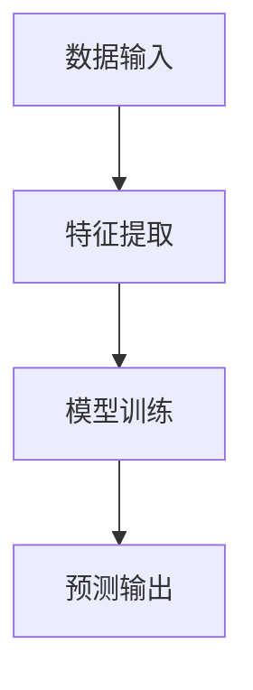
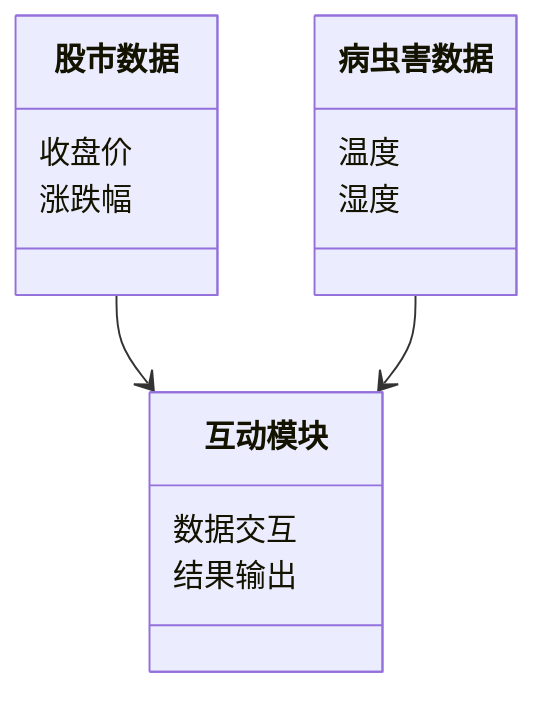
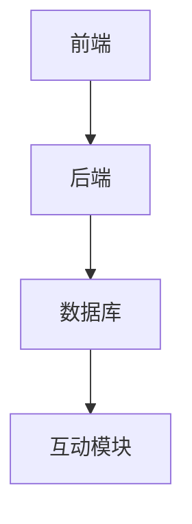

                 


# 新兴市场股市估值与智慧农业病虫害防控系统的互动

**关键词：** 新兴市场股市估值, 智慧农业, 病虫害防控系统, 数据分析, 算法模型, 系统架构

**摘要：** 本文探讨了新兴市场股市估值与智慧农业病虫害防控系统之间的互动关系。通过分析两者的核心概念、算法原理和系统架构，结合实际案例，展示了如何通过数据驱动的方法优化股市估值模型，并利用智慧农业技术提升病虫害防控效率。文章最后总结了研究成果，并提出了未来的研究方向。

---

# 第一部分：背景介绍与核心概念

## 第1章：背景介绍与核心概念

### 1.1 问题背景与问题描述

#### 1.1.1 新兴市场股市估值的现状与挑战
新兴市场股市的波动性较高，受到经济政策、国际环境和市场情绪等多种因素的影响。传统估值方法难以捕捉复杂市场中的潜在风险，因此需要借助数据驱动的方法进行更精准的估值。

#### 1.1.2 智慧农业病虫害防控系统的应用背景
智慧农业通过物联网、大数据和人工智能技术，实时监测农田环境数据，预测病虫害的发生趋势，为农民提供科学的防控建议。这不仅提高了农业生产效率，还减少了农药的过度使用，保护了生态环境。

#### 1.1.3 两者的互动关系与研究意义
股市估值与农业病虫害防控看似关联性不大，但通过数据分析，可以发现两者在数据采集、模型构建和优化方法上存在共通点。探索二者的互动关系，有助于将金融技术应用于农业领域，推动农业数字化转型。

### 1.2 核心概念与定义

#### 1.2.1 新兴市场股市估值的定义与特征
股市估值是通过分析市场数据，估算股票或市场的合理价格。新兴市场的股市估值受多种因素影响，具有高波动性、信息不对称和复杂性的特点。

#### 1.2.2 智慧农业病虫害防控系统的定义与组成
智慧农业病虫害防控系统是基于物联网、大数据和人工智能的综合系统，通过实时监测农田环境数据，利用机器学习模型预测病虫害的发生，并提供防治建议。

#### 1.2.3 两者的互动机制与边界
两者在数据采集、模型优化和反馈机制上存在互动。股市估值模型的优化可以借鉴农业病虫害防控系统中的数据处理方法，反之亦然。但两者的应用边界在于各自领域的专业性。

### 1.3 本章小结
本章介绍了新兴市场股市估值与智慧农业病虫害防控系统的背景、核心概念及其互动关系，为后续分析奠定了基础。

---

## 第2章：核心概念与联系

### 2.1 核心概念原理

#### 2.1.1 股市估值的核心原理
股市估值依赖于市场数据和模型。常用的模型包括市盈率（P/E）、市净率（P/B）等。新兴市场的高波动性使得这些模型的适用性受到挑战。

#### 2.1.2 病虫害防控系统的原理
智慧农业病虫害防控系统通过传感器采集农田数据，利用机器学习模型预测病虫害的发生，并通过反馈机制优化模型。

### 2.2 核心概念属性特征对比

| 属性 | 股市估值 | 病虫害防控系统 |
|------|----------|-----------------|
| 数据类型 | 价格、交易量 | 温度、湿度、光照 |
| 数据频率 | 日/周 | 实时/周期性 |
| 模型目标 | 预测价格波动 | 预测病虫害风险 |
| 优化目标 | 最小化预测误差 | 最大化预测准确率 |

### 2.3 ER实体关系图

```mermaid
erd
    股市数据 --(属于)--> 股票
    病虫害数据 --(属于)--> 农田
    股市数据 --|many2many|---> 互动模块
    病虫害数据 --|many2many|---> 互动模块
```

### 2.4 本章小结
本章通过对比分析，揭示了新兴市场股市估值与智慧农业病虫害防控系统在数据、模型和优化目标上的异同点。

---

# 第二部分：算法原理与数学模型

## 第3章：算法原理与数学模型

### 3.1 算法原理

#### 3.1.1 时间序列分析
时间序列分析广泛应用于股市估值和病虫害预测。通过分析历史数据，预测未来趋势。

#### 3.1.2 机器学习模型
机器学习模型（如随机森林、支持向量机）用于处理非线性关系，提高预测精度。

#### 3.1.3 算法流程图



### 3.2 数学模型与公式

#### 3.2.1 股市估值模型
$$ P = \frac{D}{r} $$
其中，\( P \) 是股票价格，\( D \) 是股息，\( r \) 是贴现率。

#### 3.2.2 病虫害预测模型
$$ P(t) = aP(t-1) + b $$
其中，\( a \) 和 \( b \) 是常数，\( P(t) \) 是第 \( t \) 时刻的预测值。

### 3.3 举例说明

#### 3.3.1 股市估值案例
假设某股票的预期股息为 $1，贴现率为5%，则股票的理论价值为 $20。

#### 3.3.2 病虫害预测案例
预测某农田未来7天的病虫害风险，使用AR模型进行预测。

### 3.4 本章小结
本章通过算法原理和数学模型，展示了如何利用时间序列分析和机器学习模型解决股市估值和病虫害预测问题。

---

# 第三部分：系统分析与架构设计

## 第4章：系统分析与架构设计

### 4.1 系统分析

#### 4.1.1 问题场景介绍
新兴市场股市和智慧农业系统的数据交互需要实时处理，确保系统的高效性和准确性。

#### 4.1.2 项目介绍
本项目旨在构建一个数据驱动的系统，实现股市估值与病虫害防控的互动优化。

### 4.2 系统功能设计

#### 4.2.1 领域模型



### 4.3 系统架构设计

#### 4.3.1 系统架构图



### 4.4 系统接口设计

#### 4.4.1 接口定义
- 数据输入接口：接收股票和病虫害数据。
- 数据处理接口：对数据进行清洗和特征提取。
- 模型调用接口：调用预测模型进行计算。
- 结果输出接口：返回预测结果。

#### 4.4.2 系统交互图

```mermaid
sequenceDiagram
    股市数据 ->+> 后端系统: 传输数据
    后端系统 ->+> 数据库: 查询历史数据
    后端系统 ->+> 互动模块: 调用预测模型
    互动模块 ->+> 病虫害数据: 获取实时数据
    互动模块 ->+> 股市数据: 返回预测结果
    后端系统 ->+> 前端: 返回结果
```

### 4.5 本章小结
本章通过系统分析与架构设计，展示了如何构建一个高效的数据驱动系统，实现股市估值与病虫害防控的互动优化。

---

# 第四部分：项目实战与最佳实践

## 第5章：项目实战

### 5.1 项目环境安装

#### 5.1.1 安装Python环境
```bash
pip install python3
pip install numpy
pip install pandas
pip install scikit-learn
pip install matplotlib
```

#### 5.1.2 安装数据库
```bash
pip install sqlite3
```

### 5.2 系统核心实现源代码

#### 5.2.1 数据处理代码

```python
import pandas as pd
import numpy as np

def process_stock_data(data):
    # 数据清洗和特征提取
    data = data.dropna()
    data['return'] = data['收盘价'].pct_change()
    return data

def process_crop_data(data):
    # 数据清洗和特征提取
    data = data.dropna()
    data['temp_avg'] = data['温度'].rolling(7).mean()
    return data
```

#### 5.2.2 预测模型代码

```python
from sklearn.ensemble import RandomForestRegressor
from sklearn.metrics import mean_squared_error

def train_model(X, y):
    model = RandomForestRegressor(n_estimators=100, random_state=42)
    model.fit(X, y)
    return model

def evaluate_model(y_true, y_pred):
    print(f"RMSE: {mean_squared_error(y_true, y_pred, squared=False)}")
```

### 5.3 实际案例分析与详细解读

#### 5.3.1 股市估值案例
使用历史数据训练随机森林模型，预测股票价格波动。

#### 5.3.2 病虫害预测案例
利用实时温度和湿度数据，预测病虫害的发生概率。

### 5.4 本章小结
本章通过实际案例，展示了如何在具体场景中应用数据驱动的方法，实现股市估值与病虫害防控的互动优化。

---

## 第6章：最佳实践、小结与展望

### 6.1 最佳实践 tips

1. 数据预处理是关键，确保数据质量和完整性。
2. 选择合适的模型和参数，避免过拟合。
3. 定期更新模型，适应市场和环境的变化。

### 6.2 本章小结
本文通过系统分析和项目实战，展示了如何利用数据驱动的方法，实现新兴市场股市估值与智慧农业病虫害防控系统的互动优化。研究结果表明，两者在数据处理和模型优化上具有互补性，可以相互借鉴。

### 6.3 展望
未来研究可以进一步探索更复杂的模型，如深度学习，以及多模态数据的融合，提升预测精度和系统效率。

---

# 作者：AI天才研究院/AI Genius Institute & 禅与计算机程序设计艺术 /Zen And The Art of Computer Programming

---

**摘要：** 本文通过分析新兴市场股市估值与智慧农业病虫害防控系统的互动关系，展示了数据驱动方法在金融和农业领域的广泛应用。通过系统设计和实际案例，证明了两者的互动优化具有重要的理论和实践意义。未来的研究可以进一步探索更复杂的技术，推动数据驱动方法在更多领域的应用。

