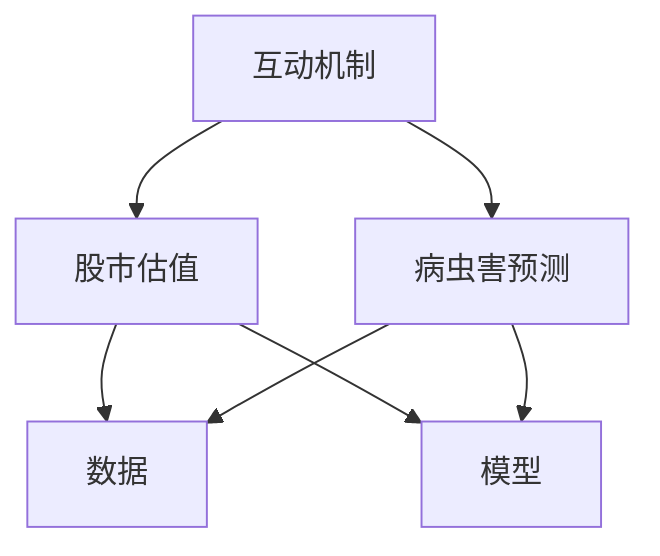
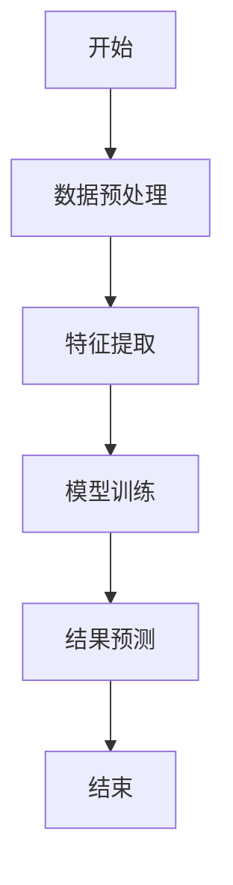
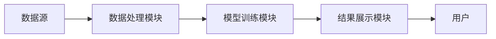

                 


# 新兴市场股市估值与智慧农业病虫害预测的互动

> 关键词：新兴市场、股市估值、智慧农业、病虫害预测、机器学习、人工智能、时间序列分析

> 摘要：本文探讨新兴市场股市估值与智慧农业病虫害预测之间的互动关系，分析两者的核心概念、算法原理、系统架构及项目实战，结合具体案例，揭示数据驱动解决方案在解决复杂问题中的潜力。

---

## 第1章 背景介绍与核心概念

### 1.1 问题背景

#### 1.1.1 新兴市场的定义与特点
- 新兴市场：指经济快速增长、工业化程度较低的国家，如巴西、印度、中国等。
- 特点：经济波动大、市场不完善、政策影响显著。

#### 1.1.2 股市估值的基本概念
- 股市估值：通过基本面分析和技术分析，对股票价格进行预测和评估。
- 常用指标：市盈率（P/E）、市净率（P/B）、股息率等。

#### 1.1.3 智慧农业与病虫害预测的关联性
- 智慧农业：利用物联网、大数据和人工智能优化农业生产。
- 病虫害预测：通过环境数据和历史数据预测病虫害发生概率。

### 1.2 问题描述

#### 1.2.1 新兴市场股市波动的特点
- 波动性大：新兴市场受外部经济波动影响显著。
- 不确定性高：政策变化和经济政策不确定性导致股市波动。

#### 1.2.2 病虫害对农业生产的威胁
- 病虫害导致农作物减产，影响农民收入。
- 病虫害的爆发具有周期性，难以预测。

#### 1.2.3 两者的互动关系
- 股市波动可能影响农业投资，进而影响病虫害防治资金。
- 病虫害预测的准确性可能影响农业产量，进而影响股市相关板块。

### 1.3 问题解决

#### 1.3.1 数据驱动的解决方案
- 利用大数据分析股市和农业数据，构建预测模型。

#### 1.3.2 人工智能在股市与农业中的应用
- 股市：使用机器学习进行股票预测。
- 农业：使用深度学习进行病虫害预测。

#### 1.3.3 互动机制的构建
- 构建数据共享平台，整合股市和农业数据，实现模型联动优化。

### 1.4 边界与外延

#### 1.4.1 新兴市场的边界条件
- 经济规模：新兴市场通常为中等收入国家。
- 政治因素：政策变化对经济和股市影响显著。

#### 1.4.2 股市估值的适用范围
- 适用于新兴市场，但需考虑数据质量和样本量。

#### 1.4.3 病虫害预测的局限性
- 数据不足：部分地区缺乏历史病虫害数据。
- 复杂性：病虫害受多种因素影响，模型难以完全捕捉。

### 1.5 概念结构与核心要素

#### 1.5.1 核心概念的层次分解
- 上层：互动机制。
- 中层：股市估值和病虫害预测。
- 下层：数据、模型、算法。

#### 1.5.2 核心要素的对比分析
- 数据来源：股市数据来自金融市场，农业数据来自传感器和历史记录。
- 模型目标：股市模型预测价格，农业模型预测病虫害风险。

#### 1.5.3 概念结构的可视化


---

## 第2章 核心概念的原理与联系

### 2.1 核心概念原理

#### 2.1.1 股市估值的数学模型
- 常用模型：CAPM（资本资产定价模型）。
- 公式：$$E(r_i) = r_f + β_i (E(r_m) - r_f)$$
  - $E(r_i)$：股票i的预期回报率。
  - $r_f$：无风险利率。
  - $β_i$：股票i的贝塔系数。
  - $E(r_m)$：市场预期回报率。

#### 2.1.2 病虫害预测的算法原理
- 常用算法：随机森林、XGBoost。
- 数据特征：温度、湿度、降水、光照、土壤情况。

#### 2.1.3 互动机制的理论基础
- 系统动力学：股市波动和病虫害预测形成反馈循环。

### 2.2 概念属性对比

| 概念 | 数据来源 | 模型目标 | 时间跨度 |
|------|----------|----------|----------|
| 股市估值 | 历史股价、财务数据 | 预测未来股价 | 短期至中期 |
| 病虫害预测 | 环境数据、历史病虫害记录 | 预测病虫害发生概率 | 中期至长期 |

### 2.3 ER实体关系图
```mermaid
er
    actor: 用户
    model: 模型
    data: 数据
    result: 结果
    actor --> data: 提供
    data --> model: 输入
    model --> result: 输出
    result --> actor: 反馈
```

---

## 第3章 算法原理与实现

### 3.1 算法原理

#### 3.1.1 时间序列分析
- ARIMA模型：适用于预测未来值。
  - 公式：$$ARIMA(p, d, q)$$
    - p：自回归阶数。
    - d：差分阶数。
    - q：移动平均阶数。

#### 3.1.2 机器学习模型
- 随机森林：适用于分类和回归问题。
  - 代码示例：
    ```python
    from sklearn.ensemble import RandomForestRegressor
    model = RandomForestRegressor(n_estimators=100)
    model.fit(X_train, y_train)
    ```

#### 3.1.3 深度学习模型
- LSTM网络：适用于时间序列预测。
  - 代码示例：
    ```python
    from keras.layers import LSTM, Dense
    model = Sequential()
    model.add(LSTM(50, input_shape=(timesteps, features)))
    model.add(Dense(1))
    model.compile(loss='mean_squared_error', optimizer='adam')
    ```

### 3.2 算法流程图


---

## 第4章 数学模型

### 4.1 时间序列模型

#### 4.1.1 ARIMA模型
- 示例：
  ```python
  from statsmodels.tsa.arima_model import ARIMA
  model = ARIMA(train, order=(5,1,0))
  model_fit = model.fit()
  ```

#### 4.1.2 LSTM网络
- 示例：
  ```python
  from keras.layers import LSTM, Dense
  model = Sequential()
  model.add(LSTM(50, input_shape=(timesteps, features)))
  model.add(Dense(1))
  ```

---

## 第5章 系统分析与架构设计

### 5.1 项目介绍
- 项目目标：构建一个结合股市估值和病虫害预测的互动系统。

### 5.2 系统功能设计
- 功能模块：
  - 数据采集模块：采集股市和农业数据。
  - 数据处理模块：清洗和预处理数据。
  - 模型训练模块：训练预测模型。
  - 结果展示模块：可视化预测结果。

### 5.3 系统架构设计


---

## 第6章 项目实战

### 6.1 环境安装
- 工具：Python、Jupyter、Scikit-learn、TensorFlow。

### 6.2 核心代码实现
- 示例代码：
  ```python
  import pandas as pd
  import numpy as np
  from sklearn.ensemble import RandomForestRegressor
  def preprocess(data):
      # 数据预处理代码
      return processed_data
  def train_model(X_train, y_train):
      model = RandomForestRegressor()
      model.fit(X_train, y_train)
      return model
  ```

### 6.3 代码解读与分析
- 数据预处理：处理缺失值、标准化数据。
- 模型训练：使用随机森林或LSTM进行训练。
- 结果分析：评估模型性能，调整参数。

### 6.4 实际案例分析
- 案例：预测某新兴市场的股市波动，同时预测某地区的病虫害风险。

---

## 第7章 总结

### 7.1 最佳实践 tips
- 数据质量：确保数据准确性和完整性。
- 模型选择：根据问题选择合适算法。
- 可视化：通过图表清晰展示结果。

### 7.2 小结
- 本文探讨了新兴市场股市估值与智慧农业病虫害预测的互动，展示了数据驱动解决方案的应用。

### 7.3 注意事项
- 数据隐私：保护用户数据。
- 模型局限：模型预测有不确定性。

### 7.4 拓展阅读
- 推荐书籍：《Python机器学习实战》、《深度学习入门》。

---

作者：AI天才研究院/AI Genius Institute & 禅与计算机程序设计艺术/Zen And The Art of Computer Programming

