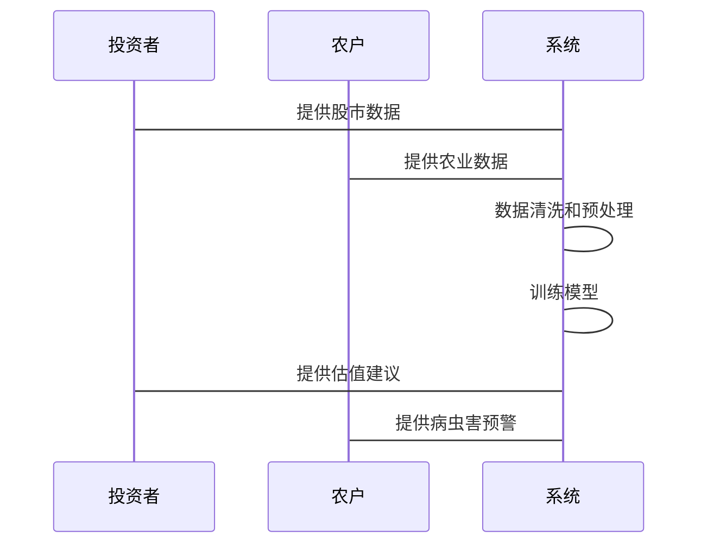

                 


# 新兴市场股市估值与智慧农业病虫害预警系统的互动

## 关键词：股市估值、智慧农业、病虫害预警、机器学习、数据驱动

## 摘要：  
本文探讨新兴市场股市估值与智慧农业病虫害预警系统的互动关系，通过分析农业数据与股市数据的关联性，提出利用机器学习技术构建预警模型，为投资者提供数据驱动的决策支持。文章详细阐述了股市估值的核心原理、智慧农业病虫害预警系统的实现方法，以及两者互动机制的数学模型，最后通过项目实战展示了系统的实际应用价值。

---

## 第一部分：背景介绍与核心概念

### 第1章：新兴市场股市估值与智慧农业病虫害预警系统概述

#### 1.1 背景介绍

##### 1.1.1 新兴市场股市的现状与挑战  
新兴市场股市具有高增长潜力，但也面临波动性大、信息不对称等问题。投资者需要更精准的估值方法来应对市场不确定性。

##### 1.1.2 智慧农业的发展与病虫害预警的重要性  
智慧农业通过物联网、大数据和人工智能技术，实现对病虫害的早期预警，帮助农民减少损失，提高农业生产效率。

##### 1.1.3 两者的互动关系与研究意义  
病虫害预警影响农业公司业绩，进而影响股市估值；同时，股市数据也能反过来反映农业风险，为预警系统提供补充信息。

#### 1.2 核心概念

##### 1.2.1 股市估值的定义与方法  
股市估值通过分析公司财务数据、市场趋势等，预测股票的合理价格。常用方法包括市盈率（P/E）、市净率（P/B）等。

##### 1.2.2 智慧农业病虫害预警系统的定义与组成部分  
智慧农业病虫害预警系统利用传感器、卫星图像和AI算法，实时监测农田数据，预测病虫害的发生并提出防治建议。

##### 1.2.3 两者的互动机制与应用场景  
病虫害预警影响农业公司股价，投资者利用预警信息调整投资策略；同时，股市数据为农业风险评估提供参考。

### 第2章：核心概念与联系

#### 2.1 核心概念原理

##### 2.1.1 股市估值的核心原理  
通过分析公司基本面和市场情绪，预测股票价格的合理区间。

##### 2.1.2 智慧农业病虫害预警系统的原理  
采集农田环境数据，利用算法分析，预测病虫害的发生概率。

##### 2.1.3 两者的关联性分析  
病虫害预警影响农业公司业绩，进而影响股市估值；同时，股市数据也能反映农业风险，为预警系统提供补充信息。

#### 2.2 核心概念对比与联系

##### 2.2.1 股市估值与智慧农业的属性对比  
| 属性 | 股市估值 | 智慧农业病虫害预警 |
|------|----------|----------------------|
| 数据源 | 财务数据、市场数据 | 农田传感器、卫星图像 |
| 目标 | 预测股价 | 预测病虫害 |
| 方法 | 机器学习、时间序列分析 | 数据分类、聚类算法 |

##### 2.2.2 互动关系的ER实体关系图

```mermaid
erDiagram
    actor 投资者 {
        <属性> 资金量
        <属性> 投资目标
    }
    actor 农户 {
        <属性> 农作物类型
        <属性> 病虫害风险
    }
    class 股市估值系统 {
        <属性> 股价
        <属性> 市场波动
        <方法> 计算估值
    }
    class 病虫害预警系统 {
        <属性> 数据来源
        <属性> 预警级别
        <方法> 分析数据
    }
    投资者 --> 股市估值系统 : 使用估值结果
    农户 --> 病虫害预警系统 : 提供农业数据
    股市估值系统 --> 病虫害预警系统 : 数据交互
```

---

## 第二部分：算法原理讲解

### 第3章：股市估值算法

#### 3.1 常用估值方法

##### 3.1.1 市盈率（P/E）  
$$ P/E = \frac{股价}{每股收益} $$

##### 3.1.2 市净率（P/B）  
$$ P/B = \frac{股价}{每股净资产} $$

#### 3.2 机器学习算法在估值中的应用  
使用随机森林或神经网络模型，基于历史数据预测未来股价。

#### 3.3 时间序列分析模型  
使用ARIMA模型预测股市波动。

### 第4章：病虫害预警算法

#### 4.1 数据分类与聚类算法  
使用K-means算法对病虫害数据进行分类。

#### 4.2 支持向量机在病虫害识别中的应用  
构建SVM模型，识别病虫害类型。

#### 4.3 预测模型的构建与优化  
使用LSTM模型，基于时间序列数据预测病虫害发生概率。

---

## 第三部分：系统分析与架构设计

### 第5章：系统分析与架构设计

#### 5.1 问题场景介绍  
农业公司股价受病虫害影响，投资者需要实时预警信息。

#### 5.2 项目介绍  
构建一个结合股市和农业数据的预警系统，帮助投资者和农民做出决策。

#### 5.3 系统功能设计  
- 数据采集模块：收集农业传感器和股市数据。
- 数据处理模块：清洗和预处理数据。
- 模型训练模块：训练机器学习模型。
- 结果展示模块：可视化预警结果。

#### 5.4 系统架构设计  


#### 5.5 系统交互设计  


---

## 第四部分：项目实战

### 第6章：项目实战

#### 6.1 环境安装  
安装Python、Pandas、Scikit-learn、TensorFlow等库。

#### 6.2 核心代码实现

##### 6.2.1 数据处理代码  
```python
import pandas as pd
data = pd.read_csv('agriculture_data.csv')
data.dropna(inplace=True)
```

##### 6.2.2 模型训练代码  
```python
from sklearn.ensemble import RandomForestClassifier
model = RandomForestClassifier()
model.fit(X_train, y_train)
```

#### 6.3 案例分析  
分析某地区病虫害数据，结合股市数据，预测相关股票的走势。

---

## 第五部分：总结与展望

### 第7章：总结与展望

#### 7.1 小结  
本文通过分析股市估值与智慧农业病虫害预警系统的互动关系，提出了数据驱动的解决方案，为投资者和农民提供决策支持。

#### 7.2 注意事项  
数据质量和模型选择对系统性能至关重要。

#### 7.3 拓展阅读  
推荐相关领域的书籍和论文，进一步学习。

---

## 作者：AI天才研究院 & 禅与计算机程序设计艺术

---

通过本文的分析和实践，读者可以深入了解股市估值与智慧农业病虫害预警系统的互动机制，并掌握如何利用技术手段实现数据驱动的决策支持。

