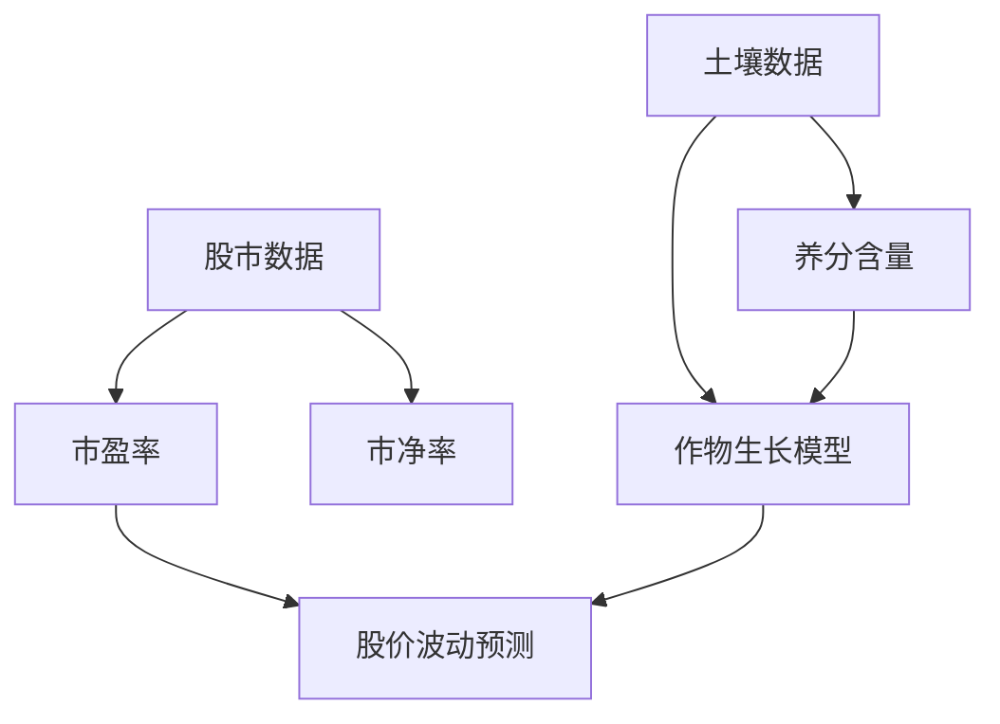
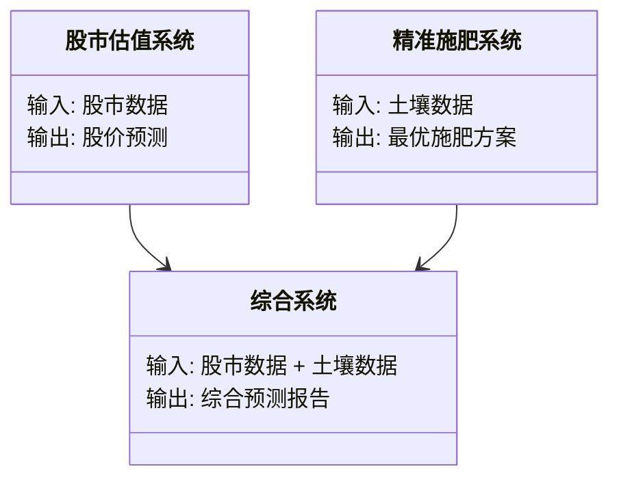
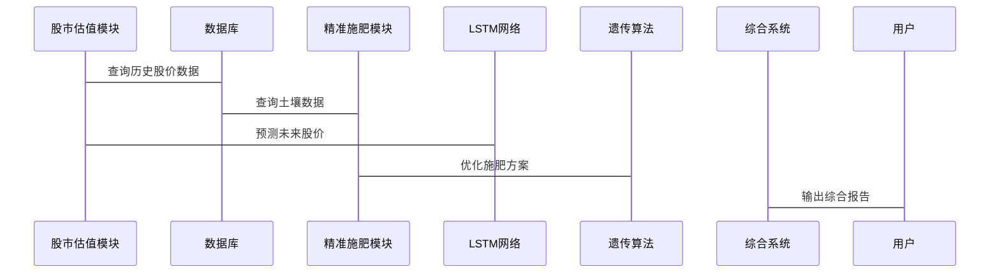

                 


# 新兴市场股市估值与智慧农业精准施肥的互动

## 关键词：股市估值、智慧农业、精准施肥、互动关系、算法、系统架构、项目实战

## 摘要：  
本文探讨新兴市场股市估值与智慧农业精准施肥之间的互动关系，分析其数学模型和系统架构。通过实际案例，展示了如何利用算法预测股市估值并优化精准施肥策略，旨在为相关领域的研究和实践提供理论支持和方法论指导。

---

## 第一部分: 新兴市场股市估值与智慧农业精准施肥的互动概述

### 第1章: 背景与问题描述

#### 1.1 新兴市场股市估值的现状
##### 1.1.1 新兴市场的定义与特点
新兴市场是指经济快速发展、产业结构转型中的国家，如中国、印度等。这些市场具有高增长潜力，但也面临波动性大的挑战。

##### 1.1.2 股市估值的基本概念
股市估值通过市盈率（P/E）、市净率（P/B）等指标评估股票价格是否合理。新兴市场的股市估值受宏观经济和政策影响较大。

##### 1.1.3 新兴市场股市估值的特殊性
新兴市场的股市估值波动性高，且受外部资本流动影响显著。与发达国家市场相比，新兴市场的估值更具敏感性和复杂性。

#### 1.2 智慧农业精准施肥的核心原理
##### 1.2.1 精准农业的定义与目标
精准农业利用物联网、大数据和人工智能技术，实现农作物种植的精准管理，以提高产量和减少资源浪费。

##### 1.2.2 智慧农业的技术支撑
智慧农业依赖于传感器、无人机、AI算法等技术，实时监测土壤湿度、温度和养分含量，为精准施肥提供数据支持。

##### 1.2.3 精准施肥的关键要素
精准施肥包括土壤分析、作物需求分析和施肥计划优化。通过数学模型确定最优施肥方案，减少化肥浪费和环境污染。

#### 1.3 股市估值与精准施肥的互动关系
##### 1.3.1 互动机制的初步探讨
股市估值的变化可能影响农业企业的投资和运营，而精准施肥技术的推广也可能影响农业企业的收益，进而影响股市表现。

##### 1.3.2 互动关系的理论框架
通过建立数学模型，分析股市估值与精准施肥之间的相互作用，揭示两者如何共同影响农业经济和金融市场。

##### 1.3.3 互动关系的实际案例
以某新兴市场为例，分析精准施肥技术的应用如何影响农业企业的业绩，进而影响其股价波动。

---

### 第2章: 核心概念与数学模型

#### 2.1 股市估值的核心概念
##### 2.1.1 股价与市盈率的关系
市盈率（P/E）= 股价 / 每股收益。低市盈率可能表示股票被低估，而高市盈率可能表示市场对公司的未来预期较高。

##### 2.1.2 股市波动的数学模型
股市波动可以用时间序列模型（如ARIMA）或机器学习模型（如LSTM）进行预测。例如，LSTM网络可以捕捉股市的长期依赖关系。

##### 2.1.3 股市估值的关键指标
关键指标包括市盈率、市净率、股息率等，这些指标共同反映了市场的估值水平。

#### 2.2 精准施肥的数学模型
##### 2.2.1 土壤养分分析的数学公式
土壤养分（如氮、磷、钾）的含量可以通过传感器数据和回归模型进行预测。例如，使用多元回归模型分析土壤湿度、温度与养分含量的关系。

##### 2.2.2 农作物生长模型
作物生长模型（如CERES模型）可以模拟作物生长过程，预测最佳施肥时间和施肥量。

##### 2.2.3 精准施肥的优化算法
优化算法如遗传算法可以用于确定最优施肥方案。例如，通过遗传算法优化施肥量和施肥时间，以最大化作物产量。

#### 2.3 核心概念的对比分析
##### 2.3.1 股市估值与精准施肥的对比表格

| 指标         | 股市估值               | 精准施肥               |
|--------------|-----------------------|-----------------------|
| 数据来源     | 市场数据、财务报表       | 土壤传感器、气象数据   |
| 目标         | 预测股价波动           | 优化施肥方案           |
| 方法         | 时间序列分析、机器学习 | 回归模型、优化算法     |

##### 2.3.2 实体关系图（ER图）



---

### 第3章: 算法原理与数学模型

#### 3.1 股市估值的预测算法
##### 3.1.1 时间序列分析
时间序列分析（如ARIMA）用于预测股市的短期波动。例如，使用ARIMA模型预测未来一周的股价走势。

##### 3.1.2 机器学习模型（如LSTM）
LSTM网络可以捕捉股市的长期依赖关系，适用于长期趋势预测。例如，使用LSTM模型预测未来一个月的股价变化。

#### 3.2 精准施肥的优化算法
##### 3.2.1 基于遗传算法的优化
遗传算法通过模拟自然选择过程，优化施肥方案。例如，确定最佳施肥时间和施肥量。

##### 3.2.2 线性规划模型
线性规划模型用于优化资源分配，如确定最优的施肥量和施肥顺序。

#### 3.3 算法原理的数学推导
##### LSTM网络的结构与公式
LSTM网络由输入门、遗忘门和输出门组成。其核心公式包括：

$$
i = \sigma(W_i x + U_i h_{prev})
$$

$$
f = \sigma(W_f x + U_f h_{prev})
$$

$$
o = \sigma(W_o x + U_o h_{prev})
$$

$$
h = i \cdot \tanh(W_c x + U_c h_{prev})
$$

##### 遗传算法的基本步骤
1. 初始化种群
2. 计算适应度
3. 选择父代
4. 交叉重组
5. 变异
6. 重复步骤，直到满足终止条件

---

### 第4章: 系统分析与架构设计

#### 4.1 问题场景介绍
##### 股市与农业的互动场景
新兴市场的股市波动可能影响农业企业的融资能力，而精准施肥技术的应用可能提升农业企业的产量，进而影响股价。

#### 4.2 系统功能设计
##### 领域模型（Mermaid类图）



#### 4.3 系统架构设计
##### 模块划分与交互（Mermaid架构图）

```mermaid
client --> 股市估值模块
client --> 精准施肥模块
股市估值模块 --> 数据库
精准施肥模块 --> 数据库
```

#### 4.4 系统接口与交互设计
##### 序列图（Mermaid）



---

### 第5章: 项目实战与案例分析

#### 5.1 环境安装与配置
##### 开发环境搭建
安装Python、TensorFlow、PyTorch、遗传算法库（如DEAP）等工具。

##### 数据集准备
获取新兴市场的股市数据和农业传感器数据，清洗和预处理数据。

#### 5.2 系统核心实现
##### 股市估值预测代码
```python
import numpy as np
from tensorflow.keras.models import Sequential
from tensorflow.keras.layers import LSTM, Dense

model = Sequential()
model.add(LSTM(64, input_shape=(timesteps, features)))
model.add(Dense(1))
model.compile(optimizer='adam', loss='mean_squared_error')
model.fit(X_train, y_train, epochs=100, batch_size=32)
```

##### 精准施肥优化代码
```python
from deap import algorithms, base, tools

toolbox = base.Toolbox()
toolbox.register("attr_int", random.randint, 0, 100)
toolbox.register("mate", tools.mate, toolbox.attr_int, toolbox.attr_int)
toolbox.register("mutate", tools.mutInt)
toolbox.register("select", tools.selTournament, tournsize=2)
```

#### 5.3 案例分析与结果解读
##### 实际案例分析
以某新兴市场为例，分析精准施肥技术的应用如何影响农业企业的收益和股价波动。

##### 结果与预期对比
通过对比实际结果与模型预测结果，验证算法的有效性和准确性。

---

### 第6章: 总结与未来展望

#### 6.1 项目总结
##### 核心成果回顾
本文通过建立数学模型和算法，揭示了新兴市场股市估值与智慧农业精准施肥之间的互动关系。

##### 经验与教训
数据质量对模型性能影响较大，需加强数据清洗和特征工程。

#### 6.2 未来研究方向
##### 新兴市场股市的进一步研究
探索更多影响因素，如政策变化和国际资本流动。

##### 智慧农业技术的创新
研究更高效的传感器和更智能的算法，进一步优化精准施肥方案。

#### 6.3 最佳实践与注意事项
##### 实践中的关键点
数据收集和处理是关键，需确保数据的准确性和完整性。

##### 注意事项与
算法的选择需根据实际问题和数据特点，避免过度复杂化。

---

## 作者：AI天才研究院 & 禅与计算机程序设计艺术

