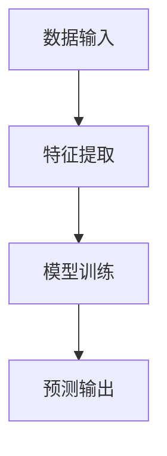
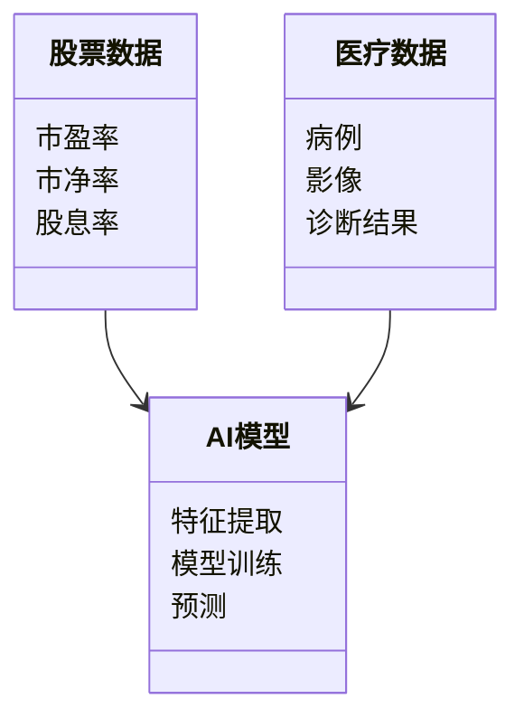
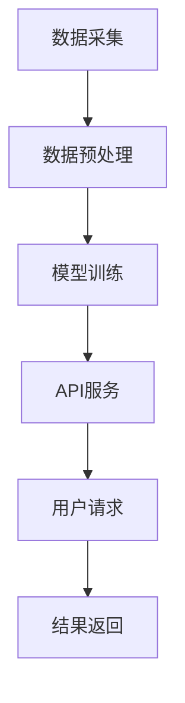
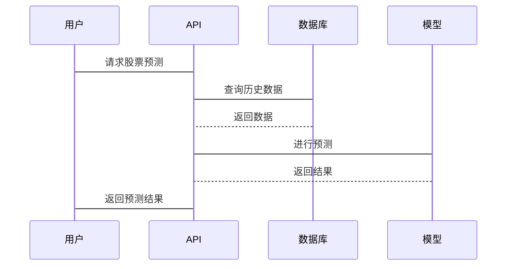

                 


# 新兴市场股市估值与智慧医疗AI辅助诊断的互动

> 关键词：新兴市场，股市估值，智慧医疗，AI辅助诊断，数据共享，互动机制，系统架构

> 摘要：本文探讨新兴市场股市估值与智慧医疗AI辅助诊断的互动机制，分析数据共享、技术融合和应用场景，提出系统架构和实现方案，为投资者和医疗行业提供决策支持。

---

## 第一部分：背景介绍

### 1.1 核心概念术语说明

- **新兴市场**：经济快速增长、金融市场逐步开放的国家，如中国、印度等。
- **股市估值**：评估股票内在价值，帮助投资者做出投资决策。
- **智慧医疗**：利用AI、大数据等技术提升医疗服务和效率。
- **AI辅助诊断**：AI技术在医疗影像和疾病预测中的应用。

### 1.2 问题背景

- 新兴市场股市波动大，信息不对称影响估值准确性。
- 医疗行业数据分散，AI辅助诊断潜力未充分挖掘。

### 1.3 问题描述

- 股市估值受宏观经济、行业和公司基本面影响。
- AI辅助诊断依赖高质量数据，需解决数据隐私和共享问题。

### 1.4 互动机制

- 数据共享：股市数据与医疗数据的结合。
- 技术融合：AI技术应用于两者，提升估值和诊断准确性。
- 应用场景：利用AI优化投资决策和医疗诊断。

### 1.5 边界与外延

- 互动机制仅限于AI技术，不涉及其他技术。
- 数据共享需遵守隐私保护法规。

### 1.6 核心要素组成

- 数据：股市数据、医疗数据。
- 技术：AI算法、大数据分析。
- 应用场景：投资决策、疾病预测。

---

## 第二部分：核心概念与联系

### 2.1 核心概念原理

- **股市估值**：通过算法分析历史数据预测未来走势。
- **AI辅助诊断**：利用深度学习模型识别医疗影像。

### 2.2 核心概念对比

| 特性 | 股市估值 | AI辅助诊断 |
|------|----------|------------|
| 数据 | 股价、财务指标 | 影像、病历 |
| 技术 | 机器学习 | 深度学习 |
| 应用 | 投资决策 | 疾病预测 |

### 2.3 ER实体关系图

```mermaid
er
  actor: 投资者
  actor: 医生
  entity: 股票
  entity: 病例
  entity: 诊断结果
  entity: 财务数据
  entity: 医疗影像
  relation: 投资者拥有股票
  relation: 股票包含财务数据
  relation: 医生诊断病例
  relation: 病例包含医疗影像
  relation: AI模型分析财务数据和医疗影像
```

### 2.4 算法流程



---

## 第三部分：算法原理讲解

### 3.1 机器学习算法

#### 3.1.1 线性回归

- 预测股票价格：$y = \beta_0 + \beta_1x + \epsilon$
- 实现代码：

```python
import numpy as np
from sklearn.linear_model import LinearRegression

# 示例数据
X = np.array([[1], [2], [3], [4]])
y = [1, 2, 3, 4]

model = LinearRegression()
model.fit(X, y)
print("预测值:", model.predict([[5]]))
```

### 3.1.2 决策树

- 分类和回归，适合医疗诊断分类。

#### 3.1.3 深度学习

- 使用CNN进行图像识别，如医学影像诊断。

---

## 第四部分：系统架构与设计

### 4.1 领域模型类图



### 4.2 系统架构图



### 4.3 系统接口设计

- 接口：API提供股票预测和疾病诊断功能。

### 4.4 交互序列图



---

## 第五部分：项目实战

### 5.1 环境安装

- Python、TensorFlow、Scikit-learn

### 5.2 核心代码实现

#### 股票预测代码：

```python
import numpy as np
import pandas as pd
from sklearn.linear_model import LinearRegression

# 数据加载
data = pd.read_csv('stock.csv')
X = data[['开盘价', '收盘价', '最高价', '最低价']]
y = data['成交量']

# 模型训练
model = LinearRegression()
model.fit(X, y)

# 预测
print("预测值:", model.predict([[100, 100, 100, 100]]))
```

#### 疾病诊断代码：

```python
import tensorflow as tf
from tensorflow.keras import layers

# 数据加载
data = pd.read_csv('medical.csv')
X = data.drop('诊断结果', axis=1)
y = data['诊断结果']

# 模型构建
model = tf.keras.Sequential([
    layers.Dense(64, activation='relu'),
    layers.Dense(2, activation='softmax')
])

# 编译
model.compile(optimizer='adam', loss='sparse_categorical_crossentropy', metrics=['accuracy'])

# 训练
model.fit(X, y, epochs=10, batch_size=32)
```

### 5.3 案例分析

- 股票预测案例：分析历史数据，预测未来价格。
- 疾病诊断案例：利用AI模型识别疾病特征。

---

## 第六部分：总结与展望

### 6.1 总结

- 互动机制的优势：提升估值准确性，优化诊断流程。
- 技术融合的重要性：AI技术推动金融和医疗发展。

### 6.2 展望

- 数据隐私保护：确保数据共享安全。
- 模型优化：提升算法准确性和效率。

---

## 作者信息

作者：AI天才研究院（AI Genius Institute） & 禅与计算机程序设计艺术（Zen And The Art of Computer Programming）

---

本文通过详细分析新兴市场股市估值与智慧医疗AI辅助诊断的互动机制，结合系统架构和项目实战，展示了如何利用技术提升投资决策和医疗诊断的准确性。

