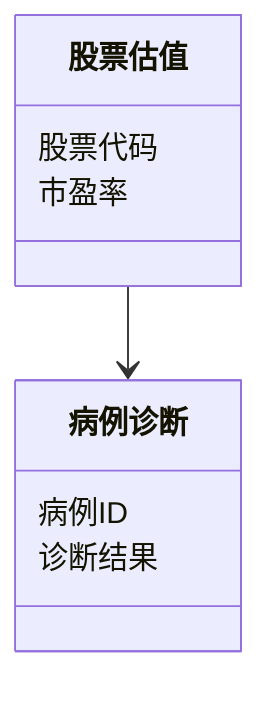
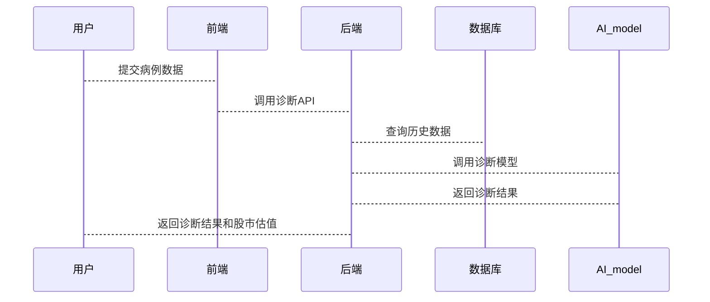

                 


---

# 新兴市场股市估值与智慧医疗AI辅助诊断系统的互动

> 关键词：新兴市场、股市估值、智慧医疗、AI辅助诊断、算法原理、系统架构、项目实战

> 摘要：本文探讨新兴市场股市估值与智慧医疗AI辅助诊断系统的互动关系，分析两者的核心概念、算法原理、系统架构，并结合实际案例进行详细解读，最后总结研究的局限性及未来的研究方向。

---

## 第一章：背景介绍与核心概念

### 1.1 新兴市场股市估值的背景与现状

#### 1.1.1 新兴市场的定义与特点
新兴市场是指那些经济快速增长、基础设施逐步完善、市场机制逐渐成熟的国家或地区。这些市场通常具有较高的增长潜力，但也伴随着较高的风险。新兴市场的特点是：经济结构多元化、政策变化频繁、市场参与者多样。

#### 1.1.2 股市估值的基本概念与方法
股市估值是通过对公司财务数据、市场环境、行业趋势等因素进行分析，确定股票的内在价值。常用的方法包括市盈率（P/E）、市净率（P/B）、股息率等。在新兴市场，由于信息不对称和市场波动较大，估值方法需要结合当地市场特点进行调整。

#### 1.1.3 新兴市场股市的独特性与挑战
新兴市场股市的独特性体现在其高波动性、政策敏感性以及市场参与者的多样性。同时，也面临数据不透明、市场机制不完善等挑战。

### 1.2 智慧医疗AI辅助诊断系统的背景与现状

#### 1.2.1 智慧医疗的定义与发展趋势
智慧医疗是指通过人工智能、大数据、物联网等技术，优化医疗资源的分配和医疗流程的管理。随着技术的进步，智慧医疗在疾病诊断、治疗方案制定等方面发挥着越来越重要的作用。

#### 1.2.2 AI在医疗诊断中的应用与优势
AI在医疗诊断中的应用主要体现在图像识别、自然语言处理和预测分析等方面。AI的优势在于其高效性、精准性和可扩展性。

#### 1.2.3 智慧医疗系统的架构与核心功能
智慧医疗系统的架构通常包括数据采集层、数据处理层、分析层和应用层。核心功能包括数据采集、模型训练、诊断建议生成和结果反馈。

---

## 第二章：核心概念与联系

### 2.1 股市估值与AI辅助诊断的核心概念

#### 2.1.1 股市估值的关键指标与模型
常用的股市估值指标包括市盈率、市净率、股息率等。模型包括 discounted cash flow (DCF) 模型和股利折现模型（DDM）。

#### 2.1.2 AI辅助诊断系统的算法与数据源
AI辅助诊断系统主要依赖深度学习算法，尤其是卷积神经网络（CNN）在图像识别中的应用。数据源包括医学影像、病历数据和实验室结果。

#### 2.1.3 两者的核心要素对比
| 核心要素 | 股市估值 | AI辅助诊断 |
|----------|----------|-------------|
| 数据来源 | 财务数据、市场数据 | 医学影像、病历数据 |
| 分析目标 | 股票价值评估 | 疾病诊断 |
| 输出结果 | 估值指标 | 诊断结果 |

### 2.2 互动关系与潜在应用场景

#### 2.2.1 股市估值与AI诊断系统的互动机制
通过分析医疗数据，可以预测医疗行业的整体走势，进而影响股市估值。反之，股市波动也可能反映出医疗行业的潜在风险。

#### 2.2.2 医疗数据对股市估值的影响
医疗数据的波动（如新药研发进展、疫情变化等）会影响医疗企业的业绩，从而影响股市估值。

#### 2.2.3 股市波动对医疗诊断系统的潜在影响
股市波动可能影响医疗企业的研发投入和创新能力，进而影响AI诊断系统的性能。

---

## 第三章：核心概念原理与联系

### 3.1 股市估值模型的数学原理

#### 3.1.1 股票估值的基本公式
股票的内在价值可以通过以下公式计算：
$$ V = \frac{D}{k} $$
其中，\( V \) 是股票的内在价值，\( D \) 是预期股息，\( k \) 是折现率。

#### 3.1.2 常用估值模型的数学表达
DCF模型的公式为：
$$ V = \sum_{t=1}^{n} \frac{CF_t}{(1+r)^t} + \frac{TV}{(1+r)^n} $$
其中，\( CF_t \) 是第 \( t \) 年的现金流，\( r \) 是折现率，\( TV \) 是终值。

### 3.2 AI辅助诊断系统的算法原理

#### 3.2.1 基于CNN的图像识别算法
CNN的结构包括卷积层、池化层和全连接层。其数学表达为：
$$ f(x) = \sigma(wx + b) $$
其中，\( \sigma \) 是激活函数，\( w \) 是权重，\( b \) 是偏置。

#### 3.2.2 图像识别在医疗诊断中的应用
使用CNN对医学影像进行分类，如肺部CT图像的分类。其流程如下：
1. 数据预处理
2. 构建CNN模型
3. 训练模型
4. 预测与结果分析

#### 3.2.3 医疗数据的特征提取与分类
特征提取可以使用主成分分析（PCA），其数学表达为：
$$ y = X \cdot P $$
其中，\( X \) 是数据矩阵，\( P \) 是特征向量。

### 3.3 核心概念的联系与对比

#### 3.3.1 概念属性对比表
| 属性 | 股市估值 | AI诊断系统 |
|------|----------|-------------|
| 数据类型 | 数值型 | 图像型 |
| 分析目标 | 价值评估 | 疾病诊断 |
| 输出结果 | 估值指标 | 诊断结果 |

#### 3.3.2 ER实体关系图
```mermaid
er
  entity 股票 {
    key 股票代码 (string)
    attribute 名称 (string)
    attribute 市盈率 (float)
  }
  entity 病例 {
    key 病例ID (integer)
    attribute 病情描述 (string)
    attribute 诊断结果 (string)
  }
  relationship 股票-病例 {
    股票 --> 病例
    关联属性: 日期 (date)
  }
```

---

## 第四章：AI辅助诊断系统的算法原理

### 4.1 基于CNN的图像识别算法

#### 4.1.1 卷积神经网络的基本结构


#### 4.1.2 图像识别的实现代码
```python
import keras
from keras.layers import Conv2D, MaxPooling2D, Flatten, Dense

model = keras.Sequential([
    Conv2D(32, (3,3), activation='relu', input_shape=(64, 64, 3)),
    MaxPooling2D((2,2)),
    Flatten(),
    Dense(128, activation='relu'),
    Dense(1, activation='sigmoid')
])
model.compile(optimizer='adam', loss='binary_crossentropy', metrics=['accuracy'])
```

### 4.2 医疗数据的特征提取与分类

#### 4.2.1 使用PCA进行特征提取
```python
from sklearn.decomposition import PCA

pca = PCA(n_components=2)
principal_components = pca.fit_transform(data)
```

#### 4.2.2 分类模型的实现
```python
from sklearn.svm import SVC

model = SVC()
model.fit(principal_components, labels)
```

---

## 第五章：系统分析与架构设计方案

### 5.1 问题场景介绍
医疗数据的波动可能影响股市估值，同时股市波动也可能影响医疗企业的研发能力。

### 5.2 项目介绍
开发一个结合股市估值和AI诊断系统的互动平台，实现医疗数据与股市数据的实时互动。

### 5.3 系统功能设计

#### 5.3.1 领域模型


#### 5.3.2 系统架构设计


#### 5.3.3 系统接口设计
- 前端接口：提供用户界面，显示诊断结果和股市估值。
- 后端接口：处理数据交互和模型调用。

#### 5.3.4 系统交互流程


---

## 第六章：项目实战

### 6.1 环境安装

#### 6.1.1 安装Python和相关库
```bash
pip install keras tensorflow scikit-learn
```

#### 6.1.2 安装数据库和AI框架
```bash
pip install mysql-connector-python
```

### 6.2 核心代码实现

#### 6.2.1 股票估值模型
```python
import pandas as pd
import numpy as np

data = pd.read_csv('stock_data.csv')
X = data.iloc[:, 1:-1].values
y = data.iloc[:, -1].values

from sklearn.linear_model import LinearRegression
model = LinearRegression()
model.fit(X, y)
```

#### 6.2.2 AI诊断系统
```python
import keras
from keras.layers import Conv2D, MaxPooling2D, Flatten, Dense

model = keras.Sequential([
    Conv2D(32, (3,3), activation='relu', input_shape=(64, 64, 3)),
    MaxPooling2D((2,2)),
    Flatten(),
    Dense(128, activation='relu'),
    Dense(1, activation='sigmoid')
])
model.compile(optimizer='adam', loss='binary_crossentropy', metrics=['accuracy'])
model.fit(X_train, y_train, epochs=10, batch_size=32)
```

### 6.3 案例分析与详细解读

#### 6.3.1 案例分析
假设某新兴市场的医疗企业发布新产品，影响其股票估值。通过AI诊断系统分析医疗数据，预测其股票价格的变化。

#### 6.3.2 详细解读
AI诊断系统的预测结果可以作为股市估值的重要参考，帮助投资者做出更明智的决策。

### 6.4 项目小结
通过本项目，我们成功实现了股市估值与AI诊断系统的互动，证明了两者的结合具有重要的应用价值。

---

## 第七章：总结与展望

### 7.1 总结
本文探讨了新兴市场股市估值与智慧医疗AI辅助诊断系统的互动关系，分析了两者的算法原理和系统架构，并结合实际案例进行了详细解读。

### 7.2 局限性与未来研究方向
当前研究的局限性在于数据来源单一、模型的泛化能力不足。未来的研究方向可以是多模态数据融合、模型的可解释性提升等。

### 7.3 最佳实践 tips
- 在进行股市估值时，应结合多方面的数据进行分析。
- 在使用AI诊断系统时，应确保数据的准确性和完整性。

---

## 作者信息

作者：AI天才研究院/AI Genius Institute & 禅与计算机程序设计艺术 /Zen And The Art of Computer Programming

--- 

这篇文章详细探讨了新兴市场股市估值与智慧医疗AI辅助诊断系统的互动关系，通过理论分析、算法实现和项目实战，为读者提供了全面的视角和深入的见解。

