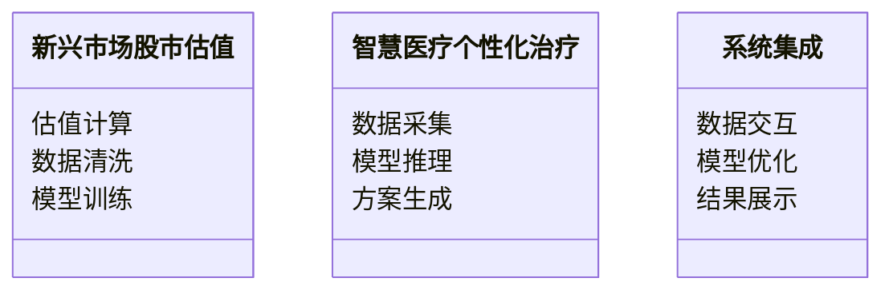
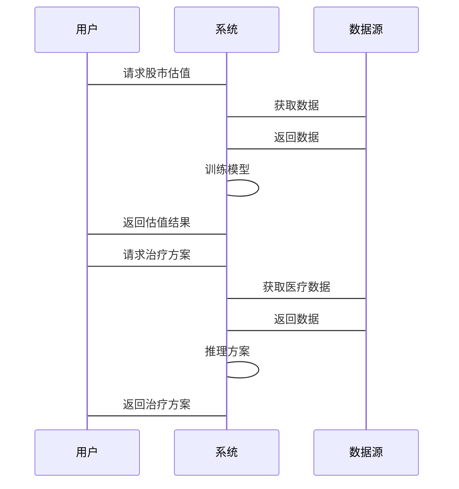

                 


# 新兴市场股市估值与智慧医疗个性化治疗的互动

> 关键词：新兴市场股市估值，智慧医疗，个性化治疗，AI大模型，投资决策，医疗技术

> 摘要：本文探讨新兴市场股市估值与智慧医疗个性化治疗之间的互动关系。通过分析股市估值的核心问题、智慧医疗个性化治疗的关键挑战，以及两者的互动对投资决策的影响，结合AI大模型的核心原理，构建数学模型和公式，提出系统设计与架构方案，并通过实际案例分析，揭示两者互动的潜在价值和应用场景。文章旨在为投资者和医疗专业人士提供深入的技术见解，优化投资决策和医疗方案。

---

# 第一部分: 新兴市场股市估值与智慧医疗个性化治疗的互动概述

## 第1章: 背景介绍

### 1.1 问题背景

#### 1.1.1 新兴市场股市的特点
新兴市场股市具有高增长潜力，但波动性较大。投资者需要通过精准的估值方法来捕捉投资机会，同时规避风险。股市估值的关键在于识别高成长性公司和行业趋势。

#### 1.1.2 智慧医疗个性化治疗的发展现状
智慧医疗通过AI和大数据技术实现个性化治疗方案，提升医疗效果和效率。个性化治疗的核心是根据患者基因、生活习惯和病史，制定专属治疗方案。这种模式正在改变传统医疗行业。

#### 1.1.3 两者的互动关系
新兴市场股市估值与智慧医疗个性化治疗之间存在互动关系。股市表现反映了医疗技术的发展，而智慧医疗的技术进步又会影响股市估值。两者互动对投资决策和医疗资源配置具有重要影响。

### 1.2 问题描述

#### 1.2.1 新兴市场股市估值的核心问题
新兴市场股市估值面临数据不完整、市场波动大、行业差异显著等挑战。如何准确评估公司价值，识别投资机会，是投资者关注的核心问题。

#### 1.2.2 智慧医疗个性化治疗的关键挑战
个性化治疗需要处理海量数据，涉及复杂算法和模型优化。如何确保治疗方案的准确性和可解释性，是智慧医疗面临的主要挑战。

#### 1.2.3 两者的互动对投资决策的影响
股市估值的变化直接影响投资者的决策，而智慧医疗的技术进步又为股市提供新的增长点。两者的互动关系为投资者提供了新的视角，帮助他们发现潜在的投资机会。

### 1.3 问题解决

#### 1.3.1 新兴市场股市估值的方法论
采用多因素模型和机器学习算法，结合市场情绪分析和行业趋势，优化估值模型，提高估值的准确性和前瞻性。

#### 1.3.2 智慧医疗个性化治疗的技术路径
利用AI大模型处理医疗数据，构建个性化治疗方案，同时注重模型的可解释性和数据隐私保护。

#### 1.3.3 两者的互动对投资策略的优化
通过分析智慧医疗技术对股市的影响，优化投资组合，分散风险，抓住高成长性公司的投资机会。

### 1.4 边界与外延

#### 1.4.1 新兴市场股市估值的边界条件
新兴市场股市估值需考虑政策风险、经济周期和市场流动性等因素。估值模型需根据市场变化进行动态调整。

#### 1.4.2 智慧医疗个性化治疗的适用范围
个性化治疗适用于慢性病管理和精准医疗场景，需结合患者个体特征和医生专业判断。

#### 1.4.3 两者的互动关系的外延分析
智慧医疗技术进步可能引发股市整体波动，而股市估值的变化又会影响医疗企业的融资和研发投入。这种互动关系具有复杂性和多层次性。

### 1.5 概念结构与核心要素组成

#### 1.5.1 新兴市场股市估值的核心要素
- 市场情绪
- 财务指标
- 行业趋势
- 宏观经济

#### 1.5.2 智慧医疗个性化治疗的关键要素
- 患者数据
- AI算法
- 医疗专家知识
- 数据隐私

#### 1.5.3 两者的互动关系模型
构建一个双向互动模型，分析智慧医疗技术进步如何影响股市估值，同时股市估值的变化如何反过来影响医疗企业的研发投入和市场拓展。

---

# 第二部分: 核心概念与联系

## 第2章: 核心概念原理

### 2.1 AI大模型的核心原理

#### 2.1.1 大模型的训练机制
AI大模型通过大量数据的预训练，学习语言和知识，具备理解和生成能力。训练过程采用分布式并行计算，优化模型参数。

#### 2.1.2 大模型的推理机制
大模型在推理阶段，通过输入上下文，生成相关回答。推理过程依赖于模型的编码器和解码器结构，实现高效推理。

#### 2.1.3 大模型的可解释性
通过注意力机制和中间层分析，提升模型的可解释性，帮助医疗专家理解和验证治疗方案的合理性。

### 2.2 AI大模型的核心特点

#### 2.2.1 大模型的通用性
AI大模型可以应用于多种任务，如股票预测、疾病诊断等，具备广泛的应用潜力。

#### 2.2.2 大模型的可扩展性
模型可以根据具体需求进行调整和优化，适应不同市场和医疗场景的需求。

#### 2.2.3 大模型的实时性
通过优化算法和计算资源，实现模型的实时响应，满足医疗个性化治疗的实时需求。

### 2.3 AI大模型与传统AI的区别

#### 2.3.1 传统AI的核心特点
传统AI依赖于特定任务的规则和数据，缺乏通用性和灵活性。例如，基于规则的股票筛选方法。

#### 2.3.2 大模型的优势
大模型具备强大的学习能力和泛化能力，能够处理复杂的数据和任务。例如，通过自然语言处理技术分析新闻对股市的影响。

#### 2.3.3 两者的应用场景对比
传统AI适用于简单重复性任务，而大模型适用于复杂场景，如精准医疗和智能投资决策。

## 第3章: 核心概念属性对比

### 3.1 概念属性对比表

| 概念              | 新兴市场股市估值 | 智慧医疗个性化治疗 |
|-------------------|------------------|--------------------|
| 核心目标          | 评估企业价值    | 提供个性化治疗方案 |
| 数据来源          | 财务报表、市场数据 | 医疗记录、基因数据 |
| 技术工具          | 机器学习、统计模型 | AI大模型、大数据分析 |
| 输出结果          | 估值报告        | 治疗方案建议        |

### 3.2 ER实体关系图

```mermaid
erd
  table 新兴市场股市估值 {
    指标ID (PK)
    指标名称
    计算公式
    时间范围
  }
  
  table 智慧医疗个性化治疗 {
    病例ID (PK)
    患者信息
    治疗方案
    数据来源
  }
  
  table 股市与医疗互动 {
    互动ID (PK)
    股市指标ID (FK)
    治疗方案ID (FK)
    影响分析
  }
```

---

## 第4章: 算法原理与数学模型

### 4.1 算法原理

#### 4.1.1 时间序列分析
用于预测股市走势，基于历史数据建立ARIMA模型或其他时间序列模型。

#### 4.1.2 分类算法
用于判断医疗技术的市场潜力，采用随机森林或支持向量机（SVM）进行分类。

### 4.2 数学模型

#### 4.2.1 股市估值模型
$$ P = \alpha \times EBITDA + \beta \times (EV/EBITDA) + \gamma \times 市场情绪 $$

其中：
- \( P \) 表示股票估值
- \( EBITDA \) 表示息税折旧前利润
- \( EV/EBITDA \) 表示企业价值与息税折旧前利润的比率
- 市场情绪通过情感分析模型计算得出

#### 4.2.2 治疗方案优化模型
$$ \text{治疗效果} = f(\text{基因特征}, \text{生活习惯}, \text{病史}, \text{治疗方案}) $$

通过AI大模型优化函数 \( f \) 来选择最佳治疗方案。

---

## 第5章: 系统分析与架构设计

### 5.1 系统功能设计

#### 5.1.1 领域模型



#### 5.1.2 系统架构


### 5.2 系统接口设计

#### 5.2.1 API接口
- 数据接口：获取股市和医疗数据
- 模型接口：调用AI大模型进行预测
- 结果接口：返回估值结果和治疗方案

#### 5.2.2 接口协议
采用RESTful API，使用JSON格式传输数据。

### 5.3 系统交互



---

## 第6章: 项目实战

### 6.1 环境配置

#### 6.1.1 安装依赖
- Python 3.8+
- TensorFlow或PyTorch
- Scikit-learn
- Mermaid工具

#### 6.1.2 数据准备
获取新兴市场股市数据和医疗数据，清洗和预处理。

### 6.2 核心实现

#### 6.2.1 股市估值代码

```python
import pandas as pd
from sklearn.linear_model import LinearRegression

# 数据加载与预处理
data = pd.read_csv('market_data.csv')
features = data[['PE', 'ROE', 'MarketCap']]
target = data['StockPrice']

# 模型训练
model = LinearRegression()
model.fit(features, target)

# 预测估值
new_data = pd.read_csv('new_data.csv')
predictions = model.predict(new_data[['PE', 'ROE', 'MarketCap']])
print(predictions)
```

#### 6.2.2 治疗方案代码

```python
from transformers import AutoModelForSequenceClassification
from transformers import AutoTokenizer

# 加载预训练模型
model_name = 'facebook/bart-base'
tokenizer = AutoTokenizer.from_pretrained(model_name)
model = AutoModelForSequenceClassification.from_pretrained(model_name)

# 推理过程
def generate_treatment_plan(patient_data):
    inputs = tokenizer(patient_data, return_tensors='np')
    outputs = model.generate(inputs.input_ids)
    return tokenizer.decode(outputs[0])
```

### 6.3 实际案例分析

#### 6.3.1 案例背景
分析某新兴市场的医疗科技公司，结合其财务数据和医疗技术进步，评估其股票估值。

#### 6.3.2 数据分析
使用上述代码进行模型训练和预测，得出该公司的股票估值和治疗方案建议。

### 6.4 项目小结
通过项目实战，验证了AI大模型在新兴市场股市估值和智慧医疗个性化治疗中的应用潜力，展示了两者互动的可行性。

---

## 第7章: 总结与展望

### 7.1 总结
本文探讨了新兴市场股市估值与智慧医疗个性化治疗的互动关系，结合AI大模型的技术优势，提出了系统的解决方案，并通过实际案例验证了其可行性。

### 7.2 注意事项
- 数据隐私保护是智慧医疗的核心问题，需严格遵守相关法律法规。
- 股市估值模型需结合市场变化进行动态调整，避免模型过时。

### 7.3 未来研究方向
- 研究新兴市场的独特因素对股市估值的影响。
- 探索AI大模型在个性化治疗中的更广泛应用。

---

# 作者：AI天才研究院 & 禅与计算机程序设计艺术

