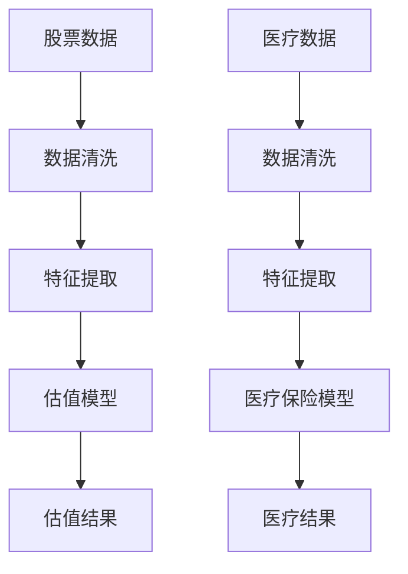
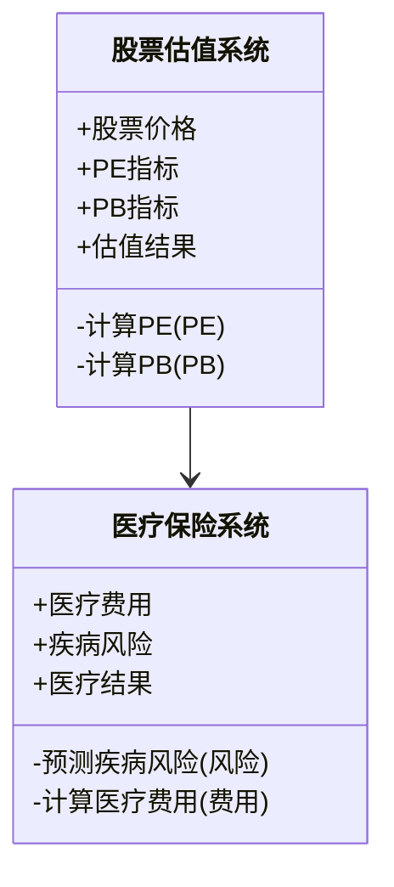

                 


# 新兴市场股市估值与智慧医疗保险的互动

> 关键词：新兴市场，股市估值，智慧医疗保险，互动机制，数据分析，机器学习

> 摘要：本文探讨了新兴市场股市估值与智慧医疗保险之间的互动关系，分析了两者的核心概念、技术原理及互动机制，通过系统架构设计和项目实战，展示了如何利用智慧医疗保险数据优化股市估值模型，实现两者的有机结合。

---

# 第1章：新兴市场股市估值与智慧医疗保险的互动概述

## 1.1 问题背景与问题描述
### 1.1.1 新兴市场股市估值的现状与挑战
新兴市场股市估值面临数据不透明、波动性大、市场参与者复杂等挑战，传统的估值方法难以捕捉市场动态。

### 1.1.2 智慧医疗保险的发展趋势
智慧医疗保险通过大数据和人工智能技术，实现医疗数据的智能化分析和个性化服务。

### 1.1.3 两者互动的潜在价值与意义
通过智慧医疗保险数据，可以为股市估值提供新的维度，提升估值模型的准确性和实时性。

## 1.2 核心概念与边界
### 1.2.1 股市估值的定义与关键指标
股市估值是通过对公司财务数据、市场表现等进行分析，评估股票的内在价值。

### 1.2.2 智慧医疗保险的核心要素
智慧医疗保险基于医疗数据和人工智能技术，提供精准的医疗服务和风险控制。

### 1.2.3 互动机制的边界与外延
互动机制是指通过数据共享和算法优化，实现股市估值与医疗保险服务的协同优化。

## 1.3 核心概念结构与要素组成
### 1.3.1 股市估值的多维度分析框架
从财务指标、市场情绪、宏观经济等多维度分析股票价值。

### 1.3.2 智慧医疗保险的系统架构
基于数据采集、分析、预测和反馈的闭环系统。

### 1.3.3 互动机制的实体关系图
通过数据流图展示股市估值与智慧医疗保险之间的数据交互和业务流程。

---

# 第2章：新兴市场股市估值的核心原理

## 2.1 股市估值的关键技术与方法
### 2.1.1 常用估值指标与公式
市盈率（PE）、市净率（PB）、股息率等指标的定义与计算公式。

### 2.1.2 数据驱动的估值模型
基于回归分析、时间序列分析等方法构建估值模型。

### 2.1.3 机器学习在估值中的应用
使用随机森林、神经网络等算法预测股票价格和风险。

## 2.2 股市估值的数学模型与公式
### 2.2.1 市盈率模型
$$ PE = \frac{股票价格}{每股收益} $$

### 2.2.2 市净率模型
$$ PB = \frac{股票价格}{每股净资产} $$

### 2.2.3 现金流折现模型
$$ V = \sum_{t=1}^{n} \frac{CF_t}{(1+r)^t} $$

---

# 第3章：智慧医疗保险的核心原理

## 3.1 医疗保险数据的分析与处理
### 3.1.1 数据清洗与特征提取
去除冗余数据，提取关键医疗指标。

### 3.1.2 数据标注与预处理
对医疗数据进行标注和标准化处理。

### 3.1.3 数据隐私与安全保护
采用加密技术和数据脱敏确保数据安全。

## 3.2 智慧医疗保险的算法原理
### 3.2.1 基于机器学习的疾病预测模型
使用逻辑回归、支持向量机等算法预测疾病风险。

### 3.2.2 基于深度学习的医疗影像分析
通过卷积神经网络（CNN）识别医学影像中的病灶。

### 3.2.3 基于规则引擎的医疗费用控制
制定费用控制规则，优化医疗保险支出。

---

# 第4章：互动机制的系统分析

## 4.1 数据共享与隐私保护
### 4.1.1 数据共享的必要性与挑战
通过数据共享提升估值模型的准确性，但需解决隐私和安全问题。

### 4.1.2 隐私保护的技术手段
采用联邦学习、同态加密等技术实现数据共享的安全性。

### 4.1.3 数据共享的法律与伦理问题
探讨数据共享的法律合规性和伦理道德。

## 4.2 风险评估与预警系统
### 4.2.1 风险评估模型的设计
基于历史数据和实时数据构建风险评估模型。

### 4.2.2 预警系统的实现
通过实时监控和阈值设定实现风险预警。

### 4.2.3 风险评估的动态调整
根据市场变化和医疗数据动态调整评估模型。

---

# 第5章：互动机制的算法实现

## 5.1 数据流分析与系统架构
### 5.1.1 数据流分析的流程图
使用mermaid绘制数据流分析的流程图。



### 5.1.2 系统架构的类图
使用mermaid绘制系统架构的类图。



### 5.1.3 系统架构的序列图
使用mermaid绘制系统架构的序列图。

```mermaid
sequenceDiagram
参与者：用户
系统：股票估值系统
系统2：医疗保险系统

参与者 -> 系统：请求股票估值
系统 -> 系统2：获取医疗数据
系统2 -> 系统：返回医疗数据
系统 -> 系统2：请求医疗估值
系统2 -> 系统：返回医疗估值结果
参与者 <- 系统：返回股票估值结果
```

## 5.2 互动机制的数学模型与公式
### 5.2.1 互动机制的数学模型
$$ \text{估值调整} = \text{医疗数据权重} \times \text{医疗结果} + \text{股票数据权重} \times \text{股票指标} $$

### 5.2.2 互动机制的公式推导
通过回归分析方法推导出医疗数据对股市估值的影响系数。

### 5.2.3 互动机制的案例分析
通过具体案例展示医疗数据如何影响股市估值模型。

---

# 第6章：项目实战与案例分析

## 6.1 环境配置与数据收集
### 6.1.1 开发环境的搭建
安装Python、TensorFlow、Pandas等开发工具。

### 6.1.2 数据源的获取与处理
从公开数据源获取股票和医疗数据，进行清洗和预处理。

## 6.2 算法实现与代码解读
### 6.2.1 股票估值模型的实现
编写Python代码实现股票估值模型。

```python
import pandas as pd
import numpy as np
from sklearn.ensemble import RandomForestRegressor

# 数据预处理
data = pd.read_csv('stock_data.csv')
features = data.drop('target', axis=1)
target = data['target']

# 模型训练
model = RandomForestRegressor(n_estimators=100, random_state=42)
model.fit(features, target)

# 预测估值
new_data = pd.read_csv('new_stock_data.csv')
new_features = new_data.drop('target', axis=1)
predictions = model.predict(new_features)
```

### 6.2.2 医疗保险模型的实现
编写Python代码实现医疗保险预测模型。

```python
import tensorflow as tf
from tensorflow.keras import layers

# 构建模型
model = tf.keras.Sequential([
    layers.Dense(64, activation='relu', input_shape=(input_dim,)),
    layers.Dense(1, activation='sigmoid')
])
model.compile(optimizer='adam', loss='binary_crossentropy', metrics=['accuracy'])

# 训练模型
model.fit(X_train, y_train, epochs=10, batch_size=32)
```

## 6.3 案例分析与结果解读
### 6.3.1 案例背景与数据准备
选择一个新兴市场，收集相关股票和医疗数据。

### 6.3.2 模型训练与结果展示
通过训练数据和测试数据展示模型的准确性和稳定性。

### 6.3.3 结果分析与优化建议
根据模型输出结果，分析互动机制的有效性，并提出优化建议。

---

# 第7章：总结与展望

## 7.1 核心观点总结
总结新兴市场股市估值与智慧医疗保险互动的核心观点和研究成果。

## 7.2 未来研究方向
探讨未来在数据隐私、算法优化、应用场景拓展等方面的研究方向。

## 7.3 注意事项与最佳实践
提醒读者在实际应用中需要注意的数据安全、模型泛化能力等问题，并提出最佳实践建议。

---

# 参考文献

[此处列出相关文献和扩展阅读资料]

---

作者：AI天才研究院/AI Genius Institute & 禅与计算机程序设计艺术 /Zen And The Art of Computer Programming

---

**注**：以上内容为示例，实际文章应根据具体需求进行调整和补充。

