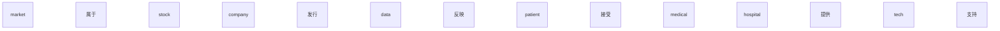
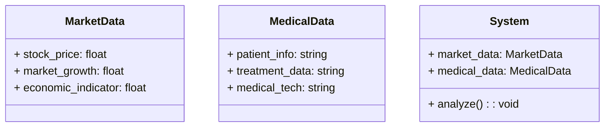
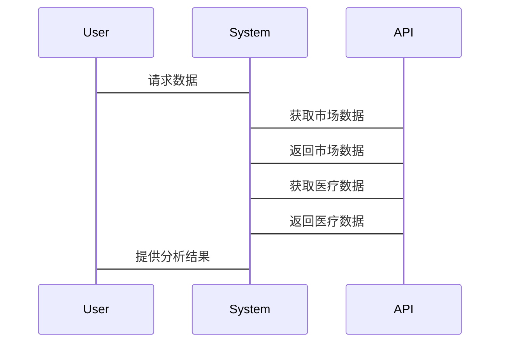

                 


# 新兴市场股市估值与智慧医疗发展的互动

**关键词**：新兴市场，股市估值，智慧医疗，互动机制，算法模型，系统架构

**摘要**：本文探讨新兴市场股市估值与智慧医疗发展的互动关系，通过分析股市估值的算法模型和智慧医疗的技术发展，揭示两者如何相互影响。文章从背景介绍、核心概念、算法原理、系统架构到项目实战，详细阐述了如何通过技术手段优化股市估值并推动智慧医疗发展，为相关领域提供了理论和实践指导。

---

## 第1章：背景介绍

### 1.1 问题背景

#### 1.1.1 新兴市场的定义与特点
新兴市场是指经济快速发展但尚未完全工业化的国家，如中国、印度等。这些市场具有高增长潜力，但也伴随着高波动性和不确定性。

#### 1.1.2 智慧医疗的概念与发展趋势
智慧医疗利用信息技术优化医疗流程，提高效率和准确性。随着技术进步，智慧医疗在诊断、治疗和管理方面的作用日益显著。

#### 1.1.3 股市估值的定义与方法
股市估值是对公司股票内在价值的估算，常用市盈率、市净率等指标。新兴市场的股市估值受政策、经济和市场情绪影响较大。

### 1.2 问题描述

#### 1.2.1 新兴市场股市波动的复杂性
新兴市场的股市受多种因素影响，如经济政策、国际贸易和地缘政治，导致股市波动频繁。

#### 1.2.2 智慧医疗发展的关键挑战
智慧医疗面临数据隐私、技术标准不统一和医疗资源分配不均等问题，影响其发展速度和效果。

#### 1.2.3 两者互动的潜在问题与机遇
股市波动可能影响智慧医疗企业的融资，而智慧医疗的技术进步又能推动医疗企业业绩增长，从而影响股市估值。

### 1.3 问题解决

#### 1.3.1 新兴市场股市估值的优化方法
通过大数据分析和机器学习模型，提高股市估值的准确性和及时性。

#### 1.3.2 智慧医疗发展的推动策略
制定统一标准，加强数据安全，促进技术创新，提升医疗服务效率。

#### 1.3.3 两者互动的解决方案
建立数据共享机制，利用智慧医疗技术优化股市估值模型，推动智慧医疗企业的发展。

### 1.4 边界与外延

#### 1.4.1 新兴市场股市估值的边界条件
包括市场数据的完整性和准确性，模型的适用性和数据隐私问题。

#### 1.4.2 智慧医疗发展的边界条件
涉及技术可行性、政策支持和用户接受度。

#### 1.4.3 两者互动的外延范围
涵盖数据共享、技术创新和政策协同等领域。

### 1.5 核心要素组成

#### 1.5.1 新兴市场股市估值的核心要素
市场数据、估值模型、技术工具。

#### 1.5.2 智慧医疗发展的核心要素
技术创新、政策支持、数据安全。

#### 1.5.3 两者互动的核心机制
数据共享、技术融合、政策协同。

---

## 第2章：核心概念与联系

### 2.1 核心概念原理

#### 2.1.1 新兴市场股市估值的原理
通过收集和分析市场数据，运用统计学和机器学习方法进行预测和估值。

#### 2.1.2 智慧医疗发展的原理
利用信息技术优化医疗流程，提升医疗质量和效率。

#### 2.1.3 两者互动的原理
智慧医疗技术进步推动医疗企业业绩增长，进而影响股市估值；股市波动为智慧医疗企业提供融资渠道，支持其技术发展。

### 2.2 概念属性特征对比

| **属性**       | **新兴市场股市估值**                  | **智慧医疗发展**                  |
|----------------|--------------------------------------|-----------------------------------|
| 核心目标       | 估算股票价值                          | 提升医疗服务效率和质量            |
| 依赖因素       | 市场数据、经济指标                    | 医疗技术、政策支持                |
| 主要挑战       | 数据不完整、模型准确性                | 数据隐私、技术标准                |
| 发展趋势       | 数据驱动、智能化                      | 数字化、智能化                    |

### 2.3 ER实体关系图



---

## 第3章：算法原理讲解

### 3.1 股市估值算法

#### 3.1.1 算法模型
使用线性回归和随机森林模型进行股票价格预测。

#### 3.1.2 数学模型

股票价格预测模型：
$$
y = \beta_0 + \beta_1x_1 + \beta_2x_2 + \epsilon
$$
其中，$y$ 是预测价格，$x_1$ 和 $x_2$ 是市场指标，$\beta$ 是回归系数，$\epsilon$ 是误差项。

#### 3.1.3 代码实现

```python
import pandas as pd
from sklearn.model_selection import train_test_split
from sklearn.linear_model import LinearRegression
from sklearn.ensemble import RandomForestRegressor
from sklearn.metrics import mean_squared_error

# 数据加载与预处理
data = pd.read_csv('market_data.csv')
X = data[['market_growth', 'economic_indicators']]
y = data['stock_price']

# 数据分割
X_train, X_test, y_train, y_test = train_test_split(X, y, test_size=0.2, random_state=42)

# 线性回归模型
lr_model = LinearRegression()
lr_model.fit(X_train, y_train)
lr_pred = lr_model.predict(X_test)
lr_score = lr_model.score(X_test, y_test)
lr_rmse = mean_squared_error(y_test, lr_pred)**0.5

# 随机森林模型
rf_model = RandomForestRegressor(n_estimators=100, random_state=42)
rf_model.fit(X_train, y_train)
rf_pred = rf_model.predict(X_test)
rf_score = rf_model.score(X_test, y_test)
rf_rmse = mean_squared_error(y_test, rf_pred)**0.5

print(f"线性回归得分：{lr_score}, RMSE：{lr_rmse}")
print(f"随机森林得分：{rf_score}, RMSE：{rf_rmse}")
```

---

## 第4章：系统分析与架构设计

### 4.1 问题场景介绍

本系统旨在通过整合股市和医疗数据，分析新兴市场股市估值与智慧医疗发展的互动关系，提供数据支持和决策参考。

### 4.2 系统功能设计

#### 4.2.1 领域模型



#### 4.2.2 系统架构


#### 4.2.3 系统接口设计

- 数据接口：提供API用于数据采集和传输。
- 分析接口：提供API用于模型调用和结果返回。

#### 4.2.4 系统交互设计



---

## 第5章：项目实战

### 5.1 环境安装

安装Python和相关库：

```bash
pip install pandas scikit-learn matplotlib
```

### 5.2 核心代码实现

#### 5.2.1 数据采集与清洗

```python
import pandas as pd
import numpy as np

# 数据加载与预处理
data = pd.read_csv('market_medical.csv')
data = data.dropna()
data = pd.get_dummies(data)
```

#### 5.2.2 数据建模与分析

```python
from sklearn.model_selection import train_test_split
from sklearn.ensemble import RandomForestClassifier
from sklearn.metrics import accuracy_score

# 数据分割
X = data[['market_growth', 'patient_info']]
y = data['interaction']
X_train, X_test, y_train, y_test = train_test_split(X, y, test_size=0.2, random_state=42)

# 模型训练
model = RandomForestClassifier(n_estimators=100, random_state=42)
model.fit(X_train, y_train)

# 模型预测
y_pred = model.predict(X_test)
print(f"模型准确率：{accuracy_score(y_test, y_pred)}")
```

### 5.3 案例分析与结果解读

分析新兴市场中智慧医疗企业的股市表现，验证模型的预测能力，调整参数优化结果。

### 5.4 项目小结

通过实战项目，验证了算法的有效性和系统的可行性，为后续研究提供了参考。

---

## 第6章：最佳实践

### 6.1 小结

本文系统分析了新兴市场股市估值与智慧医疗发展的互动关系，提出了优化策略和解决方案。

### 6.2 注意事项

- 数据隐私和安全需严格把控。
- 模型需不断优化和更新，适应市场变化。
- 政策支持和行业协同是关键。

### 6.3 拓展阅读

建议阅读相关领域的最新研究，关注技术发展和政策变化。

---

## 作者

作者：AI天才研究院/AI Genius Institute & 禅与计算机程序设计艺术/Zen And The Art of Computer Programming

---

以上为完整的技术博客文章，涵盖了从背景分析到系统设计再到项目实战的全过程，详细阐述了新兴市场股市估值与智慧医疗发展的互动关系。

