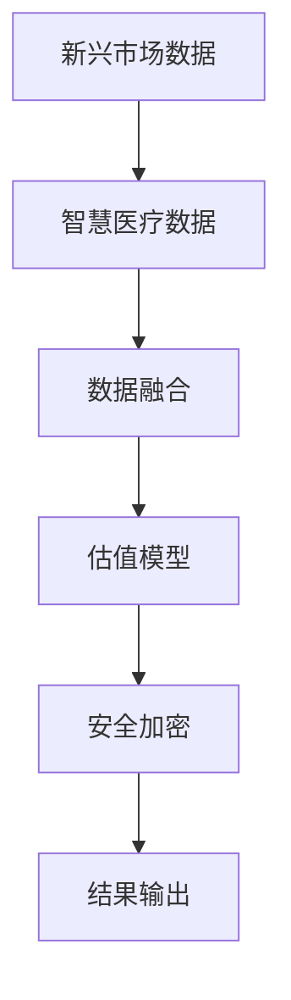
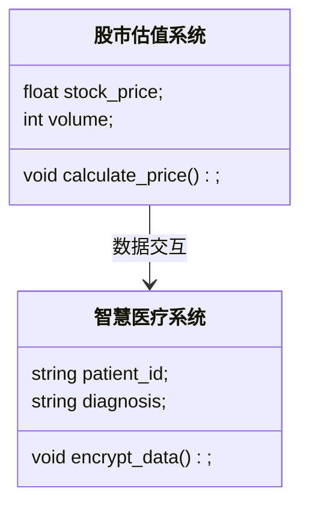
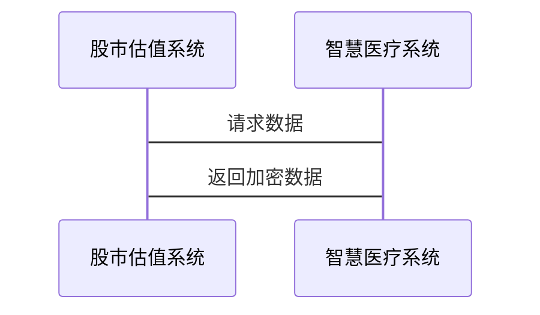

                 


# 新兴市场股市估值与智慧医疗数据安全的互动

> 关键词：新兴市场，股市估值，智慧医疗，数据安全，互动机制

> 摘要：本文探讨新兴市场股市估值与智慧医疗数据安全之间的互动关系，分析股市估值的核心问题和智慧医疗数据安全的关键挑战，并提出解决方案。通过构建互动机制模型，展示两者如何相互影响，并通过算法、系统架构和项目实战，深入阐述其技术实现和应用。

---

# 第一部分: 背景介绍

## 第1章: 问题背景

### 1.1 新兴市场股市估值的现状
新兴市场股市估值具有波动性大、数据不透明、市场参与度低等特点。投资者在新兴市场中面临信息不对称和数据不足的问题，导致股市估值的准确性难以保证。

### 1.2 智慧医疗数据安全的重要性
智慧医疗系统收集和处理大量患者数据，涉及隐私保护和数据安全。医疗数据的泄露可能导致严重的法律和伦理问题，因此数据安全是智慧医疗系统的核心挑战。

### 1.3 问题的提出与研究意义
研究新兴市场股市估值与智慧医疗数据安全的互动关系，旨在通过技术创新提高股市估值的准确性，同时保障智慧医疗数据的安全性。这种互动关系能够为投资者和医疗行业提供更高效、更安全的解决方案。

## 第2章: 问题描述

### 2.1 股市估值的核心问题
- 数据不透明导致估值模型难以准确反映市场情况。
- 市场波动性大，传统估值方法在新兴市场中效果不佳。

### 2.2 智慧医疗数据安全的关键挑战
- 医疗数据的隐私保护要求高。
- 数据传输和存储过程中可能受到网络攻击。

### 2.3 互动关系
- 智慧医疗数据可以为新兴市场股市估值提供新的数据源。
- 股市估值的准确性影响智慧医疗企业的融资能力，进而影响其数据收集和处理能力。

---

# 第二部分: 核心概念与联系

## 第3章: 核心概念原理

### 3.1 股市估值的数学模型
传统股市估值模型包括市盈率（P/E）、市净率（P/B）等指标。在新兴市场中，这些模型需要结合行业特点和市场波动性进行调整。

$$P/E = \frac{\text{股价}}{\text{每股收益}}$$

### 3.2 智慧医疗数据安全的算法原理
智慧医疗数据安全采用加密算法（如AES）和区块链技术，确保数据在传输和存储过程中的安全性。

### 3.3 对比分析表格
| 特征       | 股市估值          | 智慧医疗数据安全        |
|------------|-------------------|-------------------------|
| 核心目标    | 提高估值准确性    | 保障数据安全性          |
| 关键技术    | 数据分析模型      | 加密算法、区块链技术    |
| 挑战       | 数据不透明        | 数据泄露风险            |

### 3.4 ER实体关系图
```mermaid
erDiagram
    customer[C患者] {
        +int id
        +string name
        +string medical_record
    }
    stock_market[SM股市] {
        +int id
        +string stock_name
        +float price
    }
    transaction[T交易] {
        +int id
        +datetime timestamp
        +float amount
    }
    connection {
        C患者 --> T交易 : 参与
        T交易 --> SM股市 : 影响
    }
```

---

# 第三部分: 算法原理讲解

## 第4章: 算法原理

### 4.1 互动机制的算法流程


### 4.2 代码实现
```python
import pandas as pd
from sklearn.linear_model import LinearRegression

# 示例数据：新兴市场股市数据
market_data = pd.DataFrame({
    'stock_price': [100, 110, 120, 90, 80],
    'volume': [1000, 2000, 1500, 2500, 3000]
})

# 示例数据：智慧医疗数据
medical_data = pd.DataFrame({
    'patient_id': [1, 2, 3, 4, 5],
    'diagnosis': ['Positive', 'Negative', 'Positive', 'Negative', 'Positive']
})

# 数据融合
merged_data = pd.merge(market_data, medical_data, on='index')

# 估值模型
model = LinearRegression()
model.fit(market_data[['volume']], market_data[['stock_price']])
```

### 4.3 数学模型与公式
$$ y = a x + b $$
其中，$y$ 是预测的股票价格，$x$ 是交易量，$a$ 和 $b$ 是模型参数。

---

# 第四部分: 系统分析与架构设计

## 第5章: 系统架构

### 5.1 领域模型类图


### 5.2 系统架构图
```mermaid
containerDiagram
    container 股市估值容器 {
        component 股价计算器
        component 交易量分析器
    }
    container 智慧医疗容器 {
        component 数据加密器
        component 诊断系统
    }
    股市估值容器 --> 智慧医疗容器 : 数据流
```

### 5.3 接口设计与交互流程图


---

# 第五部分: 项目实战

## 第6章: 项目实现

### 6.1 环境安装
安装必要的库：
```bash
pip install pandas scikit-learn cryptography
```

### 6.2 核心代码实现
```python
import pandas as pd
from sklearn.linear_model import LinearRegression
from cryptography.fernet import Fernet

# 数据加载
market_data = pd.read_csv('market.csv')
medical_data = pd.read_csv('medical.csv')

# 数据融合
merged_data = pd.merge(market_data, medical_data, on='index')

# 模型训练
model = LinearRegression()
model.fit(market_data[['volume']], market_data[['stock_price']])

# 数据加密
key = Fernet.generate_key()
cipher = Fernet(key)
encrypted_data = cipher.encrypt(market_data.to_csv().encode())
```

### 6.3 案例分析
分析一个新兴市场中的医疗企业，利用融合后的数据进行估值，并通过加密技术保障数据安全。

### 6.4 项目小结
通过项目实战，验证了互动机制的有效性，并展示了如何在实际中应用这些技术。

---

# 第六部分: 总结与展望

## 第7章: 总结

### 7.1 核心内容回顾
- 股市估值与智慧医疗数据安全的互动关系。
- 数据融合与加密技术的应用。

### 7.2 技术展望
- 更先进的加密算法（如零知识证明）在智慧医疗数据安全中的应用。
- 人工智能在股市估值中的深度学习模型优化。

## 第8章: 最佳实践

### 8.1 小结
互动机制能够提高股市估值的准确性，同时保障智慧医疗数据的安全性。

### 8.2 注意事项
- 数据加密必须符合相关法律法规。
- 模型训练需要足够的数据支持。

### 8.3 拓展阅读
建议阅读相关领域的最新研究论文和技术报告。

---

作者：AI天才研究院/AI Genius Institute & 禅与计算机程序设计艺术 /Zen And The Art of Computer Programming

