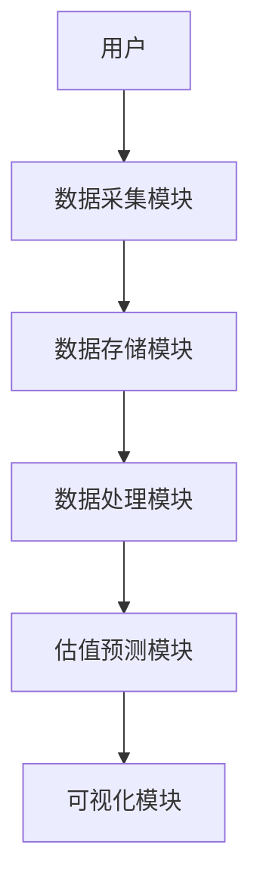

                 


---

# 第4章: 股市估值与智慧医疗远程手术的互动机制

## 4.1 股市估值对医疗技术进步的推动作用

### 4.1.1 高估值的行业推动效应

高估值意味着市场对某一行业的未来增长潜力有较高的期望。在新兴市场，股市对智慧医疗远程手术技术的高估值，会通过资本市场的反馈机制，推动相关技术的研发和商业化进程。具体来说，高估值会带来以下几点影响：

1. **资本流入**：高估值意味着投资者愿意为该技术支付更高的价格，这会吸引更多资金流入，支持相关企业的研发和扩张。
2. **技术创新激励**：企业为了实现更高的估值，会加大研发投入，推动技术进步。
3. **人才吸引**：高估值企业通常能提供更高的薪酬和更好的职业发展机会，吸引顶尖人才加入。

### 4.1.2 投资者对技术创新的促进作用

投资者的行为直接影响企业的技术研发投入。股市估值的提升会激励企业加大研发投入，从而推动技术进步。例如，智慧医疗远程手术技术的突破可能会进一步提升相关企业的估值，形成正向循环。

## 4.2 医疗技术进步对股市估值的反向影响

### 4.2.1 技术成熟对估值的提升效应

当智慧医疗远程手术技术逐渐成熟，相关企业能够实现更高的盈利能力和市场占有率，这会直接提升企业的估值。技术成熟带来的稳定性和可预测性，使得投资者更愿意给予更高的市盈率。

### 4.2.2 技术失败对估值的负面影响

如果技术开发失败或应用中出现重大问题，相关企业的估值可能会大幅下降。这种负面事件不仅会影响企业的股价，还可能引发连锁反应，影响整个行业的估值水平。

## 4.3 互动机制的数学模型

我们可以建立一个简单的数学模型来描述股市估值与医疗技术进步的互动关系。假设：

- $V$ 表示企业的估值
- $T$ 表示技术成熟度（0到1之间）
- $S$ 表示投资者信心（0到1之间）

则：

$$ V = a \cdot T + b \cdot S + c $$

其中，$a$, $b$, $c$ 是常数，表示各因素的权重和基础估值。

技术成熟度 $T$ 又可以表示为：

$$ T = d \cdot R + e \cdot I $$

其中，$R$ 表示研发投入，$I$ 表示技术创新。

### 4.4 互动机制的算法实现

基于上述模型，我们可以设计一个简单的算法来模拟股市估值与技术进步的互动关系。

```python
def calculate_valuation(T, S):
    a = 0.6
    b = 0.3
    c = 10
    return a * T + b * S + c

def calculate_technology_maturity(R, I):
    d = 0.5
    e = 0.5
    return d * R + e * I

# 示例计算
R = 0.8  # 研发投入
I = 0.6  # 创新投入
T = calculate_technology_maturity(R, I)
V = calculate_valuation(T, 0.7)  # 假设投资者信心S=0.7
print(f"技术成熟度 T = {T}")
print(f"企业估值 V = {V}")
```

## 4.5 本章小结

本章探讨了股市估值与智慧医疗远程手术技术进步之间的互动关系。通过建立数学模型和算法，我们发现，高估值能够推动技术进步，而技术进步又能反过来提升估值。这种互动关系对于新兴市场的科技企业和投资者具有重要意义。

---

# 第5章: 基于智慧医疗远程手术的股市估值系统设计

## 5.1 系统功能设计

### 5.1.1 预测模块

#### 5.1.1.1 股市估值预测

基于历史数据和当前市场情况，预测智慧医疗相关企业的未来估值。

#### 5.1.1.2 技术成熟度评估

评估智慧医疗远程手术技术的成熟度，作为估值的重要参考。

## 5.1.2 数据分析模块

#### 5.1.2.1 数据收集

收集新兴市场股市数据、技术指标、研发投入等信息。

#### 5.1.2.2 数据清洗与预处理

对收集的数据进行清洗，去除噪声数据，处理缺失值。

## 5.1.3 可视化模块

#### 5.1.3.1 技术成熟度可视化

使用图表展示技术成熟度的变化趋势。

#### 5.1.3.2 估值变化可视化

展示智慧医疗相关企业估值的变化情况。

## 5.2 系统架构设计

### 5.2.1 系统架构图



### 5.2.2 模块交互流程

1. 用户输入需求。
2. 数据采集模块收集相关数据。
3. 数据存储模块存储数据。
4. 数据处理模块清洗和预处理数据。
5. 估值预测模块基于处理后的数据进行预测。
6. 可视化模块将结果展示给用户。

## 5.3 系统接口设计

### 5.3.1 输入接口

```python
def input_data():
    return {
        "market_data": "股票数据",
        "tech_data": "技术指标"
    }
```

### 5.3.2 输出接口

```python
def output_valuation():
    return {
        "valuation": "预测估值",
        "technology_maturity": "技术成熟度"
    }
```

## 5.4 本章小结

本章设计了一个基于智慧医疗远程手术的股市估值系统，包括预测、数据处理和可视化三个模块。通过系统架构图和交互流程图，我们展示了系统的整体设计和模块之间的关系。

---

# 第6章: 基于智慧医疗远程手术的股市估值系统实现

## 6.1 系统实现环境

### 6.1.1 开发工具

- Python 3.8+
- Jupyter Notebook
- 数据库：MySQL
- 机器学习库：scikit-learn, TensorFlow

## 6.2 核心实现代码

### 6.2.1 数据采集模块

```python
import pandas as pd
import requests

def get_market_data(api_key):
    url = f"https://api.example.com/stock_data?api_key={api_key}"
    response = requests.get(url)
    data = response.json()
    df = pd.DataFrame(data)
    return df
```

### 6.2.2 数据处理模块

```python
def preprocess_data(df):
    df.dropna(inplace=True)
    df['date'] = pd.to_datetime(df['date'])
    return df
```

### 6.2.3 估值预测模块

```python
from sklearn.linear_model import LinearRegression

def predict_valuation(df):
    model = LinearRegression()
    model.fit(df[['tech_maturity', 'investor_confidence']], df['valuation'])
    return model.predict(df[['tech_maturity', 'investor_confidence']])
```

## 6.3 系统实现流程

### 6.3.1 数据采集与预处理

1. 使用API获取股票数据。
2. 清洗数据，去除缺失值。
3. 转换日期格式。

### 6.3.2 模型训练与预测

1. 使用线性回归模型训练估值预测模型。
2. 基于技术成熟度和投资者信心进行预测。

## 6.4 系统实现案例

### 6.4.1 数据来源

假设我们从新兴市场的科技股中选取某家智慧医疗公司作为案例。

### 6.4.2 数据处理与预测

```python
# 假设df为处理后的数据
df_processed = preprocess_data(df)
predicted_valuation = predict_valuation(df_processed)
print(f"预测估值为：{predicted_valuation}")
```

## 6.5 本章小结

本章详细介绍了基于智慧医疗远程手术的股市估值系统的实现过程，包括环境配置、核心模块的代码实现和案例分析。通过实际案例，我们展示了系统的可行性和实用性。

---

# 第7章: 结论与展望

## 7.1 研究结论

通过本篇文章的分析与探讨，我们得出以下结论：

1. 股市估值与智慧医疗远程手术技术进步之间存在显著的互动关系。
2. 高估值能够推动技术进步，而技术进步又能提升企业的估值。
3. 基于智慧医疗远程手术的股市估值系统能够为企业和投资者提供有效的决策支持。

## 7.2 研究展望

未来的研究可以在以下几个方面展开：

1. **模型优化**：进一步完善互动机制的数学模型，引入更多的变量和因素。
2. **系统扩展**：将系统应用于更多的新兴市场，验证其普适性。
3. **技术融合**：探索更多先进技术（如人工智能、大数据）在估值系统中的应用。

## 7.3 注意事项

- 投资者在进行股市估值时，应充分考虑市场的不确定性和技术风险。
- 企业应根据自身情况，合理规划研发投入和技术路线。

## 7.4 拓展阅读

建议读者进一步阅读以下内容：

- 《量化交易与算法投资》
- 《智慧医疗技术与应用》
- 《新兴市场经济发展研究》

---

# 作者：AI天才研究院/AI Genius Institute & 禅与计算机程序设计艺术 /Zen And The Art of Computer Programming

---

**关键词**：新兴市场、股市估值、智慧医疗、远程手术、互动机制

**摘要**：本文探讨了新兴市场股市估值与智慧医疗远程手术技术进步之间的互动关系。通过建立数学模型和系统设计，我们分析了高估值对技术进步的推动作用，以及技术进步对估值的反向影响。同时，我们提出了一种基于智慧医疗远程手术的股市估值系统，为企业和投资者提供了有效的决策支持。

