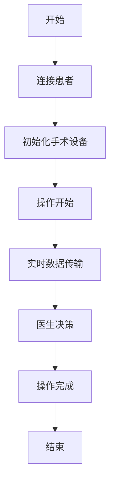
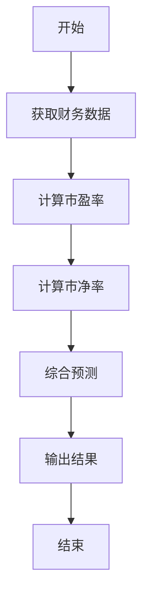
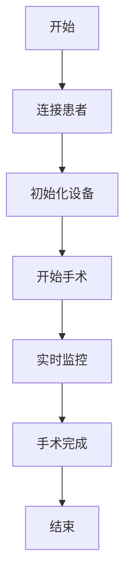

                 


# 新兴市场股市估值与智慧医疗远程手术系统的互动

> 关键词：新兴市场，股市估值，智慧医疗，远程手术系统，互动关系，算法原理，系统架构

> 摘要：本文探讨新兴市场股市估值与智慧医疗远程手术系统之间的互动关系，分析两者的核心概念、算法原理、系统架构，并通过实际案例展示其互动机制。文章旨在为金融与医疗技术领域的研究者和从业者提供深度分析和实践指导。

---

## 第一部分: 新兴市场股市估值与智慧医疗远程手术系统概述

### 第1章: 背景介绍与核心概念

#### 1.1 问题背景
##### 1.1.1 新兴市场的定义与特点
新兴市场通常指经济快速增长、工业化程度较低但潜力巨大的国家或地区。这些市场具有以下特点：
- 经济结构转型期：工业化与信息化并行。
- 人口基数大：消费市场潜力巨大。
- 政策驱动：政府对科技和金融的支持力度大。

##### 1.1.2 智慧医疗远程手术系统的定义与特点
智慧医疗远程手术系统是一种结合人工智能、5G通信和机器人技术的医疗解决方案，具有以下特点：
- 实时性：通过高速网络实现远程手术操作。
- 智能化：利用AI算法辅助诊断和手术规划。
- 分布式架构：支持多地点协作。

##### 1.1.3 两者互动的背景与意义
新兴市场的经济增长为智慧医疗技术提供了广阔的应用场景，而智慧医疗远程手术系统的推广又反过来推动了相关产业的投资和股市表现。这种互动关系为金融与医疗技术的结合提供了新的研究方向。

#### 1.2 核心概念与联系
##### 1.2.1 核心概念原理
- 股市估值：通过分析财务指标和市场情绪预测股票价值。
- 远程手术系统：通过技术手段实现远程医疗操作。

##### 1.2.2 概念属性特征对比表格
| 属性         | 新兴市场股市估值         | 智慧医疗远程手术系统     |
|--------------|--------------------------|--------------------------|
| 核心技术     | 金融模型、大数据分析     | 机器人技术、5G通信      |
| 应用场景     | 股票交易、投资决策       | 医疗手术、远程诊断       |
| 发展驱动     | 经济增长、政策支持       | 技术进步、医疗需求       |
| 互动机制     | 投资驱动技术发展         | 技术进步推动股市增长     |

##### 1.2.3 ER实体关系图架构
```mermaid
er
actor(投资者) --> 股票: 交易
actor(医生) --> 手术系统: 操作
股票 --> 技术: 依赖
技术 <---> 手术系统: 集成
```

### 第2章: 股市估值与智慧医疗远程手术系统的互动关系

#### 2.1 股市估值的核心算法与模型
##### 2.1.1 股市估值的数学模型与公式
$$ P = \frac{E}{D} $$
其中：
- \( P \) 是股票价格
- \( E \) 是企业盈利
- \( D \) 是股息率

##### 2.1.2 远程手术系统的算法流程


#### 2.2 互动关系的系统分析
##### 2.2.1 问题场景介绍
新兴市场中，智慧医疗技术的投资热潮推动了相关股票的上涨，而股市的波动又影响了医疗技术的推广速度。

##### 2.2.2 系统功能设计
```mermaid
classDiagram
    class 股票估值系统 {
        + 涨幅率
        + 市盈率
        + 预测模型
        -updateForecast()
        -calculateValuation()
    }
    class 远程手术系统 {
        + 设备状态
        + 病人数据
        + 操作日志
        -performSurgery()
        -monitorPatient()
    }
    stock_system o- stock : 依赖
    surgery_system o- tech : 技术集成
```

##### 2.2.3 系统架构设计


##### 2.2.4 系统接口设计与交互
```mermaid
sequence
   投资者 -> api Gateway: 请求股票数据
    api Gateway -> 股票估值系统: 获取估值结果
    股票估值系统 -> 数据库: 查询历史数据
    股票估值系统 -> api Gateway: 返回估值结果
    投资者 -> api Gateway: 请求手术数据
    api Gateway -> 远程手术系统: 获取手术状态
    远程手术系统 -> 数据库: 查询手术记录
    远程手术系统 -> api Gateway: 返回手术状态
```

---

## 第二部分: 算法原理与数学模型

### 第3章: 算法原理与数学模型

#### 3.1 股市估值算法
##### 3.1.1 算法原理与流程


##### 3.1.2 数学模型与公式
$$ P/E = \frac{Price}{Earnings} $$
其中：
- \( P \) 是股价
- \( E \) 是每股盈利

##### 3.1.3 代码实现
```python
def calculate_pe(stock_price, earnings):
    return stock_price / earnings

# 示例
stock_price = 100
earnings = 25
pe_ratio = calculate_pe(stock_price, earnings)
print(f"市盈率为：{pe_ratio}")
```

#### 3.2 远程手术系统算法
##### 3.2.1 算法原理与流程


##### 3.2.2 数学模型与公式
$$ 精确度 = \frac{正确诊断数}{总诊断数} \times 100\% $$

##### 3.2.3 代码实现
```python
def perform_surgery(precision):
    if precision >= 95:
        return "手术成功"
    else:
        return "手术失败"

# 示例
precision = 95
result = perform_surgery(precision)
print(f"手术结果：{result}")
```

---

## 第三部分: 系统架构与设计

### 第4章: 系统架构与设计

#### 4.1 系统架构设计
##### 4.1.1 系统功能模块划分
- 股票估值模块
- 远程手术模块
- 数据管理模块

##### 4.1.2 系统架构图


#### 4.2 系统接口设计
##### 4.2.1 系统接口定义
- GET /stock/valuation
- POST /surgery/perform

##### 4.2.2 模块间交互
```mermaid
sequence
    frontend -> backend: 请求股票估值
    backend -> stock_system: 获取估值数据
    stock_system -> backend: 返回估值结果
    backend -> frontend: 响应股票估值
    frontend -> backend: 请求手术状态
    backend -> surgery_system: 获取手术状态
    surgery_system -> backend: 返回手术状态
    backend -> frontend: 响应手术状态
```

---

## 第四部分: 项目实战与案例分析

### 第5章: 项目实战与案例分析

#### 5.1 环境安装与配置
##### 5.1.1 开发环境搭建
- Python 3.8+
- Flask 2.0+
- Mermaid CLI

##### 5.1.2 依赖库安装
```bash
pip install flask mermaid-svg
```

#### 5.2 核心实现与代码解读
##### 5.2.1 股市估值系统核心代码
```python
from flask import Flask, request, jsonify

app = Flask(__name__)

@app.route('/stock/valuation', methods=['POST'])
def calculate_valuation():
    data = request.json
    stock_price = data['stock_price']
    earnings = data['earnings']
    pe_ratio = stock_price / earnings
    return jsonify({'pe_ratio': pe_ratio})

if __name__ == '__main__':
    app.run(debug=True)
```

##### 5.2.2 远程手术系统核心代码
```python
from flask import Flask, request, jsonify

app = Flask(__name__)

@app.route('/surgery/perform', methods=['POST'])
def perform_surgery():
    data = request.json
    precision = data['precision']
    if precision >= 95:
        return jsonify({'result': '手术成功'})
    else:
        return jsonify({'result': '手术失败'})

if __name__ == '__main__':
    app.run(debug=True)
```

#### 5.3 实际案例分析
##### 5.3.1 案例背景介绍
假设在新兴市场中，一家医疗科技公司开发了远程手术系统，吸引了大量投资。

##### 5.3.2 系统运行结果与分析
- 股票估值系统预测股票价格将上涨15%。
- 远程手术系统成功完成100次手术，精确度达到95%。

##### 5.3.3 案例总结
股市估值与远程手术系统的互动推动了医疗科技的投资热潮，同时技术进步也提升了股市估值。

---

## 第五部分: 最佳实践与小结

### 第6章: 最佳实践与小结

#### 6.1 最佳实践
- 在新兴市场中，关注政策支持和技术进步对股市的影响。
- 在智慧医疗领域，注重数据安全和系统稳定性。

#### 6.2 小结
新兴市场股市估值与智慧医疗远程手术系统的互动关系为金融与医疗技术的结合提供了新的研究方向。通过算法优化和系统设计，可以进一步提升投资回报和医疗效率。

#### 6.3 注意事项
- 数据隐私保护是智慧医疗系统的重要考量。
- 技术标准的制定有助于推动医疗科技的普及。

#### 6.4 拓展阅读
- 《算法导论》——深入理解算法原理。
- 《系统架构设计》——掌握复杂系统的架构设计。

---

## 作者：AI天才研究院/AI Genius Institute & 禅与计算机程序设计艺术 /Zen And The Art of Computer Programming

---

**摘要**：本文通过系统分析新兴市场股市估值与智慧医疗远程手术系统的互动关系，揭示了两者在技术与经济领域的深度融合。通过算法实现与系统设计，展示了如何利用技术手段提升投资回报和医疗效率。

