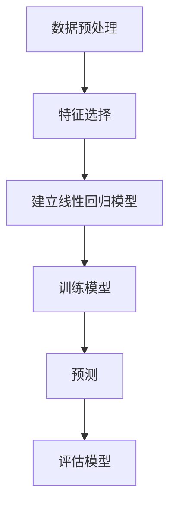
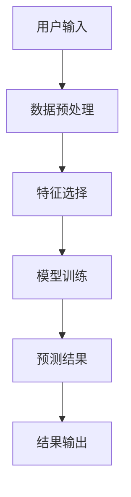

                 


```markdown
# 新兴市场股市估值与智慧城市交通拥堵预测系统的互动

## 关键词：新兴市场，股市估值，智慧城市，交通拥堵，预测系统，互动机制

## 摘要：本文探讨了新兴市场股市估值与智慧城市交通拥堵预测系统之间的互动关系。通过分析股市估值的核心概念和算法，结合交通拥堵预测的系统架构与数学模型，构建了一个互动机制的数学模型。文章还通过项目实战展示了如何将这些理论应用于实际，最后提出了最佳实践和未来研究方向。

---

## 第一部分: 背景介绍

### 第1章: 新兴市场股市估值与智慧城市交通拥堵预测的互动背景

#### 1.1 问题背景

- **新兴市场的股市特点**：新兴市场股市波动较大，受政策、经济和市场情绪影响显著。
- **智慧城市交通拥堵现状**：随着城市化进程加快，交通拥堵问题日益严重，亟需智能化解决方案。
- **互动关系的潜在关联**：股市波动可能影响城市交通需求，而交通拥堵也可能反过来影响股市情绪。

#### 1.2 问题描述

- **股市估值的基本概念**：通过市盈率、市净率等指标评估股票价值。
- **交通拥堵预测的核心问题**：基于历史数据和实时信息，预测交通拥堵情况。
- **互动关系的定义与范围**：研究股市波动与交通拥堵之间的相互作用机制。

#### 1.3 问题解决

- **股市估值的常用方法**：包括基本面分析和技术分析。
- **交通拥堵预测的算法选择**：如时间序列分析和机器学习算法。
- **互动机制的构建思路**：将股市数据和交通数据进行关联分析。

#### 1.4 边界与外延

- **股市估值的边界条件**：数据质量和样本量。
- **交通拥堵预测的适用范围**：城市规模和数据获取能力。
- **互动模型的适用场景**：特定时间和空间条件下的预测。

#### 1.5 核心要素组成

- **股市数据的关键指标**：市盈率、市净率、流动比率等。
- **交通数据的特征分析**：交通流量、节点容量、时间序列等。
- **互动模型的核心要素**：数据输入、算法选择、模型输出。

---

## 第二部分: 核心概念与联系

### 第2章: 核心概念原理

#### 2.1 股市估值的核心原理

- **市盈率与市净率的计算**：市盈率=股价/每股收益，市净率=股价/每股净资产。
- **股东权益与现金流分析**：通过现金流评估企业价值。
- **市场情绪对估值的影响**：投资者情绪波动影响股市估值。

#### 2.2 交通拥堵预测的核心原理

- **流动量与节点容量的关系**：当流动量超过节点容量时，拥堵发生。
- **时间序列分析的基本原理**：基于历史数据预测未来趋势。
- **空间分布对拥堵的影响**：地理位置和交通网络结构影响拥堵情况。

#### 2.3 互动机制的数学模型

- **股市波动对交通需求的影响**：股市下跌可能减少通勤需求，降低交通拥堵。
- **交通拥堵对股市情绪的影响**：严重拥堵可能影响投资者情绪，进而影响股市估值。
- **互动模型的构建框架**：将股市数据和交通数据进行融合分析，构建互动模型。

### 第3章: 核心概念属性特征对比

#### 3.1 股市估值与交通拥堵的属性对比

| 属性 | 股市估值 | 交通拥堵 |
|------|---------|----------|
| 数据类型 | 数值型 | 数值型 |
| 时间序列 | 是 | 是 |
| 影响因素 | 经济指标、政策、市场情绪 | 交通流量、节点容量、天气 |
| 模型复杂度 | 中等 | 中等 |

#### 3.2 ER实体关系图

```mermaid
er
  actor 股市数据
  actor 交通数据
  actor 互动模型
  relation "输入" --> 股市数据
  relation "输入" --> 交通数据
  relation "输出" --> 互动模型
```

---

## 第三部分: 算法原理讲解

### 第4章: 算法原理与实现

#### 4.1 算法原理

- **股市估值的回归分析**：通过回归分析预测股票价格。
- **交通拥堵预测的随机森林算法**：利用随机森林进行分类预测。

#### 4.2 机器学习算法实现

- **线性回归算法流程图**



- **Python代码示例**

```python
import pandas as pd
from sklearn.linear_model import LinearRegression

# 数据预处理
data = pd.read_csv('data.csv')
X = data[['市盈率', '市净率']]
y = data['股价']

# 特征选择
model = LinearRegression()
model.fit(X, y)

# 预测
predicted_prices = model.predict(X)
print(predicted_prices)
```

#### 4.3 数学模型

- **多元回归模型**

$$ y = \beta_0 + \beta_1x_1 + \beta_2x_2 + \epsilon $$

其中，$y$ 是目标变量，$x_1$ 和 $x_2$ 是自变量，$\beta_0$、$\beta_1$、$\beta_2$ 是回归系数，$\epsilon$ 是误差项。

---

## 第四部分: 数学模型与系统架构

### 第5章: 数学模型与系统架构设计方案

#### 5.1 数学模型

- **交通拥堵预测的数学模型**

$$ \text{拥堵指数} = \alpha \times \text{流量} + \beta \times \text{节点容量} + \gamma \times \text{时间} $$

#### 5.2 系统架构

- **系统架构设计**



---

## 第五部分: 项目实战

### 第6章: 项目实战

#### 6.1 项目介绍

- **项目目标**：构建股市估值与交通拥堵预测的互动系统。
- **环境安装**：安装Python、Pandas、Scikit-learn等库。

#### 6.2 核心代码实现

```python
import pandas as pd
from sklearn.ensemble import RandomForestClassifier

# 数据加载
data = pd.read_csv('data.csv')

# 特征选择
features = data[['市盈率', '市净率', '交通流量']]
target = data['拥堵状态']

# 模型训练
model = RandomForestClassifier()
model.fit(features, target)

# 预测
new_data = pd.DataFrame({'市盈率': [15], '市净率': [3], '交通流量': [100]})
predicted = model.predict(new_data)
print(predicted)
```

#### 6.3 项目小结

- **项目成果**：成功构建了互动预测系统。
- **经验总结**：数据质量和模型选择对结果影响显著。

---

## 第六部分: 最佳实践

### 第7章: 最佳实践

#### 7.1 小结

- **核心内容总结**：股市估值与交通拥堵预测的互动机制构建。
- **成功经验分享**：数据清洗和特征选择的重要性。

#### 7.2 注意事项

- **数据质量**：确保数据准确性和完整性。
- **模型调优**：根据实际效果不断优化模型。
- **隐私保护**：处理交通和股市数据时需注意隐私保护。

#### 7.3 拓展阅读

- 推荐书籍：《Python机器学习实战》、《时间序列分析》。
- 推荐博客：[AI与数据科学博客](https://example.com)

---

## 作者：AI天才研究院/AI Genius Institute & 禅与计算机程序设计艺术 /Zen And The Art of Computer Programming
```

