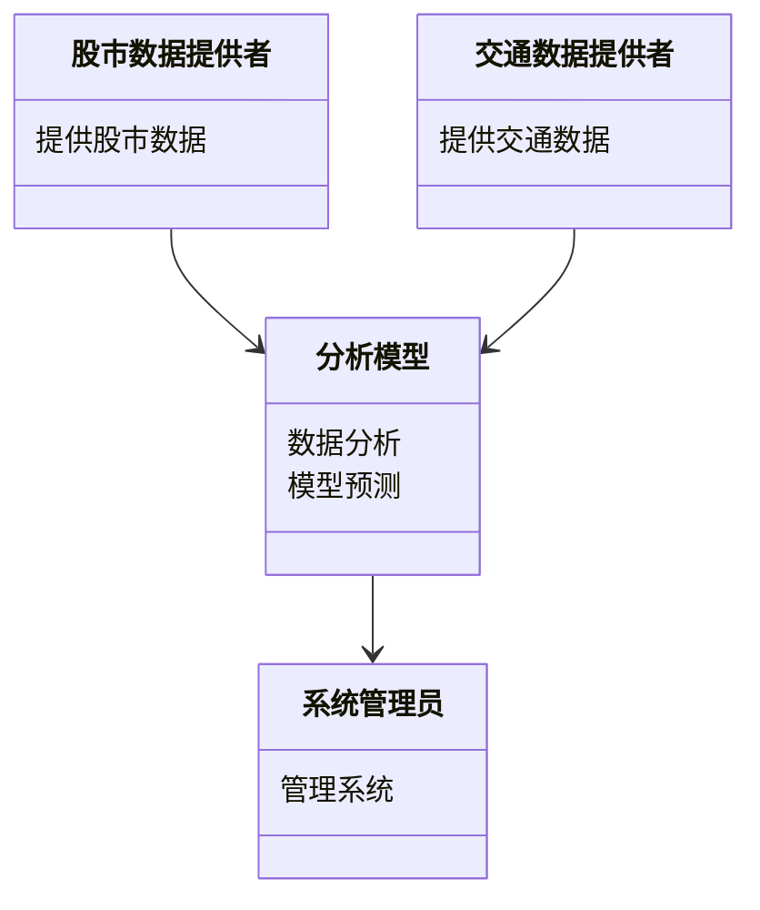
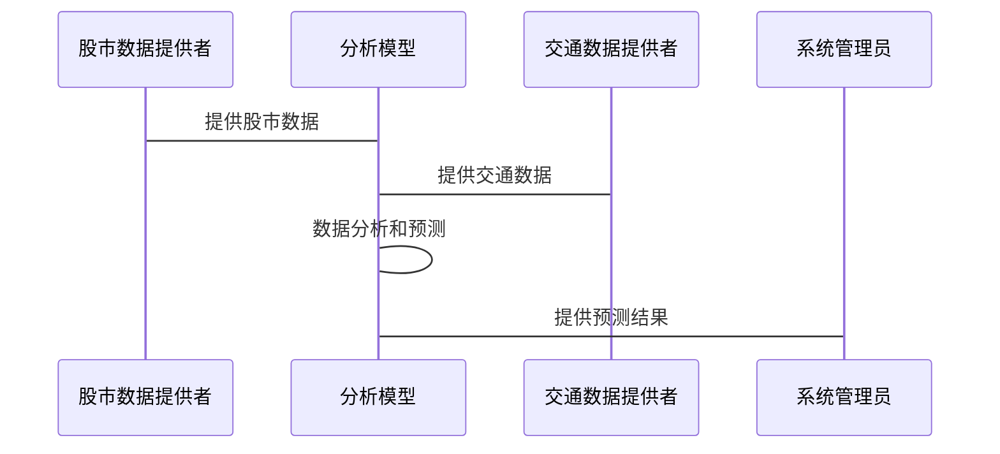

                 


# 新兴市场股市估值与智慧城市交通管理系统的互动

## 关键词：新兴市场，股市估值，智慧城市，交通管理系统，数据分析，人工智能，机器学习

## 摘要：本文探讨新兴市场股市估值与智慧城市交通管理系统之间的互动关系，通过数据分析和系统设计，分析两者如何相互影响，提出基于时间序列分析和机器学习的预测模型，结合系统架构设计，展示如何通过技术手段优化城市交通管理，提升股市估值预测的准确性。

---

# 第一部分: 背景介绍

## 第1章: 新兴市场股市估值与智慧城市交通管理系统概述

### 1.1 问题背景

#### 1.1.1 新兴市场的定义与特点
新兴市场指经济快速发展、基础设施逐步完善的国家或地区，如中国、印度等。这些市场具有高增长潜力，但也伴随着高波动性和不确定性。

#### 1.1.2 智慧城市交通管理系统的概念
智慧城市交通管理系统利用大数据、人工智能和物联网技术，实时监控和优化城市交通流量，减少拥堵和污染。

#### 1.1.3 互动关系
新兴市场的股市波动可能受交通管理系统的影响，反之亦然。例如，股市下跌可能引发经济放缓，进而影响交通流量。

### 1.2 问题描述

#### 1.2.1 新兴市场股市波动的特点
新兴市场股市波动剧烈，受政策、经济和国际环境影响较大。

#### 1.2.2 智慧城市交通管理系统的挑战
系统需应对交通流量变化、突发事件和数据处理的高实时性要求。

#### 1.2.3 互动关系的潜在问题
股市波动可能影响交通管理系统的投资和运营，而交通状况也可能影响股市投资者情绪。

### 1.3 问题解决思路

#### 1.3.1 数据分析方法
使用时间序列分析和机器学习模型，分析股市和交通数据的关联性。

#### 1.3.2 系统设计思路
设计一个实时数据采集、分析和反馈的闭环系统，优化交通流量并预测股市走势。

#### 1.3.3 模型构建与验证
建立数学模型，利用历史数据进行验证和优化，确保预测准确性。

### 1.4 边界与外延

#### 1.4.1 新兴市场的边界条件
包括市场规模、政策环境和经济结构等。

#### 1.4.2 智慧交通管理系统的边界条件
包括数据采集范围、系统覆盖区域和用户规模等。

#### 1.4.3 互动关系的外延分析
考虑股市和交通系统的相互影响，包括政策变化、经济指标和技术进步。

### 1.5 核心概念与组成

#### 1.5.1 新兴市场股市估值的核心要素
包括GDP增长率、通货膨胀率、利率和市场情绪等。

#### 1.5.2 智慧城市交通管理系统的组成
包括数据采集器、处理中心、决策系统和用户终端。

#### 1.5.3 互动关系的结构与特征
通过数据共享和模型预测，建立两者之间的动态关联。

---

# 第二部分: 核心概念与联系

## 第2章: 新兴市场股市估值原理

### 2.1 核心概念原理

#### 2.1.1 股市估值的基本方法
包括市盈率、市净率和现金流折现法等。

#### 2.1.2 新兴市场的特殊性
高波动性、政策影响大和信息不透明。

#### 2.1.3 数据驱动的估值模型
使用历史数据和机器学习算法进行预测。

### 2.2 智慧城市交通管理系统原理

#### 2.2.1 系统架构与功能
包括数据采集、存储、分析和决策支持。

#### 2.2.2 数据采集与处理
利用传感器和摄像头实时采集交通数据，进行清洗和预处理。

#### 2.2.3 智能决策算法
应用机器学习模型预测交通流量，优化信号灯控制和路线规划。

### 2.3 核心概念属性特征对比

#### 2.3.1 股市估值的特征分析
- 数据波动性高
- 受外部因素影响大
- 需要高频数据处理

#### 2.3.2 智慧交通管理的特征分析
- 数据实时性强
- 系统响应速度快
- 需要考虑多因素交互

#### 2.3.3 互动关系的特征分析
- 数据共享与整合
- 模型相互影响
- 系统反馈机制

## 第3章: 实体关系与互动机制

### 3.1 实体关系分析

#### 3.1.1 股市数据与交通数据的关系
股市数据反映经济状况，影响交通投资；交通数据反映城市运行状况，影响股市情绪。

#### 3.1.2 市场情绪与交通流量的关系
市场情绪波动可能导致交通流量变化，反之亦然。

#### 3.1.3 政策干预与系统响应的关系
政府政策可能同时影响股市和交通系统，系统需实时响应。

### 3.2 ER实体关系图

```mermaid
er
  actor: 股市数据提供者
  actor: 交通数据提供者
  actor: 系统管理员
  database: 股市估值数据库
  database: 交通管理系统数据库
  relationship: 提供数据
  relationship: 存储数据
  relationship: 分析数据
```

### 3.3 互动机制分析

#### 3.3.1 数据流动方向
从股市数据和交通数据流向分析模型，再反馈优化建议。

#### 3.3.2 信息交互过程
数据采集、分析、预测、反馈和优化。

#### 3.3.3 系统反馈机制
根据预测结果调整交通信号灯，优化交通流量，进而影响股市情绪。

---

# 第三部分: 算法原理讲解

## 第4章: 数据分析与预测算法

### 4.1 时间序列分析

#### 4.1.1 ARIMA模型

ARIMA模型适用于非平稳时间序列数据，通过自回归和移动平均部分预测未来值。

- ARIMA模型的数学公式：
  $$ ARIMA(p, d, q) $$
  其中，p为自回归阶数，d为差分阶数，q为移动平均阶数。

- 代码示例：
  ```python
  from statsmodels.tsa.arima_model import ARIMA
  model = ARIMA(train_data, order=(5,1,0))
  model_fit = model.fit()
  ```

#### 4.1.2 LSTM网络

LSTM适用于长期依赖关系，适合处理复杂的时间序列数据。

- LSTM结构：
  - 输入门（Input gate）
  - 遗忘门（Forget gate）
  - 输出门（Output gate）

- 代码示例：
  ```python
  from keras.layers import LSTM, Dense
  model = Sequential()
  model.add(LSTM(50, input_shape=(timesteps, features)))
  model.add(Dense(1))
  model.compile(optimizer='adam', loss='mean_squared_error')
  ```

### 4.2 机器学习模型

#### 4.2.1 随机森林

随机森林通过集成学习提高预测准确性，适用于特征较多的数据集。

- 代码示例：
  ```python
  from sklearn.ensemble import RandomForestRegressor
  model = RandomForestRegressor(n_estimators=100, random_state=42)
  model.fit(X_train, y_train)
  ```

#### 4.2.2 XGBoost

XGBoost在分类和回归任务中表现优异，适合处理高维数据。

- 代码示例：
  ```python
  import xgboost as xgb
  dtrain = xgb.DMatrix(X_train, label=y_train)
  params = {'n_estimators': 100, 'learning_rate': 0.1}
  model = xgb.XGBRegressor(**params)
  model.fit(X_train, y_train)
  ```

---

# 第四部分: 系统分析与架构设计

## 第5章: 问题场景与系统架构

### 5.1 问题场景介绍

新兴市场的股市和交通系统面临数据孤岛和信息不对称的问题，需要通过技术手段实现数据共享和优化。

### 5.2 系统功能设计

#### 5.2.1 领域模型



#### 5.2.2 系统架构设计


#### 5.2.3 接口设计

- 数据接口：提供REST API，供分析模型调用数据。
- 管理界面：管理员进行系统配置和监控。

#### 5.2.4 交互流程



---

# 第五部分: 项目实战

## 第6章: 实战与分析

### 6.1 环境安装

- 安装Python和相关库：
  ```bash
  pip install pandas numpy scikit-learn xgboost statsmodels keras
  ```

### 6.2 核心代码实现

#### 6.2.1 数据处理

```python
import pandas as pd
import numpy as np

# 加载股市数据
stock_data = pd.read_csv('stock.csv')
# 加载交通数据
traffic_data = pd.read_csv('traffic.csv')
```

#### 6.2.2 模型训练

```python
from sklearn.model_selection import train_test_split
from sklearn.ensemble import RandomForestRegressor

# 数据分割
X_train, X_test, y_train, y_test = train_test_split(X, y, test_size=0.2)
# 模型训练
model = RandomForestRegressor(n_estimators=100)
model.fit(X_train, y_train)
```

#### 6.2.3 结果分析

```python
from sklearn.metrics import mean_squared_error

# 预测结果
y_pred = model.predict(X_test)
print(mean_squared_error(y_test, y_pred))
```

### 6.3 实际案例分析

#### 6.3.1 数据分析

分析新兴市场股市和交通系统的数据，寻找两者之间的相关性。

#### 6.3.2 模型应用

利用训练好的模型预测股市走势，并优化交通管理系统。

#### 6.3.3 结果解读

解释模型预测结果，分析优化措施的有效性。

### 6.4 项目小结

总结项目成果，提出改进建议，为后续研究提供参考。

---

# 第六部分: 最佳实践

## 第7章: 实践与总结

### 7.1 小结

简要回顾文章内容，强调关键点。

### 7.2 注意事项

- 数据质量的重要性
- 模型选择的合理性
- 系统设计的可扩展性

### 7.3 拓展阅读

推荐相关领域的书籍和论文，供读者深入学习。

---

# 作者：AI天才研究院/AI Genius Institute & 禅与计算机程序设计艺术 /Zen And The Art of Computer Programming

