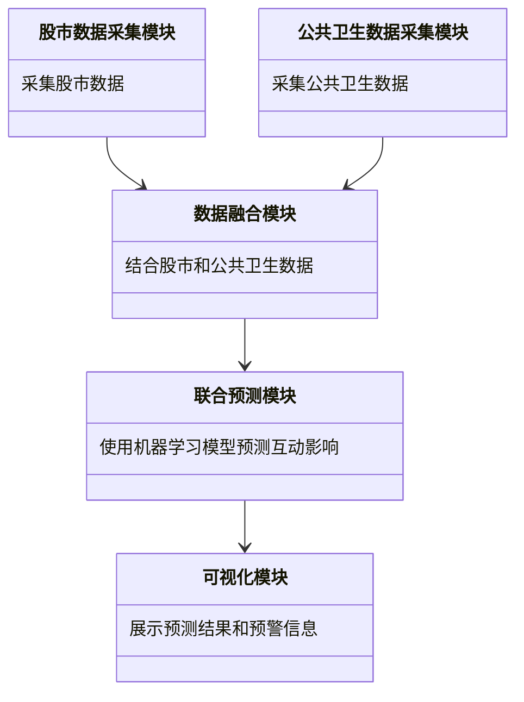
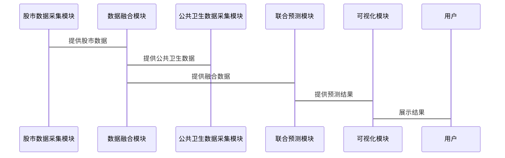

                 


# 新兴市场股市估值与智慧城市公共卫生监测系统的互动

> 关键词：新兴市场，股市估值，智慧城市，公共卫生监测，互动关系

> 摘要：本文探讨了新兴市场中股市估值与智慧城市公共卫生监测系统的互动关系。通过分析股市估值的核心要素和公共卫生监测系统的功能模块，揭示两者如何通过数据融合和算法模型实现互动预测和优化决策。结合实际案例，展示如何利用技术手段提升公共卫生事件对股市影响的预测能力，为投资者和决策者提供科学依据。

---

# 第1章: 背景与核心概念

## 1.1 问题背景与定义

### 1.1.1 新兴市场股市估值的定义与特点
新兴市场的股市估值是指对新兴经济体股票市场的整体价值进行评估的过程。与成熟市场相比，新兴市场的股市波动性更大，受政策、经济和外部环境的影响更为显著。其特点包括高增长潜力、高风险和不完全流动性。

### 1.1.2 智慧城市公共卫生监测系统的定义与特点
智慧城市公共卫生监测系统是通过物联网、大数据和人工智能技术，实时采集、分析和预测公共卫生事件的系统。其特点是数据实时性高、覆盖范围广、预测能力强。

### 1.1.3 两者的互动关系与研究意义
股市估值与公共卫生监测系统的互动关系体现在公共卫生事件对股市的影响和股市波动对公共卫生政策的反馈。研究这种互动有助于优化公共卫生管理和投资决策。

## 1.2 核心概念与边界

### 1.2.1 股市估值的核心要素
- 市场指数：如股票价格指数（SPI）。
- 市盈率（P/E比率）。
- 市净率（P/B比率）。

### 1.2.2 公共卫生监测系统的功能模块
- 数据采集：实时采集疫情数据。
- 数据分析：分析疾病传播趋势。
- 预警系统：预测疫情爆发风险。

### 1.2.3 互动关系的边界与外延
- 数据范围：仅限于与股市和公共卫生直接相关的数据。
- 时间范围：关注短期至中期的互动关系。
- 地域范围：聚焦于特定新兴市场国家或地区。

## 1.3 核心概念的结构与组成

### 1.3.1 股市估值的构成要素
- 宏观经济指标：GDP增长率、利率。
- 行业表现：科技、金融等行业的波动。
- 公司基本面：盈利能力和财务状况。

### 1.3.2 公共卫生监测系统的组成模块
- 数据采集模块：传感器和数据库。
- 数据分析模块：机器学习算法。
- 预警模块：实时预警和决策支持。

### 1.3.3 互动机制的系统架构
- 数据流：从公共卫生系统到股市估值系统。
- 模型：联合预测模型。

---

# 第2章: 核心概念与联系

## 2.1 核心概念的原理

### 2.1.1 股市估值的数学模型
$$P_{t+1} = aP_t + b\epsilon_t$$
其中，$P_t$为当前股价，$\epsilon_t$为随机误差项。

### 2.1.2 公共卫生监测系统的数据流分析
数据流包括采集、存储、分析和反馈四个阶段，涉及传感器数据和模型输出。

### 2.1.3 互动关系的系统动力学
系统动力学模型展示了股市波动如何影响公共卫生政策，反之亦然。

## 2.2 核心概念的属性对比

### 2.2.1 股市估值与公共卫生监测系统的属性对比表
| 属性         | 股市估值          | 公共卫生监测系统      |
|--------------|-------------------|-----------------------|
| 数据类型     | 数值型（股价、指数） | 数值型（病例数、死亡率） |
| 时间频率     | 日度、周度        | 日度、实时            |
| 主要影响因素 | 宏观经济、政策    | 疫情传播、医疗资源    |

### 2.2.2 互动关系的特征分析
- 双向影响：公共卫生事件影响股市，股市波动反馈影响公共卫生政策。
- 时间滞后：股市反应通常快于公共卫生政策调整。

## 2.3 ER实体关系图

```mermaid
er
  actor 股市数据提供者
  actor 公共卫生数据提供者
  actor 系统管理员
  entity 股市数据
  entity 公共卫生数据
  entity 互动数据
  relation 提供
  relation 存储
  relation 分析
```

---

# 第3章: 算法原理与数学模型

## 3.1 股市估值算法

### 3.1.1 时间序列分析
使用ARIMA模型预测股市趋势。

### 3.1.2 机器学习模型
应用XGBoost进行股票价格预测。

### 3.1.3 股市波动预测的数学公式
$$P_{t+1} = aP_t + b\epsilon_t$$

## 3.2 公共卫生监测系统算法

### 3.2.1 数据流分析
实时数据流处理，采用滑动窗口技术。

### 3.2.2 疾病传播模型
SIR模型模拟疫情传播。

### 3.2.3 人群健康风险评估的数学公式
$$R = \beta \cdot S \cdot I$$

## 3.3 互动关系的算法

### 3.3.1 数据融合方法
使用加权融合法结合股市和公共卫生数据。

### 3.3.2 联合预测模型
构建联合时间序列模型预测互动影响。

### 3.3.3 互动关系的数学公式
$$I_{interaction} = \alpha V_{market} + \beta H_{health}$$

---

# 第4章: 系统分析与架构设计

## 4.1 问题场景分析

### 4.1.1 股市估值与公共卫生监测的互动需求
- 公共卫生事件对股市的即时影响。
- 股市波动对公共卫生政策的反馈。

### 4.1.2 系统功能目标
- 实时数据采集与处理。
- 联合预测模型构建。
- 可视化展示与预警。

## 4.2 系统架构设计

### 4.2.1 系统功能模块
- 数据采集模块：采集股市和公共卫生数据。
- 数据分析模块：融合分析数据。
- 可视化模块：展示预测结果和预警信息。

### 4.2.2 系统架构图



### 4.2.3 系统接口设计
- 数据接口：RESTful API。
- 用户接口：Web界面。

### 4.2.4 系统交互图



---

# 第5章: 项目实战

## 5.1 环境安装

### 5.1.1 安装Python和必要的库
```bash
pip install pandas numpy scikit-learn matplotlib flask
```

### 5.1.2 数据采集工具安装
```bash
pip install requests pymongo
```

## 5.2 核心代码实现

### 5.2.1 数据融合模块
```python
import pandas as pd
import numpy as np

def data_fusion(stock_data, health_data):
    merged_data = pd.merge(stock_data, health_data, on='date')
    return merged_data
```

### 5.2.2 联合预测模块
```python
from sklearn.ensemble import RandomForestRegressor

def model_train(data):
    X = data.drop('interaction', axis=1)
    y = data['interaction']
    model = RandomForestRegressor()
    model.fit(X, y)
    return model
```

### 5.2.3 可视化模块
```python
import matplotlib.pyplot as plt

def plot_prediction(predicted, actual):
    plt.plot(predicted, label='Predicted')
    plt.plot(actual, label='Actual')
    plt.legend()
    plt.show()
```

## 5.3 案例分析

### 5.3.1 数据来源
- 股票数据：新兴市场指数。
- 公共卫生数据：某地区疫情数据。

### 5.3.2 模型训练与预测
训练联合预测模型，预测公共卫生事件对股市的影响。

### 5.3.3 可视化结果
展示预测与实际值的对比图。

---

# 第6章: 总结与展望

## 6.1 最佳实践 tips
- 数据实时性是关键。
- 模型需定期更新以适应新数据。

## 6.2 小结
本文探讨了新兴市场中股市估值与公共卫生监测系统的互动关系，通过理论分析和案例实践，展示了如何利用技术手段优化预测和决策。

## 6.3 注意事项
- 数据隐私和安全需注意。
- 模型需结合实际场景进行调整。

## 6.4 拓展阅读
建议阅读相关领域文献，深入学习时间序列分析和机器学习在金融与公共卫生中的应用。

---

# 作者
作者：AI天才研究院 & 禅与计算机程序设计艺术

---

通过以上结构和内容，文章详细探讨了新兴市场中股市估值与公共卫生监测系统的互动关系，结合理论分析和实际案例，为读者提供了全面的视角和深入的技术解析。

