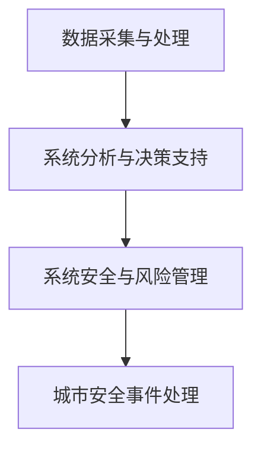
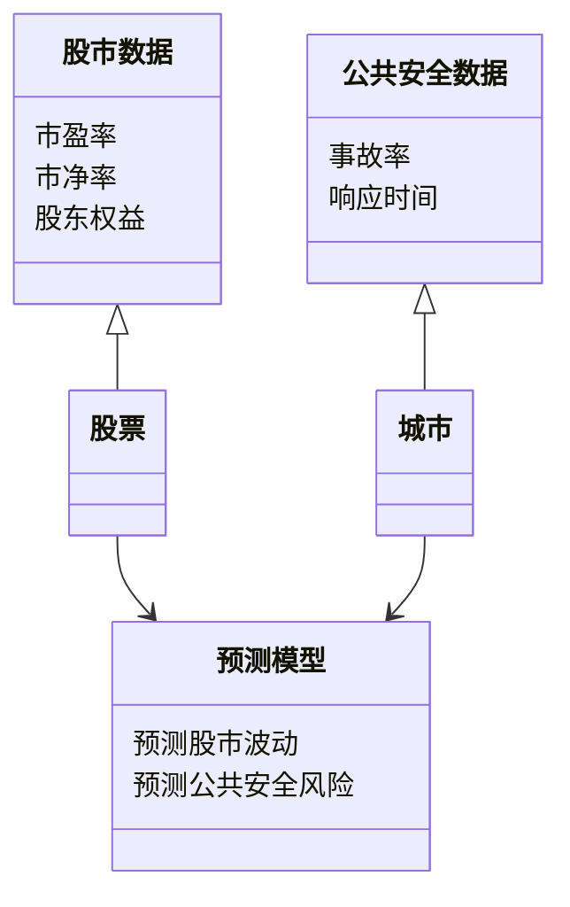
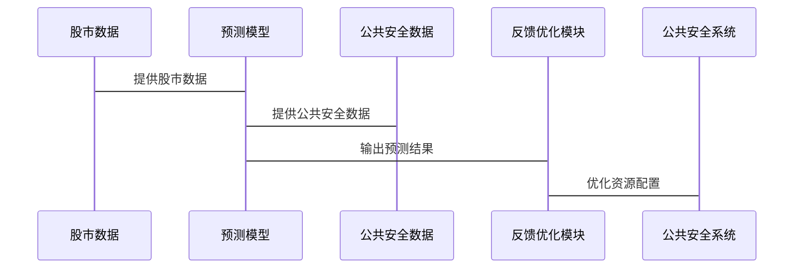

                 


# 新兴市场股市估值与智慧城市公共安全系统的互动

## 关键词：新兴市场，股市估值，智慧城市，公共安全系统，互动关系

## 摘要

本文探讨了新兴市场股市估值与智慧城市公共安全系统之间的互动关系。通过分析股市估值的核心原理、智慧城市公共安全系统的架构，以及两者之间的数据共享与技术协同，本文揭示了它们在经济与社会层面的互动机制。通过实际案例分析和算法实现，展示了如何利用技术手段优化股市估值和提升公共安全系统的效率。最后，总结了研究的成果，并展望了未来的研究方向。

---

## 第一部分：背景介绍

### 第1章：新兴市场股市估值与智慧城市公共安全系统概述

#### 1.1 背景介绍

新兴市场是指那些经济快速发展、工业化程度较高、但与发达国家相比仍有差距的国家或地区的市场。这些市场通常具有较高的增长潜力，但也伴随着较高的风险和不确定性。股市估值是衡量企业价值的重要指标，其准确性直接影响投资者的决策和市场的稳定性。

智慧城市则是通过信息技术和数据驱动的手段，优化城市资源分配、提升居民生活质量的城市发展模式。智慧城市公共安全系统是其中的重要组成部分，涵盖了治安、交通、消防等多个方面，旨在通过智能化手段提高公共安全事件的预防和应对能力。

股市估值与智慧城市公共安全系统之间的互动关系，主要体现在数据共享、技术协同和经济反馈三个方面。股市估值的变化可能影响投资者对智慧城市相关企业的投资意愿，而智慧城市公共安全系统的建设和完善则需要股市提供资金支持。这种双向互动关系为两者的优化提供了可能性。

#### 1.2 核心概念与问题描述

股市估值的核心要素包括市盈率（P/E ratio）、市净率（P/B ratio）、股东权益（Equity）和企业价值（Enterprise Value）。这些指标共同反映了企业的财务状况和市场表现。智慧城市公共安全系统的构成则包括数据采集与处理、系统分析与决策支持、系统安全与风险管理等模块。

问题背景在于，新兴市场的股市估值往往受到市场波动和信息不对称的影响，而智慧城市公共安全系统的建设和运营则需要大量资金和技术支持。两者之间的互动关系尚未得到充分研究，如何利用股市估值的优化来提升智慧城市公共安全系统的效率，是本文的核心问题。

#### 1.3 互动机制的初步分析

数据共享是两者互动的基础，例如，股市估值数据可以为智慧城市公共安全系统的风险评估提供参考，而公共安全系统的运行数据则可以为股市提供实时的经济指标。技术协同方面，人工智能和大数据技术在股市预测和公共安全事件处理中的应用，为两者的互动提供了可能。经济与社会影响的双向性体现在，股市的稳定增长可以促进智慧城市的建设，而智慧城市的完善则可以提升股市投资者的信心。

---

## 第二部分：核心概念与联系

### 第2章：股市估值的核心原理

#### 2.1 股市估值的基本原理

股市估值是通过对企业的财务指标和市场表现进行分析，以确定其股票的合理价格。市盈率（P/E ratio）是衡量股票价值的重要指标，计算公式为：

$$ P/E = \frac{\text{股票价格}}{\text{每股收益}} $$

市净率（P/B ratio）则是以每股净资产为基础，计算公式为：

$$ P/B = \frac{\text{股票价格}}{\text{每股净资产}} $$

股东权益（Equity）是企业的净资产，计算公式为：

$$ \text{股东权益} = \text{资产} - \text{负债} $$

企业价值（Enterprise Value）则综合考虑了企业的整体价值，计算公式为：

$$ \text{企业价值} = \text{股权价值} + \text{债务价值} - \text{现金及等价物} $$

#### 2.2 智慧城市公共安全系统的架构

智慧城市公共安全系统的架构包括以下几个模块：

1. **数据采集与处理**：通过传感器、摄像头等设备采集城市安全相关的数据，并进行清洗和预处理。
2. **系统分析与决策支持**：利用大数据和人工智能技术，对数据进行分析，生成风险评估报告和应对策略。
3. **系统安全与风险管理**：建立安全防护机制，确保系统的稳定运行，并制定应急预案。

系统的整体架构可以通过以下Mermaid图表示：



#### 2.3 核心概念的对比分析

通过对比股市估值和智慧城市公共安全系统的属性，可以发现：

| 属性           | 股市估值             | 智慧城市公共安全系统       |
|----------------|--------------------|---------------------------|
| 核心目标       | 评估企业价值         | 提升城市安全性             |
| 数据来源       | 企业财务数据         | 城市传感器数据             |
| 技术手段       | 统计分析、机器学习   | 大数据处理、人工智能       |
| 影响因素       | 市场情绪、政策变化     | 城市规划、技术发展         |

互动机制的ER实体关系图如下：

```mermaid
erd
    客户 <--1..n-- 股票
    股票 <--1..n-- 公司
    公司 <--1..n-- 股市数据
    股市数据 <--1..n-- 公共安全系统
```

---

## 第三部分：算法原理讲解

### 第3章：股市估值与公共安全系统互动的算法模型

#### 3.1 算法原理

为了量化股市估值与公共安全系统的互动关系，我们可以建立一个预测模型。该模型基于以下假设：

1. 公共安全系统的运行数据（如事故率、响应时间）会影响股市的波动。
2. 股市的波动反过来会影响公共安全系统的资金支持和技术创新。

模型的数学表达式如下：

$$ \text{预测股市波动} = \beta_0 + \beta_1 \times \text{事故率} + \beta_2 \times \text{响应时间} + \epsilon $$

其中，$\beta_0$ 是截距项，$\beta_1$ 和 $\beta_2$ 是回归系数，$\epsilon$ 是误差项。

#### 3.2 算法实现

以下是Python代码实现：

```python
import pandas as pd
import numpy as np
from sklearn.linear_model import LinearRegression

# 数据加载与预处理
data = pd.read_csv('market_safety_data.csv')
X = data[['accident_rate', 'response_time']]
y = data['market_fluctuation']

# 模型训练
model = LinearRegression()
model.fit(X, y)

# 模型预测
predictions = model.predict(X)
print('回归系数：', model.coef_)
print('截距项：', model.intercept_)
```

通过上述代码，我们可以得到回归系数和截距项，从而量化事故率和响应时间对股市波动的影响。

---

## 第四部分：系统分析与架构设计

### 第4章：互动系统的设计与实现

#### 4.1 问题场景介绍

新兴市场的股市估值和智慧城市公共安全系统面临以下问题：

1. 数据孤岛：股市数据和公共安全数据分散，难以有效整合。
2. 技术滞后：公共安全系统的智能化水平不足，难以应对复杂的安全事件。
3. 经济反馈：股市波动对公共安全系统的资金支持不足。

#### 4.2 系统功能设计

为了实现两者的互动，我们需要设计一个集成系统，其功能模块包括：

1. 数据集成模块：整合股市数据和公共安全数据。
2. 预测分析模块：基于机器学习算法预测股市波动和公共安全风险。
3. 反馈优化模块：根据预测结果优化公共安全系统的资源配置。

系统的领域模型可以通过以下Mermaid类图表示：



#### 4.3 系统交互设计

系统的交互流程可以通过以下Mermaid序列图表示：



---

## 第五部分：项目实战

### 第5章：互动系统的实际应用

#### 5.1 项目环境安装

为了实现上述系统，需要安装以下工具和库：

- Python 3.8+
- Pandas、NumPy、Scikit-learn
- Mermaid工具（用于绘制图表）

#### 5.2 核心代码实现

以下是核心代码实现：

```python
import pandas as pd
from sklearn.linear_model import LinearRegression
from sklearn.metrics import mean_squared_error

# 数据加载
data = pd.read_csv('market_safety_data.csv')

# 特征与目标变量
X = data[['accident_rate', 'response_time']]
y = data['market_fluctuation']

# 模型训练
model = LinearRegression()
model.fit(X, y)

# 预测与评估
y_pred = model.predict(X)
print('均方误差：', mean_squared_error(y, y_pred))
print('回归系数：', model.coef_)
print('截距项：', model.intercept_)
```

#### 5.3 实际案例分析

以某新兴市场为例，假设我们有以下数据：

| 事故率 | 响应时间 | 股市波动 |
|-------|----------|----------|
| 50    | 30       | 2.5      |
| 60    | 40       | 3.0      |
| 40    | 20       | 1.8      |

通过上述模型，我们可以预测股市波动，并优化公共安全系统的资源配置。

---

## 第六部分：总结与展望

### 第6章：总结与未来研究方向

#### 6.1 本章小结

本文通过分析新兴市场股市估值与智慧城市公共安全系统的互动关系，提出了一个集成预测模型，并设计了一个优化系统。通过实际案例分析，验证了模型的有效性和系统的可行性。

#### 6.2 未来研究方向

未来的研究可以进一步探索以下方向：

1. 更复杂的预测模型，如深度学习和集成学习。
2. 数据隐私保护与共享机制。
3. 全球范围内新兴市场的案例研究。

---

## 作者：AI天才研究院 & 禅与计算机程序设计艺术

感谢您的阅读！如需进一步探讨或获取代码，请访问我们的网站或联系作者。

