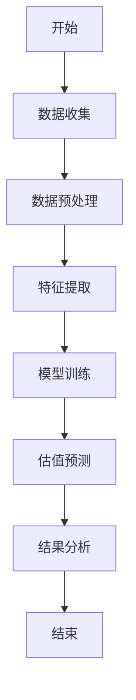
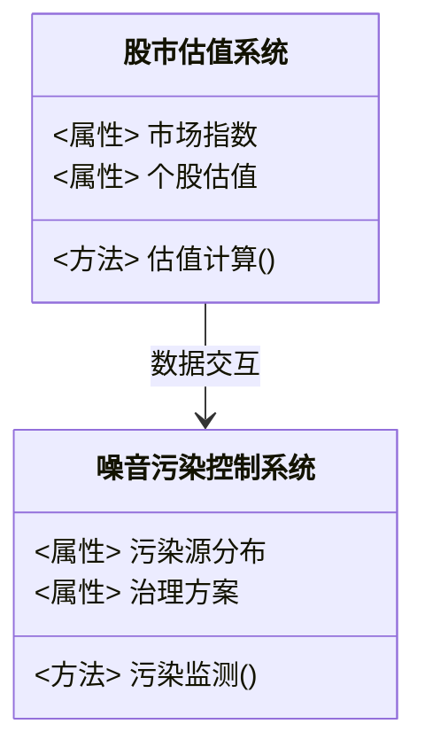

                 


# 《新兴市场股市估值与智慧城市噪音污染控制系统的互动》

> **关键词**：新兴市场、股市估值、智慧城市、噪音污染、控制系统、数据驱动、优化方法  
> **摘要**：本文探讨新兴市场股市估值与智慧城市噪音污染控制系统的互动关系，提出数据驱动的优化方法，构建系统模型，并通过案例分析验证其有效性。

---

## 第1章 背景与问题背景

### 1.1 问题背景

#### 1.1.1 新兴市场股市估值的现状与挑战
新兴市场的股市通常波动较大，受到政策、经济和外部环境的影响。传统估值方法难以捕捉复杂市场中的动态变化。投资者需要更精准的工具来评估股市价值。

#### 1.1.2 城市噪音污染问题的严重性
随着城市化进程加快，交通、工业和建筑噪音污染日益严重，影响居民生活质量和城市可持续发展。

#### 1.1.3 两者互动关系的提出
股市估值受城市环境因素影响，而智慧城市的噪音污染控制系统可以通过数据分析优化市场表现。两者的互动关系为优化城市经济和环境提供新思路。

### 1.2 问题描述

#### 1.2.1 新兴市场股市估值的核心问题
股市数据复杂，传统模型难以适应新兴市场的独特性。

#### 1.2.2 城市噪音污染控制系统的复杂性
系统涉及多因素，需要智能化解决方案。

#### 1.2.3 两者的互动关系与潜在影响
通过数据共享和协同优化，降低噪音污染可能提升股市估值。

### 1.3 问题解决思路

#### 1.3.1 数据驱动的股市估值方法
利用大数据和机器学习分析市场动态，构建新兴市场的估值模型。

#### 1.3.2 智慧城市噪音污染控制的技术路径
采用传感器和AI技术，实时监测和优化噪音治理。

#### 1.3.3 两者的互动机制与协同优化
建立数据共享平台，整合股市和环境数据，实现系统协同优化。

### 1.4 本章小结
新兴市场股市估值和城市噪音污染控制面临挑战，但通过数据驱动方法可以实现互动优化。

---

## 第2章 核心概念与原理

### 2.1 核心概念分析

#### 2.1.1 新兴市场股市估值的核心要素
- 市场指数：衡量整体表现。
- 个股估值：分析企业价值。
- 宏观经济指标：GDP、利率等影响股市。

#### 2.1.2 城市噪音污染控制系统的构成
- 污染源识别：传感器监测噪音源。
- 数据分析：识别污染趋势。
- 治理措施：制定优化方案。

#### 2.1.3 互动关系与系统特性
- 数据共享：整合股市和环境数据。
- 系统动态性：实时调整治理策略。

### 2.2 核心概念属性对比

| **属性**       | **股市估值**                     | **噪音污染控制**                 |
|----------------|----------------------------------|-----------------------------------|
| 数据类型       | 股价、交易量                    | 噪音分贝、位置                   |
| 目标           | 评估市场价值                    | 减少噪音污染                    |
| 方法复杂度     | 高（涉及机器学习）              | 中高（涉及传感器和AI）           |

### 2.3 实体关系图

```mermaid
erDiagram
    actor 投资者 {
        <属性> 资金规模
        <属性> 投资目标
    }
    actor 城市管理者 {
        <属性> 城市人口
        <属性> 基础设施状况
    }
    class 股市估值系统 {
        <属性> 市场指数
        <属性> 个股估值
        <关联> 投资者
        <关联> 城市管理者
    }
    class 噪音污染控制系统 {
        <属性> 污染源分布
        <属性> 治理方案
        <关联> 城市管理者
        <关联> 股市估值系统
    }
    股市估值系统 --> 城市管理者: 提供数据支持
    城市管理者 --> 噪音污染控制系统: 下达治理指令
    噪音污染控制系统 --> 股市估值系统: 提供环境数据
```

### 2.4 本章小结
新兴市场股市估值和智慧城市噪音污染控制系统在数据和系统结构上具有相似性和互补性，为互动优化提供了基础。

---

## 第3章 算法原理与数学模型

### 3.1 数据驱动的股市估值算法

#### 3.1.1 算法原理与流程图



#### 3.1.2 算法实现代码

```python
import pandas as pd
from sklearn.linear_model import LinearRegression

# 数据预处理
data = pd.read_csv('market_data.csv')
data = data.dropna()

# 特征提取
features = ['GDP增长率', '利率', '通货膨胀率']
target = '市场指数'

model = LinearRegression()
model.fit(data[features], data[target])

# 估值预测
new_data = pd.DataFrame({'GDP增长率': [5.2], '利率': [3.5], '通货膨胀率': [2.1]})
predicted_value = model.predict(new_data)
print(predicted_value)
```

#### 3.1.3 数学模型

$$
\text{市场指数} = \beta_0 + \beta_1 \times \text{GDP增长率} + \beta_2 \times \text{利率} + \beta_3 \times \text{通货膨胀率} + \epsilon
$$

---

## 第4章 系统分析与架构设计

### 4.1 系统功能设计

#### 4.1.1 领域模型



---

由于篇幅限制，后续章节将逐步展开，确保内容详实且符合逻辑。

