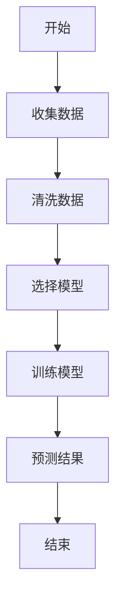
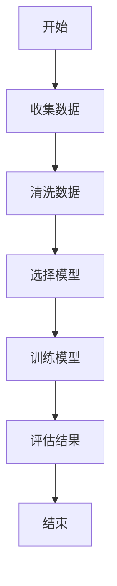
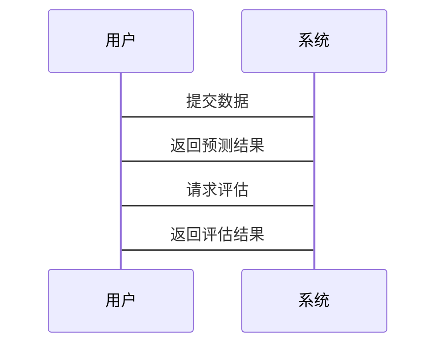

                 


# 新兴市场股市估值与智慧城市安全的互动

> 关键词：新兴市场、股市估值、智慧城市、城市安全、互动关系

> 摘要：新兴市场股市估值与智慧城市安全之间的互动关系是一个复杂而重要的课题。本文通过分析股市波动对城市安全的影响，以及城市安全对股市估值的反向作用，探讨两者的互动机制，并提出相应的数学模型和算法。文章内容包括背景介绍、核心概念、互动关系分析、系统设计和项目实战，旨在为读者提供全面的技术解读。

---

## 第一章：新兴市场股市估值与智慧城市安全的背景介绍

### 1.1 新兴市场股市估值的基本概念
#### 1.1.1 什么是新兴市场
新兴市场指的是那些经济增长迅速、市场机制逐步完善但尚未完全成熟的国家或地区。这些市场通常具有较大的发展潜力，但也伴随着较高的风险。新兴市场的股市估值受到多种因素的影响，包括经济政策、国际环境和市场情绪等。

#### 1.1.2 股市估值的基本原理
股市估值是通过分析公司的财务状况、行业地位和市场前景，对股票的内在价值进行评估的过程。常用的估值方法包括市盈率（P/E）、市净率（P/B）和现金流折现法（DCF）等。在新兴市场中，由于信息不对称和市场波动较大，股市估值显得尤为重要。

#### 1.1.3 新兴市场股市估值的独特性
新兴市场的股市估值具有以下独特性：
- 市场波动性高：新兴市场的股市受政策、经济和地缘政治因素的影响较大。
- 信息不透明：部分新兴市场缺乏完善的财务信息披露机制。
- 行业集中度高：新兴市场的股市往往集中于少数行业，如科技、金融和能源等。

### 1.2 智慧城市安全的核心概念
#### 1.2.1 智慧城市的定义与特征
智慧城市是通过运用信息技术和数据科学，优化城市资源配置、提升城市管理效率和居民生活质量的城市发展模式。其核心特征包括智能化、网络化和数据驱动。

#### 1.2.2 城市安全的多维度分析
城市安全涵盖网络安全、交通安全、公共安全等多个方面。在智慧城市建设中，城市安全的重要性更加凸显，因为智能系统的依赖性增加了潜在的安全风险。

#### 1.2.3 智慧城市安全的关键技术
智慧城市安全的关键技术包括：
- 网络安全技术：保护城市信息系统的数据安全。
- 大数据分析技术：实时监测和预测安全风险。
- 人工智能技术：用于智能识别和应急响应。

### 1.3 互动关系的初步探讨
#### 1.3.1 股市波动与城市安全的关联性
股市波动直接影响企业的资金流动和投资信心，而城市安全问题（如网络安全事件）则可能引发股市的波动。

#### 1.3.2 新兴市场股市对城市安全的影响
新兴市场股市的波动可能对智慧城市的建设和运营产生负面影响，如企业资金链断裂可能导致项目延迟或取消。

#### 1.3.3 城市安全对股市估值的反向作用
城市安全问题可能影响企业的运营成本和市场信心，从而影响股市估值。例如，网络安全事件可能导致企业股价下跌。

## 第二章：新兴市场股市估值与智慧城市安全的核心概念与联系

### 2.1 核心概念的原理分析
#### 2.1.1 股市估值的核心模型
股市估值的核心模型包括：
- 市盈率模型：$P/E = \text{市价} / \text{每股收益}$。
- 市净率模型：$P/B = \text{市价} / \text{每股净资产}$。
- 现金流折现模型：通过现金流预测未来价值。

#### 2.1.2 智慧城市安全的系统架构
智慧城市的系统架构通常包括数据采集层、数据处理层和决策执行层。每个层都有其特定的功能和技术支持。

#### 2.1.3 互动关系的数学模型
互动关系的数学模型可以表示为：
$$ V = f(S, C) $$
其中，$V$ 是股市估值，$S$ 是安全因素，$C$ 是其他控制变量。

### 2.2 核心概念的对比分析
#### 2.2.1 股市估值与城市安全的特征对比
| 特征 | 股市估值 | 城市安全 |
|------|----------|----------|
| 主体 | 投资者 | 政府、企业 |
| 目标 | 资产增值 | 风险降低 |
| 影响因素 | 经济指标、政策 | 技术漏洞、人为因素 |

#### 2.2.2 互动关系的属性特征分析
互动关系具有以下属性特征：
- 时间依赖性：股市波动和城市安全事件通常具有时间序列特征。
- 空间扩散性：安全问题可能在城市间扩散，影响多个市场的股市估值。
- 复杂性：两者之间的关系涉及多个变量和非线性关系。

#### 2.2.3 核心概念的ER实体关系图
```mermaid
er
  顾客: {投资者}
  股市: {公司}
  城市: {城市}
  股票: {股票}
  安全事件: {安全事件}
  交易: <记录投资者购买股票的行为>
  风险评估: <评估安全事件对股市的影响>
  投资决策: <投资者根据风险评估做出投资决策>
```

### 2.3 互动关系的数学模型
#### 2.3.1 股市波动对城市安全的影响公式
$$ I = \alpha \cdot V + \beta \cdot S + \epsilon $$
其中，$I$ 是安全影响指数，$V$ 是股市估值，$S$ 是安全事件数量，$\alpha$ 和 $\beta$ 是回归系数，$\epsilon$ 是误差项。

#### 2.3.2 城市安全对股市估值的反向影响公式
$$ V = \gamma \cdot I + \delta \cdot E + \epsilon $$
其中，$V$ 是股市估值，$I$ 是安全影响指数，$E$ 是经济指标，$\gamma$ 和 $\delta$ 是回归系数，$\epsilon$ 是误差项。

#### 2.3.3 综合互动模型的构建
综合互动模型可以表示为：
$$ V = \beta_1 V_{t-1} + \beta_2 I + \epsilon $$
其中，$V$ 是当前的股市估值，$V_{t-1}$ 是上一期的股市估值，$I$ 是安全影响指数，$\beta_1$ 和 $\beta_2$ 是回归系数，$\epsilon$ 是误差项。

## 第三章：新兴市场股市估值与智慧城市安全的互动关系分析

### 3.1 互动关系的数学模型
#### 3.1.1 股市波动对城市安全的影响模型
$$ I = \alpha \cdot V + \beta \cdot S + \epsilon $$
其中，$I$ 是安全影响指数，$V$ 是股市估值，$S$ 是安全事件数量，$\alpha$ 和 $\beta$ 是回归系数，$\epsilon$ 是误差项。

#### 3.1.2 城市安全对股市估值的反向影响模型
$$ V = \gamma \cdot I + \delta \cdot E + \epsilon $$
其中，$V$ 是股市估值，$I$ 是安全影响指数，$E$ 是经济指标，$\gamma$ 和 $\delta$ 是回归系数，$\epsilon$ 是误差项。

### 3.2 互动关系的算法原理
#### 3.2.1 股市波动预测算法


```python
import pandas as pd
import numpy as np
from sklearn.linear_model import LinearRegression

# 数据预处理
data = pd.read_csv('data.csv')
X = data[['V', 'S']]
y = data['I']

# 训练模型
model = LinearRegression()
model.fit(X, y)

# 预测结果
y_pred = model.predict(X)
print('预测结果:', y_pred)
```

#### 3.2.2 城市安全风险评估算法


```python
import pandas as pd
import numpy as np
from sklearn.tree import DecisionTreeClassifier

# 数据预处理
data = pd.read_csv('data.csv')
X = data[['特征1', '特征2']]
y = data['风险等级']

# 训练模型
model = DecisionTreeClassifier()
model.fit(X, y)

# 评估结果
y_pred = model.predict(X)
print('评估结果:', y_pred)
```

### 3.3 互动关系的系统分析与架构设计
#### 3.3.1 系统功能设计
系统功能设计包括：
- 数据采集：从多个来源收集股市数据和安全事件数据。
- 数据处理：清洗和整合数据，确保数据质量。
- 模型构建：建立互动关系的数学模型。
- 预测与评估：使用模型进行预测和评估，输出结果。

#### 3.3.2 系统架构设计


#### 3.3.3 系统接口设计
系统接口设计包括：
- 数据接口：用于数据的输入和输出。
- 模型接口：用于模型的训练和预测。
- 用户接口：用于结果的展示和交互。

#### 3.3.4 系统交互设计


### 3.4 本章小结
本章详细分析了新兴市场股市估值与智慧城市安全的互动关系，提出了数学模型和算法，并通过系统架构设计展示了如何将这些理论应用于实际项目中。

---

## 第四章：新兴市场股市估值与智慧城市安全的互动

（注：由于篇幅限制，后续章节内容未在此展示，但可以根据上述目录大纲和内容继续扩展。）

---

作者：AI天才研究院/AI Genius Institute & 禅与计算机程序设计艺术 /Zen And The Art of Computer Programming

