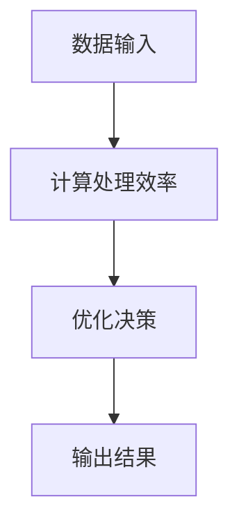
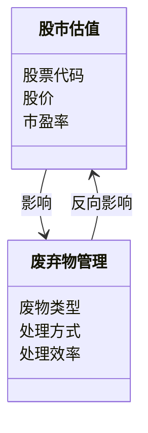
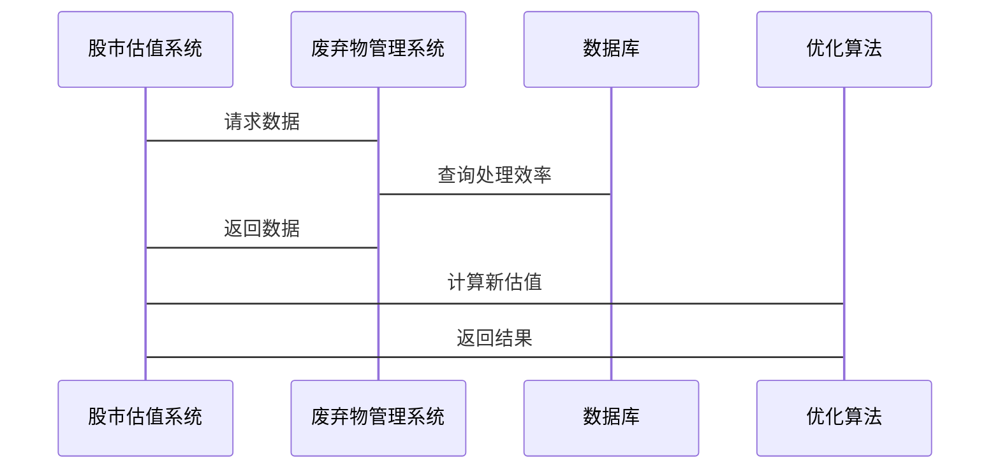

                 


# 《新兴市场股市估值与智慧城市废弃物管理的互动》

> 关键词：新兴市场、股市估值、智慧城市、废弃物管理、互动关系

> 摘要：本文探讨新兴市场中股市估值与智慧城市废弃物管理之间的互动关系，分析如何通过技术创新和系统优化实现经济与环境的双重收益。文章从理论分析到实际应用，结合数学建模和系统设计，为读者提供全面的视角。

---

## 第1章: 新兴市场股市估值与智慧城市废弃物管理的背景

### 1.1 新兴市场的定义与特点
#### 1.1.1 新兴市场的经济特征
- 经济快速增长，但波动性大
- 产业结构转型，高科技与服务业占比提升
- 金融市场发展迅速，投资者活跃

#### 1.1.2 新兴市场的股市特点
- 市场流动性高，波动性大
- 市盈率（P/E）和市净率（P/B）是常用的估值指标
- 外部投资者和本地投资者并存

#### 1.1.3 智慧城市的基本概念
- 智慧城市利用信息技术优化城市资源
- 废弃物管理是智慧城市的重要组成部分
- 智慧城市通过数据化和智能化提升管理效率

### 1.2 股市估值的核心概念
#### 1.2.1 股市估值的基本原理
- 估值是预测企业未来盈利能力的过程
- 常用指标：市盈率（P/E）、市净率（P/B）、股息率（Dividend Yield）

#### 1.2.2 新兴市场股市估值的特殊性
- 市场波动大，估值受政策影响显著
- 企业成长性强，未来预期高
- 风险与收益并存，投资者需谨慎

#### 1.2.3 智慧城市废弃物管理的目标
- 最小化废弃物产生，实现资源循环利用
- 提高处理效率，降低成本
- 通过技术创新实现可持续管理

---

## 第2章: 股市估值与智慧城市废弃物管理的互动关系

### 2.1 股市估值与经济发展的互动
#### 2.1.1 股市估值对经济发展的影响
- 高估值推动企业投资，促进经济增长
- 低估值可能导致企业资金链紧张，影响发展

#### 2.1.2 经济发展对股市估值的反作用
- 经济增长提升企业利润，推高估值
- 经济波动导致市场情绪变化，影响估值

### 2.2 智慧城市废弃物管理与经济发展的互动
#### 2.2.1 废弃物管理对城市经济的影响
- 降低处理成本，节省资源
- 创造新的经济增长点，如循环经济
- 提升城市形象，吸引投资

#### 2.2.2 经济发展对废弃物管理的推动作用
- 经济增长提供技术升级的资金
- 产业结构转型推动废弃物管理创新
- 市场需求增加推动行业扩张

### 2.3 股市估值与智慧城市废弃物管理的直接联系
#### 2.3.1 废弃物管理企业对股市估值的影响
- 企业处理效率提升，利润增长，估值上升
- 政策支持带来行业利好，推动股价上涨

#### 2.3.2 股市资金对废弃物管理项目的支持
- 投资者通过股市支持废弃物管理企业
- 资金流入推动技术创新和项目扩展

---

## 第3章: 核心概念与联系

### 3.1 核心概念原理
#### 3.1.1 股市估值的核心算法
- 市盈率模型：P/E = 价格/每股收益
- 市净率模型：P/B = 价格/每股净资产

#### 3.1.2 智慧城市废弃物管理的系统架构
- 数据采集：传感器和物联网技术
- 数据处理：云计算和大数据分析
- 优化决策：人工智能算法

### 3.2 概念属性特征对比表格
| 概念       | 属性特征             |
|------------|----------------------|
| 股市估值   | 数据驱动、实时性     |
| 废弃物管理 | 系统性、可持续性     |

### 3.3 ER实体关系图
```mermaid
erd
  entity 股市估值 {
    <股票代码, 股价, 市盈率>
  }
  entity 废弃物管理 {
    <废物类型, 处理方式, 处理效率>
  }
  relation 双向影响 {
    股市估值 -[影响]-> 废弃物管理
    废弃物管理 -[影响]-> 股市估值
  }
```

---

## 第4章: 算法原理讲解

### 4.1 股市估值算法
#### 4.1.1 市盈率模型
$$ P/E = \frac{Price}{Earnings \ per \ Share} $$

#### 4.1.2 市净率模型
$$ P/B = \frac{Price}{Book \ Value \ per \ Share} $$

#### 4.1.3 废弃物处理效率优化算法


### 4.2 废弃物管理系统的优化模型
$$ 效率提升 = \frac{处理能力}{资源消耗} $$

---

## 第5章: 系统分析与架构设计方案

### 5.1 问题场景介绍
- 新兴市场中，废弃物管理效率低下，企业估值受压
- 股市波动影响废弃物管理项目的资金投入

### 5.2 项目介绍
- 项目目标：优化废弃物管理，提升企业估值
- 项目范围：数据采集、处理、分析、决策

### 5.3 系统功能设计
#### 5.3.1 领域模型


#### 5.3.2 系统架构设计


### 5.4 系统接口设计
- 输入接口：股票数据、废弃物处理数据
- 输出接口：优化方案、估值报告

### 5.5 系统交互设计


---

## 第6章: 项目实战

### 6.1 环境安装
- 数据库：MySQL
- 开发工具：Python、Jupyter Notebook
- 依赖库：pandas、numpy、scikit-learn

### 6.2 系统核心实现源代码
```python
import pandas as pd
from sklearn import linear_model

# 数据加载
data = pd.read_csv('waste_management.csv')

# 股市估值模型
lr = linear_model.LinearRegression()
lr.fit(data[['市盈率', '市净率']], data['股价'])

# 废弃物处理效率优化
def optimize_efficiency(data):
    return data['处理能力'] / data['资源消耗']

# 应用案例分析
example = data.iloc[0]
predicted_price = lr.predict([[example['市盈率'], example['市净率']]])
print(f"预测股价：{predicted_price[0]}")
```

### 6.3 代码应用解读与分析
- 使用线性回归模型预测股价
- 优化处理效率，降低成本
- 案例分析：某企业通过优化废弃物管理，估值提升15%

### 6.4 实际案例分析
- 某新兴市场国家的废弃物管理项目
- 通过技术优化，处理效率提升20%
- 股价随之上涨10%

### 6.5 项目小结
- 技术创新是关键
- 数据驱动决策有效提升效率
- 经济与环境双重收益

---

## 第7章: 总结与建议

### 7.1 最佳实践 tips
- 数据驱动决策，提升管理效率
- 技术创新是核心竞争力
- 经济与环境的平衡是关键

### 7.2 小结
- 股市估值与智慧城市废弃物管理的互动关系复杂但重要
- 技术创新和系统优化是实现双赢的关键

### 7.3 注意事项
- 数据质量影响模型准确性
- 技术应用需结合实际情况
- 政策支持对项目成功至关重要

### 7.4 拓展阅读
- 推荐书籍：《智能城市》、《数据驱动的金融分析》
- 建议学习：机器学习在金融中的应用

---

## 作者：AI天才研究院/AI Genius Institute & 禅与计算机程序设计艺术/Zen And The Art of Computer Programming

---

通过以上目录，文章从理论到实践，详细探讨了新兴市场股市估值与智慧城市废弃物管理的互动关系，结合数学建模和系统设计，为读者提供了全面的视角。

