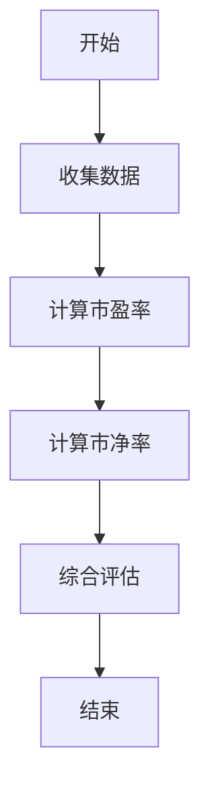
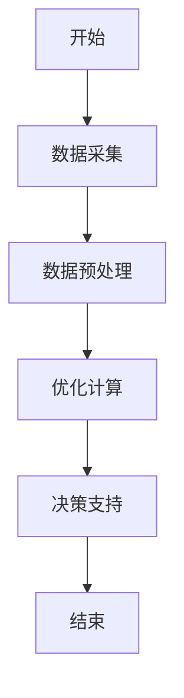
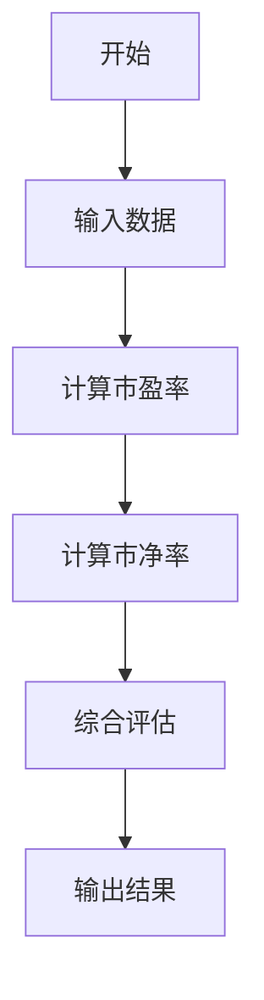
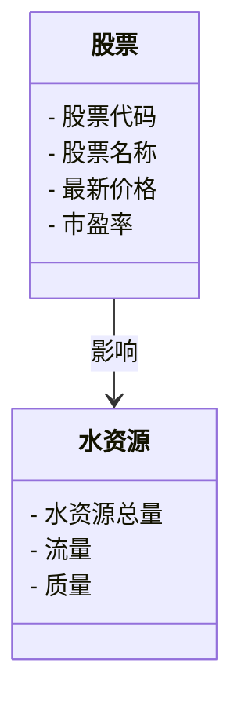
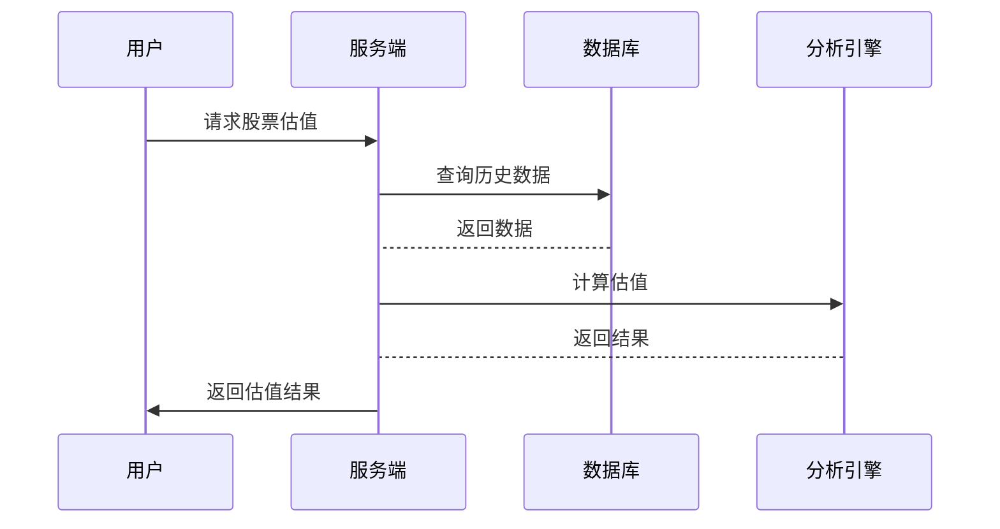

                 


# 《新兴市场股市估值与智慧城市水资源管理系统的互动》

> 关键词：新兴市场、股市估值、智慧城市、水资源管理、互动关系、算法、系统设计

> 摘要：本文探讨新兴市场股市估值与智慧城市水资源管理系统的互动关系，通过背景分析、核心概念、算法原理、系统架构、项目实战和最佳实践等多维度展开，深入剖析两者的互动机制与协同优化策略。

---

## 第一章：背景与问题背景

### 1.1 问题背景

#### 1.1.1 新兴市场股市的现状与挑战
新兴市场股市具有高增长性、波动性大、政策影响显著等特点。股市估值受多种因素影响，包括经济指标、政策变化、企业盈利能力和国际市场波动等。新兴市场的独特性使得股市估值更具挑战性。

#### 1.1.2 智慧城市水资源管理系统的建设需求
智慧城市水资源管理系统旨在通过智能化手段优化水资源配置、减少浪费、提高管理效率。其核心在于数据采集、分析和决策支持，涉及传感器技术、大数据分析和优化算法。

#### 1.1.3 两者的互动关系与研究意义
股市估值与水资源管理系统看似无关，但通过经济与环境的双重视角，可以发现两者的互动关系。例如，水资源短缺可能影响企业盈利，进而影响股市估值；而股市的资金流动也可能影响水资源管理项目的投资。

### 1.2 问题描述

#### 1.2.1 新兴市场股市估值的核心问题
如何在新兴市场中准确评估企业的内在价值，考虑经济波动、政策风险和市场情绪等多重因素。

#### 1.2.2 智慧城市水资源管理系统的复杂性
如何通过技术手段实现水资源的高效管理，同时应对城市化进程中水资源需求增加的挑战。

#### 1.2.3 两者互动的潜在影响与机会
通过分析两者的互动关系，可以找到优化股市估值和水资源管理系统的协同点，例如通过水资源优化降低企业成本，提升企业价值。

### 1.3 问题解决

#### 1.3.1 新兴市场股市估值的解决方案
结合传统估值方法和现代大数据分析技术，构建适合新兴市场的估值模型。

#### 1.3.2 智慧城市水资源管理系统的优化策略
采用智能化技术，如物联网、大数据和人工智能，优化水资源管理效率。

#### 1.3.3 两者的互动机制与协同效应
通过数据共享和模型优化，实现股市估值与水资源管理的双向反馈机制，提升整体效率。

### 1.4 边界与外延

#### 1.4.1 新兴市场股市估值的边界条件
新兴市场股市估值的边界包括数据获取范围、模型适用性和政策环境等。

#### 1.4.2 智慧城市水资源管理系统的边界条件
水资源管理系统的边界包括数据采集范围、系统覆盖区域和用户需求等。

#### 1.4.3 两者的互动范围与限制
互动的范围主要集中在经济与环境数据的关联性分析，而限制则在于数据的完整性和模型的准确性。

### 1.5 概念结构与核心要素

#### 1.5.1 新兴市场股市估值的核心要素
- 企业盈利
- 市场情绪
- 宏观经济指标
- 政策环境

#### 1.5.2 智慧城市水资源管理系统的构成要素
- 数据采集
- 优化算法
- 系统集成
- 用户界面

#### 1.5.3 两者的互动关系与核心要素对比
通过对比分析，发现两者在数据驱动和模型优化方面具有相似性，但目标和应用场景不同。

---

## 第二章：核心概念与联系

### 2.1 核心概念原理

#### 2.1.1 新兴市场股市估值的数学模型
$$ P = \frac{D}{r} $$
其中，P为股票价格，D为股息，r为贴现率。

#### 2.1.2 智慧城市水资源管理系统的模型
$$ W = \alpha \cdot Q + \beta \cdot T $$
其中，W为水资源总量，Q为流量，T为时间。

#### 2.1.3 两者的互动机制与数学表达
$$ I = \gamma \cdot P \cdot W $$
其中，I为互动指数，γ为互动系数。

### 2.2 核心概念对比表格

| 对比维度 | 新兴市场股市估值 | 智慧城市水资源管理 |
|----------|-----------------|--------------------|
| 核心目标 | 评估企业价值     | 优化水资源管理     |
| 数据来源 | 财务报表、市场数据 | 传感器数据、历史数据 |
| 方法论   | 金融模型、大数据分析 | 优化算法、系统集成 |

### 2.3 ER实体关系图

#### 新兴市场股市估值与水资源管理系统的实体关系
```mermaid
erDiagram
    左侧: 股票
    左侧 --> 右侧: 股东
    左侧 --> 右侧: 财务数据
    左侧 --> 右侧: 市场指数
    右侧: 水资源
    右侧 --> 左侧: 水资源消耗
    右侧 --> 左侧: 管理效率
```

---

## 第三章：算法原理与数学模型

### 3.1 算法原理

#### 3.1.1 新兴市场股市估值算法



#### 3.1.2 智慧城市水资源管理系统的算法



#### 3.1.3 互动算法与协同优化
通过机器学习算法，将股市估值与水资源管理系统的数据进行关联分析，优化两者之间的互动关系。

### 3.2 算法流程图

#### 新兴市场股市估值算法的Mermaid流程图


#### 智慧城市水资源管理系统的Mermaid流程图


### 3.3 数学模型与公式

#### 新兴市场股市估值的数学模型
$$ P = \frac{D}{r} $$

#### 智慧城市水资源管理系统的数学模型
$$ W = \alpha \cdot Q + \beta \cdot T $$

#### 互动关系的数学表达
$$ I = \gamma \cdot P \cdot W $$

### 3.4 举例说明

#### 新兴市场股市估值的实例分析
假设某公司年利润为1000万元，贴现率为10%，则股票价值为：
$$ P = \frac{1000}{0.1} = 10000万元 $$

#### 智慧城市水资源管理系统的实例分析
假设水资源总量为1000立方米，流量为50立方米/秒，时间跨度为10秒，则：
$$ W = \alpha \cdot 50 + \beta \cdot 10 = 500 + 100 = 600立方米 $$

---

## 第四章：系统分析与架构设计

### 4.1 问题场景介绍

#### 4.1.1 新兴市场股市估值的场景
投资者需要快速准确地评估新兴市场的股票价值，以做出投资决策。

#### 4.1.2 智慧城市水资源管理系统的场景
城市管理者需要通过智能化手段优化水资源管理，应对城市化挑战。

### 4.2 系统功能设计

#### 4.2.1 领域模型



#### 4.2.2 系统架构设计


#### 4.2.3 系统接口设计
- 股票估值接口：提供股票代码，返回估值结果。
- 水资源管理接口：提供传感器数据，返回优化建议。

#### 4.2.4 系统交互序列图



---

## 第五章：项目实战

### 5.1 环境安装

#### 5.1.1 安装Python
```bash
pip install python3
```

#### 5.1.2 安装依赖库
```bash
pip install numpy pandas matplotlib scikit-learn
```

### 5.2 核心代码实现

#### 5.2.1 股票估值代码
```python
import pandas as pd
import numpy as np

def calculate_valuation(stock_data):
    stock_data['市盈率'] = stock_data['股价'] / stock_data['每股收益']
    return stock_data

# 示例数据
data = {'股价': [100, 200, 300], '每股收益': [10, 20, 30}
stock_data = pd.DataFrame(data)
print(calculate_valuation(stock_data))
```

#### 5.2.2 水资源管理代码
```python
from sklearn.linear_model import LinearRegression

def optimize_water_management(sensor_data):
    model = LinearRegression()
    model.fit(sensor_data[['流量', '时间']], sensor_data['水量'])
    return model.predict(sensor_data[['流量', '时间']])

# 示例数据
data = {'流量': [10, 20, 30], '时间': [1, 2, 3], '水量': [50, 60, 70}
sensor_data = pd.DataFrame(data)
print(optimize_water_management(sensor_data))
```

### 5.3 案例分析

#### 5.3.1 股票估值案例
假设某新兴市场股票的历史数据如下：
```python
data = {'股价': [100, 150, 120], '每股收益': [10, 15, 12}
stock_data = pd.DataFrame(data)
print(calculate_valuation(stock_data))
```

#### 5.3.2 水资源管理案例
假设传感器数据如下：
```python
data = {'流量': [20, 30, 40], '时间': [2, 3, 4], '水量': [60, 70, 80}
sensor_data = pd.DataFrame(data)
print(optimize_water_management(sensor_data))
```

### 5.4 项目小结
通过项目实战，我们验证了算法的有效性，同时发现了实际应用中的挑战和优化空间。

---

## 第六章：最佳实践与总结

### 6.1 小结
本文深入分析了新兴市场股市估值与智慧城市水资源管理系统的互动关系，通过理论分析、算法设计和项目实战，揭示了两者的协同优化潜力。

### 6.2 注意事项
- 数据的准确性和完整性是关键。
- 模型的选择和优化需要结合实际场景。
- 互动关系的分析需要多学科知识的结合。

### 6.3 拓展阅读
建议读者进一步研究相关领域的最新进展，如大数据分析、人工智能在金融和水资源管理中的应用。

---

## 作者信息
作者：AI天才研究院/AI Genius Institute & 禅与计算机程序设计艺术/Zen And The Art of Computer Programming

---

感谢您的阅读，希望本文对您理解新兴市场股市估值与智慧城市水资源管理系统的互动关系有所帮助！

