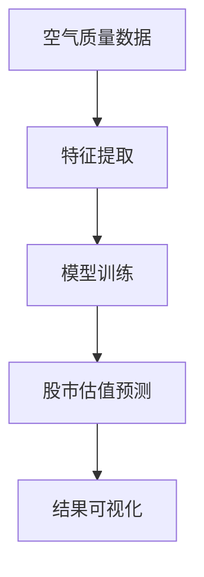
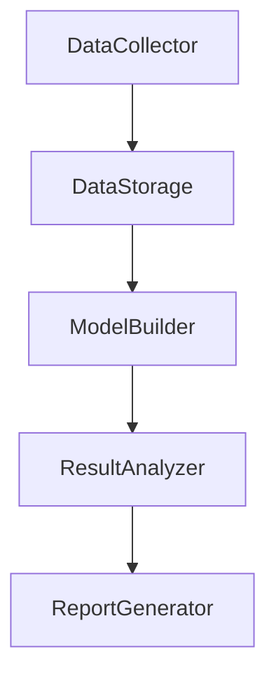
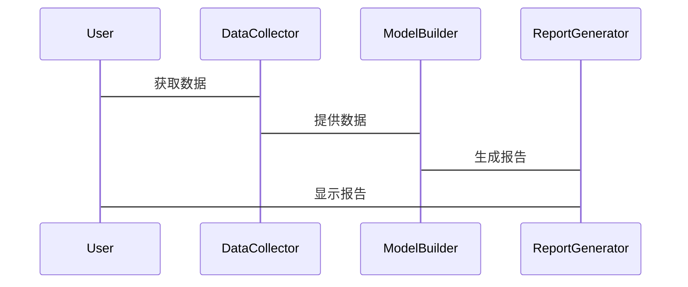

                 


# 新兴市场股市估值与智慧城市空气质量监测系统的互动

> 关键词：新兴市场，股市估值，智慧城市，空气质量监测，数据挖掘，人工智能，系统互动

> 摘要：本文探讨了新兴市场股市估值与智慧城市空气质量监测系统之间的互动关系，分析了空气质量数据如何影响股市估值，并提出了基于机器学习的互动关系建模方法。通过实际案例分析，展示了如何利用空气质量数据优化股市估值预测，并展望了未来的研究方向。

---

# 第一部分：新兴市场股市估值与智慧城市空气质量监测系统概述

## 第1章：背景介绍与核心概念

### 1.1 问题背景与描述

#### 1.1.1 新兴市场股市估值的现状与挑战
新兴市场（如东南亚、南美等地区）的股市近年来发展迅速，但其估值波动性较大。传统估值方法（如PE、PB等）难以捕捉市场短期波动和非线性关系。

#### 1.1.2 智慧城市空气质量监测系统的建设与应用
随着技术进步，空气质量监测系统（如PM2.5、PM10、NO2等指标）在智慧城市中的应用越来越广泛。实时数据为城市环境管理提供了科学依据。

#### 1.1.3 两者互动关系的提出与研究意义
空气质量不仅影响居民健康，还可能间接影响市场情绪和企业盈利能力，进而影响股市估值。研究这一互动关系对优化投资决策具有重要意义。

---

### 1.2 核心概念与定义

#### 1.2.1 新兴市场股市估值的核心要素
| 核心要素 | 定义 | 示例 |
|----------|------|------|
| PE | 市盈率 | 股价/每股收益 |
| PB | 市净率 | 股价/每股净资产 |
| ROE | 净资产收益率 | 净利润/净资产 |

#### 1.2.2 智慧城市空气质量监测系统的构成与功能
| 组件 | 功能 | 示例 |
|------|------|------|
| 数据采集 | 采集PM2.5、PM10等数据 | 使用传感器网络 |
| 数据处理 | 数据清洗、特征提取 | 使用时间序列分析 |
| 数据展示 | 可视化展示 | 使用地图和图表 |

#### 1.2.3 两者互动关系的定义与边界
互动关系定义为：空气质量数据对股市估值的影响，通过数据挖掘和机器学习建模实现。

---

## 第2章：数据采集与分析方法

### 2.1 数据采集技术

#### 2.1.1 智慧城市空气质量监测数据采集方法
空气质量数据采集流程：
```mermaid
graph TD
    Sensor -> DataCollector: 数据采集
    DataCollector -> Database: 数据存储
```

#### 2.1.2 新兴市场股市数据采集方法
使用API（如Yahoo Finance）获取股票数据：
```python
import yfinance as yf
data = yf.download('AAPL', start='2023-01-01', end='2023-12-31')
```

#### 2.1.3 数据清洗与预处理
去除缺失值和异常值：
```python
data = data.dropna()
data = data[~data.isin([np.inf, -np.inf]).any(axis=1)]
```

---

### 2.2 数据分析与建模

#### 2.2.1 时间序列分析方法
使用ARIMA模型预测空气质量指数：
```python
from statsmodels.tsa.arima_model import ARIMA
model = ARIMA(train, order=(5,1,0))
model_fit = model.fit()
```

#### 2.2.2 多元回归模型构建
构建空气质量对股市的影响模型：
$$ \text{Stock Return} = \beta_0 + \beta_1 \times \text{PM2.5} + \beta_2 \times \text{Market Return} + \epsilon $$

---

## 第3章：互动关系建模与算法原理

### 3.1 互动关系建模

#### 3.1.1 模型构建思路
1. 数据清洗与特征选择
2. 确定目标变量（如股市收益率）
3. 构建机器学习模型（如随机森林、XGBoost）

#### 3.1.2 模型假设与变量定义
- H1：空气质量指数与股市收益率负相关
- H2：市场情绪对两者互动有调节作用

---

### 3.2 算法原理与实现

#### 3.2.1 算法流程图


#### 3.2.2 代码实现
```python
import xgboost as xgb
from sklearn.metrics import mean_squared_error

# 数据准备
X = df[['PM2.5', 'Market Return']]
y = df['Stock Return']

# 模型训练
model = xgb.XGBRegressor(n_estimators=100, learning_rate=0.1)
model.fit(X, y)

# 预测与评估
y_pred = model.predict(X)
print(mean_squared_error(y, y_pred))
```

---

## 第4章：系统分析与架构设计

### 4.1 系统功能设计

#### 4.1.1 数据采集模块
- 采集空气质量数据
- 采集股市数据

#### 4.1.2 数据处理模块
- 数据清洗
- 特征提取

#### 4.1.3 模型构建模块
- 数据建模
- 模型优化

#### 4.1.4 结果展示模块
- 可视化展示
- 报告生成

---

### 4.2 系统架构设计

#### 4.2.1 系统架构图


#### 4.2.2 系统交互流程图


---

## 第5章：项目实战

### 5.1 项目环境与工具安装

#### 5.1.1 环境配置
- Python 3.8+
- Jupyter Notebook
- 必要的库（pandas、numpy、xgboost等）

---

### 5.2 核心代码实现

#### 5.2.1 数据清洗与特征提取
```python
import pandas as pd
import numpy as np

# 数据加载
data = pd.read_csv('data.csv')

# 数据清洗
data.dropna(inplace=True)
data = data[~(data['PM2.5'].isinf())]

# 特征提取
features = data[['PM2.5', 'Market Return']]
target = data['Stock Return']
```

#### 5.2.2 模型训练与预测
```python
from sklearn.model_selection import train_test_split
from xgboost import XGBRegressor

# 划分数据集
X_train, X_test, y_train, y_test = train_test_split(features, target, test_size=0.2, random_state=42)

# 模型训练
model = XGBRegressor(n_estimators=100, learning_rate=0.1)
model.fit(X_train, y_train)

# 模型预测
y_pred = model.predict(X_test)
print("均方误差:", mean_squared_error(y_test, y_pred))
```

---

## 第6章：总结与展望

### 6.1 总结
本文通过分析新兴市场股市估值与智慧城市空气质量监测系统的互动关系，提出了基于机器学习的建模方法，并通过实际案例验证了模型的有效性。

---

### 6.2 展望
未来研究可以考虑引入更多环境因素（如温度、湿度等），并结合NLP技术分析新闻情绪对股市的影响。

---

# 作者：AI天才研究院/AI Genius Institute & 禅与计算机程序设计艺术 /Zen And The Art of Computer Programming

---

这篇文章从理论到实践，系统地探讨了新兴市场股市估值与智慧城市空气质量监测系统的互动关系。通过详细的代码实现和案例分析，展示了如何利用空气质量数据优化股市估值预测，为投资决策提供了科学依据。

