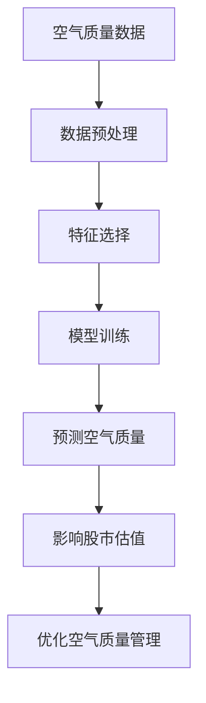
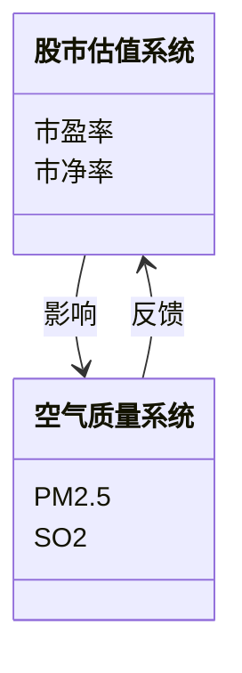
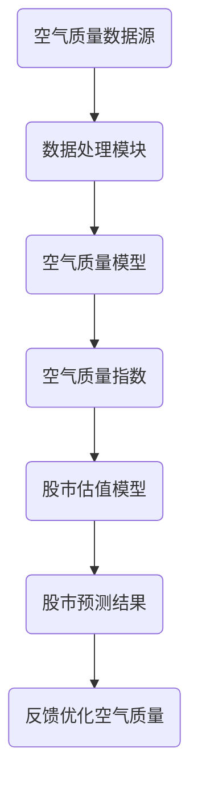

                 


# 新兴市场股市估值与智慧城市空气质量管理的互动

> 关键词：新兴市场、股市估值、智慧城市、空气质量管理、环境经济学、数据驱动、系统互动

> 摘要：本文探讨新兴市场中股市估值与智慧城市空气质量管理之间的互动关系，分析环境因素如何影响经济指标，以及如何通过数据驱动的方法优化空气质量管理策略，以提升股市估值。

---

## 目录

### 第一部分: 背景与概述

#### 第1章: 新兴市场股市估值与智慧城市空气质量管理的互动概述

##### 1.1 背景介绍

###### 1.1.1 新兴市场的定义与特点

新兴市场通常指那些经济增长迅速、但尚未完全工业化的国家。这些市场具有高增长潜力，但也面临环境和经济的双重挑战。

###### 1.1.2 股市估值的基本概念

股市估值是衡量企业价值的方法，常用的指标包括市盈率（P/E）、市净率（P/B）等。

###### 1.1.3 智慧城市空气质量管理的定义

智慧城市空气质量管理利用技术手段优化空气质量，减少污染，提升居民生活质量。

###### 1.1.4 问题背景与研究意义

探讨新兴市场中环境与经济的互动，有助于找到平衡发展的策略。

##### 1.2 核心概念与问题描述

###### 1.2.1 股市估值的核心要素

市盈率、市净率等指标，反映了市场对企业的看法。

###### 1.2.2 空气质量管理的关键指标

PM2.5、SO2等污染物浓度，AQI（空气质量指数）。

###### 1.2.3 互动机制的初步探讨

空气质量影响企业运营成本，进而影响股市估值；股市波动也可能影响空气质量管理的投入。

##### 1.3 互动机制的边界与外延

###### 1.3.1 新兴市场的特殊性

经济快速增长导致污染加剧，但环保政策可能影响企业盈利。

###### 1.3.2 空气质量对股市的影响

较差的空气质量可能导致企业运营成本上升，进而影响股价。

###### 1.3.3 股市波动对空气质量管理的影响

股市波动可能影响政府的环保投入，从而影响空气质量。

---

### 第二部分: 核心概念与联系

#### 第2章: 核心概念与联系

##### 2.1 核心概念原理

###### 2.1.1 股市估值的理论基础

市盈率=股价/每股收益；市净率=股价/每股净资产。

###### 2.1.2 空气质量管理的环境经济学原理

成本效益分析、污染物排放权交易。

##### 2.2 核心概念属性对比

###### 2.2.1 股市估值与空气质量管理的对比分析

| 属性       | 股市估值               | 空气质量管理             |
|------------|-----------------------|-------------------------|
| 目标       | 评估企业价值           | 提升空气质量             |
| 工具       | 财务指标               | 监测技术、政策工具       |
| 影响因素   | 经济指标、市场情绪       | 污染源、政策、技术       |

##### 2.3 实体关系图

```mermaid
erd
  left_column 股市估值指标 {
    分量: 市盈率、市净率
  }
  left_column 空气质量指标 {
    分量: PM2.5、SO2
  }
  left_column 影响因素 {
    分量: 经济政策、环保法规
  }
```

---

### 第三部分: 互动机制的算法与数学模型

#### 第3章: 互动机制的数学模型

##### 3.1 互动机制的数学模型

空气质量对股市的影响可以用联立方程表示：

$$
\text{AQI}_t = \beta_1 \times \text{GDP}_t + \beta_2 \times \text{政策}_t + \epsilon_t
$$

股市估值对空气质量的影响：

$$
\text{Market Value}_{i,t} = \alpha_i \times \text{AQI}_t + \delta_i \times \text{其他因素}_t + \epsilon_t
$$

##### 3.2 算法流程图



##### 3.3 系统实现

```python
import pandas as pd
from sklearn.linear_model import LinearRegression

# 数据加载与预处理
data = pd.read_csv('air_quality_stock.csv')
data = data.dropna()

# 特征选择
features = ['PM2.5', 'SO2']
target = 'Market Value'

# 模型训练
model = LinearRegression()
model.fit(data[features], data[target])

# 预测与评估
predictions = model.predict(data[features])
print('预测值:', predictions)
print('系数:', model.coef_)
print('截距:', model.intercept_)
```

---

### 第四部分: 系统分析与架构设计

#### 第4章: 系统分析与架构设计

##### 4.1 系统模型构建



##### 4.2 架构图



---

### 第五部分: 项目实战

#### 第5章: 项目实战

##### 5.1 项目实施

###### 5.1.1 数据收集与处理

收集新兴市场某城市的空气质量数据和对应股市数据，进行清洗和预处理。

###### 5.1.2 关键算法实现

实现空气质量预测和股市估值预测的算法，评估模型性能。

###### 5.1.3 实际案例分析

分析空气质量变化对特定行业股市的影响，提出优化建议。

---

### 第六部分: 结论与展望

#### 第6章: 结论与展望

##### 6.1 结论

空气质量与股市估值在新兴市场中存在显著互动，优化空气质量管理有助于提升股市估值。

##### 6.2 未来展望

未来研究可进一步优化模型，扩展到更多新兴市场进行比较研究。

---

### 作者

作者：AI天才研究院/AI Genius Institute & 禅与计算机程序设计艺术 /Zen And The Art of Computer Programming

---

这篇文章通过详细分析新兴市场中的股市估值与空气质量管理的互动关系，结合理论、算法和实际案例，为读者提供了全面的视角。通过系统设计和项目实战，展示了如何利用技术手段优化环境与经济的平衡，助力可持续发展。

