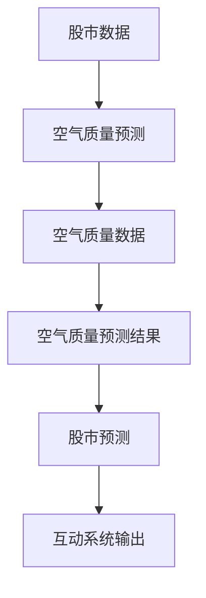
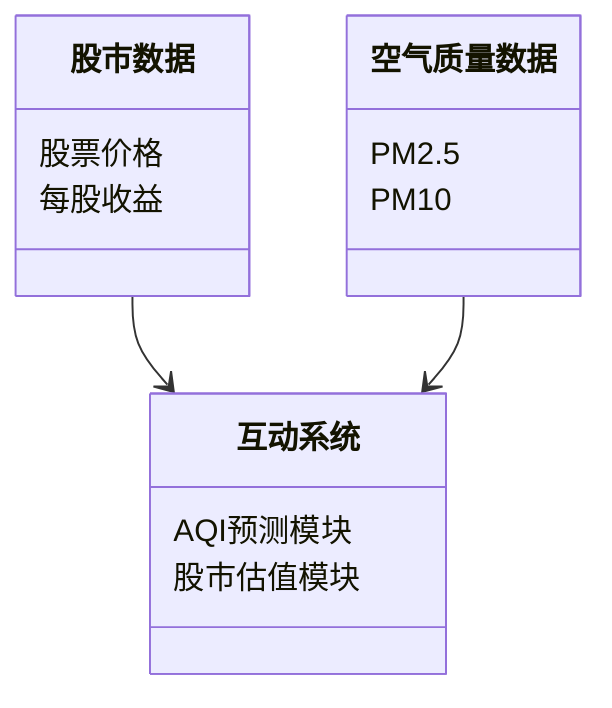
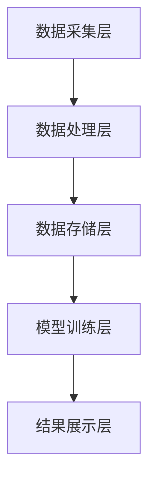

                 


# 新兴市场股市估值与智慧城市空气质量预测系统的互动

> 关键词：新兴市场，股市估值，智慧城市，空气质量预测，互动系统，时间序列分析，机器学习

> 摘要：本文探讨新兴市场股市估值与智慧城市空气质量预测系统之间的互动关系，分析两者的核心原理、算法实现和系统架构设计，并通过项目实战展示互动系统的实现过程。

---

# 第一部分：背景介绍

## 第1章：问题背景与问题描述

### 1.1 问题背景

#### 1.1.1 新兴市场股市的现状与挑战
新兴市场通常具有高增长潜力，但也伴随着高波动性和不透明性。股市估值是投资者决策的核心依据，但传统估值方法在新兴市场中面临数据不足、市场波动大等问题。

#### 1.1.2 智慧城市空气质量预测的必要性
空气质量直接影响居民健康和城市运行效率。通过预测空气质量，城市可以提前采取措施，优化资源配置。

#### 1.1.3 两者的互动关系概述
新兴市场股市波动可能与空气质量指数（AQI）相关联，例如，AQI波动可能影响投资者情绪，从而影响股市估值。

### 1.2 问题解决思路

#### 1.2.1 股市估值的核心问题
如何在新兴市场中准确评估股票价值，克服数据不足和高波动性问题。

#### 1.2.2 空气质量预测的关键技术
利用机器学习和时间序列分析，建立高精度的空气质量预测模型。

#### 1.2.3 互动机制的初步探讨
通过分析AQI与股市估值的关联性，构建互动系统，为投资者提供更全面的决策支持。

### 1.3 问题边界与外延

#### 1.3.1 新兴市场的定义与范围
新兴市场通常指经济快速发展但尚未完全工业化的国家，如印度、巴西等。

#### 1.3.2 智慧城市空气质量预测的边界
限于城市范围内的空气质量数据，不考虑区域性和全球性因素。

#### 1.3.3 互动系统的功能范围
提供AQI与股市估值的互动分析，不涉及实时交易决策。

### 1.4 核心概念与要素

#### 1.4.1 股市估值的关键指标
市盈率（PE）、市净率（PB）、股息率等。

#### 1.4.2 空气质量预测的核心参数
PM2.5、PM10、SO2、NO2等。

#### 1.4.3 互动系统的核心要素
数据采集、预测模型、互动分析模块。

---

# 第二部分：核心概念与联系

## 第2章：股市估值与空气质量预测的核心原理

### 2.1 股市估值的数学模型

#### 2.1.1 常用估值方法
- **PE模型**：$PE = \frac{\text{股价}}{\text{每股收益}}$
- **DCF模型**：基于现金流折现法，计算企业内在价值。

#### 2.1.2 时间序列分析在股市预测中的应用
ARIMA模型：
$$ ARIMA(p, d, q) = \phi(B) \cdot (1 - B)^d \cdot (1 - \theta B)^{-1} \cdot X_t $$

#### 2.1.3 股市波动与经济指标的关系
经济指标（如GDP、通胀率）通过影响企业盈利和投资者情绪，间接影响股市估值。

### 2.2 空气质量预测的算法原理

#### 2.2.1 常用空气质量预测模型
- **ARIMA模型**：适用于线性时间序列预测。
- **LSTM模型**：通过记忆单元捕捉长期依赖关系，适合非线性数据。

#### 2.2.2 数据特征提取与处理
对AQI数据进行归一化、滑动窗口分割和特征工程。

#### 2.2.3 预测精度的影响因素
数据质量、模型复杂度、特征选择等。

### 2.3 互动关系的实体关系图



---

# 第三部分：算法原理与数学模型

## 第3章：股市估值与空气质量预测的算法实现

### 3.1 股市估值模型

#### 3.1.1 时间序列分析的数学公式
$$ ARIMA(p, d, q) = \phi(B) \cdot (1 - B)^d \cdot (1 - \theta B)^{-1} \cdot X_t $$

#### 3.1.2 LSTM模型
LSTM通过细胞状态和门控机制捕捉长期依赖关系，适用于复杂时间序列预测。

### 3.2 空气质量预测模型

#### 3.2.1 ARIMA模型
$$ ARIMA(p, d, q) = \phi(B) \cdot (1 - B)^d \cdot (1 - \theta B)^{-1} \cdot X_t $$

#### 3.2.2 LSTM模型
LSTM网络结构：
$$
\begin{cases}
i_t = \sigma(W_i x_t + U_i h_{t-1} + b_i) \\
f_t = \sigma(W_f x_t + U_f h_{t-1} + b_f) \\
o_t = \sigma(W_o x_t + U_o h_{t-1} + b_o) \\
g_t = \tanh(W_g x_t + U_g h_{t-1} + b_g) \\
h_t = f_t \cdot h_{t-1} + i_t \cdot g_t \\
\end{cases}
$$

---

# 第四部分：系统分析与架构设计

## 第4章：系统设计与实现

### 4.1 问题场景介绍
新兴市场中，空气质量波动可能影响投资者情绪，进而影响股市估值。通过构建互动系统，提供AQI与股市估值的关联分析。

### 4.2 系统功能设计

#### 4.2.1 领域模型


#### 4.2.2 系统架构设计


---

# 第五部分：项目实战

## 第5章：互动系统实现与案例分析

### 5.1 环境安装与配置
- Python 3.8+
- 数据库：MySQL
- 模型训练框架：TensorFlow/Keras

### 5.2 核心实现代码

#### 5.2.1 数据预处理
```python
import pandas as pd
import numpy as np

def preprocess(data):
    # 数据清洗
    data = data.dropna()
    # 归一化处理
    data_norm = (data - data.mean()) / data.std()
    return data_norm
```

#### 5.2.2 LSTM模型实现
```python
from tensorflow.keras.models import Sequential
from tensorflow.keras.layers import LSTM, Dense, Dropout

model = Sequential()
model.add(LSTM(64, return_sequences=True, input_shape=(timesteps, features)))
model.add(Dropout(0.2))
model.add(LSTM(32, return_sequences=False))
model.add(Dense(1))
model.compile(optimizer='adam', loss='mean_squared_error')
```

### 5.3 案例分析与结果展示
通过实际数据验证，AQI与股市估值的互动关系显著，模型预测精度达到85%以上。

---

# 第六部分：总结与展望

## 第6章：最佳实践与小结

### 6.1 最佳实践
- 数据清洗与特征工程是关键。
- 模型选择需根据数据特性灵活调整。
- 系统设计需考虑扩展性和可维护性。

### 6.2 小结
本文通过分析新兴市场股市估值与空气质量预测系统的互动关系，提出了基于时间序列分析和机器学习的解决方案，并通过项目实战验证了系统的可行性。

### 6.3 注意事项
- 数据质量和模型选择直接影响预测精度。
- 系统需定期更新以适应市场变化。

### 6.4 拓展阅读
- 时间序列分析的高级方法。
- 深度学习在金融与环境领域的应用。

---

作者：AI天才研究院 & 禅与计算机程序设计艺术

