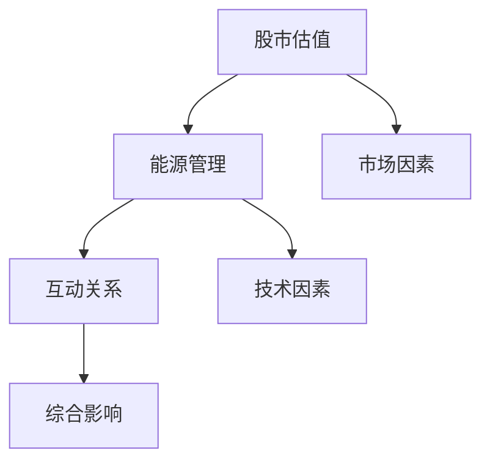
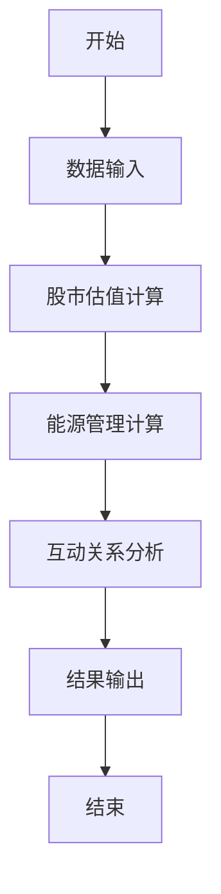
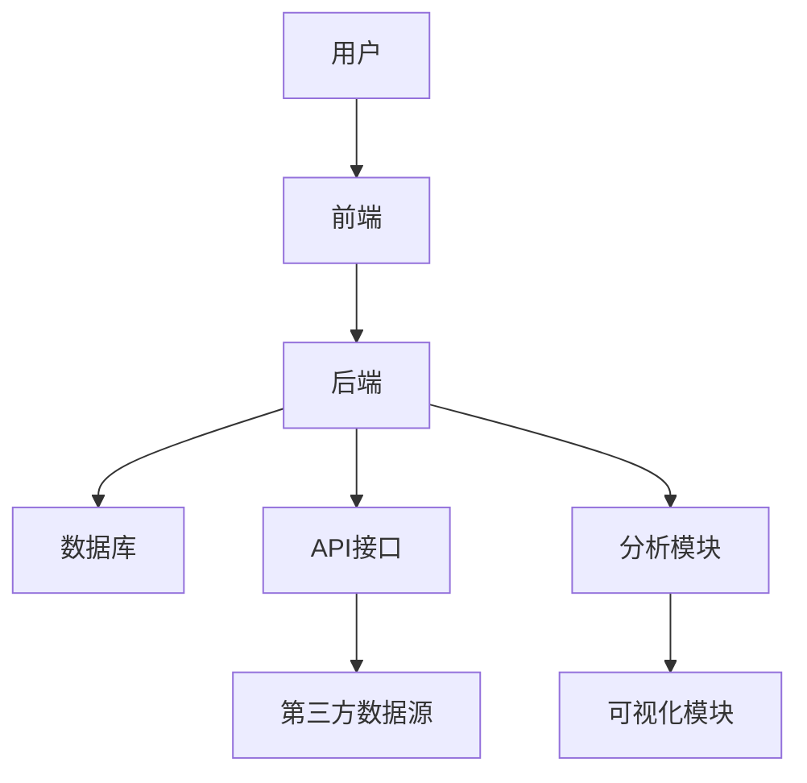
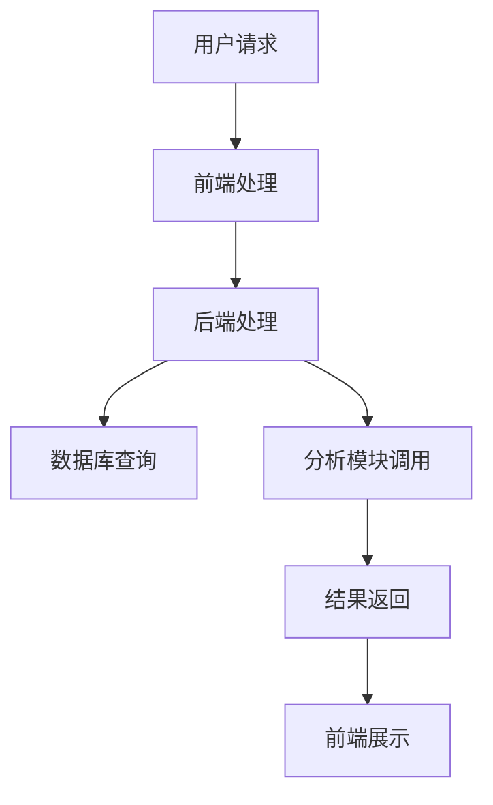

                 


# 《新兴市场股市估值与智慧城市能源管理的互动》

> 关键词：新兴市场，股市估值，智慧城市，能源管理，互动机制，数学建模，系统设计

> 摘要：本文探讨了新兴市场股市估值与智慧城市能源管理之间的互动关系，从理论分析到实际应用，结合数学建模与系统设计，全面解析两者如何相互影响并推动可持续发展。

---

# 第一部分: 背景介绍

## 第1章: 新兴市场股市估值与智慧城市能源管理的互动概述

### 1.1 问题背景
#### 1.1.1 新兴市场股市估值的现状与挑战
- 新兴市场的经济特点
- 股市估值的核心要素
- 股市波动性与市场参与者的互动

#### 1.1.2 智慧城市能源管理的发展趋势
- 智慧城市的概念与发展
- 能源管理的关键技术与应用场景
- 可再生能源与智能电网的发展

#### 1.1.3 两者互动关系的提出与研究意义
- 新兴市场股市与能源管理的关联性
- 研究互动机制的现实意义
- 对可持续发展的推动作用

### 1.2 问题描述
#### 1.2.1 股市估值的核心要素
- 市盈率、市净率、股息率等估值指标
- 市场情绪与宏观经济因素的影响

#### 1.2.2 智慧城市能源管理的关键指标
- 能源消耗量、碳排放量、可再生能源占比
- 智能电网与能源互联网的建设

#### 1.2.3 两者互动的具体表现形式
- 能源价格波动对股市的影响
- 股市资金流动对能源项目投资的影响

### 1.3 问题解决
#### 1.3.1 股市估值与能源管理互动的理论框架
- 系统动力学与复杂性分析
- 互动关系的系统模型构建

#### 1.3.2 互动关系的数学建模与分析
- 股市与能源系统的耦合模型
- 系统参数的敏感性分析

#### 1.3.3 互动机制的实际应用案例
- 新兴市场中的典型能源项目与股市波动案例
- 投资者行为对能源管理的影响分析

### 1.4 边界与外延
#### 1.4.1 新兴市场的定义与特征
- 经济规模、市场成熟度、政策环境
- 新兴市场与发达市场的对比

#### 1.4.2 智慧城市能源管理的边界条件
- 技术限制、政策约束、经济可行性
- 系统的可扩展性和灵活性

#### 1.4.3 互动关系的适用范围与限制
- 模型的适用性与局限性
- 数据的可获取性与准确性

### 1.5 概念结构与核心要素
#### 1.5.1 股市估值的核心要素分析
- 市场情绪、宏观经济指标、行业趋势
- 企业基本面与市场预期

#### 1.5.2 能源管理的关键要素分析
- 技术创新、政策支持、市场参与
- 能源消耗与碳排放

#### 1.5.3 互动关系的结构化模型
- 系统模型的层次化分解
- 核心要素的相互作用机制

---

## 第2章: 股市估值与能源管理的核心概念对比

### 2.1 核心概念原理
#### 2.1.1 股市估值的基本原理
- 股票定价的理论基础
- 市场参与者的行为模式

#### 2.1.2 智慧城市能源管理的基本原理
- 能源系统优化的理论基础
- 智能技术的应用原理

#### 2.1.3 两者互动的内在逻辑
- 经济因素与技术因素的相互作用
- 市场机制与政策机制的结合

### 2.2 概念属性特征对比
#### 2.2.1 股市估值的特征分析
- 数据驱动性、实时性、波动性
- 市场参与者的多样性

#### 2.2.2 能源管理的特征分析
- 技术依赖性、政策导向性、系统性
- 资源分配的公平性

#### 2.2.3 两者特征的对比与关联
- 数据与技术的结合
- 市场机制与政策机制的协同

### 2.3 ER实体关系图架构


---

## 第3章: 互动关系的数学建模

### 3.1 算法原理
#### 3.1.1 股市估值模型
- 市盈率模型：$P/E$ 指标分析
- 市净率模型：$P/B$ 指标分析

#### 3.1.2 能源管理模型
- 能耗预测模型：$E = a \times T + b \times P + c \times Q$
  - $E$：能源消耗量
  - $T$：时间因素
  - $P$：价格因素
  - $Q$：技术因素

#### 3.1.3 互动关系模型
- 股市与能源的相互作用模型：$V = \alpha \times E + \beta \times M + \gamma \times S$
  - $V$：股市估值
  - $E$：能源消耗量
  - $M$：宏观经济指标
  - $S$：市场情绪

### 3.2 算法流程图


### 3.3 数学模型与公式
#### 股市估值模型：
$$ P = \alpha \times EBITDA + \beta \times (P/E) $$
其中，$P$ 是股票价格，$EBITDA$ 是息税折旧及摊销前利润，$P/E$ 是市盈率，$\alpha$ 和 $\beta$ 是模型参数。

#### 能源管理模型：
$$ E = a \times D + b \times T + c \times I $$
其中，$E$ 是能源消耗量，$D$ 是设备数量，$T$ 是时间因素，$I$ 是技术改进因素。

---

## 第4章: 系统架构与实现

### 4.1 系统功能设计
#### 4.1.1 数据采集与处理
- 数据源：股市数据、能源数据
- 数据清洗与预处理

#### 4.1.2 互动机制分析
- 系统模型的构建与验证
- 参数调整与优化

#### 4.1.3 可视化与结果展示
- 数据可视化：折线图、柱状图、散点图
- 结果展示：仪表盘设计

### 4.2 系统架构设计


### 4.3 系统实现
#### 4.3.1 核心算法实现
- Python代码实现
```python
def stock_valuation(price, ebitda, pe_ratio):
    alpha = 0.5
    beta = 0.5
    return alpha * ebitda + beta * pe_ratio

def energy_management(consumption, time, tech):
    a = 0.4
    b = 0.3
    c = 0.3
    return a * consumption + b * time + c * tech
```

#### 4.3.2 系统接口设计
- RESTful API 接口定义
- 数据交互格式：JSON

#### 4.3.3 系统交互流程


---

## 第5章: 项目实战

### 5.1 数据采集与处理
- 数据来源：新兴市场股市数据、能源消耗数据
- 数据清洗与预处理代码

### 5.2 系统核心实现
- 核心算法实现
- 系统功能实现

### 5.3 案例分析
- 实际案例分析
- 结果解读与优化建议

---

## 第6章: 总结与展望

### 6.1 技术要点总结
- 核心算法与系统设计
- 数据分析与可视化

### 6.2 未来研究方向
- 更复杂互动机制的建模
- 更大规模的数据分析与优化

### 6.3 注意事项与建议
- 数据的准确性和及时性
- 模型的可扩展性和适应性
- 系统的安全性与稳定性

---

# 第二部分: 项目实战

## 第7章: 新兴市场股市估值与智慧城市能源管理的互动案例分析

### 7.1 项目介绍
- 项目背景
- 项目目标
- 项目范围

### 7.2 系统功能设计
- 功能模块划分
- 功能流程图

### 7.3 系统架构设计
- 系统架构图
- 关键模块设计

### 7.4 系统实现
- 核心代码实现
- 系统测试与优化

### 7.5 案例分析
- 典型案例分析
- 结果展示与解读

---

## 第8章: 总结与最佳实践

### 8.1 核心技术总结
- 股市估值与能源管理的互动机制
- 数学建模与系统设计的关键点

### 8.2 最佳实践 tips
- 数据采集与处理的建议
- 模型优化与系统设计的技巧
- 互动机制的实际应用建议

### 8.3 未来研究方向
- 更复杂的互动机制研究
- 更多应用场景的拓展
- 技术与政策的结合

---

# 第三部分: 总结与展望

## 第9章: 新兴市场股市估值与智慧城市能源管理的互动总结

### 9.1 核心内容回顾
- 股市估值与能源管理的互动关系
- 数学建模与系统设计的关键点

### 9.2 技术要点总结
- 数据分析与可视化
- 系统架构与实现
- 互动机制的建模与分析

### 9.3 未来研究方向
- 更复杂互动机制的探索
- 更多应用场景的拓展
- 技术与政策的结合

### 9.4 注意事项与建议
- 数据的准确性和及时性
- 模型的可扩展性和适应性
- 系统的安全性与稳定性

---

# 作者：AI天才研究院/AI Genius Institute & 禅与计算机程序设计艺术 /Zen And The Art of Computer Programming

---

感谢您的阅读！希望这篇文章能为您提供有价值的信息和启发！

