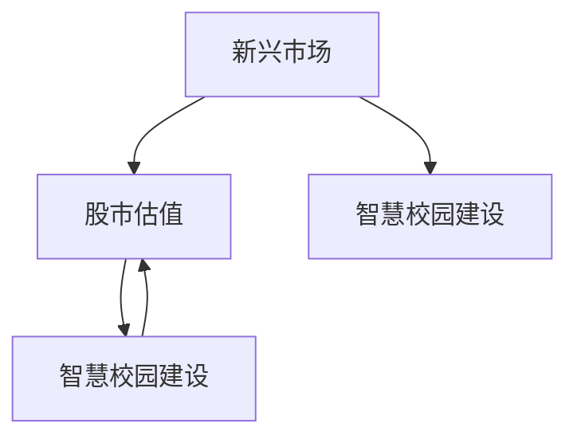
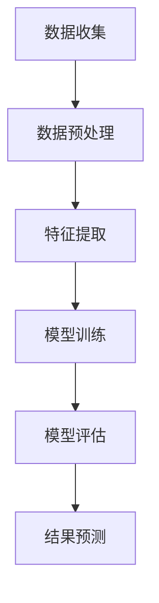
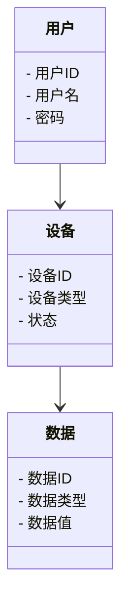
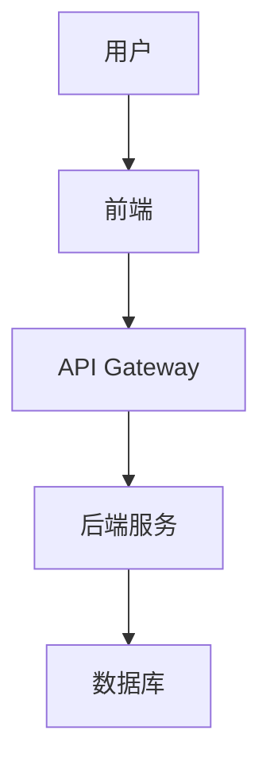

                 


# 新兴市场股市估值与智慧校园建设的互动

## 关键词：
- 新兴市场
- 股市估值
- 智慧校园
- 经济互动
- 技术驱动

## 摘要：
本文探讨了新兴市场股市估值与智慧校园建设之间的互动关系，从经济与技术的双重视角，分析了股市估值对智慧校园建设的推动作用，以及智慧校园建设对新兴市场股市的反向影响。通过详细的技术分析和实际案例，本文揭示了两者在经济全球化背景下的协同效应，为读者提供了一个全新的视角来理解这两个领域的互动关系。

---

# 新兴市场股市估值与智慧校园建设的互动

## 第1章 新兴市场股市估值与智慧校园建设的背景

### 1.1 新兴市场的定义与特点
- 新兴市场的定义：指那些经济快速增长、市场机制逐步完善的国家，如中国、印度、巴西等。
- 新兴市场的特点：经济波动性大、市场流动性强、政策支持多、技术进步快。

### 1.2 智慧校园建设的定义与目标
- 智慧校园的定义：通过物联网、大数据、人工智能等技术，实现校园管理、教学、科研的智能化。
- 智慧校园的核心目标：提高教育质量、优化资源配置、提升管理效率。

### 1.3 互动背景
- 经济全球化与新兴市场的崛起：新兴市场的经济增长为智慧校园建设提供了资金和技术支持。
- 智慧校园建设的政策支持：政府通过政策引导，推动智慧校园建设，进而影响股市估值。
- 互动的现实需求：智慧校园建设需要股市资金支持，而股市估值的变化又影响智慧校园建设的进度。

### 1.4 本章小结
本章从背景出发，介绍了新兴市场的特点、智慧校园的定义与目标，并分析了两者互动的背景和需求。

---

## 第2章 新兴市场股市估值与智慧校园建设的核心概念

### 2.1 股市估值的核心要素
- 市盈率（P/E）：股票价格与每股收益的比率，反映市场的盈利能力。
- 市净率（P/B）：股票价格与每股净资产的比率，反映市场的资产价值。
- 股息率：股票的股息与股票价格的比率，反映市场的分红能力。

### 2.2 智慧校园建设的关键技术
- 物联网技术：实现校园设备的智能化连接。
- 云计算与大数据分析：支持校园数据的存储、处理与决策。
- 人工智能与自动化：优化校园管理流程。

### 2.3 互动机制
- 经济因素对股市估值的影响：GDP增长率、通货膨胀率等经济指标影响股市估值。
- 技术进步对智慧校园建设的推动：技术创新降低智慧校园建设成本，提高效率。
- 互动中的协同效应：智慧校园建设推动新兴市场经济增长，进而提升股市估值。

### 2.4 核心概念对比分析
#### 核心概念对比表格
| 比较维度 | 股市估值 | 智慧校园建设 |
|----------|----------|--------------|
| 核心目标 | 评估市场价值 | 提升教育效率 |
| 技术支撑 | 金融模型、大数据分析 | 物联网、人工智能 |
| 影响因素 | 经济指标、政策 | 技术创新、政策 |

#### 实体关系图


### 2.5 本章小结
本章通过对比分析，揭示了新兴市场股市估值与智慧校园建设的核心概念及其互动关系。

---

## 第3章 新兴市场股市估值的算法与模型

### 3.1 时间序列分析
#### ARIMA模型
- ARIMA模型的原理：通过自回归和移动平均的方式预测未来趋势。
- 应用场景：预测新兴市场的股市指数走势。
- 示例代码：
  ```python
  from statsmodels.tsa.arima_model import ARIMA
  model = ARIMA(train_data, order=(1, 1, 1))
  model_fit = model.fit()
  forecast = model_fit.forecast(steps=5)[0]
  ```

#### GARCH模型
- GARCH模型的原理：用于估计金融时间序列的波动性。
- 应用场景：预测股市波动对智慧校园建设的影响。
- 示例代码：
  ```python
  from arch import arch_model
  model = arch_model(y_train, lags=1)
  model_fit = model.fit()
  forecast_var = model_fit.forecast(h=5, method='bootstrap')
  ```

### 3.2 机器学习在股市估值中的应用
#### 线性回归模型
- 原理：通过最小二乘法拟合直线，预测股市估值。
- 示例代码：
  ```python
  import numpy as np
  from sklearn.linear_model import LinearRegression
  X = np.array([x1, x2, x3]).T
  y = np.array([y1, y2, y3])
  model = LinearRegression()
  model.fit(X, y)
  ```

#### 支持向量机（SVM）
- 原理：通过构建超平面，将数据点分类。
- 应用场景：股市多空信号分类。
- 示例代码：
  ```python
  from sklearn import svm
  model = svm.SVC()
  model.fit(X, y)
  ```

#### 随机森林与梯度提升树
- 原理：通过集成学习提高模型鲁棒性。
- 应用场景：预测股市估值。
- 示例代码：
  ```python
  from sklearn.ensemble import RandomForestRegressor
  model = RandomForestRegressor(n_estimators=100)
  model.fit(X, y)
  ```

### 3.3 算法流程图


### 3.4 本章小结
本章通过时间序列分析和机器学习算法，详细讲解了股市估值的预测方法，并分析了这些方法在智慧校园建设中的应用。

---

## 第4章 智慧校园建设的系统分析与架构设计

### 4.1 问题场景介绍
- 智慧校园建设面临的技术挑战：数据孤岛、设备兼容性差、管理效率低。
- 经济挑战：资金不足、投资回报周期长。

### 4.2 系统功能设计
#### 领域模型类图


#### 系统架构图


### 4.3 系统接口设计
- 用户接口：登录、注册、查询数据。
- 设备接口：数据采集、设备控制。
- 管理接口：数据监控、系统设置。

### 4.4 本章小结
本章通过系统分析与架构设计，展示了智慧校园建设的技术实现方案。

---

## 第5章 项目实战：新兴市场股市估值与智慧校园建设的互动分析

### 5.1 环境安装
- 安装Python、Pandas、NumPy、Matplotlib、Scikit-learn等库。

### 5.2 核心代码实现
#### 股市估值预测代码
```python
import pandas as pd
import numpy as np
from sklearn.linear_model import LinearRegression
from sklearn.metrics import mean_squared_error

# 数据加载
data = pd.read_csv('stock_data.csv')

# 特征提取
X = data[['PE', 'PB', 'DIV']].values
y = data['Target'].values

# 模型训练
model = LinearRegression()
model.fit(X, y)

# 模型评估
y_pred = model.predict(X)
mse = mean_squared_error(y, y_pred)
print(f'MSE: {mse}')
```

#### 智慧校园建设模拟代码
```python
import networkx as nx
import matplotlib.pyplot as plt

# 网络图构建
graph = nx.DiGraph()
graph.add_nodes_from(['Market', 'Campus', 'Technology'])
graph.add_edges_from([('Market', 'Campus'), ('Technology', 'Market'), ('Campus', 'Technology')])

# 图形绘制
nx.draw(graph, node_size=1500, alpha=0.8)
plt.show()
```

### 5.3 案例分析
- 案例1：新兴市场股市波动对智慧校园建设的影响。
- 案例2：智慧校园建设对新兴市场股市的反向影响。

### 5.4 本章小结
本章通过项目实战，展示了如何将理论应用于实际，分析了股市估值与智慧校园建设的互动关系。

---

## 第6章 总结与建议

### 6.1 本章总结
- 本文从经济与技术双重视角，分析了新兴市场股市估值与智慧校园建设的互动关系。
- 提出了多种算法与模型，用于预测股市估值和优化智慧校园建设。

### 6.2 注意事项
- 数据质量对模型准确性的影响。
- 模型的可解释性与实际应用的结合。

### 6.3 拓展阅读
- 推荐阅读《金融时间序列分析》和《智慧校园建设指南》。

### 6.4 本章小结
本文通过详细分析与实际案例，为读者提供了新兴市场股市估值与智慧校园建设互动关系的全新视角。

---

## 作者：AI天才研究院/AI Genius Institute & 禅与计算机程序设计艺术 /Zen And The Art of Computer Programming

---

本文通过系统分析与实际案例，揭示了新兴市场股市估值与智慧校园建设的互动关系，为读者提供了全新的技术视角。

