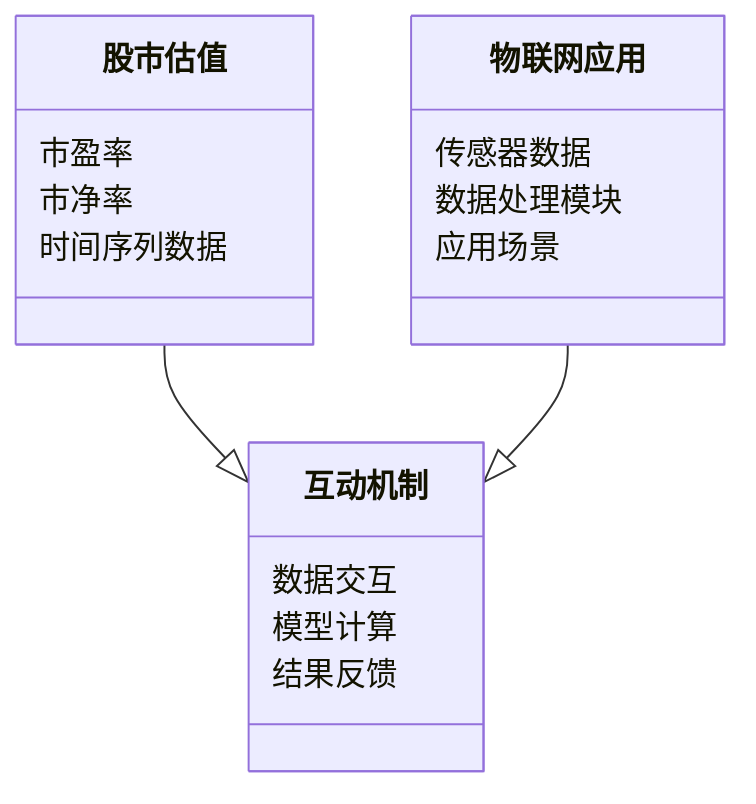
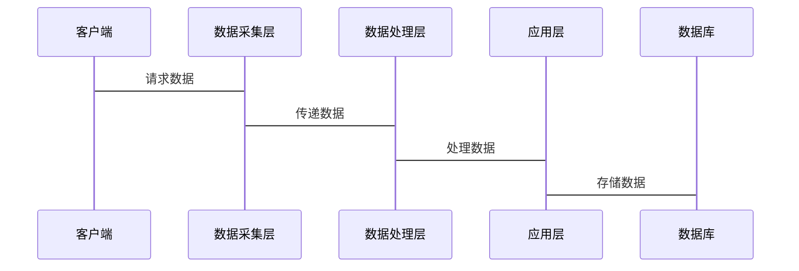

                 


# 新兴市场股市估值与智慧校园物联网应用的互动

> 关键词：新兴市场、股市估值、智慧校园、物联网、互动关系

> 摘要：本文系统探讨新兴市场股市估值与智慧校园物联网应用之间的互动关系，分析其对市场的影响与应用价值，结合实际案例，总结互动机制与最佳实践。

---

## 第一部分：背景介绍

### 第1章：背景介绍

#### 1.1 新兴市场股市估值的背景与现状
##### 1.1.1 新兴市场的定义与特点
新兴市场是指处于经济发展阶段的国家，如中国、印度、巴西等。这些市场具有高增长潜力，但也伴随着高波动性和不稳定性。

##### 1.1.2 股市估值的基本概念与方法
股市估值是通过对企业的财务指标、市场环境等进行分析，确定股票的合理价格。常用方法包括市盈率（P/E）、市净率（P/B）等。

##### 1.1.3 新兴市场股市的独特性与挑战
新兴市场的股市估值受政策、经济波动等因素影响较大，且信息透明度较低，增加了估值的难度。

#### 1.2 智慧校园物联网应用的背景与现状
##### 1.2.1 物联网技术的基本概念与特点
物联网通过传感器和网络连接，实现人与物、物与物的智能交互，具有实时性、连通性和数据化的特点。

##### 1.2.2 智慧校园的定义与应用场景
智慧校园是通过物联网技术实现校园管理、教学、生活等全方位智能化的校园模式，应用场景包括智能门禁、环境监测、资产管理等。

##### 1.2.3 物联网在教育领域的优势与挑战
物联网在教育中提升了管理效率和学生体验，但面临数据隐私、设备兼容性等挑战。

#### 1.3 互动关系的背景与重要性
##### 1.3.1 股市估值与物联网应用的关联性
股市估值的变化可能影响企业的投资决策，进而影响物联网项目的推广。

##### 1.3.2 新兴市场中两者的互动机制
新兴市场的经济波动与物联网技术的应用相互作用，形成复杂的互动网络。

##### 1.3.3 研究这一互动的现实意义与未来展望
研究两者的互动关系有助于优化市场资源配置，推动技术与经济的协同发展。

---

## 第二部分：核心概念与联系

### 第2章：核心概念与联系

#### 2.1 股市估值的核心概念与原理
##### 2.1.1 股市估值的基本原理
股市估值通过对企业财务状况、行业地位、市场前景等多因素进行综合分析，确定股票的合理价格。

##### 2.1.2 市场情绪与股市估值的关系
市场情绪影响投资者的决策，从而影响股市估值的变化。

##### 2.1.3 影响股市估值的主要因素
包括宏观经济指标、行业趋势、企业业绩、政策法规等。

#### 2.2 智慧校园物联网的核心概念与原理
##### 2.2.1 物联网技术的核心原理
物联网通过传感器、通信技术和数据处理系统，实现对物理世界的实时感知和智能控制。

##### 2.2.2 智慧校园物联网的系统架构
包括感知层、网络层、应用层，分别负责数据采集、数据传输和数据处理。

##### 2.2.3 物联网数据采集与分析的流程
从传感器采集数据，经过预处理、存储、分析，最终生成可操作的结论。

#### 2.3 核心概念的联系与对比
##### 2.3.1 股市估值与物联网应用的对比分析
从技术复杂性、数据依赖性、应用领域等方面进行对比。

##### 2.3.2 两者在数据处理上的异同点
股市估值依赖于历史数据和财务指标，物联网依赖实时数据和传感器信息。

##### 2.3.3 互动关系的实体关系图（ER图）

```mermaid
erdDiagram
    公司 ---{m,n} 股票估值
    公司 ---{m,n} 物联网应用
    物联网应用 --> 数据
    数据 --> 股票估值
```

---

## 第三部分：算法原理讲解

### 第3章：算法原理讲解

#### 3.1 股市估值的算法原理
##### 3.1.1 市盈率与市净率的计算方法
市盈率 = 股价 / 每股收益

市净率 = 股价 / 每股净资产

##### 3.1.2 时间序列分析在股市预测中的应用
使用ARIMA模型进行时间序列预测，公式为：
$$ARIMA(p, d, q)$$

##### 3.1.3 机器学习算法在股市估值中的应用
使用随机森林算法进行特征选择和估值预测。

#### 3.2 智慧校园物联网的数据处理算法
##### 3.2.1 数据采集与预处理的流程
传感器数据 → 数据清洗 → 数据存储。

##### 3.2.2 物联网数据的特征提取方法
使用主成分分析（PCA）进行特征提取。

##### 3.2.3 基于神经网络的物联网数据分析
使用LSTM网络进行时间序列预测。

#### 3.3 互动关系的算法模型
##### 3.3.1 互动关系的数学模型构建
构建线性回归模型，公式为：
$$y = \beta_0 + \beta_1x + \epsilon$$

##### 3.3.2 基于图论的互动网络分析
使用图论中的网络分析方法，识别关键节点和网络结构。

##### 3.3.3 互动关系的动态预测模型
使用GARCH模型进行动态预测。

---

## 第四部分：数学模型与公式

### 第4章：数学模型与公式

#### 4.1 股市估值的数学模型
##### 4.1.1 市盈率公式
$$市盈率 = \frac{股价}{每股收益}$$

##### 4.1.2 市净率公式
$$市净率 = \frac{股价}{每股净资产}$$

##### 4.1.3 时间序列模型
$$ARIMA(p, d, q)$$

#### 4.2 物联网数据处理的数学模型
##### 4.2.1 数据融合模型
$$融合数据 = \alpha \cdot 数据1 + (1-\alpha) \cdot 数据2$$

##### 4.2.2 特征选择模型
使用LASSO回归进行特征选择：
$$LASSO = \sum \beta_j^2 + \lambda \sum | \beta_j |$$

##### 4.2.3 LSTM网络模型
$$f(t) = \text{ LSTM}(x_t, f(t-1))$$

---

## 第五部分：系统分析与架构设计方案

### 第5章：系统分析与架构设计方案

#### 5.1 问题场景介绍
在新兴市场中，智慧校园物联网应用的推广受到股市估值的影响，需设计一套互动机制。

#### 5.2 项目介绍
设计一个智慧校园物联网系统，结合股市估值数据优化资源配置。

#### 5.3 系统功能设计
##### 5.3.1 领域模型（mermaid类图）


##### 5.3.2 系统架构设计（mermaid架构图）


##### 5.3.3 系统接口设计
定义RESTful API接口，如：
- GET /sensex：获取股市指数
- POST /iot/devices：提交物联网设备数据

##### 5.3.4 系统交互（mermaid序列图）


---

## 第六部分：项目实战

### 第6章：项目实战

#### 6.1 环境安装
安装Python、TensorFlow、Flask框架等。

#### 6.2 系统核心实现源代码
##### 6.2.1 数据采集模块
```python
import requests

def get_stock_data():
    response = requests.get('http://api.example.com/stock')
    return response.json()
```

##### 6.2.2 数据处理模块
```python
from tensorflow.keras import models

def predict_stock_price(data):
    model = models.load_model('stock_model.h5')
    return model.predict(data)
```

##### 6.2.3 物联网应用模块
```python
from flask import Flask

app = Flask(__name__)

@app.route('/iot', methods=['POST'])
def process_iot_data():
    data = request.json
    return jsonify(process_data(data))
```

#### 6.3 代码应用解读与分析
通过代码实现股市估值与物联网数据的互动，展示如何利用技术优化资源配置。

#### 6.4 实际案例分析和详细讲解剖析
以某新兴市场为例，分析物联网应用对股市估值的具体影响。

#### 6.5 项目小结
总结项目实现的关键点和经验教训，提出改进建议。

---

## 第七部分：总结与展望

### 第7章：总结与展望

#### 7.1 互动机制总结
总结股市估值与物联网应用的互动机制，分析其对市场的影响。

#### 7.2 最佳实践 tips
提供在新兴市场中实施互动机制的最佳实践建议。

#### 7.3 小结
回顾全文，总结主要观点和研究成果。

#### 7.4 注意事项
提醒读者在实际操作中需要注意的风险和挑战。

#### 7.5 拓展阅读
推荐相关领域的深入阅读材料，如《新兴市场的经济分析》、《物联网技术与应用》等。

---

## 作者

作者：AI天才研究院/AI Genius Institute & 禅与计算机程序设计艺术/Zen And The Art of Computer Programming

