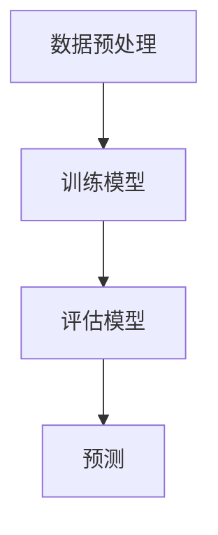
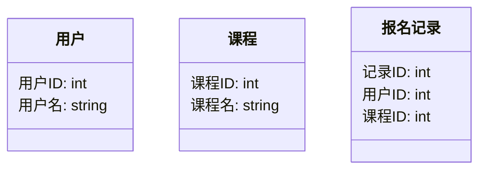
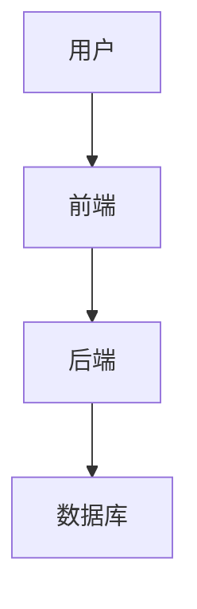
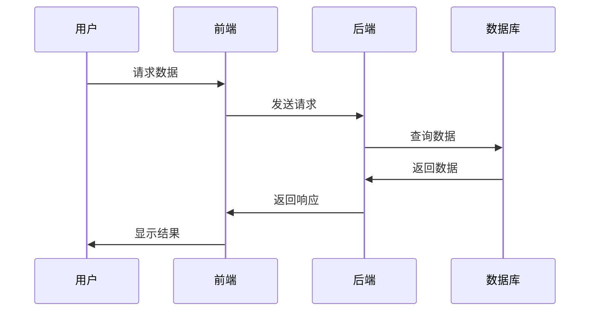

                 


# 新兴市场股市估值与智慧校园远程教育的互动

> 关键词：新兴市场，股市估值，智慧校园，远程教育，互动机制，机器学习，数据挖掘，系统架构

> 摘要：本文探讨新兴市场股市估值与智慧校园远程教育之间的互动关系，分析两者的核心概念、算法原理、系统架构及项目实战。通过详细的技术分析和实际案例，揭示两者在数据驱动下的互动机制，为投资者和教育技术提供参考。

---

## 第一部分: 背景介绍与核心概念

### 第1章: 新兴市场股市估值与智慧校园远程教育的互动背景

#### 1.1 背景介绍

##### 1.1.1 新兴市场股市估值的现状与挑战
新兴市场股市估值受经济波动、政策变化和国际环境影响较大。投资者需通过技术手段如机器学习模型预测股市走势，优化投资决策。  

##### 1.1.2 智慧校园远程教育的发展趋势
远程教育借助AI技术，实现个性化学习和精准教学，提升教育质量和效率。  

##### 1.1.3 两者互动的潜在价值与意义
通过分析股市数据与教育数据的关联，揭示两者互动如何为投资决策和教育优化提供支持。

#### 1.2 核心概念与问题描述

##### 1.2.1 股市估值的核心要素
- 市盈率（P/E）
- 市净率（P/B）
- 股息率

##### 1.2.2 智慧校园远程教育的关键特征
- 个性化学习路径
- 在线互动教学
- 数据驱动的教育决策

##### 1.2.3 互动关系的定义与边界
- 股市波动影响教育科技投资
- 教育需求影响股市资金流动

#### 1.3 问题解决与互动机制

##### 1.3.1 股市估值与远程教育互动的目标
通过数据挖掘和机器学习，探索两者之间的潜在关联，优化投资和教育决策。

##### 1.3.2 互动机制的构建与实现
- 数据收集与清洗
- 关联分析与建模
- 预测与反馈

##### 1.3.3 互动关系的外延与扩展
将互动机制应用于实际场景，如风险评估和教育资源配置。

### 第2章: 核心概念与联系

#### 2.1 核心概念原理

##### 2.1.1 股市估值的数学模型
使用线性回归模型预测股票价格：

$$ \text{预测价格} = \beta_0 + \beta_1 \times \text{历史平均价格} + \epsilon $$

##### 2.1.2 远程教育的系统架构
系统架构包括用户模块、课程模块、教师模块和管理模块。

##### 2.1.3 互动机制的逻辑框架
通过数据挖掘和机器学习，建立股市与教育的关联模型。

#### 2.2 核心概念属性对比

##### 2.2.1 股市估值与远程教育的特征对比
| 特征 | 股市估值 | 远程教育 |
|------|----------|-----------|
| 数据类型 | 数值型 | 文本+数值型 |
| 目标 | 预测价格 | 优化教学 |

#### 2.3 ER实体关系图

##### 2.3.1 股市估值实体关系图
```mermaid
er
    entity 股票 {
        key 股票代码 (string)
        属性 股票名称 (string)
        属性 最新价格 (float)
    }
    entity 交易数据 {
        key 交易日期 (date)
        关联 股票.股票代码
    }
```

##### 2.3.2 远程教育实体关系图
```mermaid
er
    entity 用户 {
        key 用户ID (int)
        属性 用户名称 (string)
    }
    entity 课程 {
        key 课程ID (int)
        属性 课程名称 (string)
    }
    entity 报名记录 {
        key 记录ID (int)
        关联 用户.用户ID
        关联 课程.课程ID
    }
```

---

## 第二部分: 算法原理与数学模型

### 第3章: 股市估值的算法原理

#### 3.1 股市预测的机器学习算法

##### 3.1.1 线性回归模型


##### 3.1.2 支持向量机模型
- 适用于小样本数据，通过核函数处理非线性关系。

##### 3.1.3 随机森林模型
- 集成学习，适用于高维数据。

#### 3.2 时间序列分析

##### 3.2.1 ARIMA模型
- 用于预测时间序列数据，通过自相关和偏自相关分析确定参数。

##### 3.2.2 LSTM网络
- 长短期记忆网络，适合处理序列数据。

---

### 第4章: 远程教育的数据挖掘算法

#### 4.1 用户行为分析

##### 4.1.1 聚类分析
使用K-means算法将用户分为不同群体。

##### 4.1.2 分类算法
使用决策树或随机森林预测用户行为。

##### 4.1.3 关联规则挖掘
发现用户购买课程的关联规则。

#### 4.2 学习效果预测

##### 4.2.1 线性回归模型
$$ \text{预测成绩} = \beta_0 + \beta_1 \times \text{学习时间} + \epsilon $$

##### 4.2.2 决策树模型
用于分类预测。

##### 4.2.3 神经网络模型
处理复杂的非线性关系。

---

### 第5章: 互动机制的算法实现

#### 5.1 股市与教育数据的关联分析

##### 5.1.1 协方差分析
$$ \text{协方差}(X,Y) = \frac{1}{n-1} \sum_{i=1}^{n} (X_i - \bar{X})(Y_i - \bar{Y}) $$

##### 5.1.2 贝叶斯网络
构建贝叶斯网络模型，分析变量之间的依赖关系。

##### 5.1.3 因子分析
提取影响股市和教育的主要因子。

#### 5.2 互动预测模型

##### 5.2.1 线性回归模型
预测股市波动对教育投资的影响。

##### 5.2.2 随机森林模型
集成学习，提高预测精度。

---

## 第三部分: 系统分析与架构设计

### 第6章: 系统分析与架构设计方案

#### 6.1 问题场景介绍
设计一个结合股市估值与远程教育的互动系统，提供数据驱动的决策支持。

#### 6.2 系统功能设计

##### 6.2.1 领域模型


#### 6.3 系统架构设计

##### 6.3.1 架构图


#### 6.4 系统接口设计
- 用户接口：注册、登录、课程报名。
- 数据接口：API提供数据查询服务。

#### 6.5 系统交互设计

##### 6.5.1 序列图


---

## 第四部分: 项目实战

### 第7章: 项目实战

#### 7.1 环境安装
安装Python、Pandas、Scikit-learn等库。

#### 7.2 系统核心实现源代码

##### 7.2.1 股市预测模型
```python
from sklearn.linear_model import LinearRegression
import pandas as pd

# 数据加载
data = pd.read_csv('stock.csv')
X = data[['历史平均价格']]
y = data['最新价格']

# 模型训练
model = LinearRegression()
model.fit(X, y)

# 预测
预测 = model.predict(X)
```

##### 7.2.2 学生表现分析
```python
from sklearn.tree import DecisionTreeClassifier
import pandas as pd

data = pd.read_csv('student.csv')
X = data[['学习时间', '互动次数']]
y = data['是否通过']

# 模型训练
model = DecisionTreeClassifier()
model.fit(X, y)

# 预测
预测 = model.predict(X)
```

#### 7.3 代码应用解读与分析
分析模型性能，调整参数优化结果。

#### 7.4 实际案例分析
以实际数据为例，展示模型的应用和结果。

#### 7.5 项目小结
总结项目成果，讨论优缺点，提出改进建议。

---

## 第五部分: 最佳实践与总结

### 第8章: 最佳实践

#### 8.1 最佳实践 tips
- 数据预处理是关键。
- 选择合适的算法提升性能。

#### 8.2 小结
系统介绍了股市估值与远程教育的互动机制，展示了技术应用的潜力。

#### 8.3 注意事项
- 数据隐私保护
- 模型泛化能力

#### 8.4 拓展阅读
推荐相关领域的书籍和论文。

---

## 作者：AI天才研究院 & 禅与计算机程序设计艺术

---

这篇文章详细探讨了新兴市场股市估值与智慧校园远程教育的互动关系，通过技术分析和实际案例，揭示了数据驱动的互动机制，为投资决策和教育优化提供了参考。

