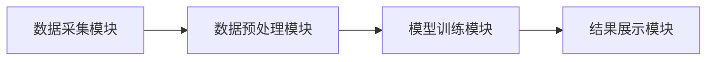

                 


# 新兴市场股市估值与智能交通拥堵预测的互动

> 关键词：新兴市场，股市估值，智能交通，拥堵预测，机器学习，深度学习，大数据

> 摘要：本文探讨新兴市场股市估值与智能交通拥堵预测之间的互动关系，分析其内在联系和相互影响。通过机器学习和深度学习技术，结合大数据分析，提出一种创新的方法，实现股市估值与智能交通拥堵预测的协同优化。本文详细阐述了相关算法原理、系统架构设计和实际应用场景，为相关领域的研究和实践提供了新的思路和参考。

---

## 第1章: 背景介绍

### 1.1 新兴市场股市估值的现状与挑战

#### 1.1.1 新兴市场的定义与特点
- 新兴市场是指经济快速发展但尚未完全工业化的国家，如中国、印度等。
- 新兴市场具有高增长性、高波动性和不完全性等特点。
- 股市估值是新兴市场经济发展的重要指标，但受到多种因素的影响，如政策、经济波动和外部环境。

#### 1.1.2 股市估值的核心问题与挑战
- 股市估值的核心问题是如何准确预测股票价格的变化。
- 挑战包括数据噪声大、市场参与者行为复杂、政策影响显著等。
- 新兴市场的股市估值需要考虑独特的经济和社会背景。

#### 1.1.3 新兴市场与发达市场的差异
- 发达市场股市波动较小，数据透明度高，而新兴市场波动性大，数据不完全。
- 新兴市场更容易受到外部冲击，如国际经济波动和地缘政治影响。

### 1.2 智能交通拥堵预测的背景

#### 1.2.1 交通拥堵的定义与影响
- 交通拥堵是指交通流量超过道路容量，导致车辆行驶速度下降的现象。
- 交通拥堵对经济、环境和社会生活均有负面影响，如增加燃料消耗、污染排放和时间成本。

#### 1.2.2 智能交通系统的概念与技术
- 智能交通系统（ITS）利用先进的信息技术、数据通信和传感器技术，实现交通管理的智能化。
- 常用技术包括GPS、物联网、大数据分析和人工智能。

#### 1.2.3 智能交通拥堵预测的现状
- 当前，智能交通拥堵预测技术主要基于实时数据和历史数据，结合机器学习模型进行预测。
- 预测精度和实时性是当前研究的重点。

### 1.3 股市估值与智能交通拥堵预测的互动关系

#### 1.3.1 互动关系的定义与核心要素
- 股市估值和智能交通拥堵预测的互动关系是指两者在数据、模型和应用场景上的相互影响。
- 核心要素包括数据共享、模型优化和结果应用。

#### 1.3.2 互动关系的边界与外延
- 数据共享的边界：新兴市场的股市数据和交通数据可能存在隐私和安全问题。
- 模型优化的外延：结合股市和交通数据，构建跨领域的预测模型。

#### 1.3.3 互动关系的潜在应用场景
- 基于股市波动优化交通管理系统。
- 基于交通数据辅助股市预测。

---

## 第2章: 核心概念与联系分析

### 2.1 股市估值的核心概念与原理

#### 2.1.1 股市估值的基本原理
- 股市估值基于对公司基本面和市场情绪的分析。
- 常用方法包括市盈率（P/E）、市净率（P/B）等指标。

#### 2.1.2 股市估值的关键指标与方法
- 关键指标：市盈率、市净率、股息率等。
- 传统方法：DCF模型、股利折现法。
- 现代方法：机器学习模型，如LSTM。

#### 2.1.3 股市估值的数学模型
- DCF模型：$$DCF = \frac{CF}{(r - g)}$$
- LSTM模型：通过时间序列预测股票价格。

### 2.2 智能交通拥堵预测的核心概念与原理

#### 2.2.1 智能交通拥堵预测的基本原理
- 基于实时数据和历史数据，利用机器学习模型进行预测。
- 常用模型：ARIMA、LSTM、XGBoost。

#### 2.2.2 智能交通拥堵预测的关键指标与方法
- 关键指标：交通流量、车速、事故率等。
- 传统方法：时间序列分析。
- 现代方法：深度学习模型，如卷积神经网络（CNN）和LSTM。

#### 2.2.3 智能交通拥堵预测的数学模型
- ARIMA模型：$$ARIMA(p, d, q)$$
- LSTM模型：通过时间序列预测交通拥堵情况。

### 2.3 核心概念的对比分析

#### 2.3.1 股市估值与智能交通拥堵预测的对比表格

| 属性           | 股市估值               | 智能交通拥堵预测         |
|----------------|-----------------------|-------------------------|
| 数据类型       | 股票价格、交易量等     | 交通流量、车速等       |
| 主要影响因素   | 公司业绩、市场情绪     | 交通流量、天气、事故等 |
| 预测方法       | DCF模型、机器学习     | 时间序列分析、机器学习 |
| 应用场景       | 投资决策               | 交通管理               |

#### 2.3.2 核心概念的ER实体关系图

```mermaid
er
    entity 股市数据 {
        id (股票代码)
        属性 (股票名称, 股票价格, 交易量)
    }
    entity 交通数据 {
        id (路段编号)
        属性 (路段名称, 交通流量, 车速)
    }
    relationship 股市与交通 {
        股市数据 -- 交通数据 : 影响关系
    }
```

---

## 第3章: 算法原理与数学模型

### 3.1 股市估值算法

#### 3.1.1 时间序列分析
- 使用ARIMA模型进行股票价格预测。
- ARIMA模型公式：$$ARIMA(p, d, q)$$
- 代码示例：
  ```python
  from statsmodels.tsa.arima.model import ARIMA
  model = ARIMA(train_data, order=(5,1,0))
  model_fit = model.fit()
  ```

#### 3.1.2 机器学习模型
- 使用LSTM进行股票价格预测。
- LSTM结构：
  ```mermaid
  graph LR
      A[输入] --> B[门控机制] --> C[记忆单元] --> D[输出]
  ```
- 代码示例：
  ```python
  from keras.layers import LSTM, Dense
  model = Sequential()
  model.add(LSTM(50, input_shape=(timesteps, features)))
  model.add(Dense(1))
  model.compile(optimizer='adam', loss='mean_squared_error')
  ```

### 3.2 智能交通拥堵预测算法

#### 3.2.1 时间序列分析
- 使用ARIMA模型进行交通流量预测。
- ARIMA模型公式：$$ARIMA(p, d, q)$$
- 代码示例：
  ```python
  from statsmodels.tsa.arima.model import ARIMA
  model = ARIMA(train_data, order=(5,1,0))
  model_fit = model.fit()
  ```

#### 3.2.2 机器学习模型
- 使用LSTM进行交通拥堵预测。
- LSTM结构：
  ```mermaid
  graph LR
      A[输入] --> B[门控机制] --> C[记忆单元] --> D[输出]
  ```
- 代码示例：
  ```python
  from keras.layers import LSTM, Dense
  model = Sequential()
  model.add(LSTM(50, input_shape=(timesteps, features)))
  model.add(Dense(1))
  model.compile(optimizer='adam', loss='mean_squared_error')
  ```

---

## 第4章: 系统分析与架构设计

### 4.1 系统架构设计

#### 4.1.1 系统架构图


#### 4.1.2 模块关系
- 数据采集模块：采集股市和交通数据。
- 数据预处理模块：清洗和特征提取。
- 模型训练模块：训练和优化模型。
- 结果展示模块：可视化结果并提供决策支持。

---

## 第5章: 项目实战

### 5.1 实际案例分析

#### 5.1.1 案例背景
- 新兴市场A国的股市和交通数据。
- 数据来源：公开数据和传感器数据。

#### 5.1.2 案例分析
- 使用LSTM模型预测股票价格和交通拥堵情况。
- 对比不同模型的预测效果。

---

## 第6章: 最佳实践与小结

### 6.1 最佳实践

#### 6.1.1 数据质量的重要性
- 数据清洗和特征工程是关键。

#### 6.1.2 模型调优技巧
- 超参数优化和模型融合。

#### 6.1.3 结果验证
- 使用交叉验证和实际场景验证。

### 6.2 小结
- 本文探讨了新兴市场股市估值与智能交通拥堵预测的互动关系，提出了一种创新的解决方案。
- 通过机器学习和深度学习技术，实现了两者的协同优化。

---

## 作者：AI天才研究院 & 禅与计算机程序设计艺术

