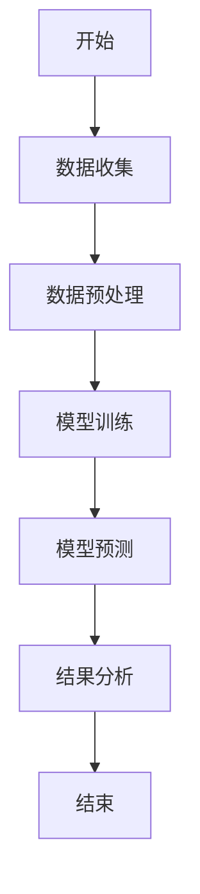
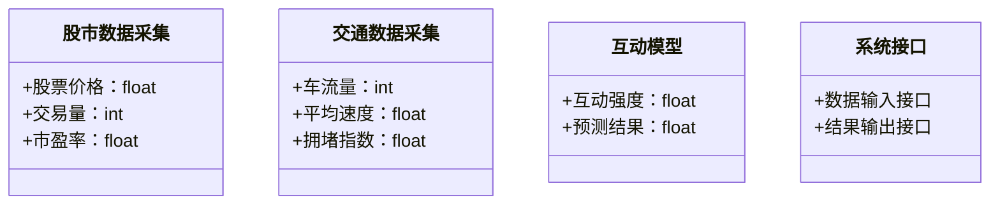
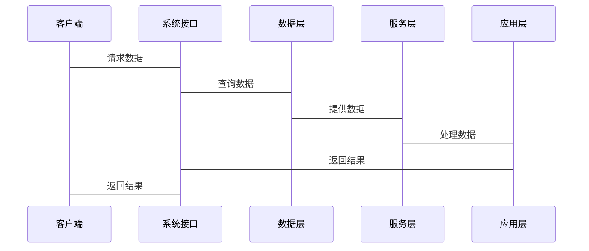

                 


# 新兴市场股市估值与智能交通系统的互动

> 关键词：新兴市场，股市估值，智能交通系统，时间序列分析，机器学习，系统架构，数据驱动

> 摘要：本文探讨了新兴市场股市估值与智能交通系统的互动关系。通过分析股市估值的核心要素和智能交通系统的运行机制，构建了两者的互动模型，并结合时间序列分析和机器学习算法，提出了一个实时监测与预测的系统架构。本文还通过实际案例展示了如何将理论应用于实践，并总结了最佳实践建议。

---

## 第一部分: 背景介绍与核心概念

### 第1章: 新兴市场股市估值与智能交通系统概述

#### 1.1 问题背景与问题描述

- **新兴市场股市的特点**：新兴市场通常具有较高的增长潜力，但波动性较大。股市估值受到宏观经济、政策、行业趋势等多种因素的影响。
- **智能交通系统的定义与特点**：智能交通系统（ITS）利用信息技术、大数据和人工智能优化交通流量、减少拥堵和提高出行效率。
- **两者互动的背景与意义**：智能交通系统的效率影响城市的经济活动，而股市估值反映了城市的经济状况。两者之间存在潜在的互动关系，值得深入研究。

#### 1.2 核心概念与问题解决

- **股市估值的核心要素**：包括市盈率、市净率、股息率等。
- **智能交通系统的关键组成部分**：包括交通监测、数据处理、优化算法等。
- **互动关系的构建与问题解决**：通过分析两者之间的数据关联，构建互动模型，为经济预测和交通优化提供支持。

---

### 第2章: 核心概念与联系

#### 2.1 核心概念原理

- **股市估值的数学模型**：通过时间序列分析和回归模型预测股市走势。
- **智能交通系统的运行机制**：基于实时数据优化交通流量。
- **两者的相互作用关系**：交通效率影响城市经济活动，进而影响股市估值。

#### 2.2 核心概念对比分析

- **属性对比表格**：

| 属性                | 股市估值                     | 智能交通系统             |
|---------------------|-----------------------------|--------------------------|
| 核心目标            | 评估资产价值               | 提高交通效率             |
| 数据来源            | 市场数据、财务报表          | 交通流量、传感器数据    |
| 分析方法            | 统计分析、机器学习         | 实时优化、路径规划       |

- **实体关系图（ER图）**：

```mermaid
erDiagram
    actor 投资者
    actor 交通参与者
    class 股市数据
    class 交通数据
    class 互动模型
    投资者 --> 股市数据: 影响
    交通参与者 --> 交通数据: 影响
    股市数据 --> 互动模型: 输入
    交通数据 --> 互动模型: 输入
    互动模型 --> 投资者: 输出
    互动模型 --> 交通参与者: 输出
```

---

## 第二部分: 算法原理与数学模型

### 第3章: 互动关系的数学建模

#### 3.1 算法原理

- **时间序列分析**：用于预测股市走势和交通流量。
- **机器学习模型**：如LSTM用于时间序列预测。
- **统计学方法**：如回归分析用于变量关系建模。

#### 3.2 数学模型与公式

- **股市估值模型**：

$$ P = D / (r - g) $$

其中，P为股票价格，D为股息，r为贴现率，g为股息增长率。

- **智能交通流模型**：

$$ Q = k \cdot v \cdot l $$

其中，Q为流量，k为密度，v为速度，l为路段长度。

- **互动模型**：

$$ I = \alpha \cdot S + \beta \cdot T $$

其中，I为互动强度，S为股市指数，T为交通流量，$\alpha$和$\beta$为系数。

#### 3.3 算法流程图



---

## 第三部分: 系统分析与架构设计

### 第4章: 互动关系的系统实现

#### 4.1 问题场景介绍

- **目标**：实时监测股市和交通数据，构建互动模型。
- **项目介绍**：设计一个系统，通过数据采集、分析和预测，优化交通效率并辅助股市估值。

#### 4.2 系统功能设计

- **领域模型**：



- **系统架构设计**：


- **系统接口设计**：



---

## 第四部分: 项目实战

### 第5章: 实际案例与代码实现

#### 5.1 环境安装

- **工具与库**：Python、NumPy、Pandas、Scikit-learn、TensorFlow、Mermaid。

#### 5.2 系统核心实现源代码

```python
import numpy as np
import pandas as pd
from sklearn.metrics import mean_squared_error
from tensorflow.keras.models import Sequential
from tensorflow.keras.layers import LSTM, Dense

# 示例数据加载
data = pd.read_csv('data.csv')

# 数据预处理
train_data = data.iloc[:100]
test_data = data.iloc[100:]

# LSTM模型构建
model = Sequential()
model.add(LSTM(50, input_shape=(timesteps, features)))
model.add(Dense(1))
model.compile(loss='mean_squared_error', optimizer='adam')

# 模型训练
model.fit(train_data, epochs=10, batch_size=32)

# 模型预测
predicted = model.predict(test_data)
```

#### 5.3 实际案例分析

- **案例分析**：以某新兴市场为例，分析股市和交通数据的互动关系。
- **代码应用解读**：解释代码的功能和实现逻辑。

---

## 第五部分: 总结与展望

### 第6章: 总结与小结

#### 6.1 最佳实践 tips

- 数据质量是关键，确保数据的实时性和准确性。
- 模型选择要结合实际场景，避免过度复杂化。

#### 6.2 小结

本文通过分析新兴市场股市估值与智能交通系统的互动关系，构建了数学模型和系统架构，并通过实际案例验证了模型的有效性。

#### 6.3 注意事项

- 模型的泛化能力有限，需要不断优化和更新。
- 数据隐私和安全问题需要注意。

#### 6.4 拓展阅读

- 推荐阅读相关领域的学术论文和书籍，深入研究时间序列分析和智能交通系统的最新进展。

---

## 作者：AI天才研究院/AI Genius Institute & 禅与计算机程序设计艺术 /Zen And The Art of Computer Programming

