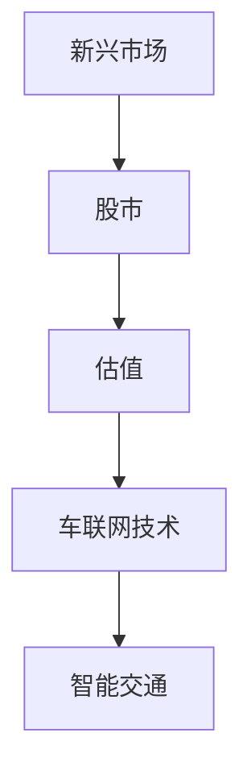
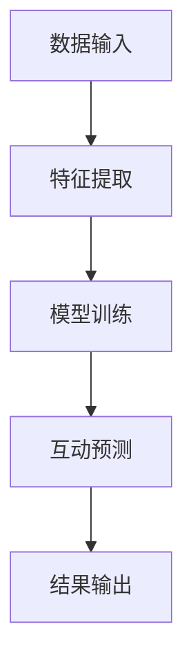
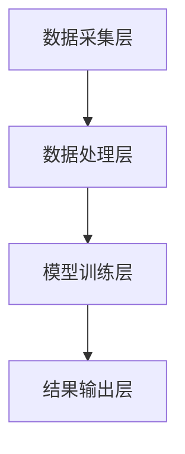

                 


# 新兴市场股市估值与智能交通车联网技术的互动

## 关键词：
- 新兴市场、股市估值、车联网技术、智能交通、互动关系

## 摘要：
本文探讨新兴市场股市估值与智能交通中的车联网技术之间的互动关系。通过分析两者的核心概念、技术原理和实际应用，揭示数据共享、技术融合和资金流动对股市估值和车联网技术的双向影响，提出互动机制的数学模型和系统架构设计方案，并通过实际案例展示互动关系的实现。

---

## 第一部分: 新兴市场股市估值与智能交通车联网技术的背景与核心概念

### 第1章: 新兴市场与智能交通的概述

#### 1.1 新兴市场的定义与特点
- **新兴市场的经济特征**：新兴市场是指经济快速发展、产业结构多元化但尚未完全成熟的国家或地区，如中国、印度、东南亚国家等。这些市场的特点是GDP增长快、消费潜力大，但同时也面临经济波动性大、政策不确定性高等挑战。
- **新兴市场的股市特点**：新兴市场的股市通常具有高波动性、高成长性和较高的风险。与成熟市场相比，新兴市场的股市更容易受到政策、地缘政治和经济周期的影响。
- **新兴市场与传统市场的对比**：传统市场如美国、欧洲等，市场成熟、监管完善，而新兴市场则更具成长性和不确定性。两者的互动关系主要体现在资本流动和技术创新上。

#### 1.2 智能交通与车联网技术的定义
- **智能交通系统的概念**：智能交通系统（ITS）是指通过先进的信息技术、数据通信技术、电子自动控制技术，对交通系统进行感知、分析和优化，以提高交通效率、减少拥堵和事故发生。
- **车联网技术的定义与特点**：车联网（V2X）是指车辆与外部网络（包括车与车、车与路、车与云端等）进行信息交互的技术，其特点是实时性强、数据量大、安全性要求高。
- **车联网与智能交通的关联**：车联网是智能交通系统的核心组成部分，通过车辆与外部网络的实时通信，实现交通流量监控、自动驾驶、智能导航等功能。

---

### 第2章: 股市估值与车联网技术的核心概念

#### 2.1 股市估值的基本原理
- **股市估值的定义**：股市估值是指对上市公司股票价值的评估，通常基于财务指标（如市盈率、市净率）和市场情绪等因素。
- **股市估值的主要方法**：包括相对估值法（如市盈率、市净率）和绝对估值法（如现金流折现法）。
- **股市估值的影响因素**：包括宏观经济环境、行业景气度、公司基本面、政策法规、市场情绪等。

#### 2.2 车联网技术的核心要素
- **车联网的通信技术**：车联网依赖于5G、Wi-Fi、蓝牙等多种通信技术，实现车辆与外部网络的实时数据传输。
- **车联网的数据采集与处理**：通过传感器、摄像头等设备采集车辆和交通环境数据，并通过大数据技术进行分析和处理。
- **车联网的安全性问题**：车联网涉及大量敏感数据，数据泄露和网络攻击是主要的安全威胁。

---

## 第二部分: 股市估值与车联网技术的互动关系

### 第3章: 新兴市场股市估值与车联网技术的互动机制

#### 3.1 数据共享与技术融合
- **数据共享的定义**：数据共享是指车联网技术产生的交通数据（如车流量、道路状况）与股市估值相关数据的共享，以实现更精准的估值模型。
- **技术融合的定义**：技术融合是指车联网技术与金融数据分析技术的结合，例如通过车联网数据优化股市估值模型。

#### 3.2 股市资金流动对车联网技术的影响
- **资金流动对技术发展的推动**：股市资金的流入可以为车联网技术的研发和推广提供资金支持。
- **资金流动对市场信心的影响**：股市估值的变化反映了市场对车联网技术的接受度和信心。

#### 3.3 车联网技术对股市估值的反向影响
- **车联网技术对交通效率的提升**：车联网技术可以减少交通拥堵，降低物流成本，从而对相关企业的财务表现产生积极影响，进而影响股市估值。
- **车联网技术对市场预期的影响**：车联网技术的成熟和推广可以改变市场对相关企业的预期，从而影响股市估值。

---

### 第4章: 股市估值与车联网技术的核心概念对比

#### 4.1 核心概念的属性特征对比
| 特性                | 股市估值                | 车联网技术            |
|---------------------|-------------------------|-----------------------|
| 核心目标            | 评估企业价值            | 提高交通效率            |
| 主要技术            | 财务分析、大数据分析    | 通信技术、数据处理技术 |
| 影响因素            | 宏观经济、政策、市场情绪 | 通信技术、数据安全     |

#### 4.2 实体关系图


---

## 第三部分: 股市估值与车联网技术的互动算法原理

### 第5章: 股市估值与车联网技术的互动算法

#### 5.1 互动关系的数学模型
- **数据流分析**：车联网技术产生的交通数据（如车流量、道路状况）可以作为股市估值的补充数据，用于预测相关企业的财务表现。
- **概率模型**：通过贝叶斯网络，可以将车联网数据与股市数据结合，建立概率模型，预测股市估值的变化。
- **贝叶斯网络**：贝叶斯网络是一种用于表示变量之间概率关系的图形模型，可以用于分析车联网数据对股市估值的影响。

#### 5.2 算法流程图


#### 5.3 Python代码实现
```python
import numpy as np
import pandas as pd
from sklearn.naive_bayes import GaussianNB

# 示例数据：车联网数据与股市数据结合
data = pd.DataFrame({
    '车流量': [100, 200, 150, 250, 300],
    '交通延误率': [10, 5, 8, 3, 2],
    '股票价格': [100, 110, 95, 120, 115]
})

# 特征提取
X = data[['车流量', '交通延误率']]
y = data['股票价格']

# 贝叶斯模型训练
model = GaussianNB()
model.fit(X, y)

# 预测新数据点的股票价格
new_data = np.array([[150, 7]])
predicted_price = model.predict(new_data)
print("预测股票价格:", predicted_price)
```

---

## 第四部分: 系统分析与架构设计

### 第6章: 系统分析与架构设计

#### 6.1 问题场景介绍
- **问题场景**：新兴市场中，车联网技术的应用可以提升交通效率，从而影响相关企业的财务表现和股市估值。如何通过车联网数据优化股市估值模型是本文的核心问题。

#### 6.2 系统功能设计
- **领域模型**：通过类图展示系统中的核心类及其关系。
- **系统架构图**：展示系统的整体架构，包括数据采集层、数据处理层、模型训练层和结果输出层。

#### 6.3 系统架构图


---

## 第五部分: 项目实战

### 第7章: 项目实战

#### 7.1 环境安装
- **工具安装**：安装Python、Pandas、Scikit-learn等工具。
- **数据获取**：获取车联网数据和相关股市数据。

#### 7.2 核心代码实现
```python
import pandas as pd
from sklearn.model_selection import train_test_split
from sklearn.metrics import accuracy_score

# 数据预处理
data = pd.read_csv('车联网与股市数据.csv')
X = data.drop('股票价格', axis=1)
y = data['股票价格']

# 划分训练集和测试集
X_train, X_test, y_train, y_test = train_test_split(X, y, test_size=0.2)

# 训练模型
from sklearn.tree import DecisionTreeClassifier
model = DecisionTreeClassifier()
model.fit(X_train, y_train)

# 预测与评估
y_pred = model.predict(X_test)
print("准确率:", accuracy_score(y_test, y_pred))
```

---

## 第六部分: 总结

### 第8章: 总结

#### 8.1 最佳实践 tips
- 在新兴市场中，车联网技术和股市估值的互动关系可以通过大数据和人工智能技术进行优化。
- 数据安全是车联网技术应用中的重要问题，需要加强数据保护措施。

#### 8.2 小结
本文通过分析新兴市场股市估值与车联网技术的互动关系，提出了互动机制的数学模型和系统架构设计方案，并通过实际案例展示了互动关系的实现。

#### 8.3 注意事项
- 数据隐私和安全问题需要高度重视。
- 模型的准确性和实时性需要进一步优化。

#### 8.4 拓展阅读
- 大数据分析在金融领域的应用。
- 车联网技术在智能交通中的其他应用。

---

**作者：AI天才研究院/AI Genius Institute & 禅与计算机程序设计艺术 /Zen And The Art of Computer Programming**

