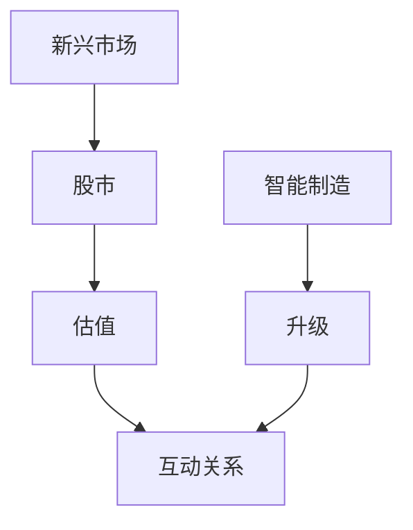
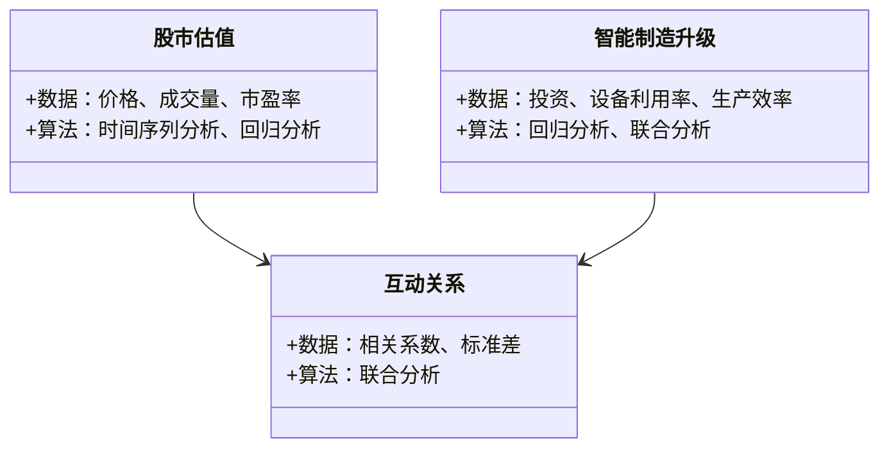
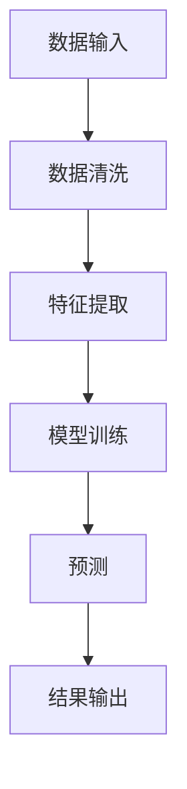
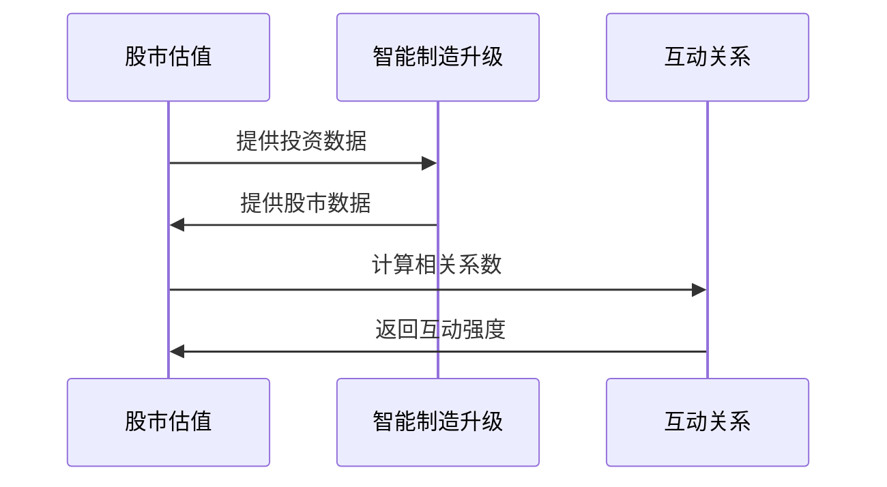

                 


# 新兴市场股市估值与智能制造升级的互动

> 关键词：新兴市场，股市估值，智能制造，互动关系，技术升级，经济影响

> 摘要：本文深入探讨了新兴市场股市估值与智能制造升级之间的互动关系。通过分析股市估值的核心原理、智能制造升级的关键技术，以及两者之间的互动机制，本文揭示了在数字化转型背景下，新兴市场如何通过智能制造升级优化股市估值，进而推动经济高质量发展。同时，本文结合实际案例，提出了优化互动关系的具体策略和方法。

---

## 第1章: 背景介绍

### 1.1 问题背景

#### 1.1.1 新兴市场的定义与特点
新兴市场是指处于快速发展阶段的经济体，通常具有以下特点：
- 经济增速快，但基础相对薄弱；
- 产业结构正在优化，制造业占比高；
- 对外开放程度逐步提升，吸引外资能力增强。

#### 1.1.2 智能制造升级的必要性
智能制造是推动制造业向高端化、智能化、绿色化发展的关键，其必要性体现在：
- 提高生产效率，降低成本；
- 通过数字化技术实现产业链协同；
- 推动传统制造业转型升级。

#### 1.1.3 股市估值与实体经济的互动关系
股市估值是市场对上市公司未来盈利能力的预期，与实体经济的发展密不可分。两者之间的互动关系主要体现在：
- 实体经济的高质量发展会提升股市估值；
- 股市资金支持实体经济，推动技术创新和产业升级。

---

### 1.2 问题描述

#### 1.2.1 新兴市场股市估值的现状
新兴市场股市估值波动较大，主要受以下因素影响：
- 经济基本面；
- 政策环境；
- 国际资本流动。

#### 1.2.2 智能制造升级的挑战与机遇
智能制造升级面临技术、资金和人才等多重挑战，同时也带来了产业结构优化和竞争力提升的机遇。

#### 1.2.3 两者互动的核心问题
核心问题在于如何通过智能制造升级优化股市估值，进而推动经济高质量发展。

---

### 1.3 问题解决

#### 1.3.1 新兴市场股市估值的提升路径
- 提高上市公司质量；
- 优化市场环境；
- 引入长期资金。

#### 1.3.2 智能制造升级的实现方法
- 技术创新；
- 数字化转型；
- 产业链协同。

#### 1.3.3 互动关系的优化策略
- 加强政策支持；
- 提高市场透明度；
- 推动产融结合。

---

### 1.4 边界与外延

#### 1.4.1 新兴市场的边界条件
- 经济规模：中等收入国家为主；
- 产业结构：以制造业为主；
- 政策环境：市场化改革逐步深化。

#### 1.4.2 智能制造升级的适用范围
- 制造业为主导产业的经济体；
- 具备一定技术基础的新兴市场；
- 政策支持较强的地区。

#### 1.4.3 互动关系的外延影响
- 对区域经济的带动作用；
- 对全球产业链的重构影响；
- 对国际资本流动的引导作用。

---

### 1.5 概念结构与核心要素

#### 1.5.1 核心概念的组成
- 股市估值：上市公司价值的市场定价；
- 智能制造：制造业的数字化、智能化转型。

#### 1.5.2 概念之间的关系
- 智能制造升级会提升企业盈利能力，从而提高股市估值；
- 股市估值的变化会影响资本流向，进而影响智能制造项目的投资。

#### 1.5.3 核心要素的对比分析
| 要素 | 股市估值 | 智能制造升级 |
|------|----------|--------------|
| 核心驱动 | 利润预期 | 技术创新 |
| 主要影响 | 资本流动 | 产业结构 |
| 关键指标 | 市盈率、市净率 | 数字化率、设备利用率 |

---

## 第2章: 核心概念与联系

### 2.1 核心概念原理

#### 2.1.1 股市估值的原理
股市估值是市场对上市公司未来盈利能力的预期，主要通过以下方式计算：
$$ P = \frac{E}{E\_V} $$
其中，$P$为股价，$E$为净利润，$E\_V$为市盈率。

#### 2.1.2 智能制造升级的原理
智能制造通过数字化技术优化生产流程，提高效率，降低成本。

#### 2.1.3 互动关系的机制
智能制造升级会提升企业盈利能力，从而提高股市估值；同时，股市估值的变化会影响资本流向，进而影响智能制造项目的投资。

---

### 2.2 概念属性特征对比

#### 2.2.1 股市估值的属性特征
- 流动性：高；
- 风险性：高；
- 波动性：大。

#### 2.2.2 智能制造升级的属性特征
- 技术依赖性：高；
- 投资周期长：长；
- 效益释放慢：慢。

#### 2.2.3 两者属性的对比分析
| 属性 | 股市估值 | 智能制造升级 |
|------|----------|--------------|
| 风险性 | 高 | 中高 |
| 投资周期 | 短 | 长 |
| 收益性 | 高 | 中高 |

---

### 2.3 ER实体关系图



---

## 第3章: 算法原理讲解

### 3.1 股市估值算法

#### 3.1.1 时间序列分析
$$ y\_t = \alpha + \beta t + \epsilon\_t $$
其中，$\epsilon\_t$为误差项。

#### 3.1.2 示例代码
```python
import pandas as pd
from statsmodels.tsa.arima.model import ARIMA

# 数据预处理
data = pd.read_csv('stock_data.csv')
data = data.dropna()

# 模型训练
model = ARIMA(data, order=(1, 1, 1))
model_fit = model.fit()

# 预测
forecast = model_fit.forecast(steps=5)
```

---

### 3.2 智能制造升级算法

#### 3.2.1 回归分析
$$ y = \beta x + \epsilon $$
其中，$y$为智能制造投资，$x$为生产总值。

#### 3.2.2 示例代码
```python
import numpy as np
from sklearn.linear_model import LinearRegression

# 数据准备
X = np.array([1, 2, 3, 4, 5]).reshape(-1, 1)
y = np.array([2, 4, 6, 8, 10])

# 模型训练
model = LinearRegression()
model.fit(X, y)

# 预测
new_X = np.array([6]).reshape(-1, 1)
predicted_y = model.predict(new_X)
```

---

### 3.3 互动关系分析算法

#### 3.3.1 联合分析
$$ \text{互动强度} = \frac{\text{相关系数}}{\text{标准差}} $$

#### 3.3.2 示例代码
```python
import numpy as np
import pandas as pd

# 数据准备
data = pd.read_csv('interaction_data.csv')
x = data['智能制造投资']
y = data['股市估值']

# 相关系数计算
correlation = np.corrcoef(x, y)[0, 1]

# 标准差计算
std_x = np.std(x)
std_y = np.std(y)

# 互动强度计算
interaction_strength = correlation / (std_x * std_y)
```

---

## 第4章: 系统分析与架构设计

### 4.1 问题场景介绍

#### 4.1.1 问题场景
新兴市场在智能制造升级过程中，面临股市估值波动较大的问题，需要通过技术创新和资本优化实现互动关系的优化。

---

### 4.2 系统功能设计

#### 4.2.1 领域模型类图



---

### 4.3 系统架构设计

#### 4.3.1 架构图



---

### 4.4 系统接口设计

#### 4.4.1 接口描述
- 输入接口：数据输入模块；
- 输出接口：预测结果输出模块。

---

### 4.5 系统交互流程图



---

## 第5章: 项目实战

### 5.1 环境安装

#### 5.1.1 环境要求
- Python 3.8+
- Jupyter Notebook
- Pandas、NumPy、Scikit-learn库

---

### 5.2 核心代码实现

#### 5.2.1 核心代码
```python
import pandas as pd
from statsmodels.tsa.arima.model import ARIMA
from sklearn.linear_model import LinearRegression

# 股市估值预测
data_stock = pd.read_csv('stock_data.csv')
model_stock = ARIMA(data_stock['price'], order=(1, 1, 1))
model_stock_fit = model_stock.fit()
forecast_stock = model_stock_fit.forecast(steps=5)

# 智能制造升级预测
data_manufacturing = pd.read_csv('manufacturing_data.csv')
X = data_manufacturing[['GDP', 'investment']]
y = data_manufacturing['production']
model_manufacturing = LinearRegression()
model_manufacturing.fit(X, y)
new_X = pd.DataFrame({'GDP': [data_manufacturing['GDP'].mean() + 0.1], 'investment': [data_manufacturing['investment'].mean() + 0.1]})
predicted_production = model_manufacturing.predict(new_X)
```

---

### 5.3 案例分析

#### 5.3.1 案例背景
假设某新兴市场国家制造业投资占比为30%，股市估值为市盈率20倍。

#### 5.3.2 实施智能制造升级
通过技术创新，制造业投资占比提升至40%，生产效率提高20%。

#### 5.3.3 股市估值变化
市盈率下降至15倍，但企业盈利提升，股价上涨。

---

### 5.4 项目小结

#### 5.4.1 实施效果
智能制造升级显著提升了企业的盈利能力，股市估值也随之提高。

#### 5.4.2 经验总结
- 技术创新是关键；
- 产融结合是核心；
- 政策支持是保障。

---

## 第6章: 总结与展望

### 6.1 总结
本文通过分析新兴市场股市估值与智能制造升级的互动关系，提出了优化互动关系的具体策略，为实现经济高质量发展提供了理论支持。

---

### 6.2 展望
未来研究可以进一步探讨新兴市场在数字经济时代如何通过技术创新和产业升级，实现股市估值的持续优化。

---

## 作者：AI天才研究院/AI Genius Institute & 禅与计算机程序设计艺术 /Zen And The Art of Computer Programming

