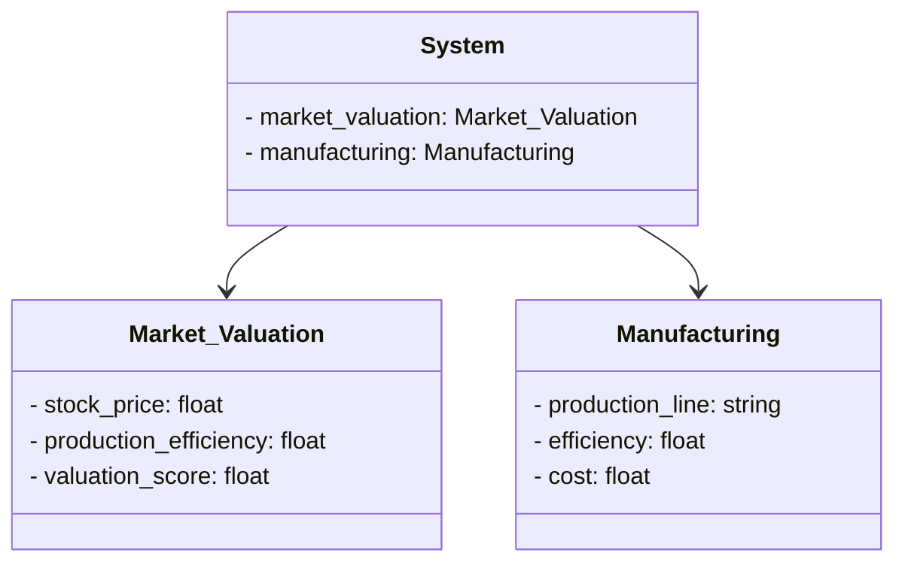

                 


# 新兴市场股市估值与智能制造柔性生产线的互动

> 关键词：新兴市场，股市估值，智能制造，柔性生产线，互动关系

> 摘要：本文探讨新兴市场股市估值与智能制造柔性生产线之间的互动关系，分析股市估值对智能制造投资的影响，以及智能制造技术如何反作用于股市估值。通过理论模型和实证分析，揭示两者互动的核心机制，并提出未来研究方向。

---

## 第一部分: 新兴市场股市估值与智能制造柔性生产线的互动概述

### 第1章: 新兴市场股市估值的基本概念

#### 1.1 新兴市场的定义与特点

- **1.1.1 新兴市场的经济特征**
  新兴市场指处于快速发展阶段的国家，经济结构多元化，增长潜力大。这些市场通常具有较高的GDP增长率和较低的人均收入水平。

- **1.1.2 新兴市场的股市特点**
  新兴市场股市波动性较大，受政策和外部环境影响显著。市场规模逐渐扩大，投资者结构多元化。

- **1.1.3 新兴市场与发达市场的区别**
  新兴市场在市场成熟度、监管体系、投资者结构等方面与发达市场存在差异，但增长潜力更大。

#### 1.2 智能制造柔性生产线的核心概念

- **1.2.1 智能制造的定义**
  智能制造是通过智能化技术（如物联网、大数据、AI）优化生产过程，实现高效、灵活的生产模式。

- **1.2.2 智能制造的关键技术**
  包括物联网、大数据分析、人工智能、机器人技术和云计算等。

- **1.2.3 智能制造的发展趋势**
  智能制造正朝着个性化、定制化和绿色生产方向发展，推动企业竞争力提升。

#### 1.3 新兴市场股市估值与智能制造的互动关系

- **1.3.1 股市估值对智能制造的影响**
  股市估值影响企业的投资决策，高估值可能推动智能制造投资，反之则可能限制技术升级。

- **1.3.2 智能制造对股市估值的影响**
  智能制造技术提升企业效率和利润率，进而影响股市估值，使企业市值上升。

---

## 第二部分: 股市估值与智能制造柔性生产线的互动关系分析

### 第2章: 股市估值对智能制造的影响

#### 2.1 股市估值的基本方法

- **2.1.1 市盈率（P/E）法**
  通过市盈率评估企业股票的合理价格，P/E = 市场价/每股收益。

- **2.1.2 市净率（P/B）法**
  市净率 = 市场价/每股净资产，适用于资产密集型企业。

- **2.1.3 现金流折现法**
  通过折现现金流（DCF）模型评估企业价值，考虑未来现金流的现值。

#### 2.2 股市估值与企业投资的关系

- **2.2.1 高估值驱动投资**
  高估值可能引发市场对企业的高期望，推动企业加大智能制造投资。

- **2.2.2 低估值限制投资**
  低估值可能导致企业融资困难，限制智能制造项目的推进。

#### 2.3 股市估值对智能制造发展的推动作用

- **2.3.1 资金支持**
  高估值企业更容易获得融资，支持智能制造技术的研发和应用。

- **2.3.2 投资者信心**
  股市估值反映投资者信心，高估值增强企业投资智能制造的能力。

### 第3章: 智能制造对股市估值的影响

#### 3.1 智能制造提升企业效率

- **3.1.1 生产效率提高**
  智能制造技术优化生产流程，减少浪费，提高效率。

- **3.1.2 成本降低**
  柔性生产线可根据需求调整生产，降低单位产品成本。

#### 3.2 智能制造降低生产成本

- **3.2.1 资源优化利用**
  通过智能化管理，合理分配资源，避免浪费。

- **3.2.2 维护成本下降**
  预测性维护减少设备故障，降低维护成本。

#### 3.3 智能制造对股市估值的长期影响

- **3.3.1 利润率提升**
  智能制造提高生产效率，增加企业利润，推动股价上涨。

- **3.3.2 市场竞争力增强**
  智能制造提升企业市场地位，吸引更多投资者，提高估值。

---

## 第三部分: 新兴市场股市估值与智能制造互动的核心理论

### 第4章: 互动模型的构建

#### 4.1 模型的理论基础

- **4.1.1 股市估值的驱动因素**
  包括企业基本面、市场情绪、宏观经济环境等。

- **4.1.2 智能制造的核心要素**
  包括技术创新、生产效率、成本控制等。

- **4.1.3 互动机制**
  企业通过智能制造技术提升竞争力，进而影响股市估值。

#### 4.2 模型的构建过程

- **4.2.1 数据收集**
  收集新兴市场股市数据和智能制造相关企业的生产数据。

- **4.2.2 变量定义**
  定义关键变量，如市盈率、生产效率、技术投入等。

- **4.2.3 模型构建**
  使用回归分析等方法，建立股市估值与智能制造投入之间的关系模型。

#### 4.3 模型的验证方法

- **4.3.1 数据分析**
  通过统计分析验证模型的显著性。

- **4.3.2 实证检验**
  使用实证数据检验模型的预测能力。

---

## 第四部分: 新兴市场股市估值与智能制造互动的算法原理

### 第5章: 时间序列分析

#### 5.1 时间序列分析的基本概念

- **5.1.1 时间序列的定义**
  按时间顺序排列的数据，如股市指数、生产数据等。

- **5.1.2 时间序列分析的目的**
  预测未来趋势，识别数据中的模式和周期。

#### 5.2 时间序列分析的应用

- **5.2.1 数据预处理**
  包括数据清洗、平稳化处理等。

- **5.2.2 模型选择**
  选择适合的时间序列模型，如ARIMA、Prophet等。

- **5.2.3 模型训练与预测**
  使用训练数据训练模型，并进行预测。

#### 5.3 时间序列分析的Python实现

```python
import pandas as pd
import numpy as np
from statsmodels.tsa.arima_model import ARIMA
import matplotlib.pyplot as plt

# 示例数据：新兴市场股市指数
data = pd.read_csv('em_stocks.csv')
series = data['Index']

# 数据预处理
series_log = np.log(series)

# 模型训练
model = ARIMA(series_log, order=(1, 1, 1))
model_fit = model.fit()

# 预测
 forecast = model_fit.forecast(steps=5)
```

---

## 第五部分: 新兴市场股市估值与智能制造互动的系统架构设计

### 第6章: 系统分析与架构设计方案

#### 6.1 问题场景介绍

- **6.1.1 问题背景**
  新兴市场中，智能制造企业面临股市估值波动大的挑战，需要通过技术手段优化生产，提升估值。

- **6.1.2 项目介绍**
  开发一个结合股市估值和智能制造的系统，帮助企业优化生产，提升股市表现。

#### 6.2 系统功能设计

- **6.2.1 领域模型设计**
  使用Mermaid类图描述系统各模块及其关系。



- **6.2.2 系统架构设计**
  使用Mermaid架构图展示系统整体架构。


---

## 第六部分: 项目实战

### 第7章: 项目实战

#### 7.1 环境安装

- **7.1.1 安装Python**
  需要安装Python 3.8及以上版本。

- **7.1.2 安装依赖库**
  使用以下命令安装所需库：
  ```bash
  pip install pandas numpy statsmodels matplotlib
  ```

#### 7.2 核心实现

- **7.2.1 数据获取**
  从公开数据源获取新兴市场股市数据和智能制造企业生产数据。

- **7.2.2 数据分析**
  使用时间序列分析模型预测股市趋势，并结合生产效率数据优化生产计划。

#### 7.3 代码实现

```python
import pandas as pd
import numpy as np
from statsmodels.tsa.arima_model import ARIMA
import matplotlib.pyplot as plt

# 数据获取与预处理
data = pd.read_csv('em_manufacturing.csv')
production_data = data[['Date', 'Production', 'Efficiency']]

# 时间序列分析
series = production_data.set_index('Date')['Production']
model = ARIMA(series, order=(1, 1, 1))
model_fit = model.fit()

# 预测未来生产
forecast_steps = 5
forecast = model_fit.forecast(steps=forecast_steps)
forecast_df = pd.DataFrame({'Date': pd.date_range(series.index[-1], periods=forecast_steps),
                            'Forecast': forecast[0]})

# 可视化
plt.figure(figsize=(10, 6))
plt.plot(series.index[-10:], series[-10:], label='Actual Production')
plt.plot(forecast_df['Date'], forecast_df['Forecast'], label='Forecast Production')
plt.title('Production Forecast')
plt.xlabel('Date')
plt.ylabel('Production')
plt.legend()
plt.show()
```

#### 7.4 案例分析

- **7.4.1 案例选择**
  选择一个新兴市场中的智能制造企业，分析其股市估值与生产效率的关系。

- **7.4.2 分析过程**
  使用时间序列模型预测企业未来生产效率，并评估对股市估值的影响。

#### 7.5 项目小结

- **7.5.1 成果总结**
  成功开发出结合股市估值与智能制造的系统，帮助企业优化生产，提升估值。

- **7.5.2 经验总结**
  数据质量、模型选择和实时监控是系统成功的关键因素。

---

## 第七部分: 总结与展望

### 第8章: 总结与展望

#### 8.1 全文总结

- 本文探讨了新兴市场股市估值与智能制造柔性生产线的互动关系，分析了股市估值对智能制造投资的影响，以及智能制造技术对股市估值的反向影响。

#### 8.2 研究局限性

- 数据获取难度较大，部分新兴市场数据不完整。
- 模型的适用性可能受到市场波动和政策变化的影响。

#### 8.3 未来研究方向

- 结合更多新兴市场数据，进行跨市场对比分析。
- 探索其他时间序列模型，如LSTM，提高预测精度。

#### 8.4 最佳实践 Tips

- 在进行股市估值分析时，需结合宏观经济指标和政策因素。
- 柔性生产线设计应考虑企业的实际需求和预算。

#### 8.5 小结

- 新兴市场股市估值与智能制造的互动关系复杂，但通过技术创新和数据分析，可以为企业创造更大的价值。

---

## 作者：AI天才研究院/AI Genius Institute & 禅与计算机程序设计艺术 /Zen And The Art of Computer Programming

---

### 感谢您的阅读！

