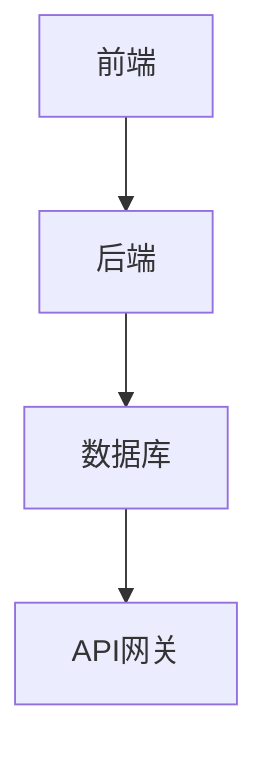
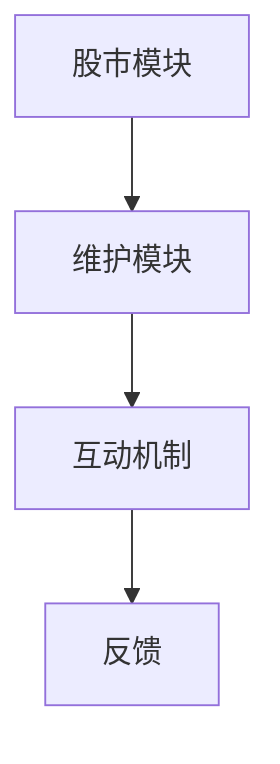
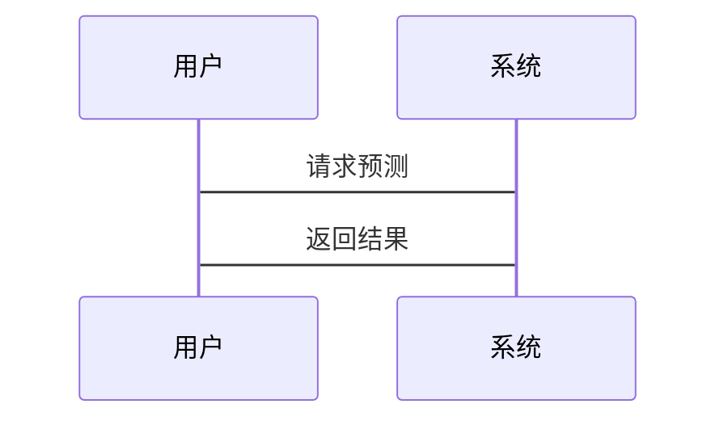

                 


# 新兴市场股市估值与智能制造预测性维护的互动

> 关键词：股市估值，智能制造，预测性维护，数据驱动，互动机制

> 摘要：本文探讨了新兴市场股市估值与智能制造预测性维护之间的互动关系，结合数学模型和算法，分析了它们如何相互影响，并通过实际案例进行验证。

---

## 第1章: 背景与核心概念

### 1.1 问题背景与定义

#### 1.1.1 新兴市场股市估值的定义与特点
股市估值是指对股票市场价格的评估，通常基于公司的财务状况、市场趋势和宏观经济指标。新兴市场股市估值具有波动性大、增长快、受政策影响显著等特点。

#### 1.1.2 智能制造预测性维护的定义与特点
预测性维护是通过传感器数据和机器学习算法预测设备故障，从而减少停机时间。智能制造中的预测性维护强调实时数据采集和自动化决策。

#### 1.1.3 互动关系的定义与边界
新兴市场股市估值和智能制造预测性维护的互动体现在数据共享、模型优化和决策反馈上。边界包括数据隐私、模型泛化能力和实际应用场景。

### 1.2 核心概念与属性对比

#### 1.2.1 股市估值与预测性维护的核心要素
| 核心要素 | 股市估值 | 预测性维护 |
|----------|----------|------------|
| 数据源   | 财务报表、市场指数 | 设备传感器数据、历史维护记录 |
| 目标     | 评估股票价值 | 预测设备故障 |
| 输出     | 估值指标 | 维护建议 |

#### 1.2.2 ER实体关系图
```mermaid
er
actor: 投资者, 设备制造商
entity: 股票, 设备
```

---

## 第2章: 核心概念的原理与联系

### 2.1 股市估值的数学模型

#### 2.1.1 时间序列分析模型
时间序列分析用于预测股市走势，常用模型包括ARIMA和LSTM。

#### 2.1.2 随机过程与马尔可夫链模型
马尔可夫链用于状态转移，帮助分析股市波动。

#### 2.1.3 股市估值的数学公式
$$ P(t) = a \cdot P(t-1) + b \cdot F(t) $$
其中，\( P(t) \) 表示当前价格，\( F(t) \) 表示外部因素。

### 2.2 预测性维护的算法原理

#### 2.2.1 基于机器学习的预测模型
使用XGBoost或随机森林模型预测设备故障。

#### 2.2.2 基于统计学的异常检测
通过Z-score方法检测传感器数据异常。

#### 2.2.3 维护策略优化算法
$$ C = \sum_{i=1}^{n} c_i \cdot x_i $$
其中，\( c_i \) 是维护成本，\( x_i \) 是维护决策变量。

### 2.3 互动机制

#### 2.3.1 数据流与信息交互
数据从股市流向设备，设备数据反哺股市模型。

#### 2.3.2 协同优化的数学模型
$$ V = \alpha \cdot S + \beta \cdot M $$
其中，\( S \) 是股市估值，\( M \) 是维护效率，\( \alpha \) 和 \( \beta \) 是权重。

#### 2.3.3 动态平衡与反馈机制
通过反馈环优化模型参数，实现动态平衡。

---

## 第3章: 算法原理与数学模型

### 3.1 时间序列分析算法

#### 3.1.1 ARIMA模型
ARIMA用于预测股票价格，通过自相关性和偏自相关性确定参数。

#### 3.1.2 LSTM网络
LSTM适合处理长期依赖关系，用于捕捉股市波动。

#### 3.1.3 GARCH模型
GARCH模型用于预测股市波动性。

### 3.2 预测性维护算法

#### 3.2.1 基于机器学习的故障预测
使用KNN算法进行分类，预测设备是否故障。

#### 3.2.2 基于统计学的异常检测
通过小波变换检测信号异常。

#### 3.2.3 维护策略优化算法
使用动态规划优化维护计划。

### 3.3 数学模型与公式

#### 3.3.1 时间序列分析公式
$$ ARIMA(p, d, q) $$
其中，p是自回归阶数，d是差分阶数，q是移动平均阶数。

#### 3.3.2 预测性维护模型公式
$$ P(f) = \sum_{i=1}^{n} w_i \cdot x_i $$
其中，\( w_i \) 是权重，\( x_i \) 是特征向量。

#### 3.3.3 互动机制的数学表达
$$ I = \gamma \cdot S + \delta \cdot M $$
其中，\( \gamma \) 和 \( \delta \) 是互动因子。

---

## 第4章: 系统分析与架构设计

### 4.1 系统功能设计

#### 4.1.1 股市估值模块
实现股票数据采集、清洗和建模。

#### 4.1.2 预测性维护模块
实现设备数据采集、清洗和建模。

#### 4.1.3 互动机制模块
实现数据交互和协同优化。

### 4.2 系统架构设计

#### 4.2.1 分层架构图


#### 4.2.2 组件交互图


### 4.3 接口与交互设计

#### 4.3.1 系统接口定义
API接口定义：/api/stock_prediction 和 /api/maintenance_prediction。

#### 4.3.2 用户交互流程图


---

## 第5章: 项目实战与案例分析

### 5.1 环境搭建与数据收集

#### 5.1.1 开发环境安装
安装Python、TensorFlow、Pandas等工具。

#### 5.1.2 数据源获取与清洗
使用Yahoo Finance获取股票数据，清洗缺失值。

### 5.2 核心算法实现

#### 5.2.1 股市估值模型实现
实现ARIMA模型，预测股票价格。

#### 5.2.2 预测性维护模型实现
实现KNN算法，预测设备故障。

### 5.3 案例分析与结果解读

#### 5.3.1 实际案例分析
分析新兴市场股市波动对设备维护的影响。

#### 5.3.2 模型结果分析
展示预测结果与实际数据对比，评估模型准确性。

---

## 第6章: 总结与展望

### 6.1 总结
本文探讨了股市估值与预测性维护的互动关系，提出了数学模型和算法。

### 6.2 展望
未来研究可以扩展到更复杂的数据分析和更广泛的应用场景。

---

## 附录

### A. 数据来源
股票数据来源：Yahoo Finance。

### B. 工具安装
安装命令：pip install numpy pandas tensorflow。

### C. 参考文献
[1] 时间序列分析书籍。

作者：AI天才研究院 & 禅与计算机程序设计艺术

