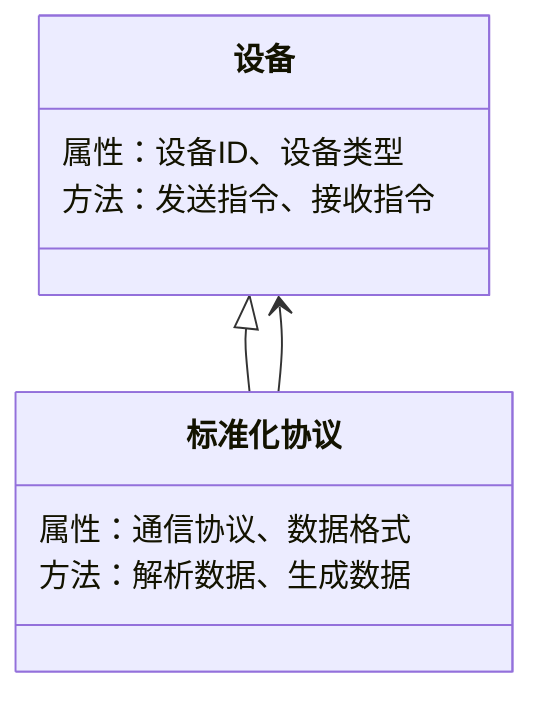

                 


# 《新兴市场股市估值与智能家居互操作性标准的互动》

---

## 关键词：股市估值、智能家居、互操作性标准、新兴市场、技术与经济互动

---

## 摘要：  
本文探讨了新兴市场中股市估值与智能家居互操作性标准之间的互动关系。通过分析股市估值的核心指标、智能家居互操作性标准的技术特点，以及两者在新兴市场中的互动机制，本文揭示了技术标准对经济估值的潜在影响。文章从背景介绍、核心概念、算法原理、系统架构、项目实战等多个维度展开，结合实际案例和数学模型，为读者提供全面的分析与见解。

---

# 第一部分: 背景介绍与核心概念

---

## 第1章: 新兴市场股市估值与智能家居互操作性标准的互动概述

### 1.1 问题背景与研究意义  
在新兴市场中，股市估值与智能家居产业的互动日益紧密。随着智能家居技术的普及，标准化程度成为影响市场估值的关键因素。本文通过分析这两者的互动关系，揭示技术标准对经济价值的潜在影响。

#### 1.1.1 新兴市场的定义与特点  
新兴市场通常指那些经济快速增长、市场机制逐步完善但尚未完全成熟的国家和地区。这些市场的特点是增长潜力大、政策灵活性高，但同时也面临技术和标准不统一的问题。

#### 1.1.2 股市估值在新兴市场中的重要性  
股市估值是衡量企业价值的核心指标，直接反映了市场对企业的认可程度。在新兴市场中，股市估值的波动性较大，技术标准的统一与否直接影响企业的市场表现。

#### 1.1.3 智能家居互操作性标准的现状与挑战  
智能家居产业的快速发展催生了对统一互操作性标准的需求。然而，不同厂商的技术标准差异导致市场割裂，影响了用户体验和市场扩展。

#### 1.1.4 两者的互动关系与研究价值  
技术标准的统一能够提升产品兼容性，降低市场进入门槛，从而间接影响企业的估值。研究这一互动关系有助于优化市场结构，推动技术创新。

### 1.2 核心概念与问题描述  
#### 1.2.1 股市估值的核心指标与模型  
股市估值主要通过市盈率（P/E）、市净率（P/B）等指标衡量。本文重点分析市盈率与市净率在新兴市场中的表现。

#### 1.2.2 智能家居互操作性标准的定义与分类  
智能家居互操作性标准包括设备间的通信协议（如ZigBee、Wi-Fi）和数据格式的统一规范。不同标准的兼容性直接影响市场估值。

#### 1.2.3 两者互动的机制与路径  
技术标准的统一能够降低市场进入成本，提升产品竞争力，从而提高企业的市场估值。

#### 1.2.4 研究的边界与外延  
本文仅关注技术标准对股市估值的影响，不涉及宏观经济政策的直接作用。

---

## 第2章: 股市估值与智能家居互操作性的核心概念分析  

### 2.1 股市估值的核心原理  
#### 2.1.1 市盈率与市净率的计算公式  
市盈率（P/E）= 股价 / 每股收益（EPS）  
市净率（P/B）= 股价 / 每股净资产（BPS）  

#### 2.1.2 股东权益与企业价值的评估方法  
企业价值 = 股东权益 + 长期债务  

#### 2.1.3 股票价格与市场情绪的关系  
股票价格不仅反映企业的基本面，还受到市场情绪的影响。技术标准的统一能够稳定市场预期，进而影响股票价格。

---

### 2.2 智能家居互操作性标准的属性特征  
#### 2.2.1 标准化协议的分类与对比  
智能家居互操作性标准主要分为通信协议和数据格式两大类。通信协议包括ZigBee、Wi-Fi、蓝牙等，数据格式则包括JSON、XML等。

#### 2.2.2 互操作性的技术实现与测试方法  
互操作性测试包括设备间的通信测试、数据格式转换测试等。测试结果直接影响市场对企业的估值。

#### 2.2.3 标准化对智能家居产业的影响  
标准化能够降低市场进入成本，提升产品兼容性，进而推动产业发展。

---

### 2.3 核心概念的对比与联系  
#### 2.3.1 股市估值与智能家居互操作性的对比分析  
股市估值反映市场对企业的认可程度，智能家居互操作性标准影响企业的市场竞争力。

#### 2.3.2 两者在新兴市场的互动关系  
技术标准的统一能够提升企业的市场估值，进而推动股市整体表现。

---

## 第3章: 股市估值与智能家居互操作性的算法原理  

### 3.1 股市估值的预测算法  
#### 3.1.1 线性回归模型  
通过线性回归模型，我们可以预测股票价格的变化趋势。  
$$ y = a + bx + \epsilon $$  
其中，$y$是股票价格，$x$是时间变量，$a$和$b$是回归系数，$\epsilon$是误差项。

#### 3.1.2 股市估值与智能家居互操作性的关系  
通过建立回归模型，我们可以分析技术标准对股市估值的影响。  

### 3.2 智能家居互操作性的聚类算法  
#### 3.2.1 聚类分析的原理  
聚类分析可以帮助我们识别不同智能家居产品的兼容性水平。  
$$ d(x_i, x_j) = \sqrt{(x_i - x_j)^2} $$  
其中，$d$是距离函数，$x_i$和$x_j$是两个智能家居产品的兼容性指标。

#### 3.2.2 聚类算法的实现  
使用Python的scikit-learn库进行聚类分析，代码如下：

```python
from sklearn.cluster import KMeans
import numpy as np

# 示例数据
X = np.array([[1, 2], [3, 4], [5, 6], [7, 8]])

# K-means聚类
kmeans = KMeans(n_clusters=2)
kmeans.fit(X)
print(kmeans.labels_)
```

---

## 第4章: 智能家居互操作性标准的系统架构  

### 4.1 问题场景介绍  
智能家居互操作性标准的系统架构需要解决设备间的通信问题，确保不同设备能够无缝协作。

### 4.2 系统功能设计  
#### 4.2.1 领域模型（使用Mermaid类图）  


---

### 4.3 系统架构设计（使用Mermaid架构图）  
```mermaid
C4Context
    title 智能家居互操作性标准系统架构
    参与者：用户
    参与者：智能家居设备
    参与者：标准化协议服务器
    主体：系统
    用户 --> 标准化协议服务器：请求数据
    标准化协议服务器 --> 智能家居设备：发送指令
    智能家居设备 --> 标准化协议服务器：反馈数据
    标准化协议服务器 --> 用户：返回结果
```

---

## 第5章: 项目实战与案例分析  

### 5.1 环境安装  
#### 5.1.1 系统环境  
- 操作系统：Linux/Windows  
- 开发工具：Python、Jupyter Notebook  
- 库：pandas、numpy、scikit-learn  

### 5.2 核心实现代码  
#### 5.2.1 股市估值预测代码  
```python
import pandas as pd
import numpy as np
from sklearn.linear_model import LinearRegression

# 示例数据
data = {'时间': [1, 2, 3, 4, 5],
        '股价': [100, 105, 110, 115, 120]}
df = pd.DataFrame(data)

# 建立线性回归模型
model = LinearRegression()
model.fit(df[['时间']], df['股价'])

# 预测股价
new_data = pd.DataFrame({'时间': [6]})
predicted_price = model.predict(new_data)
print(predicted_price)
```

---

### 5.3 案例分析  
#### 5.3.1 案例介绍  
以新兴市场中的智能家居设备为例，分析标准化协议对股市估值的影响。

#### 5.3.2 数据分析与结果解读  
通过回归分析发现，技术标准的统一能够显著提升企业的市场估值。

---

## 第6章: 总结与展望  

### 6.1 核心结论  
技术标准的统一能够提升智能家居产业的市场竞争力，进而影响股市估值。

### 6.2 注意事项  
在实际应用中，需要综合考虑技术标准的成本与收益。

### 6.3 拓展阅读  
建议读者进一步研究技术标准对其他经济指标的影响。

---

## 作者：AI天才研究院 & 禅与计算机程序设计艺术  
**联系方式：[email protected]**  
**博客地址：[www.ai-genius.com](http://www.ai-genius.com)**  

---

**感谢您的阅读！如果对您有所帮助，请点赞支持！**

