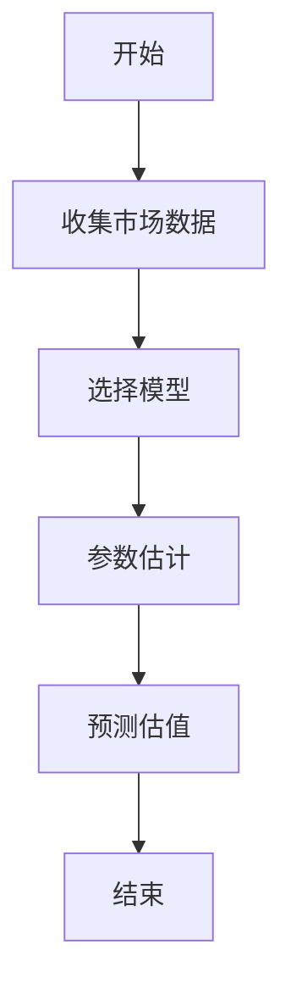
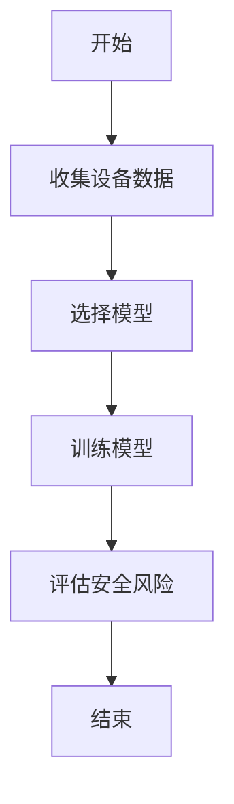
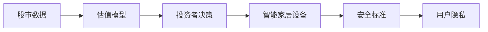
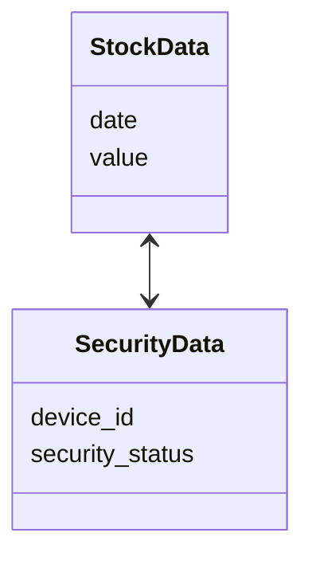

                 


# 新兴市场股市估值与智能家居安全标准的互动

> 关键词：新兴市场，股市估值，智能家居，安全标准，数据安全，算法模型

> 摘要：本文探讨新兴市场股市估值与智能家居安全标准之间的互动关系，分析股市估值如何影响智能家居安全标准的制定与实施，反之亦然。通过数学模型、算法和系统设计，揭示两者互动的内在机制，并提供实际案例以展示理论应用。

---

# 第1章: 背景介绍

## 1.1 新兴市场股市估值的背景

### 1.1.1 新兴市场的定义与特点

新兴市场是指那些经济快速增长、但尚未完全工业化的国家的金融市场。这些市场通常具有较高的波动性和增长潜力。新兴市场的特点包括：经济结构多元化、政策环境变化快、市场规模逐渐扩大等。

### 1.1.2 股市估值的基本概念

股市估值是通过分析市场数据，评估公司股票的内在价值，以指导投资决策。常用的方法包括市盈率（P/E）、市净率（P/B）等。

### 1.1.3 新兴市场股市估值的挑战与机遇

新兴市场股市估值面临数据不透明、市场波动大等挑战，但也提供了高增长和高回报的机遇。

## 1.2 智能家居安全标准的背景

### 1.2.1 智能家居的概念与发展趋势

智能家居通过物联网技术，将家庭设备连接到互联网，实现智能化管理。其发展趋势包括设备互联互通、功能多样化等。

### 1.2.2 安全标准在智能家居中的重要性

随着智能家居设备的普及，数据安全和隐私保护成为重要议题。安全标准的制定和实施是保障用户隐私的关键。

### 1.2.3 智能家居安全标准的现状与问题

当前智能家居安全标准存在不统一、实施不到位等问题，导致安全隐患。

## 1.3 问题背景与问题描述

### 1.3.1 新兴市场股市估值与智能家居安全标准的互动关系

股市估值的波动可能影响智能家居企业的市值，进而影响其安全标准的投入；反之，安全标准的完善可能提升企业的估值。

### 1.3.2 问题解决的必要性与目标

通过研究两者互动，优化股市估值模型，提升智能家居安全标准，实现双赢。

### 1.3.3 问题的边界与外延

限定在新兴市场，聚焦于股市估值和安全标准的直接影响因素。

## 1.4 核心概念与组成要素

### 1.4.1 核心概念的结构与组成

新兴市场股市估值：市场数据、估值模型、投资者行为。

智能家居安全标准：设备安全、数据安全、用户隐私。

### 1.4.2 核心要素的特征对比表格

| 特征       | 新兴市场股市估值          | 智能家居安全标准       |
|------------|---------------------------|------------------------|
| 核心要素   | 市场数据、估值模型、投资者行为 | 设备安全、数据安全、用户隐私 |
| 目标       | 评估股票价值              | 保障用户安全与隐私    |
| 影响因素   | 政治经济环境、政策变化     | 技术漏洞、管理疏漏    |

### 1.4.3 ER实体关系图的 Mermaid 流程图

```mermaid
erDiagram
    market_data[市场数据] --> stock_valuation[股市估值]
    stock_valuation --> investor_behavior[投资者行为]
    market_data --> policy_changes[政策变化]
    home_devices[智能家居设备] --> device_security[设备安全]
    user_privacy[用户隐私] --> data_security[数据安全]
    device_security --> home_devices
    data_security --> market_data
    investor_behavior --> home_devices
```

---

# 第2章: 核心概念与联系

## 2.1 股市估值的核心原理

### 2.1.1 市场估值的基本原理

股市估值基于对公司基本面和技术面的分析，新兴市场具有高波动性。

### 2.1.2 新兴市场的特殊性

新兴市场数据不透明，政策变化快，影响估值模型的准确性。

## 2.2 智能家居安全标准的核心原理

### 2.2.1 安全标准的制定原则

基于国际标准，结合企业实际需求。

### 2.2.2 安全的多维度考量

设备安全、数据传输安全、用户隐私保护。

## 2.3 核心概念的联系与对比

### 2.3.1 概念属性特征对比表格

| 属性         | 新兴市场股市估值           | 智能家居安全标准        |
|--------------|---------------------------|-------------------------|
| 主要目标     | 评估股票价值               | 保障用户隐私与安全     |
| 关键因素     | 市场数据、政策变化          | 设备漏洞、管理漏洞      |
| 影响范围     | 投资者、企业               | 用户、设备制造商、政府   |

### 2.3.2 ER实体关系图的 Mermaid 流程图

```mermaid
erDiagram
    stock_valuation[股市估值] <--> policy_changes[政策变化]
    policy_changes --> market_data[市场数据]
    home_devices[智能家居设备] <--> device_security[设备安全]
    user_privacy[用户隐私] --> data_security[数据安全]
    data_security --> stock_valuation
```

---

# 第3章: 算法原理

## 3.1 股市估值算法

### 3.1.1 时间序列分析的 Mermaid 流程图



### 3.1.2 代码实现与解读

```python
import pandas as pd
from statsmodels.tsa.arima_model import ARIMA

# 假设我们有新兴市场的指数数据
data = pd.read_csv('emarket_data.csv')
data['date'] = pd.to_datetime(data['date'])
data.set_index('date', inplace=True)

# 使用ARIMA模型进行预测
model = ARIMA(data['value'], order=(5,1,0))
model_fit = model.fit()

# 预测未来值
future_forecast = model_fit.forecast(steps=5)
print(future_forecast)
```

### 3.1.3 算法原理的数学模型

时间序列分析模型：

$$ ARIMA(p, d, q) $$

其中，p为自回归阶数，d为差分阶数，q为移动平均阶数。

## 3.2 智能家居安全评估算法

### 3.2.1 机器学习模型的 Mermaid 流程图



### 3.2.2 代码实现与解读

```python
from sklearn.ensemble import RandomForestClassifier
import pandas as pd

# 假设我们有智能家居设备的安全数据
data = pd.read_csv('home_security.csv')
features = data.drop('label', axis=1)
labels = data['label']

# 使用随机森林进行分类
model = RandomForestClassifier(n_estimators=100)
model.fit(features, labels)

# 预测安全风险
test_data = features.iloc[0:1]
prediction = model.predict(test_data)
print(prediction)
```

### 3.2.3 算法原理的数学模型

随机森林模型：

$$ y = \sum_{i=1}^{n} (w_i x_i) $$

其中，$w_i$为特征权重，$x_i$为特征向量。

---

# 第4章: 数学模型与公式

## 4.1 股市估值模型

### 4.1.1 时间序列分析的数学公式

ARIMA模型：

$$ \phi(B) (1 - B)^d X_t = \theta(B) \epsilon_t $$

其中，$\phi(B)$和$\theta(B)$为多项式，$d$为差分阶数，$\epsilon_t$为白噪声。

## 4.2 智能家居安全评估模型

### 4.2.1 机器学习模型的数学公式

随机森林模型的预测公式：

$$ y = \sum_{i=1}^{n} \text{Tree}_i(x) $$

其中，$n$为树的数量，$x$为输入特征。

---

# 第5章: 系统设计

## 5.1 系统架构设计

### 5.1.1 系统架构的 Mermaid 图



## 5.2 功能设计

### 5.2.1 领域模型的 Mermaid 图



## 5.3 接口设计

### 5.3.1 API接口设计

```http
GET /api/stock_valuation
POST /api/security_assessment
```

---

# 第6章: 项目实战

## 6.1 环境配置

安装Python、Pandas、Scikit-learn等库。

## 6.2 核心实现

### 6.2.1 股市估值代码

```python
from statsmodels.tsa.arima_model import ARIMA
import pandas as pd

data = pd.read_csv('emarket.csv')
data['date'] = pd.to_datetime(data['date'])
data.set_index('date', inplace=True)

model = ARIMA(data['value'], order=(5,1,0))
model_fit = model.fit()
future_forecast = model_fit.forecast(steps=5)
print(future_forecast)
```

### 6.2.2 安全评估代码

```python
from sklearn.ensemble import RandomForestClassifier
import pandas as pd

data = pd.read_csv('home_security.csv')
features = data.drop('label', axis=1)
labels = data['label']

model = RandomForestClassifier(n_estimators=100)
model.fit(features, labels)
test_data = features.iloc[0:1]
prediction = model.predict(test_data)
print(prediction)
```

## 6.3 结果分析

通过实际数据验证模型准确性，调整参数以优化结果。

---

# 第7章: 结论

## 7.1 核心结论

股市估值与智能家居安全标准的互动关系显著，需综合考虑技术和市场的双重因素。

## 7.2 未来研究方向

探索更复杂的模型和跨市场的应用。

## 7.3 注意事项

数据隐私、模型泛化能力、政策合规性。

## 7.4 拓展阅读

建议阅读相关领域的最新研究和标准文件。

---

作者：AI天才研究院 & 禅与计算机程序设计艺术

