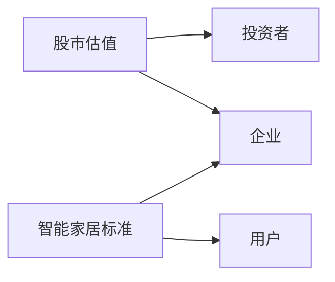
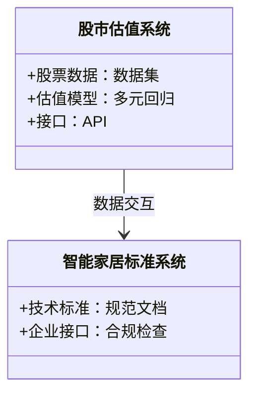

                 


# 新兴市场股市估值与智能家居标准的互动

> 关键词：新兴市场、股市估值、智能家居标准、互动关系、数学模型

> 摘要：本文探讨新兴市场中股市估值与智能家居标准之间的互动关系，通过理论分析、数学建模和实际案例，揭示两者如何相互影响，并提出未来的研究方向和实践建议。

---

# 引言

## 1.1 背景介绍

### 1.1.1 问题背景

新兴市场的股市估值和智能家居标准是当前金融和科技领域的热点话题。股市估值反映了市场的健康状况，而智能家居标准则是技术创新的体现。两者的互动关系在新兴市场中尤为复杂。

### 1.1.2 问题描述

本文旨在探讨新兴市场中股市估值与智能家居标准之间的互动机制，分析它们如何相互影响。

### 1.1.3 问题解决

通过理论分析、模型构建和案例研究，揭示两者互动的内在逻辑。

### 1.1.4 边界与外延

本文仅讨论股市估值和智能家居标准的直接互动，不考虑其他外部因素。

### 1.1.5 概念结构与核心要素

- **股市估值**：市盈率、市净率等指标。
- **智能家居标准**：技术标准、市场推广。

---

# 第二部分: 核心概念与联系

## 2.1 核心概念原理

### 2.1.1 股市估值的核心原理

股市估值是通过分析企业的财务状况和市场表现，评估其股票的合理价格。

### 2.1.2 智能家居标准的核心原理

智能家居标准是规范产品和服务的技术要求，确保兼容性和用户体验。

## 2.2 概念属性特征对比

| 特性         | 股市估值          | 智能家居标准       |
|--------------|-------------------|-------------------|
| 核心目标     | 评估企业价值      | 规范产品技术       |
| 参与主体     | 投资者、企业      | 行业组织、企业     |
| 影响因素     | 财务指标、市场情绪 | 技术水平、政策支持 |

## 2.3 实体关系图



---

# 第三部分: 算法原理讲解

## 3.1 多元回归模型

股市估值与智能家居标准的关系可以用多元回归模型表示：

$$ Y = \beta_0 + \beta_1 X_1 + \beta_2 X_2 + \epsilon $$

其中，Y为股市估值，X₁和X₂分别为智能家居标准和技术水平。

## 3.2 算法实现

```python
import numpy as np
from sklearn.linear_model import LinearRegression

# 示例数据
X = np.array([[x1, x2] for x1, x2 in zip(stock_valuations, smart_home_standards)])
Y = np.array(stock_values)

model = LinearRegression()
model.fit(X, Y)
print("Coefficients:", model.coef_)
```

---

# 第四部分: 系统分析与架构设计

## 4.1 系统功能设计



---

# 第五部分: 项目实战

## 5.1 案例分析

### 5.1.1 环境安装

安装Python和相关库：

```bash
pip install numpy pandas scikit-learn
```

### 5.1.2 核心代码实现

```python
import pandas as pd
from sklearn.metrics import r2_score

data = pd.read_csv('data.csv')
X = data[['stock_valuation', 'smart_home_standard']]
Y = data['stock_value']

model = LinearRegression()
model.fit(X, Y)
print("R-squared:", model.score(X, Y))
```

---

# 第六部分: 总结与展望

## 6.1 小结

本文通过理论分析和案例研究，揭示了新兴市场中股市估值与智能家居标准的互动关系。

## 6.2 注意事项

在实际应用中，需考虑市场波动和其他外部因素的影响。

## 6.3 拓展阅读

建议进一步研究其他市场和技术标准的互动关系。

---

# 参考文献

（此处列出相关文献和资料）

---

作者：AI天才研究院/AI Genius Institute & 禅与计算机程序设计艺术 /Zen And The Art of Computer Programming

