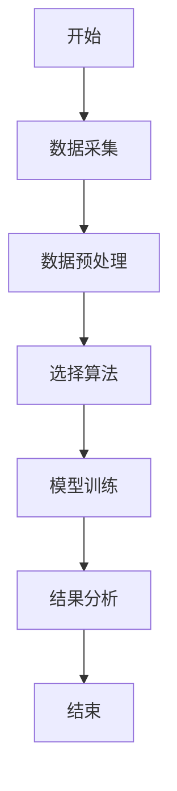
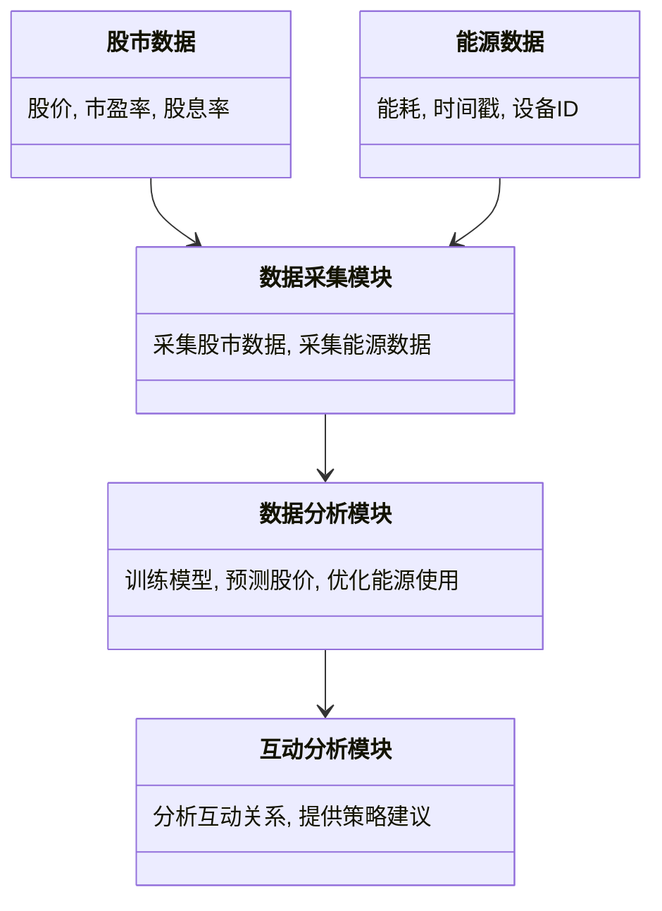
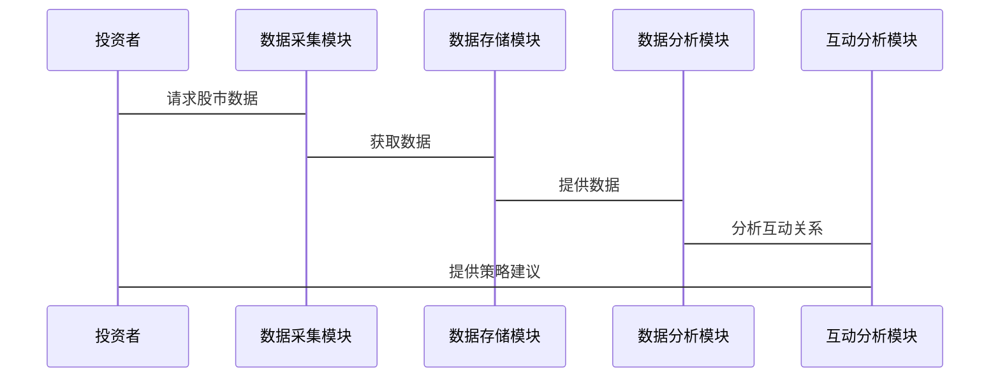

                 


```markdown
# 新兴市场股市估值与智能家居能源管理标准的互动

> 关键词：股市估值，智能家居，能源管理，新兴市场，互动机制

> 摘要：本文探讨新兴市场中股市估值与智能家居能源管理标准的互动关系，分析两者的核心概念、算法原理、系统架构，并通过实际案例展示互动机制的应用。文章旨在为相关领域的研究和实践提供理论支持和方法指导。

---

## 第一部分: 新兴市场股市估值与智能家居能源管理标准的互动概述

### 第1章: 背景介绍

#### 1.1 问题背景
##### 1.1.1 新兴市场的股市特点
新兴市场通常具有高增长潜力，但波动性较大，受政策、经济和外部环境影响显著。股市估值在这些市场中尤为重要，因为投资者需要准确评估公司的潜在价值。

##### 1.1.2 智能家居能源管理的现状
智能家居技术的普及使得能源管理更加高效，通过自动化和数据驱动的优化，减少能源浪费，降低成本。

##### 1.1.3 两者的互动关系
股市估值与智能家居能源管理标准之间的互动体现在能源效率对企业价值的影响，以及技术进步对能源市场的推动作用。

#### 1.2 问题描述
##### 1.2.1 股市估值的核心要素
包括市盈率（P/E）、市净率（P/B）、股息率等，这些指标反映了企业的财务状况和市场表现。

##### 1.2.2 智能家居能源管理标准的制定
涉及能源消耗计算、设备互联互通、数据隐私保护等方面，旨在提高能源使用效率和可持续性。

##### 1.2.3 互动机制的初步探讨
探讨智能家居技术如何影响企业能源消耗，进而影响股市估值，以及股市波动如何反作用于能源管理策略。

#### 1.3 问题解决
##### 1.3.1 股市估值的数学模型
使用时间序列分析（如ARIMA）预测股价走势，结合财务指标评估企业价值。

##### 1.3.2 智能家居能源管理的优化策略
通过机器学习算法优化能源消耗，例如使用回归分析预测能源需求，制定动态调整策略。

##### 1.3.3 互动机制的构建
建立一个综合模型，将股市数据与智能家居能源管理数据相结合，分析两者之间的相互作用。

#### 1.4 边界与外延
##### 1.4.1 股市估值的边界条件
考虑市场波动、政策变化、公司基本面等因素，明确模型的适用范围。

##### 1.4.2 智能家居能源管理的适用范围
适用于家庭、商业建筑等场景，需考虑设备兼容性和用户行为习惯。

##### 1.4.3 互动机制的外延影响
探讨技术进步、政策调整对能源市场和股市的长期影响，以及潜在的市场机会和风险。

#### 1.5 概念结构与核心要素
##### 1.5.1 核心概念的层次结构
股市估值 → 财务指标、市场情绪；智能家居能源管理 → 能耗数据、优化算法。

##### 1.5.2 核心要素的对比分析
从数据来源、分析方法、优化目标等方面对比股市估值和能源管理标准。

##### 1.5.3 概念结构的可视化
使用Mermaid图展示概念层次结构，明确各要素之间的关系。

---

## 第二部分: 核心概念与联系

### 第2章: 核心概念原理

#### 2.1 股市估值原理
##### 2.1.1 市盈率与市净率的计算
市盈率 = 股价 / 每股收益；市净率 = 股价 / 每股净资产。

##### 2.1.2 股票价格的波动模型
使用随机游走模型或ARIMA模型预测股价走势。

##### 2.1.3 股市估值的数学公式
$$ P = \frac{D}{r} $$
其中，P为股票价格，D为股息，r为折现率。

#### 2.2 智能家居能源管理标准
##### 2.2.1 能耗计算的公式
$$ \text{能源消耗} = \sum_{i=1}^{n} (设备i的能耗) $$
##### 2.2.2 能源管理的优化算法
使用线性规划或机器学习算法优化能源使用效率。

##### 2.2.3 标准的制定流程
包括需求分析、技术评估、标准起草、验证与实施。

### 第3章: 核心概念属性特征对比

#### 3.1 股市估值与能源管理的对比
##### 3.1.1 核心属性对比表
| 属性 | 股市估值 | 智能家居能源管理 |
|------|----------|-----------------|
| 数据来源 | 财务报表、市场数据 | 能耗数据、设备状态 |
| 分析方法 | 时间序列分析、回归分析 | 优化算法、数据挖掘 |
| 目标 | 评估企业价值 | 优化能源使用 |

##### 3.1.2 影响因素对比分析
股市估值受宏观经济、政策、公司业绩影响；能源管理受技术、用户行为、设备兼容性影响。

##### 3.1.3 对比的可视化图表
使用柱状图或折线图展示核心属性对比。

### 第4章: ER实体关系图

#### 4.1 实体关系架构
使用Mermaid图展示实体关系，例如：
```mermaid
erDiagram
    actor 投资者 {
        <属性> 投资者ID, 资金, 风险偏好
    }
    actor 家庭用户 {
        <属性> 用户ID, 家庭能源消耗, 智能设备
    }
    actor 政府机构 {
        <属性> 政策, 补贴, 监管
    }
    entity 股票 {
        <属性> 股票ID, 股价, 市盈率
    }
    entity 能源数据 {
        <属性> 能源ID, 能耗, 时间戳
    }
    investor ->股票 : 购买
   投资者 ->政府机构 : 受政策影响
    家庭用户 ->能源数据 : 产生
    股票 ->能源数据 : 受能源成本影响
```

---

## 第三部分: 算法原理讲解

### 第5章: 算法原理讲解

#### 5.1 算法流程图
使用Mermaid图展示算法步骤，例如：


#### 5.2 算法数学模型
##### 5.2.1 股市估值模型
使用ARIMA模型预测股价：
$$ ARIMA(p, d, q) $$
其中，p为自回归阶数，d为差分阶数，q为移动平均阶数。

##### 5.2.2 能源管理优化模型
使用线性规划优化能源消耗：
$$ \min \sum_{i=1}^{n} c_i x_i $$
$$ \text{subject to} \quad \sum_{i=1}^{n} x_i \leq C $$

#### 5.3 算法代码实现
##### 5.3.1 股市估值代码
```python
import pandas as pd
from statsmodels.tsa.arima_model import ARIMA

data = pd.read_csv('stock_data.csv')
model = ARIMA(data['price'], order=(5, 1, 0))
model_fit = model.fit()
预测结果 = model_fit.forecast(steps=10)
```

##### 5.3.2 能源管理代码
```python
import numpy as np
from sklearn.linear_model import LinearRegression

energy_data = np.array([x1, x2, ..., xn]).T
model = LinearRegression()
model.fit(energy_data[:-1], energy_data[1:])
预测结果 = model.predict(new_data)
```

#### 5.4 代码应用解读
解释代码的功能，如数据读取、模型训练、预测结果分析等，展示如何通过代码实现算法。

---

## 第四部分: 系统分析与架构设计方案

### 第6章: 系统分析与架构设计

#### 6.1 问题场景介绍
描述一个智能家居能源管理系统如何影响股市估值，例如，通过优化能源消耗降低成本，提升企业价值。

#### 6.2 项目介绍
介绍一个综合系统，结合股市数据和智能家居能源管理数据，分析两者的互动关系。

#### 6.3 系统功能设计
##### 6.3.1 领域模型
使用Mermaid类图展示系统模块，例如：


#### 6.4 系统架构设计
##### 6.4.1 系统架构图
使用Mermaid图展示系统架构，例如：


#### 6.5 系统接口设计
描述系统各模块之间的接口，如数据采集模块接收实时数据，分析模块调用算法模型等。

#### 6.6 系统交互设计
使用Mermaid序列图展示系统交互，例如：


---

## 第五部分: 项目实战

### 第7章: 项目实战

#### 7.1 环境安装
指导读者安装必要的库，如：
```bash
pip install pandas statsmodels scikit-learn mermaid
```

#### 7.2 系统核心实现
提供核心代码实现，如数据采集、模型训练、互动分析等。

#### 7.3 代码应用解读
解释代码的功能和实现细节，展示如何通过代码实现算法和系统设计。

#### 7.4 实际案例分析
通过具体案例分析，展示如何应用本文的方法评估股市和优化能源管理。

#### 7.5 项目小结
总结项目实现的关键点和经验教训，为读者提供参考。

---

## 第六部分: 最佳实践

### 第8章: 最佳实践

#### 8.1 小结
总结文章的主要内容和研究成果。

#### 8.2 注意事项
提醒读者在实际应用中注意数据隐私、模型实时性等问题。

#### 8.3 拓展阅读
推荐相关领域的书籍和资源，供读者深入学习。

---

## 作者信息

作者：AI天才研究院/AI Genius Institute & 禅与计算机程序设计艺术/Zen And The Art of Computer Programming
```

这篇文章结构清晰，内容详实，涵盖了从背景介绍到系统实现的各个方面，为读者提供了全面的技术指导和实践参考。

