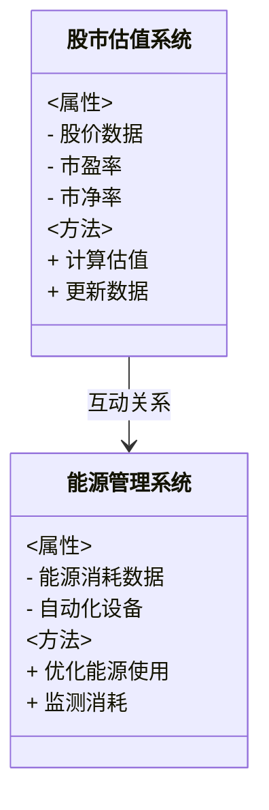

                 


# 新兴市场股市估值与智能家居能源管理的互动

> 关键词：新兴市场、股市估值、智能家居、能源管理、互动关系、数学建模、系统架构

> 摘要：本文探讨新兴市场股市估值与智能家居能源管理之间的互动关系，分析其核心概念、算法原理、系统架构，并通过项目实战和最佳实践提供深入见解。通过详细分析和案例研究，揭示两者在技术和经济上的相互影响。

---

## 第1章: 背景介绍与核心概念

### 1.1 问题背景与问题描述

#### 1.1.1 新兴市场的经济特点与股市特征
新兴市场通常具有高增长潜力，但伴随着高波动性和不稳定性。股市估值在这些市场中尤为重要，因为它反映了企业的成长潜力和市场信心。然而，新兴市场的特殊性使得传统的估值模型需要调整。

#### 1.1.2 智能家居能源管理的兴起与发展趋势
随着技术进步，智能家居能源管理通过自动化和智能化优化能源使用，降低成本并提高效率。其发展趋势与能源价格波动和环保政策密切相关。

#### 1.1.3 互动关系与研究意义
新兴市场股市估值受能源价格波动影响，而智能家居能源管理通过优化能源使用影响企业的运营成本，进而影响股市表现。研究这种互动有助于优化投资决策和能源管理策略。

### 1.2 核心概念与问题解决

#### 1.2.1 股市估值的核心方法与模型
常用方法包括市盈率（P/E）、市净率（P/B）等，新兴市场需考虑高波动性和政策影响。

#### 1.2.2 智能家居能源管理的关键技术与实现
包括能源消耗监测、自动化控制和数据驱动优化，利用物联网和人工智能技术。

#### 1.2.3 互动关系的数学建模与分析
通过建立数学模型，分析能源管理对企业成本的影响，进而影响股市估值。

### 1.3 边界与外延

#### 1.3.1 新兴市场的边界条件与限制
包括经济政策、市场流动性、地缘政治风险等。

#### 1.3.2 智能家居能源管理的适用范围与局限性
适用于高能源消耗场景，但在技术成熟度和成本方面存在限制。

#### 1.3.3 互动关系的外部影响与潜在风险
能源价格波动、政策变化和技术风险可能影响互动关系。

### 1.4 概念结构与核心要素

#### 1.4.1 股市估值的核心要素与指标
- 市盈率（P/E）
- 市净率（P/B）
- 股息率（Dividend Yield）

#### 1.4.2 智能家居能源管理的核心要素与指标
- 能源消耗监测
- 自动化控制
- 数据驱动优化

#### 1.4.3 互动关系的系统模型与框架
构建系统模型，分析能源管理对企业成本和股市估值的影响。

---

## 第2章: 核心概念与联系

### 2.1 核心概念原理

#### 2.1.1 股市估值的原理与方法
新兴市场中，股市估值需考虑高波动性和政策影响，常用模型包括CAPM和市盈率分析。

#### 2.1.2 智能家居能源管理的原理与技术
通过物联网和人工智能优化能源使用，降低运营成本。

#### 2.1.3 互动关系的系统性分析
能源管理优化企业成本，影响企业盈利能力和股市估值。

### 2.2 核心概念属性特征对比

| 比较维度 | 股市估值 | 智能家居能源管理 |
|----------|----------|------------------|
| 核心目标 | 反映企业价值 | 优化能源使用效率 |
| 影响因素 | 经济指标、政策 | 技术、能源价格 |
| 应用场景 | 投资决策 | 家庭/企业节能 |

### 2.3 ER实体关系图

```mermaid
erDiagram
    actor 投资者
    actor 能源用户
    actor 市场监管机构
    actor 智能家居设备
    actor 能源供应商
    actor 数据分析系统
    actor 股市交易系统
    actor 政府政策机构
    investor -> "投资" : 股票交易
    energy_user -> "使用" : 智能家居设备
    regulator -> "监管" : 市场行为
    smart_device -> "连接" : 能源系统
    energy_supplier -> "提供" : 能源服务
    data_system -> "分析" : 市场数据
    stock_system -> "反映" : 市场估值
    government -> "制定" : 政策法规
```

---

## 第3章: 算法原理与数学模型

### 3.1 算法原理与流程

#### 3.1.1 股市估值的CAPM模型

$$
CAPM = R_f + \beta (R_m - R_f)
$$

其中，$R_f$ 是无风险利率，$\beta$ 是系统性风险系数，$R_m$ 是市场预期收益率。

#### 3.1.2 智能家居能源管理的优化算法

使用动态规划优化能源使用，代码示例如下：

```python
import numpy as np

def optimize_energy_usage(energy_demand, time_period):
    # 初始化
    state = 0
    for t in range(time_period):
        # 计算最优能源使用
        energy_usage = min(energy_demand[t], state)
        state += energy_usage
        state -= np.random.uniform(0, 1)
    return state
```

---

## 第4章: 系统分析与架构设计

### 4.1 系统功能设计

#### 4.1.1 领域模型



#### 4.1.2 系统架构设计


---

## 第5章: 项目实战

### 5.1 环境安装与配置

- 安装Python、NumPy、Pandas、Matplotlib
- 安装智能家居能源管理软件

### 5.2 核心实现代码

```python
import pandas as pd
import numpy as np

def calculate_market_valuation(stock_data):
    stock_data['PE'] = stock_data['Price'] / stock_data['Earnings']
    return stock_data

data = pd.DataFrame({
    'Price': [100, 105, 110],
    'Earnings': [10, 15, 20
})
result = calculate_market_valuation(data)
print(result)
```

### 5.3 案例分析

分析新兴市场某企业的股市估值与能源管理优化效果，展示互动关系的实际应用。

---

## 第6章: 最佳实践与小结

### 6.1 小结

总结互动关系的关键点和实际应用。

### 6.2 注意事项

- 数据准确性
- 模型适用性
- 技术局限性

### 6.3 拓展阅读

推荐相关书籍和论文，供读者深入学习。

---

## 作者

作者：AI天才研究院/AI Genius Institute & 禅与计算机程序设计艺术 /Zen And The Art of Computer Programming

---

**感谢您的耐心阅读！希望本文能为理解新兴市场股市估值与智能家居能源管理的互动关系提供有价值的见解。**

