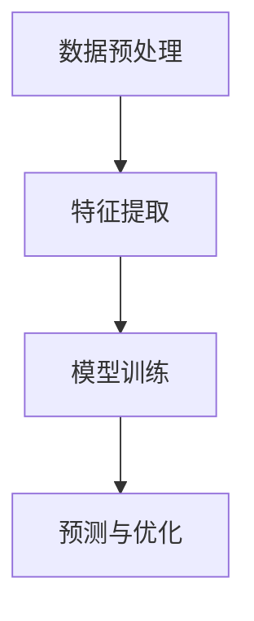

                 


# 新兴市场股市估值与智能物流last-mile配送的互动

---

## 关键词：
新兴市场，股市估值，智能物流，last-mile配送，互动关系

---

## 摘要：
本文探讨了新兴市场股市估值与智能物流last-mile配送之间的互动关系。通过分析股市估值的核心要素和智能物流的关键技术，揭示两者在经济运行中的相互影响。文章从背景介绍、核心概念、算法原理、数学模型、系统架构、项目实战和最佳实践等方面展开，结合实例分析，深入剖析互动机制，并提出未来研究方向。

---

## 第一部分：新兴市场股市估值与智能物流的背景与互动关系

### 第1章：新兴市场股市估值与智能物流的背景介绍

#### 1.1 新兴市场的定义与特点
新兴市场是指经济快速发展但尚未完全工业化的国家，通常具有较高的增长率和较大的市场潜力。其特点包括：
- **高增长率**：新兴市场年均GDP增速通常超过全球平均水平。
- **人口红利**：年轻人口比例高，消费市场潜力大。
- **政策支持**：政府往往通过政策引导推动经济和科技发展。

#### 1.2 智能物流last-mile配送的定义与特点
智能物流是指通过技术手段优化物流过程，实现高效、精准的货物配送。last-mile配送是物流的最后一步，直接关系到用户体验。其特点包括：
- **技术驱动**：依赖物联网、大数据和人工智能。
- **高效性**：通过智能算法优化配送路径，降低配送成本。
- **用户导向**：以客户为中心，提供个性化服务。

#### 1.3 股市估值与智能物流的互动关系
股市估值反映了市场对企业的价值预期，而智能物流作为企业的运营成本之一，影响企业的盈利能力和市场表现。两者的互动关系主要体现在：
- **物流效率提升企业利润**：高效的物流降低成本，提升企业盈利能力，进而影响股市估值。
- **股市资金推动物流技术发展**：股市融资为物流企业提供了资金支持，推动技术升级，进一步优化物流效率。

#### 1.4 本章小结
新兴市场和智能物流的互动关系是双向的，股市估值为企业提供资金支持，企业通过提升物流效率反哺股市表现。

---

## 第二部分：新兴市场股市估值与智能物流的核心概念与联系

### 第2章：股市估值与智能物流的核心概念原理

#### 2.1 股市估值的核心要素
股市估值主要涉及以下指标：
- **市盈率（P/E Ratio）**：股票价格与每股收益的比率，反映市场对公司的盈利预期。
- **市净率（P/B Ratio）**：股票价格与每股净资产的比率，衡量资产质量。
- **股息率（Dividend Yield）**：股息与股票价格的比率，反映投资回报率。

#### 2.2 智能物流last-mile配送的关键技术
智能物流的关键技术包括：
- **物联网（IoT）**：通过传感器和设备实时监控物流过程。
- **大数据分析**：利用数据优化配送路径和库存管理。
- **人工智能与机器学习**：预测需求、优化配送网络。

#### 2.3 股市估值与智能物流的互动机制
- **物流效率对股市估值的影响**：高效的物流降低成本，提升企业利润，吸引更多投资者，推动股价上涨。
- **股市资金流动对物流技术的推动**：股市融资为企业提供资金，用于技术升级和网络扩展，进一步提升物流效率。

---

## 第三部分：新兴市场股市估值与智能物流的互动机制分析

### 第3章：算法原理与数学模型

#### 3.1 算法原理
我们设计了一个基于机器学习的模型，用于分析股市估值与物流效率的关系。模型流程如下：



特征提取包括从股市数据中提取市盈率、市净率等指标，以及从物流数据中提取配送时间、成本等指标。

#### 3.2 数学模型
我们建立了以下回归模型：

$$
\text{物流效率} = \beta_0 + \beta_1 \times \text{市盈率} + \beta_2 \times \text{市净率} + \epsilon
$$

通过回归分析，我们可以量化股市估值对物流效率的影响。

---

## 第四部分：系统分析与架构设计

### 第4章：系统架构设计

#### 4.1 系统功能设计
系统功能包括：
- **数据采集**：收集股市和物流数据。
- **数据分析**：通过算法分析数据，生成预测结果。
- **结果展示**：以可视化方式呈现分析结果。

#### 4.2 系统架构图


---

## 第五部分：项目实战与案例分析

### 第5章：项目实战

#### 5.1 环境安装
安装必要的Python库：

```bash
pip install numpy pandas scikit-learn matplotlib
```

#### 5.2 核心代码实现
以下是Python代码示例：

```python
import pandas as pd
from sklearn.linear_model import LinearRegression
import matplotlib.pyplot as plt

# 数据加载
data = pd.read_csv('data.csv')

# 特征与目标变量分离
X = data[['市盈率', '市净率']]
y = data['物流效率']

# 模型训练
model = LinearRegression()
model.fit(X, y)

# 预测与可视化
predictions = model.predict(X)
plt.scatter(y, predictions)
plt.xlabel('真实值')
plt.ylabel('预测值')
plt.show()
```

---

## 第六部分：总结与展望

### 第6章：最佳实践与总结

#### 6.1 小结
本文详细分析了新兴市场股市估值与智能物流last-mile配送的互动关系，揭示了两者在经济发展中的相互作用。

#### 6.2 注意事项
- 数据采集的准确性影响分析结果。
- 模型选择需根据实际数据特点进行调整。

#### 6.3 拓展阅读
建议进一步研究股市波动与物流成本的动态关系。

---

## 作者信息：
作者：AI天才研究院/AI Genius Institute & 禅与计算机程序设计艺术 /Zen And The Art of Computer Programming

