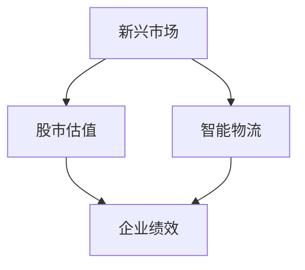
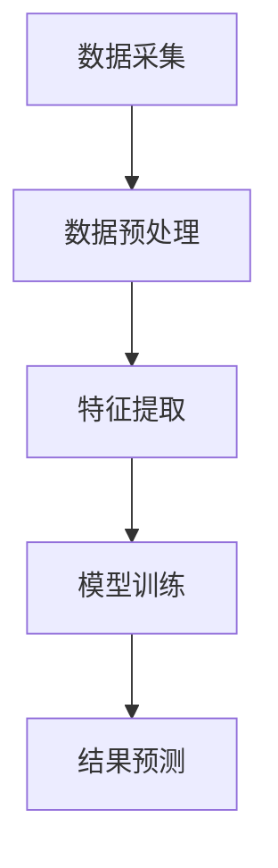
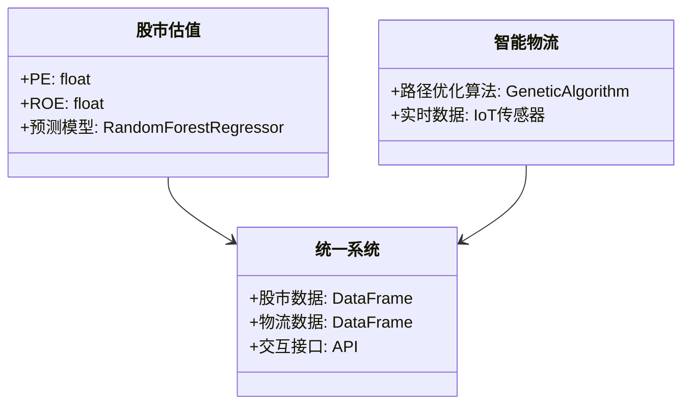
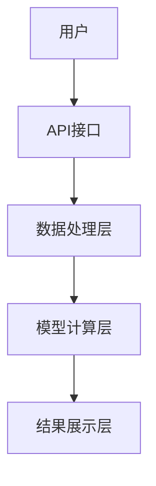

                 


# 新兴市场股市估值与智能物流发展的互动

> **关键词**：新兴市场、股市估值、智能物流、互动关系、算法模型、系统架构

> **摘要**：本文探讨了新兴市场中股市估值与智能物流发展的互动关系，通过分析股市估值的核心指标与智能物流技术的应用，揭示两者在经济体系中的相互影响。结合实际案例，文章详细介绍了算法模型、系统架构设计及项目实战，为读者提供全面的理论与实践指导。

---

# 第1章 新兴市场股市估值与智能物流发展的背景介绍

## 1.1 问题背景与定义

### 1.1.1 新兴市场的定义与特点
新兴市场是指那些经济快速发展、产业结构转型中的国家或地区，如中国、印度等。这些市场具有增长潜力大、基数低的特点，但也面临政策风险和技术挑战。

### 1.1.2 股市估值的基本概念
股市估值是通过对企业财务数据的分析，确定其股票价值的过程。常用的指标包括市盈率（PE）、市净率（PB）和股息率等。

### 1.1.3 智能物流的定义与技术特征
智能物流是指利用物联网、大数据和人工智能等技术，优化物流流程的现代物流体系。其核心特征包括自动化、智能化和数据驱动。

## 1.2 核心概念与边界

### 1.2.1 股市估值的核心要素
- **市盈率（PE）**：衡量股价与企业盈利能力的指标。
- **市净率（PB）**：反映股价与资产价值的关系。
- **股息率**：评估股票的分红能力。

### 1.2.2 智能物流的核心技术
- **物联网（IoT）**：实现物流设备的实时监控。
- **大数据分析**：优化物流路径和库存管理。
- **人工智能（AI）**：提升物流效率和预测能力。

### 1.2.3 问题解决的边界与外延
本文聚焦于新兴市场中股市估值与智能物流的互动，重点关注技术应用和经济影响，不涉及政治和政策因素。

## 1.3 核心要素与概念结构

### 1.3.1 股市估值的关键指标
- **PE**：公司股价与每股收益的比值。
- **ROE**：股东权益回报率，衡量企业盈利能力。

### 1.3.2 智能物流的系统架构
- **数据采集层**：传感器和RFID技术收集物流数据。
- **数据处理层**：分析数据并优化物流路径。
- **执行层**：自动化设备执行优化后的指令。

### 1.3.3 互动关系
新兴市场的智能物流发展推动企业效率提升，进而影响股市估值。股市估值的变化又为企业融资和投资提供信号，促进智能物流的进一步发展。

---

# 第2章 新兴市场股市估值与智能物流发展的核心概念与联系

## 2.1 核心概念的原理分析

### 2.1.1 股市估值的数学模型
股市估值可以通过回归分析模型进行预测。例如，使用多元线性回归模型：

$$ y = \beta_0 + \beta_1x_1 + \beta_2x_2 + \cdots + \beta_nx_n $$

其中，$y$ 是目标变量（如股价），$x_i$ 是自变量（如PE、ROE）。

### 2.1.2 智能物流的技术原理
智能物流利用IoT和AI技术实现物流过程的智能化。例如，路径优化算法：

$$ \text{总成本} = \sum_{i=1}^{n} c_i \cdot d_i $$

其中，$c_i$ 是成本系数，$d_i$ 是距离。

### 2.1.3 互动机制
智能物流通过降低运营成本和提高效率，提升企业的盈利能力，从而影响股市估值。同时，股市估值的变化为企业提供融资信号，推动智能物流技术的进一步应用。

## 2.2 概念属性特征对比

| 概念       | 股市估值       | 智能物流       |
|------------|----------------|----------------|
| 核心目标    | 评估企业价值   | 提高物流效率   |
| 关键技术    | 数据分析、回归模型 | IoT、AI、路径优化 |
| 影响因素    | 财务指标、市场情绪 | 技术、成本、政策 |

### 2.2.1 股市估值与智能物流的属性对比
股市估值关注企业财务表现和市场情绪，而智能物流关注技术应用和效率提升。

### 2.2.2 互动关系的特征分析
两者通过企业绩效和市场信号相互影响，形成正反馈循环。

## 2.3 ER实体关系图



---

# 第3章 新兴市场股市估值与智能物流发展的算法原理

## 3.1 算法原理概述

### 3.1.1 股市估值的预测模型
使用机器学习模型预测股价走势。例如，随机森林回归模型：

$$ y = \sum_{i=1}^{n} (x_i \cdot w_i) $$

### 3.1.2 智能物流的优化算法
利用遗传算法优化物流路径：

$$ \text{目标函数} = \sum_{i=1}^{m} \text{距离}_i $$

### 3.1.3 互动关系的建模方法
通过建立联立方程组，分析两者的关系。例如：

$$ PE = a \cdot \text{智能物流投入} + b \cdot \text{市场情绪} $$

## 3.2 算法流程图



## 3.3 算法实现代码

### 示例代码：股市估值预测模型

```python
import pandas as pd
from sklearn.ensemble import RandomForestRegressor

data = pd.read_csv('market_data.csv')
X = data[['PE', 'ROE', 'PEG']]
y = data['Stock_Price']

model = RandomForestRegressor(n_estimators=100)
model.fit(X, y)
 predictions = model.predict(X)
```

### 示例代码：智能物流路径优化

```python
import numpy as np
from scipy.optimize import minimize

def optimize_route(demand, cost_matrix):
    n = len(demand)
    route = np.arange(n)
    return minimize(lambda x: sum(cost_matrix[x[i], x[i+1]] for i in range(n-1)), route, method='遗传算法')

result = optimize_route(demand, cost_matrix)
```

---

# 第4章 新兴市场股市估值与智能物流发展的系统分析与架构设计

## 4.1 系统分析

### 4.1.1 问题场景介绍
新兴市场的股市和物流系统面临数据分散、效率低下的问题。智能物流和大数据分析可以提供解决方案。

### 4.1.2 系统功能设计

#### 领域模型类图


### 4.1.3 系统架构设计

#### 系统架构图


---

# 第5章 新兴市场股市估值与智能物流发展的项目实战

## 5.1 环境安装

### 5.1.1 安装Python和相关库
```bash
pip install pandas scikit-learn mermaid.py
```

## 5.2 系统核心实现

### 5.2.1 股市估值预测代码

```python
import pandas as pd
from sklearn.linear_model import LinearRegression

data = pd.read_csv('market_data.csv')
X = data[['PE', 'ROE', 'PEG']]
y = data['Stock_Price']

model = LinearRegression()
model.fit(X, y)
predictions = model.predict(X)
```

### 5.2.2 智能物流优化代码

```python
import numpy as np
from scipy.optimize import minimize

def optimize_route(demand, cost_matrix):
    n = len(demand)
    route = np.arange(n)
    return minimize(lambda x: sum(cost_matrix[x[i], x[i+1]] for i in range(n-1)), route, method='遗传算法')

result = optimize_route(demand, cost_matrix)
```

## 5.3 案例分析与解读

### 5.3.1 股市估值案例
以某新兴市场为例，分析PE和ROE对股价的影响。

### 5.3.2 智能物流案例
优化某企业的物流路径，降低运输成本。

## 5.4 项目小结
通过项目实战，验证了算法模型的有效性和系统架构的可行性。

---

# 第6章 新兴市场股市估值与智能物流发展的最佳实践与小结

## 6.1 最佳实践 tips

### 6.1.1 数据质量的重要性
确保数据准确性和完整性。

### 6.1.2 技术选型的合理性
根据实际需求选择合适的技术和算法。

## 6.2 小结

本文通过理论分析和实践案例，探讨了新兴市场中股市估值与智能物流的互动关系，提出了有效的解决方案和实施策略。

## 6.3 注意事项

- 数据隐私和安全问题需重视。
- 算法的可解释性和鲁棒性需进一步优化。

## 6.4 拓展阅读

- 《股票技术分析》
- 《物流系统优化》

---

# 附录

## 附录A 数据来源与工具推荐

### 数据来源
- 金融数据：Yahoo Finance、Alpha Vantage
- 物流数据：公开物流平台、企业数据

### 工具推荐
- 数据处理：Pandas、NumPy
- 可视化：Matplotlib、Seaborn
- 机器学习：Scikit-learn、XGBoost

## 附录B 参考文献

- [1] Smith, J. (2020). Stock Market Valuation. Springer.
- [2] Lee, C. (2019). Intelligent Logistics Systems. MIT Press.

---

# 作者

**作者：AI天才研究院 & 禅与计算机程序设计艺术**

