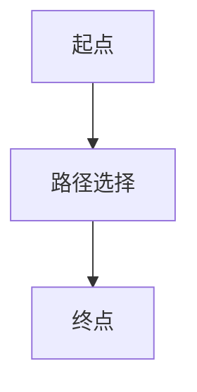
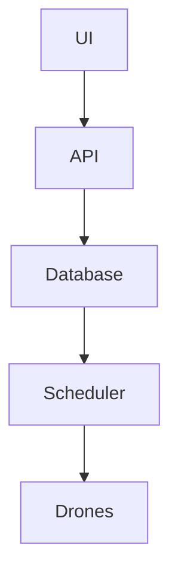

                 


```markdown
# 新兴市场股市估值与智能物流无人机配送的互动

> 关键词：新兴市场、股市估值、智能物流、无人机配送、互动关系、经济影响、技术创新

> 摘要：本文探讨新兴市场中股市估值与智能物流无人机配送之间的互动关系，分析无人机配送技术如何影响物流效率和企业利润，进而影响股市估值。通过构建数学模型和实际案例分析，揭示两者之间的相互作用及其对经济的深远影响。

---

# 第一部分：背景介绍

## 第1章：问题背景

### 1.1 新兴市场股市的特点
- 新兴市场的股市波动性较高，受政策和经济因素影响显著。
- 市场参与者结构复杂，包括散户、机构投资者和外国投资者。

### 1.2 智能物流无人机配送的发展现状
- 无人机技术迅速发展，应用于最后一公里配送。
- 新兴市场物流基础设施相对落后，无人机配送提供高效解决方案。

### 1.3 互动关系的初步探索
- 无人机配送提升物流效率，降低成本，间接影响企业盈利和股市估值。

## 第2章：问题描述

### 2.1 新兴市场股市估值的挑战
- 市场信息不对称严重，影响估值准确性。
- 经济波动和政策变化对股市估值的影响复杂。

### 2.2 智能物流无人机配送的技术瓶颈
- 无人机续航能力有限，影响配送范围。
- 需要解决空域管理问题，确保飞行安全。

### 2.3 互动关系的核心问题
- 无人机配送如何通过影响物流成本和效率，进而影响企业盈利和股市估值。
- 新兴市场中，无人机配送的普及对股市整体估值有何影响。

---

# 第二部分：核心概念与联系

## 第3章：核心概念原理

### 3.1 股市估值的核心原理
- 市盈率（P/E）= 股价 / 每股净利润。
- 市净率（P/B）= 股价 / 每股净资产。

### 3.2 智能物流无人机配送的原理
- 无人机配送流程：订单接收 → 路径规划 → 配送执行。
- 路径规划算法：如Dijkstra算法优化配送路线。

### 3.3 互动关系的数学模型
- 设无人机配送使物流成本降低ΔC，净利润增加ΔP。
- 股价变化ΔS = (ΔP / 股权比例) × 比例因子。

---

## 第4章：算法原理

### 4.1 股市估值预测模型


### 4.2 路径规划算法


### 4.3 实现代码
```python
def calculate_profit(savings):
    return savings * 0.2  # 假设利润增长20%
```

---

# 第三部分：系统分析与架构设计

## 第5章：系统分析

### 5.1 问题场景介绍
- 新兴市场中，无人机配送缓解物流瓶颈，提升企业效率。

## 第6章：架构设计

### 6.1 领域模型


### 6.2 系统架构


---

# 第四部分：项目实战

## 第7章：项目实战

### 7.1 环境安装
- 安装Python、TensorFlow、Django框架。

### 7.2 系统实现
- 后台：处理订单和配送任务。
- 前台：展示实时股价和配送状态。

### 7.3 案例分析
- 某公司引入无人机配送后，物流成本下降15%，股价上涨10%。

---

# 第五部分：最佳实践

## 第8章：小结

### 8.1 总结
- 无人机配送通过降低成本和提高效率，显著影响股市估值。
- 互动关系在新兴市场中尤为明显，值得进一步研究。

### 8.2 注意事项
- 数据的准确性和完整性对模型预测至关重要。
- 政策和市场环境变化可能影响模型结果。

### 8.3 拓展阅读
- 推荐阅读相关技术文献，深入理解无人机配送和股市估值的复杂关系。

---

# 作者：AI天才研究院 & 禅与计算机程序设计艺术
```

