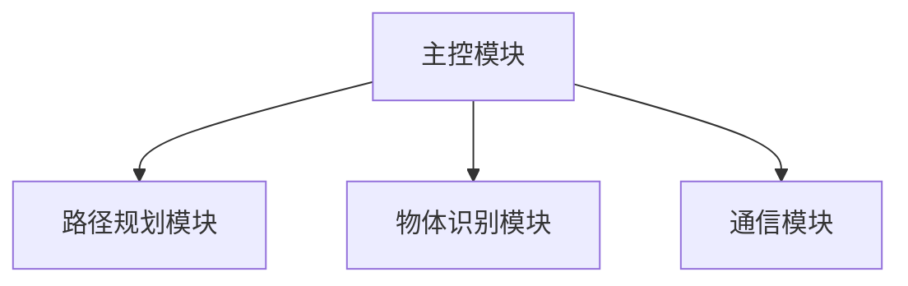

                 


# 新兴市场股市估值与智能物流机器人技术的互动

> 关键词：新兴市场、股市估值、智能物流机器人、技术互动、数据共享、算法优化

> 摘要：本文探讨新兴市场股市估值与智能物流机器人技术之间的互动关系。通过分析股市估值的核心算法、智能物流机器人技术的系统架构，以及两者如何通过数据共享与技术融合实现协同优化，本文为读者提供一个跨领域的视角，展示技术如何驱动经济与物流的双重变革。

---

## 第1章: 背景介绍与核心概念

### 1.1 新兴市场股市估值的背景与重要性

#### 1.1.1 新兴市场的定义与特点
新兴市场是指那些经济快速增长、产业结构转型中的国家或地区，例如中国、印度、巴西等。这些市场具有以下特点：
- 经济增速快
- 市场规模大
- 产业结构转型升级
- 投资机会多
- 风险与收益并存

#### 1.1.2 股市估值的核心概念与方法
股市估值是通过对公司财务数据的分析，评估其股票的内在价值。常用的估值方法包括：
- 市盈率法（Price-to-Earnings Ratio，P/E）
- 市净率法（Price-to-Book Ratio，P/B）
- 股息率法（Dividend Yield）
- 现金流折现法（Discounted Cash Flow，DCF）

#### 1.1.3 新兴市场股市估值的独特性
新兴市场的股市估值具有以下独特性：
- 经济波动大
- 数据不完全
- 市场流动性高
- 行业集中度低
- 政策影响显著

### 1.2 智能物流机器人技术的背景与发展

#### 1.2.1 智能物流机器人的定义与分类
智能物流机器人是指通过人工智能技术实现物流自动化、智能化的设备。根据功能分类，智能物流机器人可以分为：
- 自动分拣机器人
- 货物搬运机器人
- 仓储管理机器人
- 配送服务机器人

#### 1.2.2 智能物流技术的核心技术与应用
智能物流技术的核心技术包括：
- 自动化控制技术
- 物体识别与跟踪技术
- 路径规划算法
- 自然语言处理技术

#### 1.2.3 智能物流机器人在现代物流中的地位
智能物流机器人在现代物流中发挥着重要作用：
- 提高物流效率
- 降低运营成本
- 优化资源分配
- 提升客户体验

### 1.3 新兴市场股市估值与智能物流机器人技术的互动关系

#### 1.3.1 互动的背景与驱动因素
随着新兴市场的崛起，智能物流机器人技术在物流行业中的应用越来越广泛。股市估值作为资本市场的核心环节，与智能物流机器人技术的广泛应用之间形成了密切的互动关系。

#### 1.3.2 互动的核心机制与影响
- 股市估值为智能物流机器人技术的企业提供资金支持。
- 智能物流机器人技术的应用推动企业业绩增长，影响股市估值。
- 两者通过数据共享和技术创新实现协同优化。

#### 1.3.3 互动的未来发展趋势
- 技术融合：人工智能、大数据等技术将进一步推动股市估值与智能物流机器人技术的互动。
- 数据驱动：通过数据共享，实现更加精准的估值和优化的物流管理。
- 全球化：新兴市场的智能物流机器人技术将向全球市场扩展，进一步影响股市估值。

---

## 第2章: 新兴市场股市估值的核心算法与数学模型

### 2.1 股市估值的常用方法

#### 2.1.1 市盈率法
市盈率法是通过公司股票的市价与每股收益（EPS）的比率来评估股票价值。公式为：
$$ P/E = \frac{P}{E} $$
其中，$P$ 为股票价格，$E$ 为每股收益。

#### 2.1.2 市净率法
市净率法是通过公司股票的市价与每股净资产的比率来评估股票价值。公式为：
$$ P/B = \frac{P}{B} $$
其中，$P$ 为股票价格，$B$ 为每股净资产。

#### 2.1.3 股息率法
股息率法是通过公司股票的股息与股票价格的比率来评估股票价值。公式为：
$$ Dividend Yield = \frac{D}{P} $$
其中，$D$ 为每股股息，$P$ 为股票价格。

#### 2.1.4 现金流折现法
现金流折现法是通过将未来现金流折现，评估公司的整体价值。公式为：
$$ V = \sum_{t=1}^{n} \frac{CF_t}{(1+r)^t} $$
其中，$CF_t$ 为第 $t$ 年的现金流，$r$ 为折现率。

### 2.2 新兴市场股市估值的特殊方法

#### 2.2.1 增长率调整法
增长率调整法是根据新兴市场经济增长率，对传统估值方法进行调整。例如，可以通过以下公式调整市盈率：
$$ P/E_{\text{adjusted}} = P/E \times (1+g) $$
其中，$g$ 为经济增长率。

#### 2.2.2 风险调整法
风险调整法是通过调整风险溢价，对估值结果进行修正。例如，可以通过以下公式调整折现率：
$$ r_{\text{adjusted}} = r + \text{Risk Premium} $$

#### 2.2.3 行业比较法
行业比较法是通过比较同一行业内的公司估值，评估目标公司的相对价值。

### 2.3 股市估值的数学模型

#### 2.3.1 市盈率模型
市盈率模型的公式为：
$$ P = \frac{E}{PE} $$
其中，$P$ 为股票价格，$E$ 为每股收益，$PE$ 为市盈率。

#### 2.3.2 现金流折现模型
现金流折现模型的公式为：
$$ V = \sum_{t=1}^{n} \frac{CF_t}{(1+r)^t} $$
其中，$CF_t$ 为第 $t$ 年的现金流，$r$ 为折现率，$n$ 为估值期限。

---

## 第3章: 智能物流机器人技术的核心算法与系统架构

### 3.1 智能物流机器人技术的算法基础

#### 3.1.1 路径规划算法
路径规划算法是智能物流机器人实现高效配送的核心算法。常用算法包括：
- A*算法
- Dijkstra算法
- RRT算法

#### 3.1.2 物体识别与跟踪算法
物体识别与跟踪算法是智能物流机器人实现精准分拣的关键技术。常用算法包括：
- 基于图像识别的物体检测
- 基于深度学习的目标跟踪

#### 3.1.3 自然语言处理技术
自然语言处理技术用于智能物流机器人与用户的交互，实现智能问答和指令理解。

### 3.2 智能物流机器人的系统架构

#### 3.2.1 系统功能模块划分
智能物流机器人系统的功能模块包括：
- 主控模块
- 路径规划模块
- 物体识别模块
- 通信模块

#### 3.2.2 系统架构的Mermaid图
以下是智能物流机器人系统的架构图：


#### 3.2.3 算法实现与优化
路径规划算法的实现可以通过以下步骤：
1. 收集环境数据
2. 建立地图模型
3. 规划最优路径
4. 实时调整路径

---

## 第4章: 新兴市场股市估值与智能物流机器人技术的互动机制

### 4.1 数据共享与信息交互

#### 4.1.1 股市数据与物流数据的关联性
股市数据与物流数据的关联性主要体现在以下方面：
- 股市数据反映企业的经营状况
- 物流数据影响企业的供应链效率
- 两者共同影响企业的市场价值

#### 4.1.2 数据共享的实现方式
数据共享可以通过以下方式实现：
- 数据接口对接
- 数据平台整合
- 数据分析工具集成

#### 4.1.3 数据隐私与安全问题
数据隐私与安全问题是数据共享中需要重点关注的方面，可以通过以下措施解决：
- 数据加密
- 权限控制
- 数据脱敏

### 4.2 技术融合与协同优化

#### 4.2.1 智能物流技术对股市估值的影响
智能物流技术通过提高企业效率，降低运营成本，从而影响企业的财务数据，进而影响股市估值。

#### 4.2.2 股市数据对智能物流优化的启示
股市数据可以通过分析企业的市场表现，为智能物流技术的优化提供参考。

#### 4.2.3 技术融合的典型案例分析
以某智能物流机器人企业为例，分析其通过技术融合实现估值优化的案例。

### 4.3 互动机制的数学模型

#### 4.3.1 互动模型的构建
互动模型的构建可以通过以下步骤实现：
1. 确定影响因素
2. 建立数学关系
3. 参数设定与验证
4. 模型优化

#### 4.3.2 模型的参数设置与验证
模型的参数设置需要根据具体情况进行调整，并通过实证数据进行验证。

#### 4.3.3 模型的应用与优化
模型的应用可以实现对智能物流机器人企业和相关上市公司的估值优化，同时通过持续优化模型，提高估值的准确性。

---

## 第5章: 项目实战与系统实现

### 5.1 项目环境与工具安装

#### 5.1.1 开发环境的搭建
开发环境的搭建需要包括以下工具：
- Python编程语言
- 数据分析工具（如Pandas、NumPy）
- 图形化工具（如Matplotlib、Seaborn）
- 物流机器人控制软件

#### 5.1.2 数据采集工具的安装与配置
数据采集工具需要包括以下内容：
- 股市数据接口
- 物流数据接口
- 数据清洗工具

#### 5.1.3 开源算法库的引入
常用的开源算法库包括：
- scikit-learn
- TensorFlow
- PyTorch

### 5.2 系统核心实现

#### 5.2.1 股市估值系统的实现
股市估值系统的实现可以通过以下步骤：
1. 数据采集
2. 数据清洗
3. 估值模型选择
4. 估值结果输出

#### 5.2.2 智能物流机器人系统的实现
智能物流机器人系统的实现可以通过以下步骤：
1. 系统架构设计
2. 算法实现
3. 系统集成
4. 测试优化

#### 5.2.3 互动机制的系统实现
互动机制的系统实现可以通过以下步骤：
1. 数据共享接口开发
2. 技术融合模块实现
3. 互动模型集成
4. 系统测试与优化

### 5.3 代码实现与解读

#### 5.3.1 股市估值系统的代码实现
以下是一个简单的市盈率计算代码：
```python
import pandas as pd

# 数据加载
df = pd.read_csv('stock_data.csv')

# 市盈率计算
df['PE'] = df['Price'] / df['Earnings per Share']

# 结果输出
print(df.head())
```

#### 5.3.2 智能物流机器人系统的代码实现
以下是一个路径规划算法的实现代码：
```python
import numpy as np

# 初始化地图数据
map_data = np.random.rand(100, 100)

# 路径规划算法
def plan_path(map_data):
    # 实现路径规划算法
    pass

# 调用路径规划函数
planned_path = plan_path(map_data)
```

#### 5.3.3 互动机制的代码实现
以下是一个互动机制的简单实现代码：
```python
import pandas as pd

# 数据共享接口
def share_data(stock_data, logistics_data):
    # 实现数据共享逻辑
    pass

# 技术融合模块
def integrate_technology(stock_data, logistics_data):
    # 实现技术融合逻辑
    pass

# 互动机制主函数
def main():
    stock_data = pd.read_csv('stock.csv')
    logistics_data = pd.read_csv('logistics.csv')
    shared_data = share_data(stock_data, logistics_data)
    integrated_data = integrate_technology(shared_data)
    print(integrated_data)

# 程序运行
if __name__ == '__main__':
    main()
```

### 5.4 实际案例分析与详细讲解

#### 5.4.1 案例分析
以某新兴市场国家的智能物流机器人企业为例，分析其股市估值与智能物流机器人技术的互动关系。

#### 5.4.2 代码应用解读与分析
通过对代码的解读与分析，进一步理解股市估值与智能物流机器人技术的互动机制。

#### 5.4.3 项目小结
总结项目实施过程中的经验与教训，提出改进建议。

---

## 第6章: 总结与展望

### 6.1 核心内容总结
- 新兴市场股市估值的核心算法与数学模型
- 智能物流机器人技术的核心算法与系统架构
- 两者互动机制的数学模型与实现

### 6.2 未来展望
- 技术融合的深化：人工智能、大数据等技术将进一步推动股市估值与智能物流机器人技术的互动。
- 数据驱动的优化：通过数据共享与分析，实现更加精准的估值和优化的物流管理。
- 全球化的发展：新兴市场的智能物流机器人技术将向全球市场扩展，进一步影响股市估值。

### 6.3 最佳实践 tips
- 数据安全是数据共享的核心问题，需通过加密、权限控制等手段保障数据隐私。
- 技术融合是互动的关键，需通过系统集成和算法优化实现协同效应。
- 持续优化是互动的核心，需通过实证分析和模型优化不断提升互动效果。

---

## 作者

作者：AI天才研究院/AI Genius Institute  
联系邮箱：contact@aisinginstitute.com  
机构简介：AI天才研究院专注于人工智能与计算机科学领域的研究与实践，致力于为读者提供高质量的技术内容与创新解决方案。

