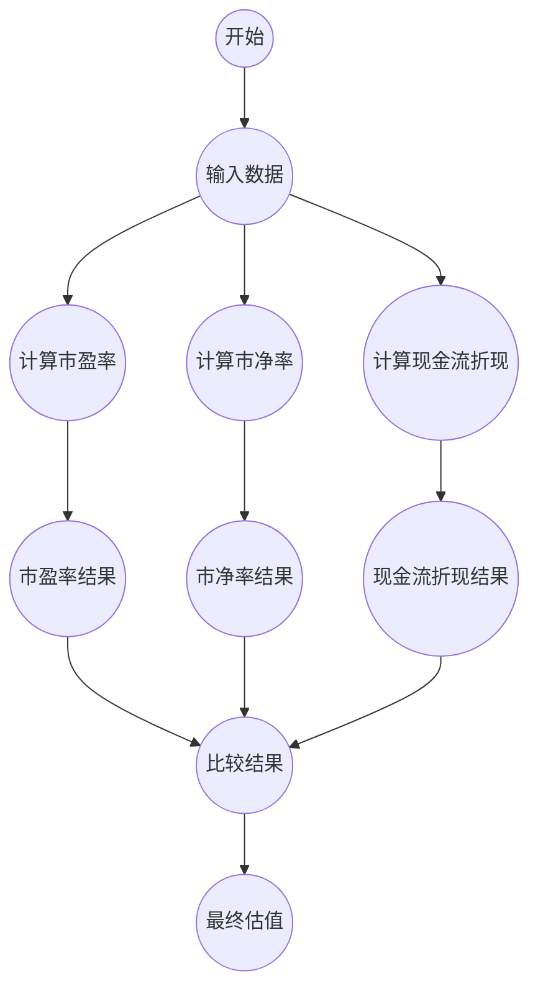
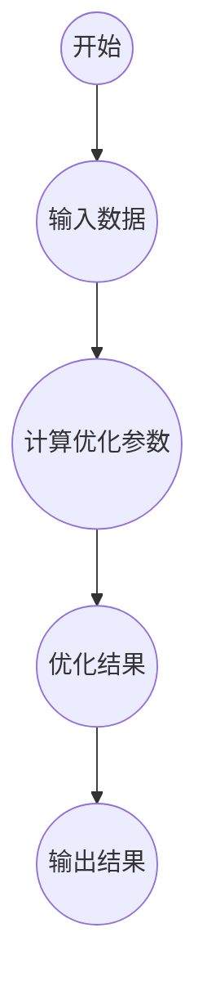
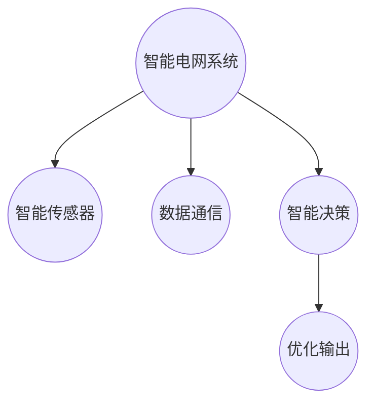

                 

# 新兴市场股市估值与智能电网优化技术的互动

> 关键词：新兴市场，股市估值，智能电网，优化技术，数据驱动

> 摘要：本文探讨新兴市场中股市估值与智能电网优化技术之间的互动关系，分析两者如何通过数据驱动的方式实现协同优化，为投资者和能源管理者提供新的视角和方法。

---

## 第1章: 新兴市场股市估值与智能电网优化技术的互动概述

### 1.1 新兴市场的定义与特点

#### 1.1.1 新兴市场的经济特征
新兴市场通常指那些经济发展迅速、市场机制逐步完善的国家，如中国、印度、巴西等。这些市场具有以下特点：
- 经济增速快，但波动性较大。
- 市场规模逐步扩大，但基础设施仍需完善。
- 投资者结构多元化，包括机构投资者和个人投资者。

#### 1.1.2 新兴市场的股市特点
新兴市场的股市具有以下特点：
- 市场流动性较高，但波动性较大。
- 市场参与者结构多元化，包括本地投资者和外国投资者。
- 市场信息透明度逐步提高，但仍有信息不对称问题。

#### 1.1.3 新兴市场与智能电网的关系
智能电网是新兴市场能源转型的重要方向。随着经济的发展，新兴市场对能源的需求不断增加，智能电网技术能够有效优化能源分配，降低能源浪费，提高能源利用效率。

### 1.2 股市估值的核心概念

#### 1.2.1 股市估值的基本方法
股市估值是通过分析公司的财务数据、行业地位、市场前景等因素，对公司的股票价格进行合理评估的过程。常用的方法包括：
- 市盈率（P/E）模型
- 市净率（P/B）模型
- 现金流折现模型（DCF）

#### 1.2.2 股市估值的关键指标
- 市盈率（P/E）：衡量股票价格与每股收益的比率。
- 市净率（P/B）：衡量股票价格与每股净资产的比率。
- 净利润增长率：衡量公司盈利能力的增长速度。
- 营业收入增长率：衡量公司收入的增长速度。

#### 1.2.3 股市估值的边界与外延
股市估值不仅关注公司的财务数据，还需要考虑宏观经济环境、行业发展趋势、政策法规等因素。

### 1.3 智能电网优化技术的定义与特点

#### 1.3.1 智能电网的定义
智能电网是指通过先进的传感、通信、控制技术，实现电力系统各个环节的智能化监测、分析和决策，以提高电力系统的可靠性和效率。

#### 1.3.2 智能电网的核心技术
- 智能传感器技术：用于实时监测电力系统的运行状态。
- 数据通信技术：用于电力系统数据的实时传输。
- 智能决策技术：基于大数据分析，优化电力系统的运行。

#### 1.3.3 智能电网优化技术的特点
- 实时性：能够快速响应电力系统的动态变化。
- 可扩展性：能够适应电力系统规模的变化。
- 高效性：能够显著提高电力系统的运行效率。

### 1.4 股市估值与智能电网优化技术的互动关系

#### 1.4.1 互动的核心概念
股市估值与智能电网优化技术的互动是指通过智能电网数据的分析，优化股市估值模型，从而提高估值的准确性。

#### 1.4.2 互动的主要机制
- 数据驱动：通过智能电网产生的海量数据，为股市估值提供新的数据来源。
- 技术协同：智能电网优化技术的应用能够提高能源公司的运营效率，从而影响其股票估值。

#### 1.4.3 互动的边界与外延
- 数据质量：智能电网数据的准确性直接影响股市估值的准确性。
- 技术成熟度：智能电网优化技术的成熟度影响其对股市估值的贡献程度。
- 市场环境：宏观经济环境和政策法规对互动关系有重要影响。

#### 1.5 本章小结

---

## 第2章: 股市估值的核心概念与技术

### 2.1 股市估值的背景与问题描述

#### 2.1.1 股市估值的背景
随着经济全球化的发展，股市估值成为投资者评估股票价值的重要工具。

#### 2.1.2 股市估值的核心问题
- 如何准确评估股票的内在价值？
- 如何利用大数据技术提高估值的准确性？

#### 2.1.3 股市估值的目标与意义
- 帮助投资者做出理性的投资决策。
- 提高金融市场的效率和透明度。

### 2.2 股市估值的核心技术

#### 2.2.1 市盈率模型

市盈率（P/E）是衡量股票价值的重要指标，其计算公式为：
$$ P/E = \frac{Price}{Earnings} $$

#### 2.2.2 市净率模型

市净率（P/B）是衡量股票价值的另一个重要指标，其计算公式为：
$$ P/B = \frac{Price}{Book\ Value} $$

#### 2.2.3 现金流折现模型

现金流折现模型（DCF）是通过预测公司未来现金流，将其折现为现值，从而评估股票价值的方法。其公式为：
$$ V = \sum_{t=1}^{n} \frac{CF_t}{(1+r)^t} $$

### 2.3 股市估值的技术对比分析

#### 2.3.1 不同估值模型的对比

| 模型 | 优点 | 缺点 |
|------|------|------|
| 市盈率模型 | 简单易懂 | 不适合亏损公司 |
| 市净率模型 | 考虑了资产价值 | 适用于周期性行业 |
| 现金流折现模型 | 精确性高 | 计算复杂 |

#### 2.3.2 各种估值模型的优缺点

- 市盈率模型：简单易懂，但不适合亏损公司。
- 市净率模型：考虑了资产价值，但适用于周期性行业。
- 现金流折现模型：精确性高，但计算复杂。

#### 2.3.3 合适场景的选择

- 对于成长型企业，现金流折现模型更合适。
- 对于周期性行业，市净率模型更合适。

### 2.4 股市估值的数学模型与公式

#### 2.4.1 市盈率公式
$$ P/E = \frac{Price}{Earnings} $$

#### 2.4.2 市净率公式
$$ P/B = \frac{Price}{Book\ Value} $$

#### 2.4.3 现金流折现公式
$$ V = \sum_{t=1}^{n} \frac{CF_t}{(1+r)^t} $$

### 2.5 股市估值的算法流程图

## 第3章: 智能电网优化技术的核心概念与技术

### 3.1 智能电网优化技术的背景与问题描述

#### 3.1.1 智能电网优化技术的背景
随着能源需求的增加和环保要求的提高，智能电网优化技术成为能源转型的重要方向。

#### 3.1.2 智能电网优化技术的核心问题
- 如何提高电力系统的运行效率？
- 如何降低能源浪费？

#### 3.1.3 智能电网优化技术的目标与意义
- 提高电力系统的可靠性和效率。
- 降低能源成本，减少碳排放。

### 3.2 智能电网优化技术的核心技术

#### 3.2.1 智能传感器技术

智能传感器用于实时监测电力系统的运行状态，包括电压、电流、温度等参数。

#### 3.2.2 数据通信技术

数据通信技术用于电力系统数据的实时传输，包括无线通信和光纤通信。

#### 3.2.3 智能决策技术

智能决策技术基于大数据分析，优化电力系统的运行策略。

### 3.3 智能电网优化技术的数学模型与公式

#### 3.3.1 智能电网优化模型
$$ \text{Minimize } \sum_{i=1}^{n} c_i x_i $$
$$ \text{Subject to } \sum_{i=1}^{n} x_i \leq C $$

#### 3.3.2 智能电网优化算法

### 3.4 智能电网优化技术的系统架构图

## 第4章: 股市估值与智能电网优化技术的互动机制

### 4.1 数据流与信息共享

智能电网产生的海量数据可以为股市估值提供新的数据来源，包括电力消耗、电价变化等。

### 4.2 技术协同

智能电网优化技术的应用能够提高能源公司的运营效率，从而影响其股票估值。

### 4.3 协同优化

通过智能电网数据的分析，优化股市估值模型，从而提高估值的准确性。

## 第5章: 案例分析与实战应用

### 5.1 案例分析

#### 5.1.1 案例背景
以印度智能电网项目为例，分析智能电网数据对股市估值的影响。

#### 5.1.2 数据分析
分析智能电网数据对能源公司股票估值的具体影响。

#### 5.1.3 结果与讨论
智能电网数据的引入能够显著提高股市估值的准确性。

### 5.2 实战应用

#### 5.2.1 环境安装
安装必要的数据分析工具和智能电网模拟软件。

#### 5.2.2 系统实现
实现智能电网数据与股市估值模型的集成。

#### 5.2.3 案例分析
通过具体案例分析，验证智能电网数据对股市估值的提升效果。

## 第6章: 总结与展望

### 6.1 总结

本文探讨了新兴市场股市估值与智能电网优化技术的互动关系，分析了两者如何通过数据驱动的方式实现协同优化。

### 6.2 展望

未来，随着智能电网技术的不断发展和股市估值模型的不断完善，两者之间的互动关系将更加紧密，为投资者和能源管理者提供新的视角和方法。

---

## 作者：AI天才研究院/AI Genius Institute & 禅与计算机程序设计艺术 /Zen And The Art of Computer Programming

