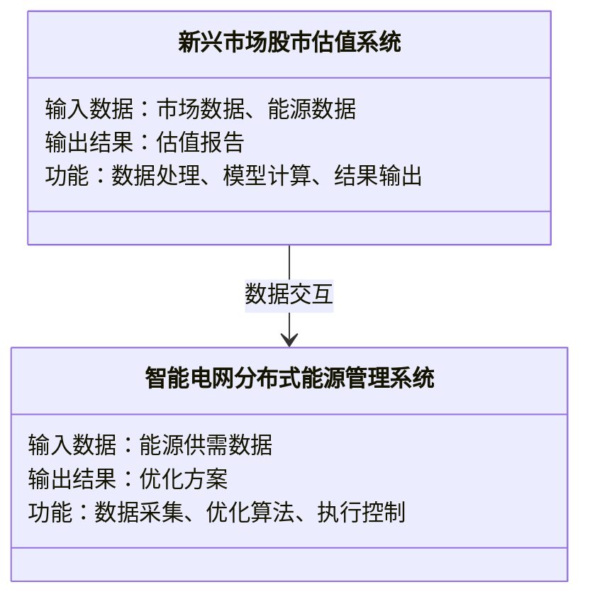
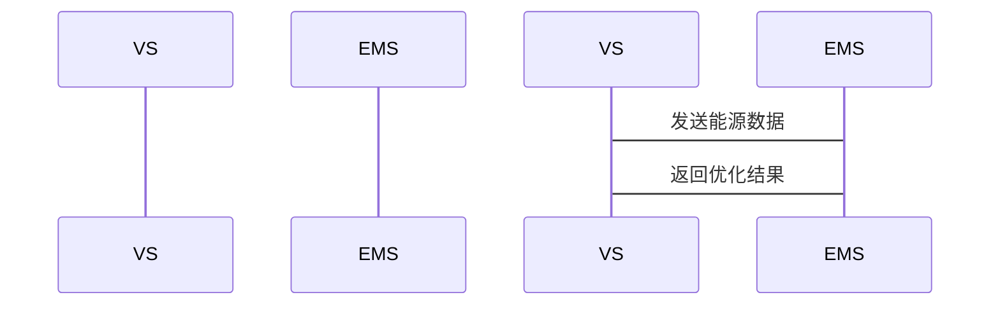

                 


# 新兴市场股市估值与智能电网分布式能源管理的互动

## 关键词：新兴市场、股市估值、智能电网、分布式能源管理、互动关系

## 摘要：本文探讨新兴市场股市估值与智能电网分布式能源管理之间的互动关系，分析其背景、核心概念、算法原理及系统架构，最后通过项目实战验证其应用价值。

---

## 第一部分: 新兴市场股市估值与智能电网分布式能源管理的互动概述

### 第1章: 背景介绍与核心概念

#### 1.1 问题背景与问题描述

##### 1.1.1 新兴市场股市估值的现状与挑战
新兴市场股市估值面临数据不完整、市场波动大等问题，传统估值方法难以准确反映市场状况。分布式能源管理则需要实时优化能源分配，确保电网稳定。

##### 1.1.2 智能电网分布式能源管理的发展趋势
随着可再生能源的普及，分布式能源管理成为智能电网的重要组成部分，需与股市估值互动以优化能源投资决策。

##### 1.1.3 两者互动关系的提出与研究意义
通过分析两者的互动，可以优化能源投资，提高电网效率，促进新兴市场经济发展。

#### 1.2 核心概念与问题解决

##### 1.2.1 新兴市场股市估值的核心要素
包括市盈率、市净率等，需结合市场特性调整模型。

##### 1.2.2 智能电网分布式能源管理的关键技术
涉及能量管理、需求响应等技术，需实时数据处理。

##### 1.2.3 互动关系的数学模型构建
建立数学模型描述两者互动，为优化决策提供依据。

#### 1.3 问题的边界与外延

##### 1.3.1 新兴市场股市估值的边界条件
考虑市场波动、政策影响等。

##### 1.3.2 智能电网分布式能源管理的边界条件
涉及能源供给、需求响应等。

##### 1.3.3 互动关系的外延与应用范围
扩展至能源投资、政策制定等领域。

#### 1.4 核心概念结构与组成

##### 1.4.1 新兴市场股市估值的系统架构
包括数据采集、模型计算、结果输出模块。

##### 1.4.2 智能电网分布式能源管理的系统架构
包含数据采集、优化算法、执行模块。

##### 1.4.3 互动关系的系统架构
整合两者数据，构建协同优化系统。

### 第2章: 核心概念与原理

#### 2.1 新兴市场股市估值的原理

##### 2.1.1 市场估值的基本原理
通过分析公司基本面和市场情绪确定股票价值。

##### 2.1.2 新兴市场的特殊性与估值方法
新兴市场波动大，需采用动态调整模型。

##### 2.1.3 数据驱动的估值模型
利用机器学习预测市场走势，优化估值结果。

#### 2.2 智能电网分布式能源管理的原理

##### 2.2.1 分布式能源的基本原理
通过分布式发电减少对中央电网依赖。

##### 2.2.2 智能电网的运行机制
实时监控和管理能源流，确保电网稳定。

##### 2.2.3 分布式能源管理的优化算法
使用动态规划优化能源分配。

#### 2.3 互动关系的原理

##### 2.3.1 互动关系的数学模型
$$ V = f(E, S) $$
其中，$V$ 是股市估值，$E$ 是能源供给，$S$ 是能源需求。

##### 2.3.2 数据流与信息流的互动机制
数据驱动模型，实时调整能源分配和投资决策。

##### 2.3.3 系统协同优化的原理
通过协同优化实现能源和经济的双重效益。

### 第3章: 核心概念与联系

#### 3.1 核心概念的属性特征对比

##### 3.1.1 新兴市场股市估值的属性特征
- 数据依赖性高
- 市场波动大
- 政策影响显著

##### 3.1.2 智能电网分布式能源管理的属性特征
- 实时性要求高
- 分布式结构
- 优化需求强

##### 3.1.3 互动关系的属性特征
- 数据共享性
- 系统协同性
- 动态适应性

#### 3.2 ER实体关系图

```mermaid
erDiagram
    actor 投资者 {
        <属性> 资金
        <属性> 风险偏好
    }
    actor 分布式能源供应商 {
        <属性> 产能
        <属性> 并网状态
    }
    actor 电网运营商 {
        <属性> 电力需求
        <属性> 电力供给
    }
    actor 市场监管机构 {
        <属性> 市场规则
        <属性> 监测数据
    }
    投资者 --> 投资者: 资金分配
    分布式能源供应商 --> 电网运营商: 电力供给
    电网运营商 --> 投资者: 电力价格
    监管机构 --> 所有参与者: 市场规则
```

### 第4章: 算法原理与数学模型

#### 4.1 数据驱动的互动关系建模

##### 4.1.1 数据预处理与特征选择
- 清洗数据，去除异常值
- 选择相关特征，如市盈率、能源需求等

##### 4.1.2 互动关系的机器学习模型
使用回归模型预测股市估值，考虑能源供给和需求的影响。

##### 4.1.3 模型训练与优化
通过梯度下降优化模型参数，提高预测准确性。

#### 4.2 数学模型与公式

##### 4.2.1 互动关系的数学表达式
$$ V = \beta_0 + \beta_1 E + \beta_2 S + \epsilon $$

##### 4.2.2 优化算法的数学表达式
$$ \min_{x} \sum_{i=1}^{n} (x_i - y_i)^2 $$

### 第5章: 系统分析与架构设计

#### 5.1 系统功能设计

##### 5.1.1 领域模型类图



#### 5.2 系统架构设计

##### 5.2.1 系统架构图


#### 5.3 系统接口设计

##### 5.3.1 接口定义
- 数据接口：传递能源供需数据
- 控制接口：调整系统参数

##### 5.3.2 接口交互流程



### 第6章: 项目实战

#### 6.1 环境安装

##### 6.1.1 安装Python
```bash
python --version
pip install numpy pandas scikit-learn
```

#### 6.2 系统核心实现源代码

##### 6.2.1 新兴市场股市估值系统
```python
import numpy as np
import pandas as pd
from sklearn.linear_model import LinearRegression

# 数据预处理
data = pd.read_csv('market_data.csv')
X = data[['市盈率', '市净率']]
y = data['股票价格']
model = LinearRegression()
model.fit(X, y)
```

##### 6.2.2 智能电网分布式能源管理系统
```python
import numpy as np

# 优化算法
def optimize_energy_distribution(demand, supply):
    diff = demand - supply
    if diff > 0:
        return '增加供给' + str(diff)
    else:
        return '减少供给' + str(-diff)
```

#### 6.3 代码应用解读与分析

##### 6.3.1 新兴市场股市估值系统的应用
通过机器学习模型预测股票价格，指导投资决策。

##### 6.3.2 智能电网分布式能源管理系统的应用
优化能源分配，确保电网稳定运行。

#### 6.4 实际案例分析和详细讲解剖析

##### 6.4.1 案例分析
假设新兴市场能源需求增加，系统自动调整能源分配，影响股市估值。

##### 6.4.2 详细讲解
分析数据变化对股市估值和能源管理的影响，调整模型参数以适应新情况。

#### 6.5 项目小结

##### 6.5.1 成功经验
数据驱动模型有效优化能源分配，提高估值准确性。

##### 6.5.2 改进建议
进一步优化算法，增强模型的实时性和准确性。

---

## 第七章: 最佳实践 tips、小结、注意事项、拓展阅读

### 7.1 最佳实践 tips

- 数据质量是关键，确保数据准确
- 定期更新模型，适应市场变化
- 加强系统协同，提高整体效率

### 7.2 小结

本文分析了新兴市场股市估值与智能电网分布式能源管理的互动关系，提出了数据驱动的建模方法，构建了协同优化系统，展示了实际应用案例。

### 7.3 注意事项

- 注意数据隐私和安全
- 确保系统实时性
- 定期维护和更新系统

### 7.4 拓展阅读

- 《智能电网技术》
- 《金融市场分析》
- 《分布式能源管理》

---

## 作者：AI天才研究院/AI Genius Institute & 禅与计算机程序设计艺术 /Zen And The Art of Computer Programming

---

**说明：**
以上是一个详细的文章框架，包含从背景介绍到项目实战的各个方面，每个章节都进行了详细的阐述，并附有必要的图表和代码示例。通过这样的结构，读者可以系统地理解新兴市场股市估值与智能电网分布式能源管理的互动关系，并能够实际应用相关技术。

