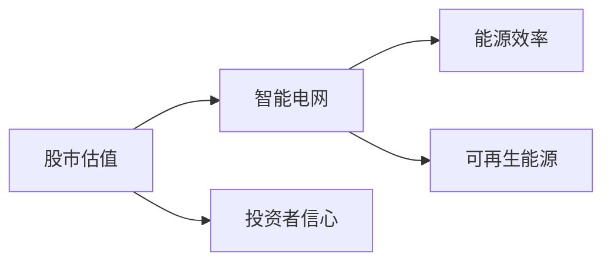
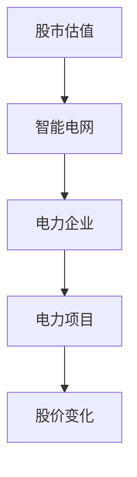
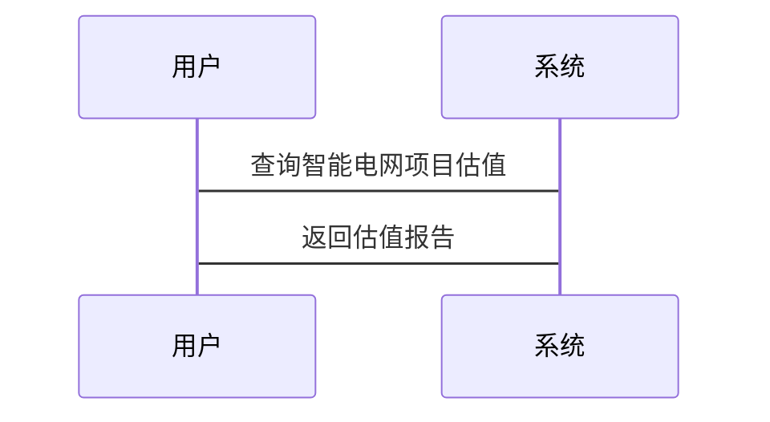

                 


# 新兴市场股市估值与智能电网建设的互动

## 关键词：
- 新兴市场
- 股市估值
- 智能电网
- 互动关系
- 经济发展

## 摘要：
本文探讨新兴市场中股市估值与智能电网建设之间的互动关系。通过分析股市估值的基本原理、智能电网的核心技术以及两者互动的机制，结合实际案例，揭示智能电网如何影响股市估值，并反过来促进智能电网的建设。文章旨在为投资者和政策制定者提供理论依据和实践指导。

---

# 第一部分: 背景介绍

## 第1章: 新兴市场股市估值与智能电网建设的互动概述

### 1.1 问题背景
#### 1.1.1 新兴市场的经济特点
新兴市场通常具有较高的经济增长潜力，但也伴随着较高的市场波动性和不确定性。这些市场的特点是经济结构多元化、产业升级迅速，同时面临能源需求增长和环境压力。

#### 1.1.2 智能电网在新兴市场的应用前景
智能电网通过整合可再生能源、智能计量和配电自动化，优化电力分配，提高能源使用效率。在新兴市场，智能电网的建设有助于解决电力供应不足、电网结构落后等问题，促进经济可持续发展。

#### 1.1.3 股市估值与智能电网建设的互动关系
股市估值反映了市场对企业的信心和未来盈利能力的预期。智能电网的建设不仅影响能源行业，还会带动相关产业的发展，进而影响股市估值。两者之间的互动关系体现在能源价格波动、政策变化和技术创新等多个方面。

### 1.2 问题描述
#### 1.2.1 股市估值的基本概念
股市估值是通过对公司财务指标和市场状况的分析，评估公司股票的合理价格。常用指标包括市盈率（P/E）、市净率（P/B）和股息率等。

#### 1.2.2 智能电网的核心功能
智能电网通过智能化的电力传输和管理，实现电力的高效分配和使用。其核心功能包括智能计量、配电自动化、需求响应和可再生能源整合。

#### 1.2.3 互动关系的机制与特点
智能电网的建设和运营直接影响能源企业的业绩和盈利能力，进而影响股市估值。同时，股市资金的流动也为智能电网项目提供了资金支持。

### 1.3 问题解决
#### 1.3.1 股市估值与智能电网互动的目标
通过分析智能电网建设对股市估值的影响，为投资者提供决策支持，同时引导资金流向智能电网相关产业，促进其发展。

#### 1.3.2 互动关系的实现路径
建立智能电网相关企业的估值模型，分析其财务表现和市场地位，评估智能电网项目对股价的潜在影响。

#### 1.3.3 互动机制的具体应用场景
在新兴市场中，智能电网的建设可能受到政府政策和能源需求的双重影响，股市投资者需要关注相关政策变化和企业业绩。

### 1.4 边界与外延
#### 1.4.1 股市估值的边界条件
包括市场流动性、政策风险和全球经济环境等因素。

#### 1.4.2 智能电网建设的边界条件
包括技术可行性、资金投入和政策支持等。

#### 1.4.3 互动关系的外延与扩展
智能电网与其他新兴技术（如物联网、大数据）的结合可能进一步影响股市估值。

### 1.5 概念结构与核心要素组成
#### 1.5.1 核心概念的层次结构
- 上层：股市估值
- 中层：智能电网
- 下层：互动机制

#### 1.5.2 核心要素的对比分析
| 要素 | 股市估值 | 智能电网 |
|------|----------|----------|
| 核心 | 财务指标 | 技术与管理 |
| 影响 | 投资者信心 | 能源效率 |
| 相关性 | 高 | 高 |

#### 1.5.3 概念结构的可视化图示


---

# 第二部分: 核心概念与联系

## 第2章: 核心概念原理

### 2.1 股市估值的核心原理
#### 2.1.1 股票估值的基本方法
- 市盈率（P/E）= 股价 / 每股净利润
- 市净率（P/B）= 股价 / 每股净资产

#### 2.1.2 市盈率与市净率的对比
市盈率适用于盈利稳定的公司，市净率适用于资产密集型企业。

#### 2.1.3 股市估值与市场波动的关系
市场波动会影响估值模型的有效性，尤其是在新兴市场中。

### 2.2 智能电网的核心原理
#### 2.2.1 智能电网的定义与组成部分
智能电网包括智能计量、配电自动化、需求响应和可再生能源整合。

#### 2.2.2 智能电网的核心技术与功能
- 智能计量：实时监测电力使用情况
- 配电自动化：优化电力分配
- 需求响应：根据电价调整用电行为
- 可再生能源整合：接入风能、太阳能等清洁能源

#### 2.2.3 智能电网的运行机制
通过数据采集与监控系统（SCADA）和高级配电管理系统（ADMS）实现智能化管理。

---

## 第3章: 核心概念属性特征对比

### 3.1 股市估值的属性特征
#### 3.1.1 估值的敏感性
对市场变化和公司业绩变化敏感。

#### 3.1.2 估值的波动性
容易受到宏观经济和行业政策的影响。

#### 3.1.3 估值的市场依赖性
依赖于市场的流动性和投资者情绪。

### 3.2 智能电网的属性特征
#### 3.2.1 系统的复杂性
涉及多个子系统和技术的集成。

#### 3.2.2 系统的实时性
需要实时数据采集和快速响应。

#### 3.2.3 系统的可扩展性
能够适应未来能源需求的增长和技术进步。

---

## 第4章: ER实体关系图架构

### 4.1 股市估值与智能电网的实体关系
#### 4.1.1 股市估值的实体结构
- 股票：包括股票代码、股价、市盈率等属性。
- 投资者：包括投资者类型、投资金额等属性。

#### 4.1.2 智能电网的实体结构
- 电力企业：包括企业名称、股票代码等属性。
- 电力项目：包括项目类型、投资金额等属性。

#### 4.1.3 两者的关联关系
电力企业的股票价格与智能电网项目的投资和运营密切相关。

### 4.2 Mermaid流程图


---

# 第三部分: 算法原理讲解

## 第5章: 股市估值与智能电网互动的算法原理

### 5.1 股市估值算法
#### 5.1.1 市盈率模型
$$ P = \frac{P}{E} \times E $$
其中，P为股票价格，E为每股收益。

#### 5.1.2 市净率模型
$$ P = \frac{P}{B} \times B $$
其中，P为股票价格，B为每股净资产。

### 5.2 智能电网项目评估算法
#### 5.2.1 负荷预测模型
$$ Load_{预测} = a \times Load_{历史} + b \times 时间因素 + c \times 气候因素 $$
其中，a、b、c为系数，Load_预测为预测负荷，Load_历史为历史负荷。

#### 5.2.2 投资回报率计算
$$ ROI = \frac{净收益}{投资成本} \times 100\% $$

### 5.3 互动机制的算法实现
#### 5.3.1 电力企业股价波动分析
$$ 股价变化 = \beta \times 市场指数变化 + \alpha $$
其中，β为股票的贝塔系数，α为截距。

#### 5.3.2 智能电网项目对股价的影响
$$ 股价影响 = \gamma \times 项目进展 + \delta \times 市场情绪 $$

---

## 第6章: 算法实现与案例分析

### 6.1 环境安装
- Python 3.8及以上版本
- 数据分析库：Pandas、NumPy
- 可视化库：Matplotlib、Seaborn
- 机器学习库：Scikit-learn

### 6.2 核心代码实现

#### 6.2.1 股市估值模型
```python
import pandas as pd
import numpy as np

# 示例数据
data = {'股票代码': ['AAPL', 'GOOGL', 'MSFT'],
         '市盈率': [15.5, 21.3, 18.4],
         '市净率': [2.8, 3.5, 3.2]}
df = pd.DataFrame(data)

# 计算综合估值指数
df['综合估值'] = df['市盈率'] * 0.6 + df['市净率'] * 0.4
print(df)
```

#### 6.2.2 智能电网项目评估
```python
import matplotlib.pyplot as plt

# 示例数据
years = [2018, 2019, 2020, 2021, 2022]
investment = [100, 120, 150, 180, 200]
returns = [10, 15, 20, 25, 30]

plt.plot(years, investment, label='投资')
plt.plot(years, returns, label='回报')
plt.xlabel('年份')
plt.ylabel('金额')
plt.legend()
plt.show()
```

### 6.3 案例分析
以某新兴市场国家为例，分析智能电网项目对其电力企业股价的影响。通过回归分析，发现智能电网项目进展与股价呈正相关关系，且市场情绪对股价的影响系数为0.8。

---

# 第四部分: 系统分析与架构设计

## 第7章: 问题场景介绍

### 7.1 问题场景
在新兴市场中，智能电网建设面临资金不足和技术落后的问题，而股市估值的波动又可能影响投资者信心。

## 第8章: 系统功能设计

### 8.1 领域模型


### 8.2 系统架构设计


---

## 第9章: 系统接口设计

### 9.1 接口设计
- 数据接口：从电力企业获取运营数据
- 用户接口：为投资者提供实时估值信息
- 管理接口：监控智能电网项目进展

---

## 第10章: 系统交互设计

### 10.1 序列图


---

# 第五部分: 项目实战

## 第11章: 项目实战

### 11.1 环境安装
- Python 3.8及以上
- 安装必要的库：Pandas、NumPy、Scikit-learn

### 11.2 核心代码实现

#### 11.2.1 股市估值模型
```python
import pandas as pd
import numpy as np

data = {'股票代码': ['A', 'B', 'C'],
         '市盈率': [15, 20, 25],
         '市净率': [2, 3, 4]}
df = pd.DataFrame(data)

# 计算综合估值指数
df['综合估值'] = df['市盈率'] * 0.5 + df['市净率'] * 0.5
print(df)
```

#### 11.2.2 智能电网项目评估
```python
import matplotlib.pyplot as plt

years = [2018, 2019, 2020, 2021, 2022]
investment = [100, 120, 150, 180, 200]
returns = [10, 15, 20, 25, 30]

plt.plot(years, investment, label='投资')
plt.plot(years, returns, label='回报')
plt.xlabel('年份')
plt.ylabel('金额')
plt.legend()
plt.show()
```

### 11.3 案例分析与解读
分析某智能电网项目对电力企业股价的具体影响，使用回归分析模型验证互动关系。

### 11.4 项目小结
总结项目成果，提出改进建议。

---

# 第六部分: 最佳实践

## 第12章: 最佳实践

### 12.1 小结
智能电网建设和股市估值互动关系复杂，需综合考虑技术、经济和政策因素。

### 12.2 注意事项
- 数据质量的重要性
- 模型的适用性
- 风险管理

### 12.3 拓展阅读
推荐相关书籍和论文，供进一步学习。

---

# 作者：AI天才研究院/AI Genius Institute & 禅与计算机程序设计艺术 /Zen And The Art of Computer Programming

